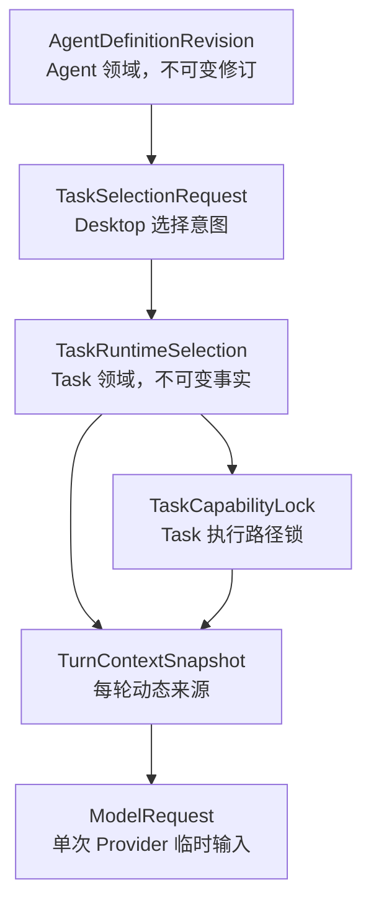

# ADR-011：Agent Definition 与 Task Runtime Selection

> 状态：**ACCEPTED**  
> 提出日期：2026-07-24  
> 接受日期：2026-07-24  
> 适用范围：Desktop submit turn、Task 初始化、Agent/Model/Skill/Tool/Knowledge 选择与模型调用前锁定  
> 前置决策：ADR-005、ADR-006、ADR-008、ADR-010、KN-025  
> 接受依据：用户明确接受；Claude Code 独立文档复核 P0/P1/P2/P3 新增问题为 0；KN-026

## 1. 背景

KAF-5 已建立 Conversation、TurnContextSnapshot、Context Pipeline、ModelRequest、TaskCapabilityLock 和最小 Agent Loop，但当前公共 Contract 只有轻量 `AgentDefinitionRef`，没有完整 Agent Definition 修订，也没有持久化的 Task 运行组合。

Desktop/Central Foundation 已确认：

- 每个 Agent 必须有默认 Model；
- `allowModelOverride` 控制用户是否可以为单个 Task 显式选择其他合法 Model；
- Local Core 是 Runtime Selection 的唯一协调者；
- Task 启动后不得因配置同步、模型 health、Agent 更新、Skill 文件变化或 Central 断线静默改变运行组合；
- Desktop 只提交选择意图，Central Gateway 只调用已经解析和锁定的 Model。

如果把用户请求、最终运行组合、能力执行锁和每轮上下文混为一个对象，就会复制 TaskCapabilityLock、错误锁定动态 contextRevision，并破坏 ADR-008/ADR-010 的恢复边界。

## 2. 决策概览

采用以下对象链：

```text
AgentDefinitionRevision
        ↓ referenced by
TaskSelectionRequest
        ↓ deterministically resolved as
TaskRuntimeSelection
        ↓ references
TaskCapabilityLock
        ↓ contributes to each
TurnContextSnapshot
        ↓ converted to
ModelRequest
```

对象所有权：



## 3. AgentDefinitionRevision

`AgentDefinitionRevision` 是 Agent 领域的不可变修订，至少包含：

```text
agentId
revision
digest
identity
goal
instructions
defaultModelId
allowModelOverride
skillReferences
toolReferences
knowledgeReferences
requiredModelCapabilities
createdAt
```

规则：

1. 每个 Agent 必须有 `defaultModelId`；
2. 用户 Agent 每次保存形成新 revision，不原地覆盖历史 revision；
3. 企业已发布 Agent 版本不可原地修改；
4. 有权限创建者可以基于企业已发布版本派生个人草稿，在 Desktop 编辑和本地测试，提交完整不可变包后由管理员审核形成新企业版本；
5. Admin Console 不承担 Agent 编辑器；
6. Agent、Skill 和 Knowledge 不因为被 Agent 引用而进入 Capability Registry；Capability Registry 继续只管理 Model 和 Tool。

## 4. TaskSelectionRequest

`TaskSelectionRequest` 是 Desktop 提交给 Local Core 的用户选择意图，例如：

```text
agentId
requestedModelId?
selectedSkillIds[]
selectedKnowledgeIds[]
workspaceGrantId?
inputRequirements?
```

它不是最终执行事实：

- 不能直接进入 Model Provider 请求；
- 不能自行证明用户权限、版本、可用性或 Agent 允许范围；
- Desktop 不计算 Model 权限交集；
- Local Core 必须重新读取当前合法来源并做确定性校验。

`requestedModelId` 只影响当前 Task，不修改 Agent defaultModel，也不修改 User personal defaultModel。

## 5. ModelEligibilityEvaluator

建立独立的纯确定性 `ModelEligibilityEvaluator`，不复用 ADR-008 `CapabilityResolver`。

候选 Model 由以下交集确定：

```text
当前用户有权限
∩ 当前配置已启用
∩ Credential 可用
∩ 当前可以被调用
∩ 满足 Agent requiredModelCapabilities
∩ 满足当前输入必要能力
```

`ModelEligibilityEvaluator`：

- 不做评分；
- 不做偏好排序；
- 不自动选择“最佳模型”；
- 不做成本、延迟或质量路由；
- 不根据 health 选择其他 Binding；
- 不在失败后自动换模型；
- 不根据 Model 名称、Provider 名称或经验推测能力。

首期 Model 能力事实只包括：

```text
inputModalities
outputModalities
supportsToolCalling
supportsStreaming
contextWindow
```

这些事实必须来自版本化、受信 Model Definition。

## 6. 默认 Model 与显式覆盖

三种默认值严格分离：

| 概念 | 所有者 | 作用 |
| --- | --- | --- |
| Agent defaultModel | AgentDefinitionRevision | 运行该 Agent 时的默认执行 Model |
| User personal defaultModel | 用户本地偏好 | 未显式选择 Agent 或开放式任务的默认偏好 |
| Task requestedModelId | TaskSelectionRequest | 只对本 Task 的显式覆盖 |

解析规则：

1. 没有 `requestedModelId` 时，只尝试 Agent defaultModel；
2. defaultModel 合法时解析为实际 Model；
3. defaultModel 不可用且 `allowModelOverride=false` 时，Task 不得启动；
4. defaultModel 不可用、`allowModelOverride=true` 且存在合法候选时，必须等待用户明确选择；
5. Core 不自动从候选中替换 defaultModel；
6. 用户显式选择的 Model 必须通过 ModelEligibilityEvaluator；
7. Task 创建并锁定 Model 后，不因不可用、断线或配置更新静默切换。

## 7. TaskRuntimeSelection

`TaskRuntimeSelection`：

- 归属 Task 领域；
- 每个 Task 恰好一条；
- 创建后不可变；
- 记录稳定运行组合和来源证明；
- 通过 ID 引用 Model/Tool TaskCapabilityLock；
- 不复制 CapabilityLock 中完整 Definition、Binding 和 AdapterDescriptor。

至少记录：

```text
runtimeSelectionId
taskId
agentDefinitionId
agentRevision
agentDigest
agentDefaultModelId
requestedModelId?
resolvedModelCapabilityLockId
activeSkillRevisions[]       # id/revision/contentDigest/materializedRef
toolCapabilityLockIds[]
knowledgeRevisions[]         # id/revision/digest/materializedRef
workspaceGrantId?
enterpriseConfigRevision?
platformPromptRevision
selectionDigest
createdAt
```

`TaskRuntimeSelection` 不得包含：

```text
contextRevision
RuntimeAdapterHandle
PID
Credential 或 Secret
health / availability 快照
Connection Instance
Provider SDK 对象
当前网络连接状态
```

## 8. TaskCapabilityLock 关系

ADR-008 `TaskCapabilityLock` 继续是 Model/Tool 执行路径的唯一精确锁，物化 Definition、Binding 和 AdapterDescriptor 的可恢复投影。

- 实际 Model 必须在 Task 启动前创建 Model TaskCapabilityLock；
- 所有准备暴露给 Model 的 Tool Schema 必须在第一次 Model 调用前创建 Tool TaskCapabilityLock；
- 向 Model 暴露 Tool Schema 已构成“确定使用该能力候选路径”，符合 ADR-008 首次确定使用时锁定的原则；
- `TaskRuntimeSelection` 只保存 lock ID 和必要 digest，不复制锁内容；
- Binding 不可用时明确 unavailable/waiting/人工处理，不更换为未锁定 Binding。

## 9. Skill、Knowledge 与 Workspace

Skill 不通过 TaskCapabilityLock 建模为 Tool：

- Skill Runtime 负责发现、读取、解析和物化；
- 本地 Skill 以 content digest 形成不可变 revision；
- 原文件变化不得静默改变已启动 Task；
- TaskRuntimeSelection 锁定 materialized Skill revision/digest；
- 未被 Agent 允许、用户无权使用或当前 Task 未启用的 Skill 不进入 Prompt。

Knowledge 使用独立 revision/digest/materialized reference，不进入 Capability Registry。Workspace 只记录稳定 WorkspaceGrant ID；每次真实文件操作仍按 ADR-002/ADR-006 重检真实路径和操作权限。

## 10. TurnContextSnapshot 与 ModelRequest

`TurnContextSnapshot` 继续是每次 Model 调用前创建的动态对象，负责：

```text
Conversation 范围与 contextRevision
Compaction
Task 状态和 Event 投影
Tool Observation
Materialized Skill Context
Knowledge/Workspace Context
Token Budget 来源
TaskRuntimeSelection/CapabilityLock 来源证明
```

Context revision 只属于 TurnContextSnapshot，不属于 TaskRuntimeSelection。

`ModelRequest` 是单次 Provider 调用的 provider-neutral 临时输入：

- 使用已锁定 Model target；
- 使用当前 TurnContextSnapshot；
- 不成为 Task 运行组合事实源；
- 不进入 Agent Definition；
- Provider conversion 不得改变 resolved Model。

## 11. 持久化与失败关闭

Task、TaskRuntimeSelection、Model/Tool TaskCapabilityLocks 和 userMessageId 绑定应在同一 Task 事务中原子提交。任一引用缺失、revision/digest 不一致、Model 不合法、Tool 无法锁定或强依赖未物化时，不得启动 Agent Loop。

恢复时必须重新验证 Selection、Lock 和物化引用的 revision/digest。若持久事实自身不一致或 digest 校验失败，必须收敛为类型化的 incompatible/corrupt 恢复结果并停止自动恢复；若受信实现或凭证只是当前不可用，则进入 unavailable/waiting 路径。两类情况都不得改用当前 Registry 中的其他 Model、Binding、Skill 或 Knowledge，也不得重写原 Selection 以适配新配置。

Task 恢复时：

1. 加载不可变 TaskRuntimeSelection；
2. 验证 selection digest；
3. 加载所引用 TaskCapabilityLock；
4. 重建兼容 Runtime Handle；
5. 加载 materialized Skill/Knowledge revision；
6. 缺失或不可用时显式收敛，不静默替换。

## 12. 非目标

- 自动模型路由、评分、成本优化和失败自动换模型；
- Multi-Agent/Subagent；
- Agent/Skill 统一 Capability Registry；
- 运行中动态修改 TaskRuntimeSelection；
- 在 TaskRuntimeSelection 中保存 Context、Prompt 正文或运行实例；
- 长期 Memory；
- 多代 RegistrySnapshot 热切换。

## 13. 接受结论与编码门槛

本 ADR 已确认：

1. AgentDefinitionRevision、TaskSelectionRequest、TaskRuntimeSelection、TaskCapabilityLock、TurnContextSnapshot、ModelRequest 所有权不重叠；
2. `contextRevision` 不进入 TaskRuntimeSelection；
3. ModelEligibilityEvaluator 不复用 CapabilityResolver；
4. 三种 Model 默认值分离；
5. Model/Tool 锁定与 ADR-008 一致；
6. Skill 以 materialized revision/digest 锁定；
7. 不引入自动选模或运行中 fallback。

KN-026 已接受本 ADR 并打开 DCF-0/CGF-0。正式 AgentDefinitionRevision、ModelEligibilityEvaluator 或 TaskRuntimeSelection 持久化仍按 DCF/CGF 批次计划、Contract Conformance 和独立 QA 门槛逐批实现，不因 ADR 接受而提前塞入 DCF-0/CGF-0 非语义脚手架。
