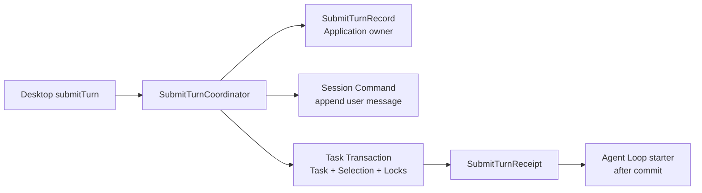

# ADR-012：Submit Turn 跨 Session/Task 最小协调与恢复

> 状态：**ACCEPTED**  
> 提出日期：2026-07-24  
> 接受日期：2026-07-24  
> 适用范围：Desktop `submitTurn`、Conversation 用户消息、Task 初始化、Runtime Selection 和 Agent Loop 启动  
> 前置决策：ADR-005、ADR-007、ADR-010、ADR-011、KN-025  
> 接受依据：用户明确接受；Claude Code 独立文档复核 P0/P1/P2/P3 新增问题为 0；KN-026

## 1. 背景

Desktop 需要一个面向用户语义的 `submitTurn` 高层入口，但一次用户回合同时涉及：

- Session/Conversation 中追加用户消息；
- Task 领域创建 Task；
- 创建不可变 TaskRuntimeSelection；
- 创建 Model/Tool TaskCapabilityLock；
- 绑定 userMessageId；
- 在事务提交后启动 Agent Loop。

ADR-010 已冻结 Conversation/Session 与 Task 是两个独立事实所有者。它们不能共享 revision、领域 Receipt、event sequence 或 checkpoint，也不能合并成 SessionTask God Object。简单地在内存中顺序调用上述操作会在崩溃和客户端重试时留下半完成状态。

## 2. 决策

在 Application 层建立范围受控的 `SubmitTurnCoordinator`，使用应用级 `SubmitTurnRecord` 和 `SubmitTurnReceipt` 协调本地 SQLite 中的 Session/Task 双领域操作。



这不是通用 Saga、工作流引擎或分布式事务协调器。

## 3. 领域所有权保持不变

| 对象 | 所有者 | 不共享内容 |
| --- | --- | --- |
| SessionHead / ConversationMessage / Session Event / Session Receipt | Session/Conversation | 不使用 Task revision、Task checkpoint |
| Task / Run / Step / Task Event / Task Receipt / TaskCapabilityLock / TaskRuntimeSelection | Task | 不使用 Session revision、Session event sequence |
| SubmitTurnRecord / SubmitTurnReceipt | Application Coordination | 不成为 Session 或 Task 的事实替代品 |

SubmitTurnCoordinator 只保存跨领域关联和推进状态，不复制 Conversation 正文、TaskState、CapabilityLock 内容或 Prompt。

## 4. 应用级对象

`SubmitTurnRecord` 至少包含：

```text
submitTurnCommandId
clientTurnId
sessionId
requestDigest
status
userMessageId?
taskId?
runtimeSelectionId?
createdAt
updatedAt
lastFailure?
```

`SubmitTurnReceipt` 至少包含：

```text
submitTurnCommandId
clientTurnId
requestDigest
status
userMessageId
taskId
runtimeSelectionId
acceptedAt
completedAt
result
```

建议状态只表达最小协调阶段：

```text
accepted
message_appended
task_committed
completed
failed_terminal
```

这些状态是 Application 协调事实，不进入 TaskStatus。

允许的最小收敛路径为：

```text
accepted → message_appended → task_committed → completed
accepted → failed_terminal
message_appended → failed_terminal
```

`failed_terminal` 只用于已经可信确定、继续重试不会改变结果的校验或领域失败，例如 Session 已归档、所请求的 Agent revision 不存在，或没有合法 Model。SQLite 暂时忙、进程崩溃、Task 事务提交结果尚未确认、Loop 启动暂时失败等可恢复问题不得进入 `failed_terminal`。

## 5. 幂等规则

1. `submitTurnCommandId` 是调用者稳定命令 ID；
2. `clientTurnId` 是 Desktop 生成的用户回合稳定 ID；
3. `requestDigest` 覆盖规范化选择意图、sessionId 和用户输入引用；
4. 相同 commandId + 相同 digest 回放同一 Record/Receipt；
5. 相同 commandId + 不同 digest 返回 typed conflict；
6. 同一 clientTurnId 不得绑定两个不同用户消息或两个不同 Task；
7. Desktop 超时后可以使用相同 commandId 重试，但不能创建第二次逻辑提交。

## 6. 固定处理顺序

```text
1. 接收 submitTurn
2. 校验 commandId、clientTurnId 和 requestDigest
3. 持久化或回放 SubmitTurnRecord(accepted)
4. 通过 Session Command 幂等追加用户消息
5. 更新 Record(message_appended)
6. 在同一个 Task 事务中创建：
   - Task
   - TaskRuntimeSelection
   - Model TaskCapabilityLock
   - Tool TaskCapabilityLocks
   - userMessageId 绑定
7. 更新 Record(task_committed)
8. 写入 SubmitTurnReceipt(completed)
9. 事务提交后异步启动 Agent Loop
```

Task、TaskRuntimeSelection、TaskCapabilityLock 和 userMessageId 绑定必须尽量在同一 Task 事务中原子提交。Session Command 与 Task 事务仍为两个独立领域事务。

Agent Loop 不在 Session 或 Task 数据库事务内运行。Receipt 已完成但 Loop 尚未启动属于可恢复启动工作，不回滚已接受 Turn。

## 7. 六个崩溃与恢复场景

| 场景 | 恢复规则 | 后续自动化证据 |
| --- | --- | --- |
| 用户消息已写入，Task 未创建 | 由 Record 的 message_appended 状态继续 Task 事务 | close/reopen 后只有一个 message、一个 Task |
| Task 已创建，Receipt 未完成 | 读取既有 Task/Selection/Locks，完成 Receipt | 不重复 Task、Lock 或 Event |
| Receipt 已完成，Agent Loop 未启动 | Recovery 扫描 completed + not-started，启动同一 Task | 不依赖 Desktop 重发 |
| Desktop 超时后重复提交 | 相同 commandId/digest 回放当前 Record/Receipt | 不重复 Message/Task |
| 相同 commandId、相同 digest | 幂等回放 | 返回相同稳定 ID |
| 相同 commandId、不同 digest | typed conflict | 不改变已有状态 |

Recovery Coordinator 必须扫描：

```text
已接受但尚未完成绑定
或 Receipt 已完成但尚未启动 Agent Loop
```

恢复不能依赖 Desktop 再次发送请求。

扫描至少在 Local Core 启动完成后立即执行，并在写入未完成 Record 或 Loop 启动失败后安排后续扫描；周期性扫描可作为漏唤醒的安全网。对同一 Record 的自动重试必须使用有上限的退避，避免紧循环，但不得改变 commandId、clientTurnId、Task ID 或已完成 Receipt。具体时间参数属于可观测的运行配置，不进入公共 Contract；自动化验收必须用可注入 Scheduler 证明无需 Desktop 重发即可最终恢复。

## 8. 失败语义

- 用户输入或选择意图非法：在创建 Record 前或 Record terminal failure 中失败关闭；
- Session 不存在或已归档：不创建 Task；
- Agent/Model/Tool/Skill/Knowledge/Workspace 校验失败：保留用户消息与失败 Receipt 的关联，向 Desktop 返回可理解错误，不启动 Loop；
- 用户消息已经持久化后出现可信、不可重试的 Agent/Model/Tool/Skill/Knowledge/Workspace 校验失败：原子写入失败 Receipt，并把 Record 从 message_appended 收敛为 failed_terminal；
- Task 事务提交失败：不更新为 task_committed；
- Loop 启动失败：保留 completed Receipt，由恢复扫描重试启动；
- 不把用户提交失败伪装成 Model/Tool Observation。

`lastFailure` 只保存类型化错误代码、阶段和安全摘要，不保存用户正文、Prompt 或 Secret。

## 9. 范围限制

不建设：

- 通用分布式 Saga；
- 多服务事务协调器；
- XA/两阶段提交；
- 远程事务管理；
- 通用 Workflow Engine；
- 跨设备或跨 Central Service 的 Turn 协调；
- SessionTask 统一 revision、Receipt、Event 或 Checkpoint。

本 ADR 只服务于单 Local Core、单本地 SQLite 和 Session/Task 双领域的最小协调。

## 10. 接受结论与编码门槛

本 ADR 已确认：

1. Session/Task 领域所有权保持独立；
2. SubmitTurnRecord/Receipt 只承担 Application 编排；
3. Task 内相关对象在一个 Task 事务提交；
4. 六个命名崩溃/重试场景都有明确恢复结果；
5. Loop 只在事务提交后启动；
6. 不引入通用 Saga 或工作流平台。

KN-026 已接受本 ADR。`submitTurn` 的正式 Schema、持久化和业务路由仍必须在 DCF-1 及对应 Core 实施批次中按本 ADR建立 Conformance 和崩溃恢复证据；DCF-0 不提前实现协调状态机。
