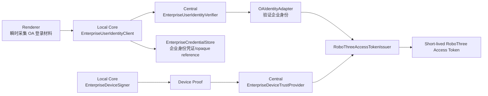

# ADR-014：Enterprise OA Identity、Managed Device Trust 与 Client Credential

> 状态：**ACCEPTED**  
> 提出日期：2026-07-24  
> 重大修订：2026-07-24，OA Identity、Managed Device Trust、不可导出 Device Signer 与 Challenge/Proof  
> 接受日期：2026-07-25  
> 适用范围：Desktop/Local Core 接入 Central Enterprise Service 的企业身份、设备信任、凭证与短期访问令牌生命周期  
> 前置决策：ADR-001、ADR-006、ADR-009、ADR-011、ADR-013、KN-028、KN-029  
> 接受依据：`0.0.0-cgf.1.0-repair.1` 独立 QA `PASS`，56 files / 417 Node tests、Java 在线/离线各 12 tests，P0/P1/P2/P3 均为 0；用户明确接受  

## 1. 上下文

RoboThree 企业会话不能只证明“知道一个 Enrollment Code”，也不能相信客户端
正文自报的 `enterpriseId`、`userId` 或 `deviceId`。企业能力必须同时受企业用户
身份、设备信任、固定权限和版本兼容约束。

原提案使用：

```text
Enrollment Code → Client Credential → Access Token
```

该流程把 Enrollment Code 同时用作用户身份和设备 Bootstrap，不能满足企业正式
身份边界。本修订用 OA 企业身份和独立设备证明替代该主链。Enrollment Code
只保留为可选的 Alpha Manual Device Enrollment Adapter，不再证明用户身份。

## 2. 决策概览

企业会话成立条件固定为：

```text
OA Enterprise Identity
∩ Managed Device Trust
∩ RoboThree Permission
∩ Compatibility
→ Short-lived RoboThree Access Token
```

任何一项不满足时：

- 不签发新的 RoboThree Access Token；
- 不下发或重新同步企业 Configuration Snapshot；
- 不进行 Configuration Storage Activation 或 Runtime Registry Activation；
- 企业 Model 和 Central Tool 不可调用；
- 企业 Agent/Skill 不进入 Runtime Registry 或 Prompt。

RoboThree 不使用系统浏览器、OIDC、PKCE 或浏览器 Callback。首个企业用户身份
Adapter 是 OA，但本 ADR 不冻结 OA 用户名密码、Ticket、SDK 或 Token Exchange
的具体 Wire Protocol。

## 3. 六个所有者和进程边界

```text
Local Core / Desktop
├── EnterpriseUserIdentityClient
├── EnterpriseCredentialStore
└── EnterpriseDeviceSigner

Central Enterprise Service
├── EnterpriseUserIdentityVerifier
│   └── OAIdentityAdapter
├── EnterpriseDeviceTrustProvider
└── RoboThreeAccessTokenIssuer
```



这些所有者不得合并为跨 Local/Central 的“大 Port”。Java Central 与 Node.js
Local Core 继续通过版本化语言中立 Contract 交互，不共享进程内对象或源码 DTO。

## 4. EnterpriseUserIdentityClient

`EnterpriseUserIdentityClient` 位于 Local Core Application 边界，负责：

- 发起企业 OA 身份流程；
- 通过类型化 OA Adapter Client 传递瞬时身份材料；
- 接收 OA/Central 返回的受控身份结果或短期 opaque identity handle；
- 协调 EnterpriseCredentialStore；
- 不解析或自行构造可信 `enterpriseId/userId`；
- 不签发 RoboThree Access Token。

OA 集成优先级：

```text
OA 官方 SDK / Ticket / Token Exchange
优先于
OA 账号密码 API
```

不得自行设计用户名密码加密算法、签名算法或兼容 OA 私有协议。若最终只能使用
账号密码 API，必须依据 OA 官方接口和公司安全规范建立独立 Adapter 评审。

## 5. EnterpriseUserIdentityVerifier 与 OAIdentityAdapter

`EnterpriseUserIdentityVerifier` 位于 Central Service，负责：

- 调用 `OAIdentityAdapter` 验证企业身份；
- 只从 OA 的可信验证结果形成 `enterpriseId/userId`；
- 检查账号禁用或不可建立企业会话的状态；
- 产生短期、受控、不可由客户端伪造的 verified identity context；
- 不信任请求正文中的企业或用户身份字段。

`OAIdentityAdapter` 是首个实现，但 OA 的用户名密码、Ticket、SDK、Token
Exchange Wire Protocol 不进入长期 canonical Enterprise Gateway Contract。
Fake OA Adapter 可以用于 CGF-1.1 Foundation 级测试；真实 OA Adapter 必须在
企业试点前实现和验收。

## 6. Renderer 与敏感身份材料

Renderer 可以瞬时采集 OA 登录材料，但必须满足：

- 不写入 Renderer store、localStorage、IndexedDB、缓存、历史记录或日志；
- 不进入 Session、Conversation、Task、Event、Checkpoint、Receipt、Effect、
  Outbox、Prompt、Artifact 或普通业务状态；
- 只通过 context-isolated Preload 和受控敏感通道交给受信 Main/Core 边界；
- 完成或失败后立即清理可控内存引用。

Renderer 不得获得：

```text
RoboThree Access Token
OA Ticket
Refresh Credential
Device Credential
Client Credential
Device Private Key
```

真实 Desktop 登录 UI 和真实 OA 敏感通道不属于 CGF-1.1 的完成门槛，但必须在
企业试点前完成。

## 7. EnterpriseCredentialStore

建立独立的 `EnterpriseCredentialStore` Application Port：

```text
store
replace
resolve
delete
```

它可以保存或解析：

- 企业 Refresh Credential；
- Client Credential；
- Device Key Handle；
- Key ID；
- Provider Reference；
- 其他 opaque Keychain reference。

`resolve` 不得返回设备私钥。设备密钥相关 reference 只能交给
`EnterpriseDeviceSigner` 或底层平台 Provider 完成签名。

`EnterpriseCredentialStore` 与 ADR-013 `PersonalCredentialStore`：

- 是不同 Application Port；
- 使用不同 namespace；
- 使用不可互换的 opaque reference；
- 使用不同生命周期和错误语义；
- 使用不同审计事件；
- 不允许合并成通用 `CredentialStore`。

Adapter 层可以复用同一个 OS Keychain SDK，但不得共用业务 key prefix、存储
item 类型或 reference 解析规则。企业 Port 至少区分：

```text
not_found
unavailable
access_denied
corrupted
disabled
internal
```

## 8. EnterpriseDeviceSigner

Local Core 侧正式建立：

```text
EnterpriseDeviceSigner
├── getDeviceKeyId()
├── getPublicKey()
└── sign(deviceChallenge)
```

职责仅限：

- 在本机使用设备私钥完成 Challenge 签名；
- 返回 Key ID、公钥和 Device Proof 所需签名结果；
- 不判断设备是否受管、合规或已撤销；
- 不调用 Central 权限或配置逻辑。

禁止提供：

```text
getPrivateKey()
resolvePrivateKey()
exportPrivateKey()
```

设备私钥必须尽可能使用平台支持的不可导出密钥能力。生产 Adapter 优先级：

```text
Windows CNG / TPM
macOS Keychain + Secure Enclave
企业证书容器 / PKCS#11
其他受控平台密钥提供器
```

普通 OS Keychain 可以保存 Device Key Handle、Key ID 和 Provider Reference，
但不得假定任意 Keychain 实现都天然保证私钥不可导出。真实 OS Device Signer
Adapter 不属于 CGF-1.1 完成门槛；CGF-1.1 使用 Fake/Test Signer 验证 Contract
和服务端链路。

## 9. EnterpriseDeviceTrustProvider

`EnterpriseDeviceTrustProvider` 位于 Central Service，负责：

- 验证 Device Proof；
- 根据已登记公钥解析可信 `deviceId`；
- 查询设备是否受管、合规、禁用或撤销；
- 归一化 OA、MDM、证书或 Manual Enrollment 的信任结果；
- 向 Token Issuer 返回类型化设备信任事实。

设备信任来源优先级：

1. OA 的可信设备结果；
2. 公司终端管理/MDM；
3. 企业设备证书或安装时设备密钥；
4. Manual Device Enrollment Adapter。

不得仅依赖 MAC、主机名、OS 用户名、User-Agent 或客户端自报 `deviceId`。
个人电脑即使 OA 身份有效，设备信任失败时仍不得建立企业会话。

`EnterpriseDeviceSigner` 与 `EnterpriseDeviceTrustProvider` 严格分离：

```text
EnterpriseDeviceSigner
= Local，使用不可导出私钥签名

EnterpriseDeviceTrustProvider
= Central，验证签名、设备记录和合规状态
```

## 10. Device Challenge 与 Device Proof

Central 下发：

```text
DeviceChallenge
├── challengeId
├── nonce
├── issuedAt
├── expiresAt
├── audience
├── clientInstanceId
└── allowedAlgorithms[]
```

Local Core 调用：

```text
EnterpriseDeviceSigner.sign(DeviceChallenge)
```

产生：

```text
DeviceProof
├── challengeId
├── deviceKeyId
├── algorithm
├── signature
└── signedAt
```

设备私钥、Keychain Handle、Provider Reference 和底层 Provider 对象不得进入
Device Proof 或网络 Contract。`sign(challenge)` 是本地 Port，不是 Central
HTTP API。

跨服务 Contract 只表达：

```text
issue challenge
→ submit device proof
→ verify proof
```

## 11. Challenge 防重放

Device Challenge 必须：

- 由 Central 使用密码学安全随机 nonce 生成；
- 短期有效；
- 单次使用；
- 绑定当前 verified identity context 或 Token 签发请求；
- 绑定 `clientInstanceId`；
- 绑定用途和 audience；
- 成功验证后立即原子消费；
- 过期、重复、签名非法或上下文不匹配时失败关闭。

Central 不得只凭 `deviceKeyId` 判断设备可信。可信设备身份来自：

```text
已登记设备公钥
∩ 有效 Challenge 签名
∩ 未撤销设备记录
∩ 当前设备合规结果
```

Challenge 的数据库状态、签名验证和消费原子性属于 CGF-1.1 服务端实现，不进入
Configuration Snapshot 或 Runtime Contract。

## 12. Alpha Manual Device Enrollment

Manual Device Enrollment 只在 OA 或公司终端系统不能可靠判断设备时实现：

```text
已验证 OA 用户
→ IT 生成单次短期 Device Enrollment Code
→ 设备生成不可导出密钥
→ Central 发出 enrollment challenge
→ Local Device Signer 形成 proof
→ Central 登记设备公钥和可信 deviceId
```

规则：

- Code 只能由 IT/管理员生成；
- Code 单次使用、短期有效；
- Code 不承担用户身份认证；
- 用户必须先通过 OAIdentityAdapter；
- Code 不允许普通用户绕过 OA；
- Central 绑定可信 `userId`、`deviceId`、`clientInstanceId` 和 public key；
- 正式部署优先替换为 OA 可信设备、MDM、Conditional Access 或企业证书。

Manual Enrollment 是可选 Adapter，不是所有企业部署的必经流程。

## 13. RoboThreeAccessTokenIssuer

`RoboThreeAccessTokenIssuer` 位于 Central Service，只在以下交集成立时签发短期
RoboThree Access Token：

```text
verified OA identity
∩ verified device proof
∩ trusted and compliant device
∩ fixed RoboThree permission
∩ compatible Desktop/Core/Contract
```

Token 至少绑定：

```text
enterpriseId
userId
deviceId
clientInstanceId
tokenId
issuedAt
expiresAt
issuer
audience
permissions
contractVersion
```

Token 签名 key 只存在于 Central `EnterpriseSecretStore`。用户或设备已禁用时
不得签发新 Token；已签发短期 Token 可以自然过期；MVP 不做实时 push revoke。
企业 Model/Tool 调用必须继续验证有效 Access Token。

Token Claim 不进入 Session、Task、Prompt、TaskRuntimeSelection、
TaskCapabilityLock 或 Configuration Snapshot。

## 14. Typed Error

设备信任至少定义：

```text
device_not_managed
device_not_compliant
device_access_denied
```

Challenge/Proof 至少定义：

```text
device_challenge_expired
device_challenge_replayed
device_signature_invalid
device_context_mismatch
```

错误只能包含安全摘要和 correlation ID，不得回显 OA 登录材料、Ticket、
Refresh Credential、Device Credential、私钥、签名原文、内部设备资产详情或
Secret Store 信息。

## 15. 离线和撤销

企业配置缓存可以保留，但没有有效企业会话时：

- 不重新同步 Configuration Snapshot；
- 不进行 Storage Activation；
- 不进行 Runtime Registry Activation；
- 企业 Model 不可调用；
- Central Tool 不可调用；
- 企业 Agent/Skill 不进入 Runtime Registry；
- 企业 Agent/Skill 不进入 Prompt；
- 历史 Task、Event 和 Audit 事实不删除。

离线企业 Agent/Skill 执行和纯本地个人模式后置，不在本 ADR 或 CGF-1.1 建设。

用户或设备禁用后：

- 不得签发新 Access Token；
- 已签发短期 Token 可以自然过期；
- MVP 不实现实时 push revoke；
- 设备撤销不删除历史 Task/Audit；
- logout 清除本地企业身份 Credential 和当前企业会话，但设备登记的服务端撤销
  是独立管理动作。

## 16. Secret 禁入

OA 登录材料、OA Ticket、Refresh Credential、Client Credential、Device
Credential、Device Private Key、Keychain Handle、Access Token 和解析后的
Secret 不得进入：

- URL、query string、命令行参数；
- Renderer store、localStorage、IndexedDB；
- 普通 Desktop Local HTTP/SSE；
- Session、Conversation、Task、Event、Checkpoint、Receipt、Effect、Outbox；
- Configuration Snapshot、Model/Tool Descriptor、Agent/Skill Package；
- RuntimeSelection、RegistrySnapshot、TaskCapabilityLock、ModelRequest；
- 普通日志、错误详情、Fixture、golden file、Audit 正文或 crash metadata。

Fixture 只使用明确标记且不具备真实权限的假值。Configuration Snapshot 可以
表达能力是否可用，但不得包含企业 credentialRef、设备私钥引用或身份材料。

## 17. Compatibility Feature

Enterprise Gateway Compatibility 使用通用能力标识：

```text
enterprise_identity
managed_device_trust
manual_device_enrollment
```

不使用 `enterprise_sso`，也不通过 Compatibility 冻结 OA、MDM、证书或平台
密钥 Provider 的厂商细节。

## 18. Contract 修订边界

身份子协议只允许最小修改：

1. Enrollment 改为可选 Device Enrollment；
2. Token 改为 Verified Identity + Device Proof；
3. 新增 Device Challenge/Proof；
4. 新增 Access Token Claims；
5. Compatibility 增加通用 feature；
6. 补充设备和 Challenge typed error Fixture；
7. 不加入 OIDC Login/Callback Schema；
8. 不把固定 username/password/OTP 冻结为长期 canonical Contract。

以下保持不变：

```text
Configuration Snapshot
Agent/Skill Package
Model/Tool/Knowledge Descriptor
revision/digest
ETag
canonical JSON
credentialRef 禁入
Storage Activation / Runtime Activation
```

## 19. 非目标

- 完整或厂商固定的 OA Wire Protocol；
- 真实 OA Adapter；
- 真实 MDM/Conditional Access；
- 真实企业设备证书平台；
- Windows/macOS/Linux 全部生产 Device Signer Adapter；
- 实时撤销；
- 复杂设备管理后台；
- 多租户 SaaS；
- 复杂 RBAC；
- Policy Engine；
- 离线企业 Agent/Skill 执行；
- 纯本地个人模式产品设置。

真实 OA Adapter、真实设备信任 Adapter 和至少一个目标平台的生产 Device
Signer 必须在企业试点前完成，但不是 CGF-1.1 的完成门槛。

## 20. 备选方案

### 方案 A：Enrollment Code 同时证明用户和设备

拒绝。Code 只允许作为可选 Manual Device Enrollment Adapter。

### 方案 B：OIDC/PKCE 与系统浏览器

本阶段不采用。RoboThree 首期使用公司 OA 身份集成，不建设浏览器 Callback。

### 方案 C：设备私钥可导出并由 Core 直接读取

拒绝。Local Core 只能通过 `EnterpriseDeviceSigner` 获得签名结果。

### 方案 D：只信任 deviceKeyId 或客户端 deviceId

拒绝。必须验证 Central Challenge 签名、设备登记、撤销和当前合规结果。

### 方案 E：没有企业会话时继续激活缓存企业能力

拒绝。缓存可以保留，但不能激活或进入 Runtime/Prompt。

## 21. 后果和工期

正面：

- 用户身份和设备身份独立验证；
- OA、MDM、证书和 Manual Enrollment 可以通过 Adapter 演进；
- 设备私钥不进入网络或 Core 普通内存对象；
- 企业/个人 Credential 继续强隔离；
- Configuration/Package/Descriptor 主体无需返工。

代价：

- 增加 Device Challenge/Proof、防重放状态和签名验证；
- 增加 Fake/Test Device Signer；
- 增加 OA Identity、Device Trust 和 Token Issuer 的组合测试；
- 企业试点前仍需真实公司系统接入。

CGF-1.1 集中工程量调整为 **11～16 个工程工作日**。CGF-1 总计仍按此前
19～28 天基线评估，但应在 PM 计划中吸收 Challenge/Proof 增量并预留独立 QA
和返工窗口。工程工作量不等于日历承诺。

## 22. 已确认事项

1. 六个所有者和 Local/Central 进程边界；
2. OAIdentityAdapter 是首个身份 Adapter，但不冻结具体 OA Wire Protocol；
3. Renderer 只能瞬时采集 OA 材料，不能获得企业 Token/Credential；
4. EnterpriseDeviceSigner 只签名且私钥不可导出；
5. EnterpriseDeviceTrustProvider 在 Central 验证 Proof、登记和合规状态；
6. Challenge 单次、短期、绑定上下文并原子消费；
7. Enrollment Code 只用于可选 Manual Device Enrollment；
8. Token 同时绑定企业身份、可信设备、权限和兼容性；
9. 无有效企业会话时缓存保留但不激活、不进入 Runtime/Prompt；
10. Contract 只修改身份子协议，不重新开放配置主体；
11. `EnterpriseCredentialStore` 与 `PersonalCredentialStore` 强隔离；
12. CGF-1.1 在本 ADR `ACCEPTED` 前保持 `GATED`。

## 23. 实施门槛

当前：

```text
DCF-1.1：UNBLOCKED
CGF-1.1：UNBLOCKED
ADR-014：ACCEPTED
```

CGF-1.1 的解锁条件已经全部满足：

```text
ADR-014 修订完成 ✅
∩ 身份 Schema/Fixture 最小更新完成 ✅
∩ TypeScript/Java Conformance PASS ✅
∩ 独立 QA 无 P0/P1 ✅
∩ 用户明确 ACCEPT ADR-014 ✅
```

本 ADR 接受后允许按既定 CGF-1.1 范围实现 Fake OA Adapter、Device
Challenge/Proof 服务端验证、Device Trust、Token Issuer、PostgreSQL/Flyway
和配置读服务；仍不授权实现真实 OA/MDM、生产 OS Device Signer、重新开放
CGF-1.0 配置主体、引入 Policy Engine、复杂设备后台或实时撤销。
