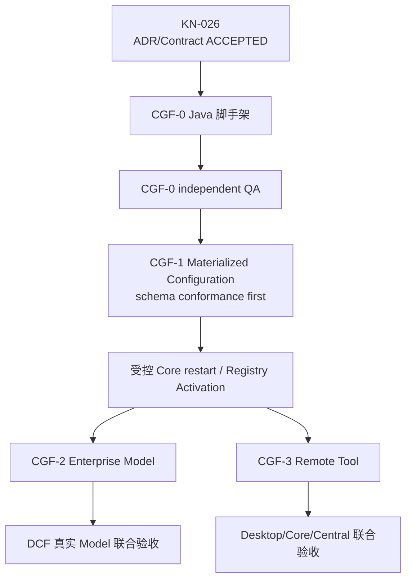

# RoboThree Central Gateway Foundation 开发计划

> 阶段：`CGF — Central Gateway Foundation`  
> 状态：**CONFIRMED**  
> 日期：2026-07-24  
> Contract：[Enterprise Gateway Contract v1alpha1（ACCEPTED）](./contracts/ENTERPRISE-GATEWAY-CONTRACT-v1alpha1.md)  
> 编码状态：**CGF-0 CLOSED；CGF-1.1 CLOSED；CGF-1.2 CONFIRMED_WITH_SPECIFIED_REVISIONS；CGF-1.2A AUTHORIZED**  
> 前置事实：KAF-5.3 `PASS`、KAF-5 `CLOSED`、KN-024 已打开双线规划入口

## 1. 目标

Central Gateway Foundation 建立 Local Core 与企业能力之间的版本化、跨语言、安全连接，不接管本地 Agent Runtime。

目标链路：

```text
Local Core 获得可信身份上下文
→ 下载完整企业配置候选
→ 校验并物化全部强依赖
→ Configuration Storage Activation
→ 受控重启后 Runtime Registry Activation
→ 调用已解析企业 Model
→ 调用中央远程 Tool
→ 上传最小审计元数据
→ Central 不可用时使用最近有效且本地可运行配置
```

## 2. 服务形态

第一阶段采用 Java 模块化单体：

```text
central-service
├── bootstrap
├── authentication
├── compatibility
├── configuration
├── credentials
├── model-gateway
├── tool-gateway
├── audit
└── persistence
```

协议方向：

- OpenAPI 3.1；
- JSON Schema；
- HTTPS + JSON；
- SSE；
- TypeScript/Java 各自实现类型；
- 共享 Schema 和 Conformance Fixture，不共享源码 DTO。

建议技术基线为 Java 21、Spring Boot 3.x、PostgreSQL、Secret Store Adapter 和 Testcontainers；具体版本服从公司既有 Java/数据库基线，不成为本计划的业务架构硬约束。

## 3. 责任边界

Central Service 负责：

- 企业 Model Gateway；
- Central Tool Gateway；
- 企业 Credential；
- 企业配置和不可变 Agent/Skill Package；
- 固定用户权限；
- 最小审计；
- compatibility。

Central Service 不负责：

- Local Agent Loop、Runtime Selection 和 Prompt Assembly；
- Session、Conversation、Task、Run、Step；
- WorkspaceGrant 和本地文件；
- Desktop UserConfirmation；
- 个人 Model Credential；
- 自动 Model 评分、路由或失败换模。

## 4. CGF-0：Java 骨架与非语义跨语言 Conformance

### 允许交付

- Java 工程目录和模块骨架；
- Build、Lint、Test、CI；
- readiness/compatibility 的 Fixture Harness；
- OpenAPI/JSON Schema 文档草稿；
- TS/Java 共享非正式 Fixture；
- Fake Secret Store、Fake Model、Fake Tool；
- 不涉及正式领域决策的传输 Pipeline；
- 空模块和测试容器基础。

### 禁止交付

- 正式业务 HTTP/SSE 路由；
- 正式认证、配置、Model/Tool DTO；
- 业务数据库表和 migration；
- Configuration Runtime Activation；
- Credential 真实保存或解析；
- 在跨语言 Conformance 前生成正式业务 DTO；
- 把 Fixture Schema 当成冻结 Contract。

KN-026 已打开 CGF-0。CGF-0 只实现 Java 模块骨架和非语义跨语言 Harness；CGF-1 的正式身份、配置 DTO、业务表和激活实现仍须在 CGF-0 独立 QA、公司 Java 基线与字段级 Conformance 后解锁。

### 实现检查点（0.0.0-cgf.0.1）

- 建立 Java 21、Spring Boot 3.5.16、Maven Wrapper 3.9.16 模块化单体骨架；
- 建立 authentication、compatibility、configuration、credentials、modelgateway、toolgateway、audit、persistence 包边界；
- readiness/compatibility 只提供明确 `fixtureOnly` 标记的非正式 Harness，默认绑定 `127.0.0.1` 随机端口；
- Java 与 TypeScript 读取同一 JSON Fixture，各自独立实现类型，不共享源码 DTO；
- Fake Secret Store、Fake Model、Fake Tool 只用于 Foundation 测试；
- 未加入正式认证、配置/Model/Tool DTO、数据库、migration、真实 Credential 或 Runtime Activation；
- Java 离线 `mvnw verify` 为 5 tests / 0 failures，真实 Spring Boot 随机端口冒烟通过。

独立 QA：

```text
0.0.0-cgf.0.1-SNAPSHOT
PASS
JDK 21.0.11 / mvnw verify + mvnw -o verify
5 tests / 0 failures
P0=P1=P2=P3=0
```

状态：`CLOSED`。用户已确认 CGF-1 方案及指定修订，CGF-1.0 的 ADR-014、
canonical Enterprise Contract Pack 和 TS/Java Conformance 已完成；CGF-1.0
identity repair 独立 QA 无 P0/P1 且 ADR-014 已 `ACCEPTED`，CGF-1.1 已解锁。

## 5. CGF-1：身份、完整配置与 MaterializedEnterpriseConfiguration

交付候选：

- OA Enterprise Identity、Managed Device Trust、固定权限和 Compatibility
  交集后的短期 Access Token；
- enterpriseId/userId/deviceId/clientInstanceId/tokenId/版本兼容信息；
- 完整 Configuration Snapshot；
- Model/Tool/Agent/Skill/Knowledge Descriptor 或 Package 引用；
- 固定用户权限；
- revision、digest 和 ETag；
- 候选下载、Schema/digest/reference/compatibility 校验；
- Agent/Skill 强依赖 Package 下载和校验；
- `MaterializedEnterpriseConfiguration`；
- Configuration Storage Activation；
- 派生的 `EnterpriseConfigurationActivationStatus`；
- 上一个有效配置保留；
- Fake/真实企业 Secret Store Adapter 的边界。

CGF-1.0 初始 Contract/Conformance 已通过独立 QA。身份子协议以
`0.0.0-cgf.1.0-repair.1` 最小修订为 OA verified identity、Device
Challenge/Proof、可选 Manual Enrollment 和绑定设备的短期 Token；配置、
Package、Descriptor、digest 和两层激活主体不变。ADR-014 `ACCEPTED`、
repair TS/Java Conformance、独立 QA 无 P0/P1 以及 PostgreSQL/Secret Store
基线门槛均已满足，CGF-1.1 已解锁。

### MaterializedEnterpriseConfiguration

它是 Enterprise Gateway Contract 的技术激活单位、CGF-1 退出门槛和本地离线可读配置的完整集合，不是新产品模块。

至少包括：

```text
Configuration Snapshot
validated Agent Packages
validated Skill Packages
Model Descriptors
Tool Descriptors
Knowledge Descriptors
fixed user permissions
all revisions and digests
compatibility information
```

激活条件：

```text
Schema 合法
∩ Snapshot digest 正确
∩ Package digest 正确
∩ 引用完整
∩ 强依赖全部物化
∩ Package revision 一致
∩ Desktop/Core/Contract 版本兼容
```

全部满足后才能 Configuration Storage Activation。Storage Activation 不修改当前 RegistrySnapshot；Local Core 受控重启并构建新 RegistrySnapshot 后才发生 Runtime Registry Activation。

第一版只使用完整 Snapshot，不做增量 patch、实时撤销、多代 Registry 热并存或运行中 Binding 替换。

## 6. CGF-2：企业 Model Gateway

交付候选：

- 一个真实 OpenAI-compatible 企业 Provider；
- 中央 Credential 解析；
- provider-neutral 输入转换；
- Invocation 接受、状态查询、SSE streaming、cancel 和 timeout；
- typed provider error；
- 最小调用审计；
- 与 Local Core/DCF 的真实企业 Model 联合验收。

Local Core 提交已经由 TaskRuntimeSelection/TaskCapabilityLock 解析和锁定的 Model。Central Gateway 必须校验身份、权限、Model revision、配置来源和请求 digest，但不重新选模。

### 幂等边界

Gateway 只承诺：

- Invocation 请求接受幂等；
- 相同 `clientRequestId + requestDigest` 不重复创建 Invocation；
- 相同 ID、不同 digest 返回 conflict；
- 最终状态可查询；
- 已缓存事件可以按 cursor 重放。

Gateway 不承诺：

- Provider 调用幂等；
- 完整 Token Delta 永久重放；
- 网络断开后安全重新调用 Provider；
- 相同 Prompt 产生相同结果。

无法判断 Provider 是否已执行时进入 `unknown` 或 `uncertain`，不得盲目重新调用，也不得静默切换 Model。

## 7. CGF-3：Central Tool Gateway、审计与离线验收

交付候选：

- 一个 Remote Echo/HTTP Tool；
- Tool Catalog；
- invoke/status/cancel；
- effectAttemptId、idempotencyKey、requestId、executionId 的独立生命周期；
- completed/failed/cancelled/timed_out/uncertain；
- 有界 Audit Ingest；
- at-least-once 去重；
- 网络断开和恢复；
- Central 离线时本地回退。

`failed` 只表示可信确定失败；无法确认远端副作用时返回 `uncertain`。真实 MCP 在 Remote Echo/HTTP 链路稳定后接入，不与第一条 Gateway 链同时调试。

离线规则：

| 能力 | Central 不可用时 |
| --- | --- |
| 缓存企业配置 | 保留，但不重新同步或执行 Storage/Runtime Activation |
| 企业 Agent/Skill | 不进入 Runtime Registry 或 Prompt |
| 企业 Model | unavailable |
| 中央远程 Tool | unavailable |
| 纯本地个人模式 | 后续独立产品设置，不由 CGF-1.1 建设 |

已启动 Task 不得将企业 Model 静默换为个人 Model，也不得将中央 Tool 替换为本地 Tool。

## 8. 阶段依赖



## 9. 非目标

- 完整 Admin Console；
- 正式组织树、复杂 RBAC、多租户 SaaS；
- Policy Engine 和企业运行时审批；
- 多 Provider 智能路由和成本平台；
- MCP Marketplace；
- 微服务拆分；
- 复杂设备管理后台；
- 实时权限撤销；
- 任务正文、完整 Prompt、Model 完整输出或本地文件正文存储；
- 多代 RegistrySnapshot 热切换。

## 10. 预计工程量

在 Contract 已接受、公司 Java 基线和真实 Provider 可用的情况下，单一主开发流预计 18～27 个工作日。其中 CGF-0 非语义脚手架预计 2～4 个工作日，已经包含在总量中；它只估算 Java 模块骨架、跨语言 Fixture/Conformance、Fake 和构建基础，不代表 Enterprise Gateway Contract 已解锁。该估算不包含完整 Admin、正式 SSO、真实 MCP、企业基础设施审批和重大 P0 返工。
