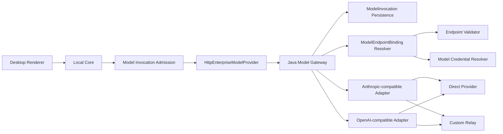

# RoboThree CGF-2 Model Gateway Foundation 开发计划

> 阶段：`CGF-2 — Model Gateway Foundation`  
> 状态：**OPENWORKER-ALIGNED REVISION / DOCUMENT REVIEW PASS /
> CGF-2.0、CGF-2A.1～2A.3、CGF-2A PASS/CLOSED /
> CGF-2B.1、CGF-2B.2 PASS/CLOSED /
> CGF-2B.3.1 REPAIR.1 PASS/CLOSED + PUBLIC CUSTOM RELAY PASS /
> ENTERPRISE RELAY CONFORMANCE MOVED TO ENTERPRISE INTEGRATION /
> CGF-2B.3.2 PASS/CLOSED / INDEPENDENT QA PASS / USER ACCEPTED；
> CGF-2B.3.3 repair.1、CGF-2B.3.3、CGF-2B.3、CGF-2B
> PASS/CLOSED / INDEPENDENT QA PASS / USER ACCEPTED；
> ADR17-I1/I2/I3 + ADR-017 IMPLEMENTATION GATE PASS/CLOSED；
> CGF-2C PLAN CONFIRMED / CGF-2C.1 PLAN ACCEPTED /
> IMPLEMENTATION IN PROGRESS / 2C.2-2C.3 GATED**  
> 初稿日期：2026-07-28  
> 重新对齐日期：2026-07-30  
> 评审修订日期：2026-07-30  
> 补充对齐复核：2026-07-30，Claude Code `P0=0 / P1=0 / P2=0 / P3=0`  
> OpenWorker 对齐复核：2026-07-31，Claude Code
> `P0=0 / P1=0 / P2=0 / P3=0`，10 份文档一致  
> 架构草案：[ADR-015](../adr/015-enterprise-model-invocation-and-development-provider-boundary.md)  
> Tool Call 收敛决策：[ADR-017](../adr/017-agent-tool-call-batch-completion-cancellation-and-recovery.md)  
> ADR-017 实施计划：[ADR-017 Implementation Plan](./ADR-017-IMPLEMENTATION-PLAN.md)  
> CGF-2C 详细计划：[CGF-2C Development Plan](./CGF-2C-DEVELOPMENT-PLAN.md)  
> CGF-2C.1 具体方案：[CGF-2C.1 Development Plan](./CGF-2C.1-DEVELOPMENT-PLAN.md)  
> 前置状态：CGF-1.1～CGF-1.3、DCF-2、ADR-016 Alignment-1、Alignment-2A、
> Alignment-2B 均 `PASS/CLOSED`  
> 对齐基线：ADR-014、ADR-015、ADR-015 补充修订 A、ADR-016、ADR-017、
> Central Java Alignment-2
> 已关闭代码事实  
> 当前目标：CGF-2B 已整体关闭；企业内网 Relay 环境验收后移至 Enterprise
> Integration；ADR-017 Implementation 与 CGF-2C Desktop 用户外发继续独立
> 门禁  
> 已接受补充：[ADR-015 补充修订 A](../adr/015a-direct-provider-and-custom-relay-addendum.md)

## 1. 阶段目标

CGF-2 在不等待真实 OA/SSO、MDM、复杂 RBAC、企业 MaaS 和生产 Secret Store
的前提下，建立一条可被后续企业 Adapter 复用的真实 Model Gateway 链路：

```text
Test Enterprise Session
→ Local Core 锁定真实 Model
→ 用户确认外部目标和数据范围
→ Central 持久接受 Invocation
→ 精确解析不可变 ModelEndpointBinding revision
→ 类型化 Credential Resolver + Endpoint Validator
→ Anthropic-compatible / OpenAI-compatible Provider Adapter
→ 厂商直连或企业自定义中转站
→ SSE Streaming
→ Local Core Agent Loop
→ Desktop
→ durable Assistant Message
```

阶段关闭只能声明：

```text
MODEL_GATEWAY_FOUNDATION_PASS
ENTERPRISE_PILOT_NOT_READY
```

### 1.1 与已接受基线的关系

本计划是对既有 Central Gateway Foundation 中 `CGF-2：企业 Model Gateway`
的细化和分批，不改变其最终产品责任。Development Profile 只用于提前验证真实
Provider 链路；《RoboThree MVP 功能范围与开发基线 v1.0》中“企业凭证保存在
中央安全凭证存储、由企业 Model Gateway 调用企业 MaaS/Provider”的正式路径
继续有效。

ADR-015 及其补充修订 A 已于 2026-07-30 正式接受。补充修订确认厂商直连与
企业自定义中转站为同等级 Connection Mode，二者复用同一 Invocation Runtime，
并与 Anthropic/OpenAI-compatible Protocol Adapter 正交。CGF-2.0 只允许对
Enterprise Gateway Contract 做 additive 扩展并建立 Conformance/Threat
Model；不得改写 ADR-014、MVP 基线或任何已冻结语义。即使 Foundation 关闭，
企业生产/试点仍必须完成后置 Enterprise Integration。

### 1.2 Alignment-2 后的重新对齐结论

旧草案中以下内容失效：

- Spring JDBC / Flyway；
- 进程内有界 Event Buffer 作为恢复事实；
- 单节点恢复即可关闭阶段；
- 只实现 OpenAI-compatible Provider；
- 把 Model Invocation 的 dispatch/recovery 与普通 HTTP 请求生命周期绑定。

重新对齐后固定：

1. Persistence 使用 MyBatis-Plus Adapter，锁、幂等、事件序列、lease 和 CAS
   使用显式 Mapper SQL；
2. Schema 使用版本化 SQL、manifest、digest 和只读 Preflight，不使用
   Flyway，不在应用启动时自动建表；
3. Invocation、durable event、cancel intent、dispatch decision、lease 和
   recovery owner 的权威事实全部在 PostgreSQL；
4. 任一 Central 节点都可以处理 status、cancel、SSE reconnect 和过期 lease
   接管，不依赖 sticky session；
5. Provider 兼容层同时支持 Anthropic-compatible 与 OpenAI-compatible，
   Provider 私有 Wire 对象不进入通用 Contract；
6. DeepSeek 只作为首个 Development Provider；具体 Endpoint、Model ID 和
   协议能力必须由真实 Conformance 证明，不能由文档声明；
7. Local Core 继续负责 Runtime Selection、Task Model Lock、Context Assembly
   和外发确认；Central 不自动选模或失败换模；
8. HTTP 业务端点只使用 GET/POST，Controller 保持 Thin Controller；
9. Global Error Envelope、W3C Trace Context、日志脱敏和 Production
   fail-closed 直接复用 Alignment-1；
10. CGF-2 完成仍只能声明 `MODEL_GATEWAY_FOUNDATION_PASS`，不得声明企业
    生产集成完成。
11. Central 内部使用版本化 `ModelEndpointBinding` 精确解析 Endpoint、
    Connection Mode、Protocol、Credential reference 和 Profile revision；
    公共 Invocation Contract 不接受这些连接字段；
12. 旧 Binding revision 使用不可变保留语义，运行中的 Invocation 不因配置
    更新静默切换 Endpoint、Credential、Connection Mode 或 Protocol；
13. Foundation 使用受控、版本化的 Development/Test Binding Seed；Admin
    Model 页面后置，不作为 CGF-2A/2B 关闭门槛；
14. RoboThree 不建设企业模型报备、Relay Key 签发、聚合路由和运营平台。
15. provider-neutral Tool Calling 在进入 CGF-2C.1 前必须完成 ADR-017 的
    no-orphan batch completion、用户取消、确认阻塞和 crash recovery
    一致性实现与独立 QA；不得只以 Provider Wire Conformance 代替运行时收敛。

### 1.3 通用能力与产品场景边界

CGF-2 建设的是通用 Model Gateway Foundation，不以招投标、合同审查、HTML
预览或其他业务场景为输入条件。业务场景优先级、HTML Fake Provider 演示和
后续 Tool Pack 可以并行规划，但：

- 不属于 CGF-2.0、2A 或 2B 的进入门槛；
- 不得把场景特有 Prompt、流程或数据模型写入 Gateway；
- 不得因某个场景尚未拍板而阻塞通用 Invocation、Persistence、Provider
  Adapter 或恢复链路；
- 不得把 HTML Fake Provider 演示计入 CGF-2 Foundation 验收。

CGF-2.0、2A 和 2B 依靠 ADR、Contract、威胁模型与技术测试规范推进，不要求
完整产品 PRD。CGF-2C 在开始 Desktop 真实用户内容外发、确认和错误恢复 UI
之前，必须由用户确认聚焦的 Model Experience PRD 与 UX 状态矩阵。

## 2. 已有基础与本阶段新增

### 2.1 直接复用

- ADR-008 `ModelProvider` 类型化 Port；
- ADR-010 Context Pipeline 和 provider-neutral `ModelRequest`；
- ADR-011 TaskRuntimeSelection 与 Model 精确锁定；
- ADR-014 Identity/Device/Permission/Token Foundation；
- CGF-1 Configuration Snapshot、Package、revision/digest、Runtime Activation；
- `EnterpriseAccessTokenProvider`；
- Central Java 21、Spring Boot、PostgreSQL、MyBatis-Plus、版本化 SQL、
  Testcontainers 与 Embedded PostgreSQL；
- Production Dependency Manifest、全局异常、Thin Controller、Tracing；
- Alignment-2B 双 JVM Harness、共享 PostgreSQL 和资源归零方法；
- DCF Desktop Streaming、cancel、Task Projection、重启与消息持久化；
- ADR-017 Tool-Call Batch Completion、Cancellation 与 Recovery；
- `model.use` 固定权限。

### 2.2 必须新增

- Enterprise Model Gateway Wire Contract；
- Central `ModelInvocation` Domain 与 PostgreSQL Persistence；
- 接受幂等、状态查询、cancel、timeout、uncertain；
- PostgreSQL Durable Event、opaque durable cursor、dedupe；
- dispatch decision、recovery lease/claim 和 fencing epoch；
- Development Test Identity seed；
- Central 内部版本化 `ModelEndpointBinding`、Capability/Timeout Profile；
- 类型化 Binding Resolver、Model Credential Resolver 与 Endpoint Validator；
- Anthropic-compatible 与 OpenAI-compatible Provider Adapter；
- 厂商直连与企业自定义中转站 Development/Test Binding Seed；
- Local Core `HttpEnterpriseModelProvider`；
- Model Invocation Admission / 外发范围确认；
- Agent Tool Call 批次收敛、取消/崩溃区分与无孤儿 Result；
- 最小 Model Audit；
- Java/Node/Desktop 真实联合 Harness。

## 3. 固定模块边界



所有权：

| 模块 | Owner |
| --- | --- |
| Agent Loop、ModelProvider、Admission、Core Adapter | Codex 5.6 |
| Java Gateway、Persistence、Provider Adapter | Codex 5.6 |
| 语言中立 Contract、ADR、Conformance | Codex 5.6 |
| Desktop 状态、Streaming、确认和错误体验 | 当前正式角色任命中的客户端负责人 Codex 5.3；角色变化须由用户另行明确，Contract/安全变更须 Codex 5.6 复核 |
| 独立 QA | Claude Code |
| 产品体验与阶段接受 | 用户 |

Codex 5.3 与 Codex 5.6 不得同时修改 Main/Preload/shared Contract 文件。CGF-2
每批开始前必须明确共享文件 owner。

### 3.1 Central 内部配置所有权

| 对象 | 所有权与边界 |
| --- | --- |
| `ModelEndpointBinding` | Central 配置所有；以精确、不可变 revision 解析 Connection Mode、Protocol、Endpoint 和 Credential reference |
| Capability Profile | Central 配置所有；保存 Streaming、Tool Calling、Context Window 和协议限制等不可变能力事实，不承载实时健康 |
| Timeout Profile | Central server-owned；保存 request deadline、stream idle、lease 和 recovery query 的有界策略 |
| Runtime health / disabled / revoked | 只能实时收窄已锁定 Binding 的可执行性，不得选择另一个 Binding |
| Public Invocation Contract | 只接收已锁定 Model/config/runtime generation，不接收 Binding、URL、Protocol 或 Credential 字段 |

Foundation 通过版本化 Development/Test Seed 实现这些内部 Port；生产配置表和
Admin UI 后置。该 Seed 与未来生产 Adapter 必须通过同一 Resolver Conformance。

## 4. CGF-2.0：ADR、Contract 与威胁模型

### 4.1 交付

- ADR-015 进入 `ACCEPTED`；
- 扩展 Enterprise Gateway OpenAPI/JSON Schema；
- Model Invocation accept/status/cancel/SSE；
- invocation/client request/transport request/cursor ID 生命周期；
- Invocation 状态与 typed error；
- canonical request digest；
- TS/Java valid/invalid Fixture；
- provider-neutral Stream Event 映射；
- Credential 与日志脱敏威胁模型；
- Development/Production Profile compatibility；
- Model 外发目标与数据类别；
- Anthropic-compatible 与 OpenAI-compatible 双协议 Stub Server Fixture；
- Durable Event 与 ephemeral delta 的双通道语义；
- lease owner、fencing epoch、过期接管和 split-brain 失败关闭语义；
- GET/POST 路由、Thin Controller、Error Envelope 与 Trace 边界。

### 4.2 必须冻结

1. 公共状态只使用
   `accepted/running/completed/failed/cancelled/timed_out/uncertain`；
2. `accepted`、`running` 均先持久化再进入下一步；
3. Provider 不声明幂等，断线先查询；
4. `audience = enterprise-model-gateway` 和
   `requiredPermission = model.use`，与 ADR-015 §3.9 保持一致；
5. Model ID/revision/config generation 精确校验；
6. 不持久化完整 Prompt、输出或 delta；
7. cursor 为不透明 Gateway cursor；
8. Development Adapter 在 Production fail-closed；
9. 文本 Streaming 是真实 DeepSeek 必选门槛；
10. Anthropic-compatible 与 OpenAI-compatible Adapter 均通过 Stub
    Conformance；
11. 真实 Tool Calling 不作为 CGF-2 Foundation 关闭门槛；只有 Provider
    Descriptor 明确声明并通过真实 Conformance 时才允许启用；
12. durable event sequence 与 ephemeral stream sequence 分离，token delta
    不伪装成可永久重放事实；
13. Provider dispatch lease 使用数据库时间、fencing epoch 和有界 TTL，
    旧 owner 的迟到提交必须被拒绝。
14. `leaseTtl`、`providerRequestDeadline`、`providerStreamIdleTimeout` 和
    `recoveryQueryDeadline` 分离；lease 到期只允许 takeover，不直接把
    `running` 改为 `uncertain`。
15. 公共 Model Invocation Request 不包含 `baseUrl`、`connectionMode`、
    `protocol`、`credentialReference` 或 per-request Endpoint；
16. Central dispatch decision 锁定 Binding revision/digest，但不物化 Base
    URL、Credential 或 HTTP Client；
17. Connection Mode 与 Protocol 正交，运行期不得自动猜测、切换或 failover。

### 4.3 测试

- Schema strict 和 unknown field rejection；
- canonical digest 稳定；
- 相同 clientRequestId/digest 重放；
- 相同 ID/不同 digest conflict；
- 非法状态和事件顺序拒绝；
- 超限 message/event/stream 拒绝；
- 身份字段、Credential 和 Provider 私有字段禁入；
- durable sequence gap、重复 event、digest conflict 和 cursor 失效拒绝；
- lease acquire/renew/expire/takeover/fencing conflict；
- lease 到期只发生 owner takeover，不产生基于时长的
  `running → uncertain`；
- dispatch 前 timeout、Provider 可信 timeout、dispatch 后 outcome 未知三种
  路径分别收敛为 `timed_out`、`timed_out`、`uncertain`；
- Anthropic/OpenAI 双协议 Fixture 的同一 provider-neutral 投影；
- TS/Java 共用 Fixture Conformance。

### 4.4 退出门槛

```text
ADR-015 ACCEPTED
AND Contract/Fixture review PASS
AND Claude Code 文档评审 P0=0 P1=0
AND 用户明确授权 CGF-2A
```

工期：3～5 个集中工程工作日。

## 5. CGF-2A：Durable Model Invocation 与双节点恢复

### 5.1 交付

- Java `ModelInvocation` Domain；
- `ModelInvocationRepository`；
- InMemory/PostgreSQL 同一 Conformance；
- 下一个可用 PostgreSQL Schema 版本（当前预期 `v0007`）；
- `B0007` fresh baseline、`U0007` exact v0006 upgrade、manifest 和
  `.sha256` sidecar；CGF-2A.1 修改任何 SQL 前必须查询 ledger、deploy/sql
  和测试 Fixture，确认 `v0007` 仍为下一个可用编号；如已占用，必须整体改用
  新编号，不得覆盖或改写既有版本；
- Schema Loader/Preflight forward-only 更新，应用启动不执行 SQL；
- 原子 accept；
- 同 scope/clientRequestId 单写者；
- 状态查询；
- PostgreSQL Durable Event append、sequence、digest 和 opaque cursor；
- ephemeral text delta 有界缓冲，但不得作为恢复权威；
- cancel 和 timeout；
- dispatch decision；
- recovery lease、fencing epoch、数据库时间和过期接管；
- Central restart 与任意节点恢复；
- Fake Provider；
- Test Identity/Device/Permission seed；
- 受控、版本化的 Development/Test Binding Seed；
- 类型化 Binding Resolver，在 dispatch 前解析精确 Binding revision/digest；
- Credential Resolver 和 Endpoint Validator Port；
- `model.use` Access Token 验证；
- 最小 Audit 事实。

### 5.2 持久模型

Schema 至少物化：

```text
model_invocation
model_invocation_event
model_invocation_recovery_lease
model_invocation_audit_outbox
```

`model_invocation` 保存逻辑请求、状态、精确 Model/config revision、request
digest、dispatch decision、cancel/timeout intent、usage 和安全错误元数据。
`model_invocation_event` 只保存 durable event，不保存完整 Prompt、输出或
token delta。lease 保存 owner、epoch、expiresAt 和 recovery attempt，不把
JVM PID 或连接对象写入 Contract。

`model_invocation` 和公共 Contract 不保存 Base URL、Credential reference 或
等价连接字段。dispatch decision 只记录精确 Binding revision/digest。历史
Binding revision 由 Central 版本化配置事实不可变保留；存在非终态 Invocation
引用时禁止物理删除。CGF-2A.2 使用版本化 Development/Test Seed 实现该配置
Port，不修改已经关闭的 v0007 四表；后续生产配置表必须另用新的 forward-only
SQL 版本和独立评审。

关键 SQL 必须显式实现：

- `INSERT ... ON CONFLICT` 接受幂等；
- `SELECT ... FOR UPDATE` 状态迁移；
- expected status/revision/epoch CAS；
- `(invocation_id, event_sequence)` 唯一约束；
- `(invocation_id, event_id)` 去重；
- 数据库时间 lease acquire/renew/takeover；
- old epoch late commit rejection；
- Invocation 状态、durable event 和 outbox 的同事务提交。

### 5.3 事务与恢复

```text
validate token/model/request
→ resolve exact immutable ModelEndpointBinding revision
→ validate endpoint/credential/profile and real-time narrowing state
→ atomic persist accepted
→ acquire lease / fencing epoch
→ atomic persist running + binding revision/digest + dispatch decision + durable event
→ call Fake Provider
→ validate stream
→ persist terminal metadata + durable event + audit outbox
```

故障矩阵至少包括：

- accept 前失败；
- accepted commit 后响应丢失；
- running 前失败；
- running commit 后 Provider 调用前崩溃；
- Provider 已接收后连接断开；
- token delta 中断；
- usage 后终态前崩溃；
- cancel 与 completed 竞争；
- timeout 与 late terminal 竞争；
- PostgreSQL close/reopen；
- 同 clientRequestId 并发；
- lease owner 崩溃、过期和另一节点接管；
- 旧 owner 恢复后的迟到 terminal；
- 两节点并发 claim；
- SSE reconnect 到另一节点；
- durable cursor gap/digest conflict；
- ephemeral delta 丢失；
- Binding 更新后旧 Invocation 仍解析原 revision；
- Binding disabled/revoked/credential/health 收窄时失败关闭；
- 直连/Relay/Protocol 不发生静默替换。

`running` 未知恢复不能伪造成 failed；Provider 无查询能力时收敛为 uncertain。

`running → uncertain` 不按固定 wall-clock 时长自动触发。四类计时必须分离：

| 时间策略 | 作用 | 不得承担 |
| --- | --- | --- |
| `leaseTtl` | 决定恢复 owner 何时可以被接管 | 不决定 Invocation 终态 |
| `providerRequestDeadline` | 限制单次 Provider 调用总等待 | 不证明 Provider 未执行 |
| `providerStreamIdleTimeout` | 检测流在无合法事件时的静默 | 不直接伪造 failed |
| `recoveryQueryDeadline` | 限制可查询 Provider 的恢复查询 | 不允许不可查询 Provider 盲目重调 |

接管节点必须先判断 dispatch 是否可能已经到达 Provider及当前
Provider capability：

- 可以可信查询：在 `recoveryQueryDeadline` 内查询并按可信结果收敛；
- 可以按协议保证安全重试：复用原逻辑 Invocation 身份，不创建新 Invocation；
- 既不可查询也不可安全重试：接管后进入 `uncertain`；
- dispatch 前已确定超时，或 Provider 明确返回可信 timeout：进入
  `timed_out`。

CGF-2.0 冻结受限策略字段和测试边界，CGF-2A.2 冻结 Development 默认值与
最大值；Controller、节点本地临时值和 Provider Adapter 不得绕过策略。

ephemeral delta 丢失时不得拼接不完整 Assistant Message。Local Core 必须先查
Invocation Snapshot。Central Invocation outcome 与 Local delivery outcome
必须分离：

- Provider outcome 未知时，Invocation 收敛为 `uncertain`；
- Central 已可信 `completed`、但 Local Core 缺少完整输出时，Invocation 保持
  `completed`，Local Task 进入 `waiting/manual_attention` 并返回 typed
  `model_stream_resume_unavailable`；
- Local Core 丢弃未完成的 provisional Assistant Message，不把残缺正文标为
  已持久化；
- 用户显式重试创建新的 Invocation，不能自动重调或复用旧 clientRequestId。

### 5.4 双节点硬门槛

必须使用两个独立 Java PID、双端口、双 Hikari Pool、共享真实 PostgreSQL：

1. A accept，B status/SSE reconnect；
2. A running 后退出，B 在 lease 到期后接管；
3. A 恢复后旧 epoch 提交被拒绝；
4. A cancel，B Provider completion 并发时只出现一个可信终态；
5. 两节点并发相同 request 幂等、不同 digest conflict；
6. Database pause/unpause 后 readiness 与 recovery 收敛；
7. Schema version/digest 漂移双节点失败关闭；
8. 重复启停后 PID、端口、连接、lease 和 subscriber 资源归零。

不得以 Alignment-2B Foundation Harness 或同 JVM 双 ApplicationContext 替代。
其中 lease takeover、旧 epoch 迟到提交拒绝、跨节点 durable SSE reconnect
三项必须在同一真实双 JVM Harness 中执行并形成独立证据；不得用单 JVM
ApplicationContext、Mock Repository 或历史 Alignment-2B 报告替代。

### 5.5 内部分批

```text
CGF-2A.1：Schema vNext + Domain/Persistence/Conformance
CGF-2A.2：Application Runtime + Binding Resolver + Durable Event + Lease/Fencing
CGF-2A.3：真实双 JVM Recovery Harness
```

每批独立 QA 和用户接受后才解锁下一批。

### 5.6 退出门槛

- InMemory/PostgreSQL Conformance PASS；
- CGF-2A.1 在首次 SQL 改动前证明 `v0007` 仍为下一个可用编号；若不是，
  B/U/manifest/sidecar/Fixture 必须统一使用实际下一个编号；
- 所有命名故障点 PASS；
- Token/Prompt/Output/Credential 动态扫描 0 泄漏；
- Schema fresh/upgrade/close-reopen/结构等价 PASS；
- 双 JVM lease takeover/fencing/SSE reconnect PASS；
- Central 在线/离线门禁 PASS；
- Claude Code 独立 QA PASS；
- 用户接受并授权 CGF-2B。

工期：10～15 个集中工程工作日。

## 6. CGF-2B：双协议 Provider 与双 Connection Mode 真实验证

### 6.1 交付

- 类型化 Model Credential Resolver/Secret Store Adapter；
- Central 内部版本化 ModelEndpointBinding；
- 固定 Endpoint Validator；
- `AnthropicCompatibleModelProviderAdapter`；
- `OpenAiCompatibleModelProviderAdapter`；
- 两个 Adapter 共用 provider-neutral Application Port，但分别维护 Wire DTO、
  SSE parser、finish reason、usage、Tool Call 和错误映射；
- 厂商直连和企业自定义中转站的受控版本化 Binding Seed；
- HTTPS、禁止 redirect、请求/响应/Event 上限；
- 两套严格 SSE parser；
- 文本 delta、usage、finish reason；
- timeout、cancel；
- 401/403/429/5xx/协议错误归一化；
- Provider 私有 chunk 到 provider-neutral event；
- Provider protocol capability 精确声明，禁止运行期自动猜测或失败后换协议；
- Central synthetic invocation Harness；
- Development 环境标识和非敏感数据警告。

### 6.2 Credential 规则

真实 API Key 只能由用户在本机测试环境提供，不进入仓库。测试启动方式可以使用
显式环境变量，但：

- 变量名可以文档化，值不能写入任何文件；
- 不得输出 shell 环境或完整请求 Header；
- 测试报告只记录 credential source ready/unavailable；
- 生产 Profile 不注册 Development Credential Adapter；
- 企业试点前替换真实 Secret Store。

任何曾出现在聊天、日志或截图中的 Key 都视为已泄漏，真实测试前必须撤销并
重新生成。本计划和仓库不得保存 Key 值。

### 6.3 第一阶段允许的数据

CGF-2B 不接入 Desktop 用户输入。真实 Provider/Relay 只允许使用仓库外固定生成的
非敏感 synthetic Prompt：

- 固定 Unicode/中文短文本；
- 不含用户身份、Workspace、Skill、Knowledge、Tool Schema 或 Tool Result；
- 不含真实业务、个人或企业数据；
- 不写入普通日志、Trace 或 QA 报告。

真实用户文本、Platform/Agent instructions、Workspace、Skill、Knowledge、
Tool Schema、文件正文和 Tool Result 在 CGF-2C 的 Model Invocation Admission
完成前全部禁止外发。

### 6.4 双协议 Provider Conformance

Anthropic-compatible 与 OpenAI-compatible Stub 必须分别覆盖：

- 正常 Unicode/中文 Streaming；
- fragmented SSE frame；
- multiple frames；
- oversize event；
- malformed JSON；
- wrong content type；
- redirect；
- 401/403；
- 429 + retry hint；
- 5xx；
- connection reset before headers；
- connection reset mid-stream；
- timeout；
- cancel；
- usage 缺失/重复；
- completed 后迟到 delta；
- Tool Call fragment（即使真实门槛后置）。

两套 Adapter 必须投影到相同的 provider-neutral `ModelStreamEvent` 语义，但
不得共享 Provider Wire DTO 或通过大量条件分支合并成万能 Adapter。

真实 Provider 冒烟不能由 Stub 结果替代。Foundation 至少要求一条获准厂商
直连和一条企业自定义中转站完成文本 Streaming、usage、finish reason、
timeout/cancel 和错误映射。两条链路必须使用不同 Connection Mode、Binding
revision/digest、规范化 Base URL、Credential reference 和 synthetic canary，
但允许保留相同 upstream Model ID。另一协议若没有可用真实 Endpoint，可以先
以严格 Stub Conformance 证明实现完整，但其 Descriptor 必须标记
`realProviderConformance=false`，不得宣称已完成真实 Provider 验证。

第二协议与企业实际 MaaS Endpoint 的真实 Provider 验证属于后置 Enterprise
Integration 门槛，不属于 CGF-2C 或 CGF-2 Foundation 关闭条件。后续启用该
协议的真实 Descriptor 前仍必须补齐对应真实 Conformance，不能把 Stub PASS
等同于生产兼容。

### 6.5 HTTP/SSE 与无状态边界

业务端点只允许：

```text
POST /model-invocations
GET  /model-invocations/{invocationId}
POST /model-invocations/{invocationId}/cancel
GET  /model-invocations/{invocationId}/events
```

实际 URL 前缀和版本由 CGF-2.0 Contract 冻结。Controller 只做输入映射和
Application Facade 调用。SSE 可以连接任意节点；客户端使用 opaque durable
cursor，先读取 Snapshot，再补 durable event。ephemeral delta 不承诺跨节点
重放。

### 6.6 内部分批

```text
CGF-2B.1：双协议 Stub Adapter + Binding/Credential/Endpoint Conformance
CGF-2B.2：厂商直连 Binding + 真实 Provider Central Streaming
CGF-2B.3：Custom Relay Binding + Provider 故障恢复 + Central 双节点真实边界 Harness
```

CGF-2B.3.2 的详细门槛见
[双 JVM Relay Recovery 开发计划](./CGF-2B.3.2-DEVELOPMENT-PLAN.md)。该计划
当前仅进入文档评审，不构成编码授权。

CGF-2B.2 开始前必须由用户提供厂商直连的新生成 Key、测试额度、允许访问的网络
和非敏感测试数据；CGF-2B.3 Foundation 开始前还必须提供一条获准 Custom
Relay 的新 Base URL 和新 Key。Credential 只通过进程环境或受控测试 Secret
Adapter 注入。企业内网 Relay 的 Base URL、CA/代理和生产凭证不属于 Foundation
资源门槛，后移至 Enterprise Integration。

### 6.7 退出门槛

- 一条获准厂商直连真实文本 Streaming PASS；
- 一条获准 Custom Relay 真实文本 Streaming PASS；
- Anthropic/OpenAI 双协议 Stub Conformance PASS；
- Central API Key 泄漏扫描 0 命中；
- synthetic Prompt/输出使用本批唯一 canary；自动扫描应用日志、捕获的
  Trace Export、测试输出与 QA evidence，正文、canary 及其可逆编码均
  0 命中；报告只保留 count/digest/status/duration/typed error code；
- Provider cancel/timeout/uncertain 和双节点恢复 PASS；
- 修改 Binding 后旧 Invocation 继续使用原 revision；
- per-request URL、redirect、未批准 Endpoint 和静默 failover 全部失败关闭；
- Claude Code 独立 QA PASS；
- 用户授权 CGF-2C。

工期：7～12 个集中工程工作日，不含账号申请、充值和网络等待。

## 7. CGF-2C：外发确认、Tool Calling 与联合恢复

### 7.0 ADR-017 前置门槛

详细实施边界见 [ADR-017 Implementation Plan](./ADR-017-IMPLEMENTATION-PLAN.md)。
ADR-017 不是新增的 `CGF-2C.0` 编码批次。以下条件必须在 CGF-2C.1 开始前
全部满足：

```text
ADR-017 implementation
AND InMemory/SQLite Conformance
AND cancel/crash/confirmation/retry Recovery Matrix
AND Claude Code independent QA
AND 用户明确接受
```

该门槛至少保证：

- 一个 Assistant Message 内已持久化的每个 Tool Call 最终都有匹配 Result、
  明确取消/拒绝结果，或可解释的 durable waiting disposition；
- 用户主动取消不会被 crash recovery 当作待执行调用；
- 已 `DISPATCHED` 的调用继续使用 ADR-007 recovery 语义，外部结果不确定时
  进入 `uncertain`，不盲目重试；
- 等待用户确认的调用会阻塞同批后续调用，重启后恢复原顺序；
- Retry 创建新 Run，不继承旧 pending 调用，不自动重放或复用旧 Run 的成功
  调用；新 Run 若再次执行，必须创建新的 Action/Effect 并重新校验；
- 本阶段仍以串行 Tool Call 为默认，不以低风险标签推断并行安全。

Provider Wire Tool Calling Conformance 只能证明协议解析正确，不能替代以上
Application Runtime 收敛门槛。

### 7.1 交付

- 类型化 ModelInvocationAdmission；
- Local Core `HttpEnterpriseModelProvider`；
- 复用 `EnterpriseAccessTokenProvider`；
- Task/目标/dataScopeDigest 精确确认；
- 确认后重新校验 RuntimeSelection/CapabilityLock/Model availability；
- Tool Schema 外发范围；
- provider-neutral Tool Calling；
- Tool Observation 返回 Model 前的数据范围扩展确认；
- Central/Core/Desktop cancel；
- SSE reconnect 和 status-first 恢复；
- 不重复创建 Invocation；
- Central 不可用时企业 Model unavailable；
- 不自动切换个人 Model；
- 最终 Message/Task 状态收敛；
- 真实用户文本 Streaming 到 Desktop；
- 最终 Assistant Message 持久化；
- Java/Node/Desktop 联合 E2E；
- 最小 Model Audit Outbox。

### 7.2 Tool Calling 门槛

必须完成 Stub Provider Tool Calling Conformance。真实 DeepSeek Tool Calling：

- 若所选 DeepSeek Model 明确声明并通过真实 Conformance，则纳入用户演示；
- 若不支持或语义不稳定，Model Descriptor 必须声明不支持，真实基础体验只验收
  文本 Streaming；
- 不得由 Local Core 或 Adapter 伪造 Tool Call；
- 真实 Provider Tool Calling 未验收时，不宣称 DeepSeek Agent Tool Loop 已完成；
- 真实 Tool Calling 不作为 CGF-2 Foundation 关闭的强制门槛，文本 Agent
  Loop、外发确认、Streaming 和恢复可以独立关闭。

### 7.3 外发确认门槛

详细 Contract、Admission、Token 与 Desktop 边界见
[CGF-2C Development Plan](./CGF-2C-DEVELOPMENT-PLAN.md)。现有
`TaskExternalConfirmationScope` 绑定 Tool revision，不能承载 Model 外发。
CGF-2C.1 必须以 additive `task_model_external_scope` 绑定 Runtime Selection、
Model/Binding/Descriptor revision、externalTarget、七类 canonical
dataCategories 和 dataScopeDigest；不得伪造 Tool revision。

任何真实用户内容进入 Provider 前必须完成：

```text
Validated ModelRequest
→ TaskRuntimeSelection / CapabilityLock 精确校验
→ externalTarget + data categories + dataScopeDigest
→ exact Desktop User Confirmation
→ 实时 permission/session/model availability 重新校验
→ acquire enterprise-model-gateway Access Token
→ create ModelInvocation
```

首期确认按 Task、目标、Model revision 与数据范围生效；相同 Task 内精确 scope
未变化时不得每轮重复弹窗。Model/Binding/Descriptor revision、Provider target、
数据类别或范围扩大时必须重新确认。WorkspaceGrant 不等于外发授权。数据类别
严格复用 Enterprise Gateway 已冻结的七项枚举；Conversation 历史按原始来源
归类，不新增 `conversation_context`。

### 7.4 联合恢复矩阵

- Desktop reconnect；
- Local Core restart；
- Central restart before accept；
- Central restart after accepted；
- Central restart after running；
- SSE cursor 可续接；
- delta 不可续接；
- cancel concurrent with completed；
- timeout concurrent with late provider event；
- Access Token expiry/renew once；
- Token 单次续签失败后停止自动重试：未 accept 时进入可恢复 external dependency
  waiting；已 accept/running 时保留原 Invocation，企业会话恢复后 status-first，
  不重复创建 Invocation；
- permission/device/session invalid；
- Model revision/config generation drift；
- 用户拒绝外发；
- 数据范围扩大后重新确认；
- 同批多个 Tool Call 全部完成；
- 用户取消时，尚未分发调用形成 typed cancelled result，且不进入 crash recovery；
- 中间调用等待确认时，后续调用不得越过确认点；
- 允许/拒绝确认后按原批次顺序继续或收敛；
- Assistant Message 持久化后、首个 Tool Result 前崩溃；
- 部分 Tool Result 已持久化后崩溃，恢复不得重复已完成调用；
- 已 `DISPATCHED` 调用崩溃后按 ADR-007 进入幂等恢复、查询后重试或
  manual reconciliation；
- Retry 新 Run 不继承、自动重放或自动复用旧 Run 的 Tool Call；
- Tool Call/Result Provider Message 完整性校验；
- 最终 Conversation 不重复；
- Audit 失败不反向改变 Task。

### 7.5 内部分批

```text
前置硬门槛：ADR-017 实现 / Conformance / 独立 QA / 用户接受
CGF-2C.1：Local Core Adapter + ModelInvocationAdmission
CGF-2C.2：Desktop 确认 + 真实文本 Streaming + Message 收敛
CGF-2C.3：Java/Node/Desktop 联合恢复 Harness
```

CGF-2C.1 不依赖完整业务 PRD；CGF-2C.2 必须等待用户确认通用 Model Experience
PRD 与 UX 状态矩阵。具体业务场景优先级不是 CGF-2C.2 的硬门槛。

### 7.6 退出门槛

```text
CGF-2.0 / 2A / 2B / 2C independent QA PASS
AND ADR-017 implementation / Conformance / independent QA / user acceptance PASS
AND 用户接受厂商直连与企业中转站基础体验
AND Model 外发确认 PASS
AND 完整联合 Harness PASS
```

允许结论：

```text
CGF-2 MODEL_GATEWAY_FOUNDATION_PASS / CLOSED
ENTERPRISE_INTEGRATION GATED
ENTERPRISE_PILOT_NOT_READY
```

ADR-017 Implementation `4～6` 天工作包已完成关闭。当前剩余集中工程工作量为
CGF-2C.1～2C.3 `9～15` 天；不包含 PRD/UX 等待、资源等待、独立 QA 和返工。

## 8. 后置 Enterprise Integration

CGF-2 Foundation 关闭后，以下内容进入独立 Enterprise Integration 阶段：

1. 真实 OA/SSO Adapter；
2. 正式 MDM/设备证书/设备合规；
3. 企业 RBAC/用户组到固定权限映射；
4. Vault/KMS/公司 Secret Store；
5. 企业 MaaS Provider Adapter；
6. 正式 TLS、CA、代理和网络白名单；
7. Admin 企业 Model 配置；
8. 生产部署、容量、限流和企业试点。
9. 企业内网 Relay Conformance，包括私网路由、企业 CA/代理、CAS/RBAC、
   企业 Credential/审计与生产 Secret Store 组合验证。

这些 Adapter 未完成时，Production Profile 必须 fail-closed。

预估：10～20 个集中工程工作日，外加企业 IT、网络、安全和 MaaS 等待时间。

## 9. 资源清单

### 9.1 CGF-2.0/2A 不需要外部提供

- 现有 Java 21；
- Docker Desktop；
- PostgreSQL 16/Testcontainers；
- Node 24/pnpm；
- Fake OA/Device/Token；
- Stub Model Provider。

### 9.2 CGF-2B 前必须提供

| 资源 | Owner | 规则 |
| --- | --- | --- |
| DeepSeek 开发者账号 | 用户 | 不进入 RoboThree 账号体系 |
| DeepSeek API Key | 用户 | 只进入 Development Credential Source |
| 测试额度 | 用户 | 使用非敏感测试 Prompt |
| 可访问网络 | 用户/本机 | 确认代理、DNS、TLS |
| 测试 Model ID | 用户 + Codex 5.6 | 配置化，不硬编码进 Contract |
| CGF-2B 测试数据 | Codex 5.6 | 只使用固定 synthetic Prompt |
| CGF-2C 允许外发范围 | 用户 | 通过类型化确认绑定 Task/目标/数据类别 |
| 企业中转站 Base URL / API Key | 用户/企业模型网关负责人 | 只进入受控 Test Binding/Credential Adapter，不进入仓库 |

当前用户提供的候选测试 Profile 为：

```text
providerKind = deepseek
protocolProfile = anthropic-compatible
endpoint = https://api.deepseek.com/anthropic
modelId = deepseek-v4-pro
```

这些值只作为部署配置候选，不进入 provider-neutral Contract，也不代表能力已经
验证。CGF-2B.2 必须以真实 Conformance 确认 Endpoint、Model、Streaming、
usage、finish reason、timeout/cancel 和错误语义。此前暴露过的 API Key 不得
继续使用。`https://api.deepseek.com/anthropic` 只是待验证候选 Endpoint；
文档存在不构成可用性证明，真实测试失败时必须 typed fail-closed，不得自动
改用另一协议或猜测 URL。

### 9.3 企业试点前必须提供

- OA/SSO 官方接口与联系人；
- MDM/设备证书或合规事实；
- 企业权限/RBAC 数据源；
- Secret Store；
- 企业 MaaS Endpoint/Model/认证；
- 企业 CA、代理和网络白名单；
- 安全、隐私与数据出境要求；
- 生产容量、限流、审计和保留策略。

## 10. 测试与 QA 纪律

每个子批次必须：

- 开发者运行完整 Node/Central 门禁；
- 需要 PostgreSQL 的测试实际运行 Testcontainers；
- 需要 loopback/HTTP 的 E2E 实际运行；
- 真实 DeepSeek 冒烟不得由 digest、Stub 或历史报告替代；
- 双节点 recovery/lease/fencing 必须以两个独立 Java PID 实际执行；
- Anthropic/OpenAI 两套 Adapter 必须分别执行 Stub Conformance；
- 厂商直连与 Custom Relay 必须分别执行真实 Binding Conformance，且不得静默
  failover；Foundation 的 Custom Relay 可使用获准公网中转资源，企业内网
  Relay Conformance 属于后置 Enterprise Integration；
- CGF-2B 必须对 synthetic input/output 注入唯一 canary，并自动扫描应用日志、
  捕获 Trace、测试输出和 QA evidence；只允许 count、digest、status、
  duration 和 typed error code；
- 报告不得记录 Prompt、输出、API Key、Bearer、Credential、完整本地路径；
- Claude Code 独立重跑，不复用开发者历史报告作为执行替代；
- 用户明确接受后才关闭子批次。

## 11. 工期

| 批次 | 集中工程工作量 |
| --- | ---: |
| CGF-2.0 | 3～5 天 |
| CGF-2A | 10～15 天 |
| CGF-2B | 7～12 天 |
| ADR-017 Implementation Gate | 4～6 天 |
| CGF-2C | 9～15 天 |
| CGF-2 全阶段合计 | 33～53 天 |
| 当前剩余 | 13～21 天 |

日历参考只能在人员投入和并行度明确后另行排期，不能由工程工作量直接换算为
承诺日期。该估算不包含 DeepSeek 账号/充值、网络等待、企业 IT、独立 QA 和
返工。

## 12. 非目标

CGF-2 Foundation 不建设：

- 真实 OA/SSO、MDM、企业 RBAC；
- 企业 MaaS；
- 生产 Secret Store；
- Admin 企业配置完整页面；
- 个人 Model；
- 多 Provider 自动路由；
- Provider 失败后自动切换 Anthropic/OpenAI 协议；
- 自动模型降级；
- 成本平台；
- 复杂限流和配额管理；
- Prompt/输出长期中央存储；
- 图像、音频、Batch 或 Responses API；
- Policy Engine；
- 多 Agent/Subagent；
- OpenWorker 风格的通用 Inbox/Message Bus；
- 仅凭 Tool 风险等级自动并行同批 Tool Call；
- Tool 执行结果跨 Retry Run 自动复用或自动重放；
- 把真实 Tool Calling 作为文本 Model Gateway Foundation 的强制关闭门槛。
- 把具体业务场景优先级或 HTML Fake Provider 演示作为 CGF-2 进入条件。

## 13. 风险

| 风险 | 等级 | 缓解 |
| --- | --- | --- |
| Development Adapter 进入生产 | P0 | profile fail-closed + compatibility +启动检查 |
| API Key/Prompt/输出泄漏 | P0 | Secret 动态扫描、日志禁入、测试报告约束 |
| 未确认 Workspace/Skill/Knowledge 外发 | P0 | ModelInvocationAdmission + 默认禁止 |
| 未批准 Relay 形成 SSRF/内网探测 | P0 | 固定 Endpoint Validator + 管理员 Seed + redirect fail-closed |
| Provider 已执行但网络断开 | P1 | running 先持久化、status-first、uncertain |
| Binding 更新导致运行中 Invocation 漂移 | P1 | 不可变历史 revision + dispatch digest + 禁止 silent failover |
| 双节点 lease split-brain | P1 | PostgreSQL time + fencing epoch + 旧 owner CAS 拒绝 |
| ephemeral delta 断线丢失 | P1 | Snapshot-first；禁止拼接；无法查询时 uncertain |
| DeepSeek SSE/Tool Calling 不兼容 | P1 | Stub + 真实 Conformance、能力精确声明 |
| Anthropic/OpenAI 投影漂移 | P1 | 两套独立 Wire Adapter + 同一 neutral corpus |
| 跨语言 Schema 漂移 | P1 | canonical Schema/Fixture、TS/Java 双实现 |
| 前后端并行覆盖共享文件 | P1 | 文件 owner 和批次交接 |
| 用户取消后的 Tool Call 被 crash recovery 重新执行 | P1 | ADR-017 durable disposition + cancel/crash 分流 + Recovery Conformance |
| 多 Tool Call 出现孤儿 Result 或越过确认点 | P1 | 批次顺序锁定 + no-orphan invariant + Provider Message 完整性验证 |
| DeepSeek 账号/额度/网络延迟 | P2 | 2.0/2A 先用 Stub 并行推进 |

## 14. 2026-07-30 文档评审修订映射

| 评审项 | 修订结果 | 状态 |
| --- | --- | --- |
| P2-1 running→uncertain 与 lease TTL | §4.2、§5.3 将 lease、request deadline、stream idle、recovery query 分离，并冻结 evidence-based uncertain | CLOSED |
| P2-2 第二协议真实验证归属 | §6.4 明确属于 Enterprise Integration，不是 Foundation 关闭条件 | CLOSED |
| P2-3 synthetic 泄漏验证 | §6.7、§10 增加唯一 canary 和日志/Trace/测试输出/QA evidence 自动扫描 | CLOSED |
| P2-4 CGF-2A 工期 | §5.6、§11 调整为 10～15 天，总计 25～40 工程日 | CLOSED |
| P2-5 双 JVM 最低场景 | §5.4 明确 takeover、旧 epoch、durable SSE reconnect 必须真实双 JVM执行 | CLOSED |
| P2-6 v0007 占用检查 | §5.1、§5.6 增加首次 SQL 改动前的 ledger/目录/Fixture 检查和整体升号规则 | CLOSED |
| P3-1 客户端负责人引用 | §3 保持当前正式任命 Codex 5.3；只有用户明确变更后才更新 | RESOLVED_NO_CHANGE |
| P3-2 DeepSeek candidate endpoint | §9.2 明确仅是候选，CGF-2B.2 真实 Conformance 失败关闭 | CLOSED |
| P3-3 Token audience | §4.2 明确 `enterprise-model-gateway` 并回链 ADR-015 §3.9 | CLOSED |

产品/PM 并行事项的边界同步在 §1.3、§11、§12 和 §15：业务场景优先级、
HTML Fake Provider 与日历排期不作为 CGF-2 技术门槛。本轮没有接受新的场景
范围，也没有改变能力平台优先原则。

### 14.1 ADR-015 补充修订 A 对齐映射

| 补充决策 | 计划落点 | 状态 |
| --- | --- | --- |
| 厂商直连与企业中转站同等级 | §1、§3、§6 | ALIGNED |
| Connection Mode 与 Protocol 正交 | §1.2、§3、§4.2、§6.4 | ALIGNED |
| 不可变历史 Binding revision | §5.1～§5.3 | ALIGNED |
| Invocation 不物化连接字段 | §4.2、§5.2 | ALIGNED |
| 类型化 Credential Resolver / Endpoint Validator | §2.2、§3、§5.1、§6.1 | ALIGNED |
| Foundation 使用版本化 Seed，Admin UI 后置 | §1.2、§5.1、§6.1、§12 | ALIGNED |
| 两条真实链路与 synthetic canary | §6.4、§6.6、§6.7、§9.2、§10 | ALIGNED |
| 禁止静默 failover | §1.2、§4.2、§5.3、§6.7、§10 | ALIGNED |

### 14.2 ADR-017 与 OpenWorker 借鉴对齐映射

| 决策 | 计划落点 | 状态 |
| --- | --- | --- |
| Tool Call 不得形成孤儿 Result | §1.2、§7.0、§7.4 | ALIGNED |
| 用户取消与进程崩溃必须区分 | §7.0、§7.4、§13 | ALIGNED |
| 等待确认阻塞同批后续调用 | §7.0、§7.4 | ALIGNED |
| 已分发调用继续复用 ADR-007 | §7.0、§7.4 | ALIGNED |
| Retry 新 Run 不继承、自动重放或自动复用旧调用 | §7.0、§7.4、§12 | ALIGNED |
| ADR-017 是 CGF-2C.1 前置硬门槛，不新增 CGF-2C.0 | §7.0、§7.5、§7.6 | ALIGNED |
| OpenWorker 仅作为 DESIGN_ONLY 参考，不复制实现 | ADR-017、AR-050 | ALIGNED |
| 低风险并行与通用 Inbox 延后 | §7.0、§12 | DEFERRED |

## 15. 当前门槛

```text
Alignment-2B：PASS / CLOSED
ADR-015：ACCEPTED
ADR-015 补充修订 A：ACCEPTED
ADR-017：ACCEPTED / DOCUMENT CONSISTENCY REVIEW PASS / IMPLEMENTED / IMPLEMENTATION GATE CLOSED
CGF-2 Plan OpenWorker 对齐修订：DOCUMENT REVIEW PASS
CGF-2：IN PROGRESS
CGF-2.0：PASS / CLOSED
CGF-2A.1：PASS / CLOSED
CGF-2A.2：PASS / CLOSED
CGF-2A.3：PASS / CLOSED
CGF-2A：PASS / CLOSED
CGF-2B.1：PASS / CLOSED
CGF-2B.2：PASS / CLOSED — REPAIR.2 INDEPENDENT QA PASS / USER ACCEPTED
CGF-2B.3.1 repair.1：PASS/CLOSED — PUBLIC CUSTOM RELAY CONFORMANCE PASS /
                      INDEPENDENT QA PASS / USER ACCEPTED
Enterprise Relay Conformance：MOVED TO ENTERPRISE INTEGRATION / GATED
CGF-2B.3.2：PASS/CLOSED — INDEPENDENT QA PASS / USER ACCEPTED
CGF-2B.3.3 repair.1：PASS/CLOSED — INDEPENDENT QA PASS / USER ACCEPTED
CGF-2B.3.3：PASS/CLOSED
CGF-2B.3：PASS/CLOSED
CGF-2B：PASS/CLOSED
ADR-017 Implementation Plan：PASS/CLOSED
ADR17-I1/I2/I3：PASS/CLOSED
CGF-2C Plan：CONFIRMED
CGF-2C.1 Plan：ACCEPTED / IMPLEMENTATION IN PROGRESS
CGF-2C.1：UNBLOCKED / IN PROGRESS
CGF-2C.2/2C.3：GATED
Enterprise Integration：GATED
```

CGF-2A.3 test-only Harness 已实际使用
两个独立 Java PID、随机 loopback 端口、独立 Hikari Pool 和共享
PostgreSQL 16，覆盖 cross-node durable reconnect、crash takeover、stale
fencing、cancel/completion 竞争、数据库中断、Schema 漂移与资源收敛。
Claude Code 独立 QA 实际重跑 Central 在线/离线各 153 项和工作区
107/685，P0/P1/P2/P3 均为 0；用户正式接受后，CGF-2A.3 与 CGF-2A 整体
`PASS/CLOSED`。其实现没有修改生产 Contract、v0007、Model Runtime 或
HTTP Surface，也没有创建真实 Provider Adapter、正式 Model Controller、
真实模型调用或 Desktop 用户外发链路；CGF-2B、CGF-2C 不因 CGF-2A
关闭而自动解锁。

CGF-2B 阶段前差异确认已完成：现有 Binding、Runtime、持久事实和双 JVM
恢复可直接复用；B.1 需要补齐 provider-neutral 瞬态请求、流式 Sink、
Credential 材料的授权 Transport、生产级 Endpoint/HTTP 安全和双协议 Wire
Adapter。上述均为现行 CGF-2B 已接受范围内的实现接缝，不重新开放 ADR-015、
ADR-015a、公共 Contract 或 v0007。用户已确认详细计划并授权 B.1；实现、
独立 QA 与用户验收均已完成，CGF-2B.1 正式 `PASS/CLOSED`。
ADR-017 已接受不代表已经实现，也不自动解锁 CGF-2C。

CGF-2B.2 修订计划已通过 Claude Code `P0～P3=0` 复核并由用户确认、授权
编码。`0.0.0-cgf.2b.2` 已完成 Runtime Bridge、双协议 Stub Conformance、
Development Credential Source 和 opt-in 真实 Provider Harness；无 Secret
完整门禁和 Claude Code 独立 QA 已通过且由用户接受。随后
`0.0.0-cgf.2b.2-repair.1` 使用获准资源完成真实 Anthropic-compatible
Streaming、非法凭证、取消、Deadline 与零泄漏验证，并补齐扩展
thinking/signature delta 的严格校验但不投影私有内容。repair.1 独立 QA 发现
OpenAI-compatible blank content P1；`0.0.0-cgf.2b.2-repair.2` 已忽略空字符串
与纯空白 Provider 帧并新增回归测试。Claude Code 独立重跑 Central 182 x2、
Workspace 107/685 及真实 OpenAI-compatible 四场景：293 deltas、非法凭证
`failed`、取消 `cancelled`、Deadline `timed_out`、泄漏 0；用户正式接受后
repair.2 与 CGF-2B.2 均 `PASS/CLOSED`。该关闭不解锁 CGF-2B.3 或 CGF-2C。

CGF-2B.3 修订计划的 2 项 P2 与 3 项 P3 已由 Claude Code 复核全部关闭，
`P0～P3=0`；用户确认正式计划并授权 CGF-2B.3.1。版本
`0.0.0-cgf.2b.3.1` 已让既有 Provider-backed Backend 显式接受
`CUSTOM_RELAY`，新增 Central 内部 `upstreamModelId` 并由既有双协议 Adapter
映射到 Wire `model` 字段；RoboThree 锁定的 `modelId`、公共 Contract 和
durable facts 保持不变。版本化 Relay Test Binding、独立 Endpoint Policy、
真实 Relay opt-in Harness、四类 blank content 回归与架构护栏已经实现。
Central online/offline 各 189 项、Workspace 107/685 均通过。随后
`0.0.0-cgf.2b.3.1-repair.1` 修复受控 B.3 Credential 环境命名和
OpenAI-compatible 单调 usage 收敛：逐帧递增/重复终值只形成一个最终 Usage，
任何 token 计数回退仍失败关闭。硅基流动公网 `CUSTOM_RELAY` Harness 获得
167 个 text delta，Streaming、非法凭证、取消、Deadline 与动态泄漏扫描全部
通过；Central online/offline 各 191 项、Workspace 107/685 通过。该证据只
形成 `PUBLIC_CUSTOM_RELAY_CONFORMANCE_PASS`，不替代企业内网 Relay 环境、
企业 CA/代理、身份权限或生产 Secret Store 验收。Claude Code 独立 QA 已重跑
Central 191 x2、Workspace 107/685、真实公网 Relay 四场景与泄漏扫描，
`P0～P3=0`；用户已接受 repair.1，repair.1 与 CGF-2B.3.1 Foundation 正式
`PASS/CLOSED`。企业内网 Relay Conformance 后移至 Enterprise Integration；
CGF-2B.3.2 已完成实现与开发者门禁，Claude Code 独立 QA
`P0～P3=0`，并由用户正式接受后 `PASS/CLOSED`。B.3.3 已获用户授权并以
`0.0.0-cgf.2b.3.3-repair.1` 完成安全、协议和资源收口，Claude Code 独立 QA
`P0～P3=0`，用户正式接受后 repair.1、B.3.3、B.3 与 B 已依序
`PASS/CLOSED`；CGF-2C 继续 `GATED`。
