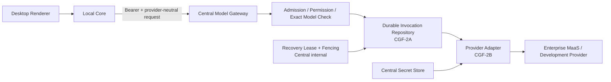

# CGF-2.0 Model Gateway Contract 与威胁模型

> 状态：**IMPLEMENTED / DEVELOPER SELF-TEST PASS / INDEPENDENT QA PENDING**  
> 日期：2026-07-30  
> 适用范围：CGF-2.0 Contract、Fixture、Conformance  
> 决策依据：ADR-015、ADR-016、CGF-2 Development Plan  
> 非授权范围：CGF-2A、CGF-2B、CGF-2C

## 1. 目标

本文件冻结 Enterprise Model Gateway 第一版的信任边界、数据边界和失败关闭
规则。CGF-2.0 只定义可由 TypeScript 与 Java 独立实现和验证的协议事实，不
声称已经实现真实 Provider Dispatch、持久 Model Invocation、双节点 lease、
真实 DeepSeek 调用或 Desktop Model Experience。

## 2. 信任与所有权

| 对象 | 权威所有者 | 不可信输入 |
| --- | --- | --- |
| 企业身份、设备、权限 | Central Security Context | Request Body 自报 identity |
| 实际 Model ID/revision/generation | Local Core 锁定，Central 精确复核 | Provider 自动路由结果 |
| Model Credential | Central Secret Store / Provider Adapter | Local Core、Desktop、Fixture |
| Model Invocation 状态 | Central PostgreSQL（CGF-2A） | JVM 内存、SSE 临时状态 |
| 外发确认事实 | Local Core 持久事实，Central admission 精确验证 | Renderer 文案、客户端布尔值 |
| lease/fencing | Central 内部 PostgreSQL 协调事实（CGF-2A） | HTTP accept request |
| Provider 私有帧 | Provider Adapter 内部 | Public SSE、durable event、Audit |

## 3. 受保护资产

- RoboThree Access Token、Provider API Key、Refresh/Device Credential；
- 企业身份、设备和权限 Claim；
- 完整 Prompt、用户正文、Workspace/Skill/Knowledge 内容；
- Model 完整输出、Token delta、Tool 参数和 Tool 结果；
- 精确 Model/configuration/runtime generation；
- Invocation 幂等键、状态 revision、durable sequence、cursor；
- recovery lease owner、fencing epoch 和 commit digest；
- Provider endpoint、私有 Header、SDK 对象和原始响应帧。

## 4. 数据分类与持久化

| 数据 | 传输 | 持久化 | 日志/Trace |
| --- | --- | --- | --- |
| provider-neutral Model request | Local Core → Central | CGF-2A 只存 digest、锁定引用和必要元数据，不存完整 Prompt | 禁止正文 |
| ephemeral text/tool delta | Central SSE → Local Core | 不作为 durable Gateway 事实 | 禁止正文 |
| durable lifecycle/usage | Central SSE/status | 可持久化 sequence、status、usage、digest | 只允许 count/status/duration/code |
| Access Token | Authorization Header | 不入业务表 | 禁止 |
| Provider Credential | Central Adapter 内部 | 仅 Secret Store opaque reference | 禁止 |
| Admission | accept request | 只存类型、目标、数据类别和 digest/确认引用 | 不记录正文 |

## 5. 威胁与控制

### T1：Request Body 自报企业身份或权限

攻击者在请求中加入 `enterpriseId`、`userId`、`deviceId` 或权限字段，绕过
Central Security Context。

控制：

- `acceptRequest` 为 strict object；
- 固定 `audience = enterprise-model-gateway`；
- 固定 `requiredPermission = model.use`；
- 身份、设备、权限只从已验证 Access Token 和 Central 当前事实获取；
- valid/invalid Fixture 与 TS/Java Conformance 验证自报字段失败关闭。

### T2：Credential 或 Provider endpoint 下发

攻击者或错误实现把 `credentialRef`、API Key、Bearer Token 或 Provider URL
写入 Local Core 可见 Contract。

控制：

- 公共 Model Invocation Schema 不提供这些字段；
- Provider endpoint/credential 只属于 Central Adapter Configuration；
- unknown field、Credential leak Fixture 失败关闭；
- Source Guard 与 QA 动态扫描禁止 Token/Key/URL 泄漏。

### T3：Development Admission 绕过用户确认

`development_synthetic` 被滥用于真实用户正文，或客户端伪造已确认状态。

控制：

- Development 只允许固定 synthetic case 与 synthetic data digest；
- 用户数据必须使用 `user_confirmed`，绑定 Task、Confirmation、目标、数据类别、
  dataScope digest 与 confirmation digest；
- Development Adapter 在 Production Profile 失败关闭；
- CGF-2B 的唯一 canary 必须使用无用户正文的 synthetic admission；
- Production 真实数据路径留到 CGF-2C。

### T4：幂等冲突与重复 Provider Dispatch

网络重试可能创建多个 Invocation 或重复产生外部调用。

控制：

- 逻辑幂等身份固定为 `clientRequestId + requestDigest`；
- `requestId` 仅标识一次传输尝试；
- 相同 ID/相同 digest 返回同一 Invocation；
- 相同 ID/不同 digest 返回 typed conflict；
- Provider 未声明幂等时，断线先查询，不盲目重新 Dispatch；
- CGF-2.0 只冻结语义，原子实现和双节点验证属于 CGF-2A。

### T5：durable 与 ephemeral 事件混淆

把 Token delta 当作可永久重放事实，或让临时事件推进持久状态。

控制：

- durable 事件必须包含 durable sequence 和 opaque cursor；
- ephemeral 事件只包含 stream sequence，不含 durable sequence/cursor；
- 完整输出和 Provider 私有 chunk 禁止进入 durable payload；
- reconnect 先 status reconciliation，再从 durable cursor 续接；
- ephemeral delta 丢失时由最终持久 Message/Invocation 状态收敛。

### T6：非法状态或不可信失败收敛

Provider 断线被误报为 `failed`/`timed_out`，或者引入第二个 `unknown` 公共状态。

控制：

- 公共状态仅为
  `accepted/running/completed/failed/cancelled/timed_out/uncertain`；
- `failed` 和 `timed_out` 只用于可信确定性结果；
- 已 Dispatch 且无法确认外部结果时进入 `uncertain`；
- `unknown` 不是公共 Invocation 状态；
- lifecycle event type 必须与 payload status 一致。

### T7：lease 过期导致双 owner

旧 owner 在 lease 过期并被接管后提交迟到结果，覆盖新 owner。

控制：

- lease 使用数据库时间；
- 每次 acquire/renew/takeover 使用单调 fencing epoch；
- 每个 durable commit 必须携带当前 epoch、expected status revision 和 next
  durable sequence；
- 旧 epoch、sequence gap 或 revision drift 失败关闭；
- lease 到期只允许所有权接管，不直接修改 Invocation 公共状态；
- 完整事务、并发和双 JVM 验证属于 CGF-2A。

### T8：四类计时语义混用

用 lease TTL 代替 Provider deadline，或因 stream idle 直接判定外部结果。

控制：

1. `leaseTtlMillis`：只协调恢复所有权；
2. `providerRequestDeadlineAt`：限制逻辑 Provider 请求；
3. `providerStreamIdleTimeoutMillis`：检测流静默并触发状态查询/恢复；
4. `recoveryQueryDeadlineMillis`：限制 Provider 状态查询。

客户端只可提交 2、3；1、4 是版本化的 Central 内部恢复策略。lease 到期不是
`uncertain` 的充分证据。

### T9：Provider 私有帧污染公共 Contract

Anthropic/OpenAI 私有字段进入 Local Core，导致协议绑定、泄漏或跨 Provider
语义漂移。

控制：

- 公共 Contract 只有 provider-neutral Message、Tool 和 Event；
- 两类私有 Stub Frame 只位于 test-only Adapter Fixture；
- 双协议 Fixture 必须归一为相同 provider-neutral projection；
- 真实第二协议验证属于 Enterprise Integration，不是 Foundation 生产就绪声明。

### T10：超限输入、SSE 和慢消费

超大 Prompt、Tool Schema、delta 或无界 SSE 消耗内存/连接。

控制：

- Message、Tool Schema、Request、delta、cursor 均有数量和字节上限；
- 公共传输只允许 GET/POST；
- HTTP/SSE 实现必须限制 body、frame、buffer、deadline 和 redirect；
- slow consumer、取消传播和资源归零的运行验证属于 CGF-2B。

### T11：日志、Trace、Fixture 泄漏

Prompt、输出、Token、Credential 或完整路径进入测试证据和可观测数据。

控制：

- Error Envelope 只含 typed code 与 safe summary；
- Trace 只允许低基数 status/error code/duration；
- Stub Fixture 不含真实 endpoint/credential/user content；
- QA 必须在源码、日志、Trace、Fixture 和报告四个通道执行动态扫描。

### T12：Production 误装 Development/Fake Adapter

Development Provider 或 Stub Controller 被生产 Spring Profile 解析。

控制：

- Production Composition Validator 必须将 Development/Fake Bean 视为启动错误；
- compatibility feature 只表示 Contract 能力，不表示 Provider 已生产可用；
- CGF-2B 独立验证 production fail-closed。

## 6. Typed error 最小语义

CGF-2.0 复用 strict Enterprise Error Envelope。实现阶段至少稳定区分：

- `model_invocation_validation_failed`；
- `model_invocation_conflict`；
- `model_access_denied`；
- `model_revision_unavailable`；
- `model_external_confirmation_required`；
- `model_provider_unavailable`；
- `model_provider_rate_limited`；
- `model_provider_timed_out`；
- `model_invocation_uncertain`；
- `model_stream_resume_unavailable`；
- `model_recovery_fencing_conflict`。

错误不得包含 Prompt、Provider 原始响应、Credential、Token 或内部异常栈。

## 7. CGF-2.0 验证矩阵

| 验证 | TS | Java | CGF-2.0 预期 |
| --- | --- | --- | --- |
| strict Schema / unknown field | 是 | 是 | PASS |
| identity/credential/endpoint 禁入 | 是 | 是 | PASS |
| audience/permission 固定 | 是 | 是 | PASS |
| public status 无 `unknown` | 是 | 是 | PASS |
| durable/ephemeral 分离 | 是 | 是 | PASS |
| lease/fencing fact strict | 是 | 是 | PASS |
| 四类计时字段隔离 | 是 | 是 | PASS |
| Anthropic/OpenAI Stub 同投影 | 是 | 是 | PASS |
| OpenAPI GET/POST 与精确 Schema ref | 是 | 是 | PASS |
| 真实 PostgreSQL lease/claim | 否 | 否 | CGF-2A |
| 真实 Provider HTTP/SSE | 否 | 否 | CGF-2B |
| 用户真实外发确认 | 否 | 否 | CGF-2C |

## 8. 阶段边界

CGF-2.0 完成后仍不得宣称：

- Model Gateway 可真实调用；
- 双节点 lease 已实现；
- DeepSeek/Anthropic/OpenAI Provider 已接入；
- exactly-once；
- 企业 SSO/MaaS/RBAC 已完成；
- 用户真实数据已允许外发；
- CGF-2A、2B 或 2C 已解锁。

后续任何编码都必须由用户分别授权。
