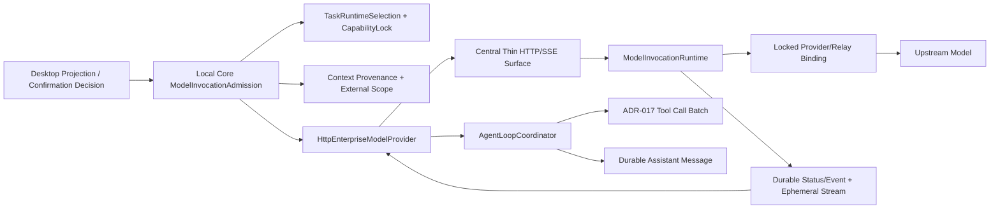

# RoboThree CGF-2C.1 具体实施方案

> 阶段：`CGF-2C.1 — Model Admission, Core Provider and Central HTTP/SSE`  
> 状态：**PASS/CLOSED**  
> 日期：2026-08-03  
> 首轮评审：Claude Code `P0=0 / P1=0 / P2=1 / P3=2`；本版已吸收技术修订  
> 父计划：[CGF-2C Development Plan](./CGF-2C-DEVELOPMENT-PLAN.md)  
> 硬前置：CGF-2.0、CGF-2A、CGF-2B、ADR17-I1/I2/I3 与
> ADR-017 Implementation Gate 均 `PASS/CLOSED`  
> 文档复核：Claude Code `P0=0 / P1=0 / P2=0 / P3=0`  
> 用户授权：2026-08-03 正式接受 Revision 1 并授权进入 CGF-2C.1 编码  
> CGF-2C.2、CGF-2C.3、Enterprise Integration：继续 `GATED`

## 1. 本批目标

CGF-2C.1 建设第一条真实用户 Model Invocation 的 Headless Foundation 链路：

```text
Desktop submitTurn 已持久化
→ Local Core 读取精确 TaskRuntimeSelection / CapabilityLock
→ Context Pipeline 生成 provider-neutral ModelRequest
→ ModelInvocationAdmission 计算外发目标和数据范围
→ 复用或请求 Desktop 用户确认
→ 分发前重新校验企业会话、权限和 Model 实时状态
→ HttpEnterpriseModelProvider
→ Central accept / status / cancel / SSE
→ 已锁定 direct-provider 或 custom-relay Binding
→ provider-neutral text/tool-call/terminal
→ ADR-017 Agent Loop
→ durable Assistant Message 或明确的人工处理结果
```

本批不建设最终 Desktop Model Experience。C.1 只证明 Contract、Application、
HTTP/SSE、安全、幂等和恢复语义可用；CGF-2C.2 才在用户确认的 PRD/UX 下完成
最终可见体验。

五个业务场景、业务 Agent 配置与 Tool Pack 集成不是 C.1 或 C.2 的进入门槛。
C.2 冻结的是通用 Model Experience；业务场景优先级可由 PM 并行规划，但不得
反向阻塞能力平台主线。

## 2. 现状与必须关闭的实现缺口

### 2.1 可以直接复用

- `TaskRuntimeSelection`、`TaskCapabilityLock` 与不可变 Registry Generation；
- KAF-5 Context Pipeline、Model Protocol 和 provider-neutral Tool Call；
- DCF-2 `UserConfirmationCoordinator`、Task Control、Snapshot 与 durable cursor；
- ADR17-I1/I2/I3 的 Tool Call Batch、no-orphan completion、取消和恢复矩阵；
- `RuntimeAdapterHandles.modelProvider(descriptorId, revision)` 精确解析；
- CGF-1 的 Enterprise Access Token、Device Trust 和配置物化；
- CGF-2A 的 durable Invocation、lease/fencing、cancel/timeout 和恢复；
- CGF-2B 的 Anthropic/OpenAI-compatible Adapter、Endpoint/Credential Transport、
  厂商直连与 Public Custom Relay Foundation。

### 2.2 当前代码事实

1. `DurableAgentLoopStarter` 已创建 `model.generate` active Step，但仍拒绝带 Tool
   Lock 的 Task，并由启动时固定的 Scripted/Fake Model 执行；
2. `AgentLoopCoordinator` 构造函数持有单一 `ModelProvider`，还不能按 Task 锁定
   Descriptor 精确选择 Provider；
3. `ConfirmationScope` 只有 `single_action` 和 Tool 专用
   `task_external_scope`，不能伪造 Tool revision 承载 Model 外发；
4. Central 已有 durable `ModelInvocationRuntime` 和 Provider Adapter，但生产代码
   还没有正式 Model Invocation Controller、SSE Surface 与 user-confirmed Admission；
5. Central ephemeral buffer 当前主要覆盖 text，真实 Agent Loop 还需要类型化
   Tool Call 投影；
6. Core 没有持久记录本地 Model round 与 Central Invocation 的精确关联，崩溃后
   无法区分“尚未 accept”“已 accept”“已完成但本地消息未提交”。

因此 C.1 不能只新增一个 HTTP Client；必须同时关闭 Task 级 Provider 解析、
外发确认、Central HTTP/SSE、Invocation 关联和输出连续性恢复五个缺口。

## 3. 总体所有权



| 对象 | 唯一所有者 | 约束 |
| --- | --- | --- |
| Task/Run/Step 与 Model 外发确认 | Local Core | Central 不创建 Desktop 确认 |
| 实际 Model/Binding/Descriptor 选择 | Local Core 锁定，Central 精确解析 | 不智能路由、不静默 failover |
| 企业身份、设备、权限和 Credential | Central | Token/Key 不下发 Renderer |
| Invocation durable terminal | Central Runtime | Backend 不能直接提交 Repository |
| ephemeral text/tool fragment | 当前执行节点内存 | 不进数据库、Event、Audit |
| Assistant Message | Local Core Conversation Persistence | Central 不保存完整模型输出 |
| Tool Call completion | ADR-017 Batch Coordinator | C.1 不建设第二套 Tool Loop |

## 4. Workstream A：Model 外发 Confirmation Contract

### 4.1 Additive scope

在 Local Contract 的 `ConfirmationScope` 增加：

```text
task_model_external_scope
```

字段语义冻结为：

```text
schemaVersion
type = task_model_external_scope
taskId
runtimeSelectionDigest
modelCapabilityRevision
bindingRevision
adapterDescriptorRevision
externalTarget
dataCategories[]
dataScopeDigest
```

其中：

- `externalTarget` 使用锁定 Adapter Descriptor 的稳定逻辑目标标识，例如
  `implementationRef`；禁止放入真实 URL、Host、Credential 或 Key；
- `dataCategories` 严格复用 Enterprise Gateway 七类枚举：
  `user_text`、`platform_agent_instructions`、`tool_schema`、
  `workspace_content`、`skill_content`、`knowledge_content`、`tool_result`；
- `dataScopeDigest` 绑定数据来源范围、锁定 revision 与 WorkspaceGrant 边界引用，
  不绑定每轮正文；
- 现有 `scopeDigest` 继续绑定整个确认 scope；
- Central 单次 `requestDigest` 另行绑定实际请求，三者不得混用。

### 4.2 确认复用

相同 Task 内，仅当以下事实全部一致时复用确认：

```text
runtimeSelectionDigest
modelCapabilityRevision
bindingRevision
adapterDescriptorRevision
externalTarget
dataCategories
dataScopeDigest
```

同一已授权范围内的新 user message 不重复弹窗。新增 Skill/Knowledge/Workspace
来源、新数据类别、目标变化或任一 revision 漂移必须重新确认。

### 4.3 Provenance 与失败关闭

- Context Pipeline 的 source receipt 是类别判定事实源，不从字符串内容猜测来源；
- 已锁定 Tool Schema 使用 `tool_schema`；Tool Result 使用 `tool_result`；
- 平台规则、Agent 身份/目标/Instructions 使用
  `platform_agent_instructions`；
- C.1 不新建 Skill Reader、Knowledge Provider 或 Workspace 全量读取。只有已经通过
  类型化 runtime 装载并带 provenance 的内容才允许进入 Context；
- 先前 Assistant Message 只有在其持久 provenance 能证明来自同一个
  `externalTarget` 和兼容的锁定 Model selection 时才可继续发送；它不作为新的
  本地外发类别。来源缺失、目标变化或来源不明时以
  `model.external_scope_unclassifiable` 失败关闭；
- 禁止把 Assistant 输出错误归类为 `user_text`，也不在 C.1 擅自增加第八类枚举。

### 4.4 兼容策略

- `single_action` 与现有 Tool `task_external_scope` 行为不变；
- 先为当前 reader/writer 增加 Fixture 和兼容性测试；若 additive union 对已有
  reader 构成破坏，编码前必须升级 Local Contract 版本，禁止放宽 parser；
- Desktop v1alpha1 Projection 继续使用现有通用 Confirmation 字段。C.1 只把新
  scope 安全投影为现有“外部数据范围”摘要，不增加 Renderer Contract 字段；
- `UserConfirmationCoordinator` 的错误语义从 Tool 专用文案收敛为 scope-aware
  typed error，但继续复用现有 `wait_step` / `resume_step` /
  `record_observation`，不修改 Kernel reducer。

## 5. Workstream B：Core ModelInvocationAdmission

### 5.1 内部调用对象

公共 `ModelRequest` 不增加 Task、Run 或 Credential 字段。Core Application 层新增
内部 `ModelProviderInvocation`，包含：

```text
taskId / runId / stepId / actionId / round
runtimeSelectionId / runtimeSelectionDigest
locked Model Capability/Binding/Descriptor references
modelRequest
assistantMessageId
deadlineAt
```

它不进入公共 Contract，不进入 Renderer，也不包含 Runtime Handle、PID、Token
或 Credential。

### 5.2 精确 Provider 解析

1. `DurableAgentLoopStarter` 读取 durable Task bundle；
2. 校验 `resolvedModelLock` 精确存在且 digest/revision 匹配；
3. 使用 `RuntimeAdapterHandles.modelProvider(descriptorId, revision)` 解析 Handle；
4. 将解析后的 Provider 作为本次 Run 的显式依赖交给 `AgentLoopCoordinator`；
5. `AgentLoopCoordinator` 不再使用启动时固定的全局 Model Provider；
6. 不按名称、价格、健康评分或协议自动换 Provider。

Task 只锁定 Definition/Binding/Descriptor/Registry revision，不锁定进程、连接、
Token 或 Runtime Handle，继续符合 ADR-008。

### 5.3 Admission 顺序

```text
strict ModelRequest validation
→ exact Task/Run/Step/Action identity
→ exact RuntimeSelection + CapabilityLock validation
→ derive externalTarget/dataCategories/dataScopeDigest
→ reuse confirmed scope or request confirmation
→ immediately before dispatch re-check session/device/permission/model state
→ acquire short-lived Enterprise Access Token
→ prepare durable local invocation link
→ Central accept/status/events
```

任何确认前、确认等待中或最终实时校验失败的路径都不得向 Central `accept`。

### 5.4 Agent Loop 接入

- 复用现有 `model.generate` active Step 作为 Model 外发确认的 execution reference；
- 同一 Step 可以覆盖一个 Agent Run 内的多轮模型调用，round 在内部 link 中区分；
- `DurableAgentLoopStarter` 移除“只允许 text-only Agent”的临时限制，但只有在从
  TaskCapabilityLock 确定性构建全部 `ToolSchemaCandidate` 后才允许；
- Tool 名称在单次 Model Request 中必须唯一；重复名称在外发前失败关闭；
- Central 返回 Tool Call 后，Core 只允许映射到本次请求已经锁定并发送的 Tool
  Schema；未知名称或重复 Tool Call ID 拒绝；
- 通过验证的 Tool Call 继续进入 ADR-017 Batch Coordinator，禁止另建执行路径。

### 5.5 Confirmation 结果

- `confirmed`：恢复同一 `model.generate` Step，重新执行实时收窄校验后分发；
- `rejected`：写入既有 `user_rejected` Observation，不创建 Central Invocation；
- App/Core 重启：从 durable Confirmation + exact scope 恢复，不重复弹窗；
- scope 变化：旧确认不得复用，创建新 confirmationId；
- 同 confirmationId / scopeDigest 同内容幂等，不同内容 typed conflict。

## 6. Workstream C：HttpEnterpriseModelProvider

### 6.1 类型化 Port 边界

`HttpEnterpriseModelProvider` 是 Local Core 的 `model_provider` Runtime Handle，
只处理 Enterprise Gateway Protocol：

- accept；
- status；
- cancel；
- durable event/SSE；
- provider-neutral text delta、Tool Call、usage 和 terminal 转换；
- AbortSignal、deadline、trace/correlation 传播；
- Access Token 最多续签一次。

它不解析厂商私有 SSE，不持有厂商 Key，不选择 direct-provider/custom-relay，
也不访问 SQLite；持久协调由 Application 层完成。

### 6.2 ID 生命周期

| ID | 生命周期 | 重试规则 |
| --- | --- | --- |
| `ModelRequest.requestId` | Local Core 单个 Model round | round 变化时新建 |
| `clientRequestId` | 同一逻辑 Central Invocation | 崩溃/网络重试保持不变 |
| `requestId` | 单次 HTTP/SSE 传输尝试 | 每次传输新建 |
| `invocationId` | Central durable Invocation | 由 Central 返回并持久关联 |
| `durableCursor` | Central durable event offset | 不透明保存，不在 Core 解析 |

Central accept 的 `requestDigest` 覆盖精确 ModelRequest、Admission、locked target
和 timeout，不包含 transport requestId。相同 `clientRequestId + requestDigest`
幂等；同 ID 不同 digest 必须 conflict。

### 6.3 HTTP 安全

- 生产只允许 HTTPS；测试只显式放行受控 loopback；
- `redirect: manual`，不跟随重定向转发 Bearer；
- Bearer 只出现在 Authorization Header；
- request、response、SSE frame、累计 stream 均有 byte 上限；
- Content-Type、frame、enum、ID、sequence、cursor 全部 strict 校验；
- 401/Token expiry 最多续签一次，并继续同一 clientRequestId/invocationId；
- 第二次 401、续签失败或身份/设备无效时停止自动重试；
- Prompt、输出、Token、Credential、Endpoint 和完整路径不进入日志/Trace/Audit。

### 6.4 SSE strict consumer

Core Consumer 严格复用 Enterprise Gateway v1alpha1 canonical Event Envelope：

- ephemeral 只接受 `started`、`text_delta`、`tool_call`；
- durable 只接受 lifecycle event 和 `usage_recorded`；
- `heartbeat` 只能使用不携带业务 JSON 的 SSE comment/transport keep-alive，
  不能伪装成新的 canonical Event；
- durable event 校验 `durableSequence` 连续、eventId/digest 同一性与 terminal
  不可逆；`durableCursor` 仅透传、持久化和回送，不解析其内部含义；
- ephemeral event 校验单次 live stream 内 `streamSequence` 严格单调且连续；
  reconnect 后不得把 streamSequence 当作 durable replay cursor；
- invocationId、contractVersion、eventClass、eventType、payload、eventDigest 和
  occurredAt 全部 strict 校验；unknown field/type/frame 失败关闭；
- heartbeat/inactivity timeout 只判断当前 Transport 是否失活，不直接改变
  Invocation terminal，也不生成新的 durable cursor。

## 7. Workstream D：Central Production HTTP/SSE Surface

### 7.1 Thin Controller

基于已冻结的 Enterprise Gateway Model 路由实现正式生产 Surface：

```text
POST accept
GET status
POST cancel
GET events
```

Controller 只负责 strict DTO、调用 Application Service 和返回 HTTP/SSE；不得写
业务逻辑、Repository 调用或事务。继续遵守公司 Java 基线：GET/POST、全局异常、
链路追踪、MyBatis-Plus Persistence、无状态服务和集群部署。

### 7.2 身份与 Admission

- `EnterpriseBearerTokenFilter` 精确覆盖四条 Model 路由；
- Central 从已验证 Token Claim 获取 enterprise/user/device/client 身份，不信任
  Request Body 自报主体；
- Production 只接受经过 Core Confirmation 形成的 `user_confirmed` admission；
- `development_synthetic` 仅保留在 development/test profile，生产失败关闭；
- Central 仍重新校验 `model.use`、Device Trust、Binding state、Credential 和
  request digest；Core 确认不替代 Central 授权。

### 7.3 SSE 与执行所有权

C.1 冻结“先订阅、后启动”的执行顺序：

```text
GET events
→ 验证 Invocation 与调用主体
→ 在当前 Central 节点建立 bounded ephemeral subscriber
→ 当前节点竞争 durable execution lease
→ owner 调用既有 ModelInvocationRuntime / Provider Backend
→ durable status/event 与 ephemeral text/tool-call 分通道发送
```

目的：避免 accepted Invocation 在没有任何 Subscriber 时后台执行并永久丢失完整
输出。它不要求 sticky session，也不建设 Redis/Kafka：

- durable Invocation/status/event 继续由共享 PostgreSQL 保证；
- ephemeral delta 只在执行 owner 节点内存存在，可丢失且不重放；
- 同一 `invocationId` 重新订阅时先读取 durable owner/lease：
  - 当前节点仍是 owner 且 bounded buffer 能证明从 Core 最后已见
    `streamSequence` 起连续时，可以重挂同一 live stream；
  - 其他节点持有未过期 owner lease 时，当前节点只能作为 passive subscriber
    返回 status/durable event，禁止再次调用 Backend；
  - 只有 lease 已到期、owner 缺失且 recovery policy 允许时，当前节点才能通过
    CAS/fencing 竞争为新 owner；
- C.1 不建设跨节点 ephemeral 转发。passive subscriber 如果无法取得连续输出，
  即使 durable status 最终为 completed，也必须按
  `model_stream_resume_unavailable` 进入 Local 人工处理；
- 节点死亡后新节点必须 status-first 和 evidence-based recovery，不能拼接旧 delta；
- SSE Client 断开时传播取消/连接状态，但是否取消 Provider 由已冻结 cancel/deadline
  语义决定，不能把普通网络抖动直接改写为 terminal。

### 7.4 Event 与 bounded buffer

Central 内部 ephemeral buffer/publisher 严格投影 canonical 类型：

```text
ephemeral:
started
text_delta
tool_call

durable:
accepted / dispatch_decided / terminal
usage_recorded

transport only:
SSE heartbeat comment
```

Provider 私有 `thinking`、`signature` 和未知 frame 不投影、不持久化；Tool Call
必须在 Adapter 层完整校验后才进入 provider-neutral 事件。ephemeral event 不进入
PostgreSQL、Audit Outbox 或 durable Invocation terminal。禁止在 C.1 新增
`tool_call_delta`、`completed_tool_call`、`usage_delta` 或 `heartbeat` canonical
event type；若实现发现 canonical 类型不足，必须停止并单独评审 Contract。

## 8. Workstream E：本地 Invocation Link 与双事务恢复

### 8.1 SQLite migration

使用编码时“下一个可用 migration 编号”；本文撰写时为 migration 14。新增本地
`model_invocation_links`（最终名称可在实现中保持项目命名风格），只记录协调事实：

```text
taskId / runId / stepId / actionId / round
runtimeSelectionDigest
assistantMessageId
modelRequestId / modelRequestDigest
confirmationId / scopeDigest / dataScopeDigest
clientRequestId / centralAcceptRequestDigest
invocationId? / statusRevision? / durableCursor?
acceptedAt? / outputStartedAt? / messageCommittedAt?
recordDigest / createdAt / updatedAt
```

禁止记录 Prompt、Message 正文、模型输出、delta、Tool 参数/结果、Token、Credential、
Endpoint、Runtime Handle、PID 或完整本地路径。

不新增公共 Model Invocation 状态枚举。`prepared / accepted / committed` 由字段事实
推导，不建立第二套 Central 状态机。

### 8.2 三个本地提交点

```text
L1：Central accept 前
    持久化稳定 clientRequestId、request digest、confirmation scope 和
    预分配 assistantMessageId

网络：Central accept / status / events

L2：accept 后
    持久化 invocationId、statusRevision、durableCursor

L3：完整 terminal stream 后
    幂等提交 durable Assistant Message / ADR-017 Assistant Batch，
    再标记 messageCommittedAt
```

Local SQLite 与 Central PostgreSQL 不存在跨数据库原子事务。恢复依赖稳定 ID、
digest、唯一约束、CAS 和 status-first query，不宣称 exactly-once。

### 8.3 崩溃窗口

| 窗口 | 恢复规则 |
| --- | --- |
| L1 前 | 无 Central 请求，可安全重新准备 |
| L1 后、accept 前 | 使用同一 clientRequestId/digest 重放 accept |
| accept 成功、L2 前 | 同一 clientRequestId 查询/幂等 accept，禁止新 Invocation |
| L2 后、首个 ephemeral 前 | status-first；同 owner 且 buffer 连续才重挂；其他有效 owner 存在时只做 passive status/durable subscription；仅 lease 到期/owner 缺失时按 recovery policy 竞争接管，绝不新建 Invocation |
| ephemeral 已开始、连接中断 | 不拼接缺失输出；标记 output continuity lost |
| Central terminal、L3 前 | 若完整输出仍在当前连续流内则提交；Core 已崩溃导致输出丢失时不得伪造结果 |
| L3 后、响应丢失 | 以 assistantMessageId/message digest 幂等收敛，不重复 Message |

### 8.4 输出不可恢复

RoboThree 不持久化完整模型输出和历史 delta，因此以下窗口不能被伪装成成功：

```text
Central 已 accepted/running/completed
AND Core/stream 已丢失完整输出连续性
AND 本地 durable Assistant Message 尚未提交
```

此时：

- 保留原 Invocation、clientRequestId 和 durable 事实；
- 不自动创建第二 Invocation；
- 以 ADR-015 已冻结的 typed `model_stream_resume_unavailable` 收敛为现有
  `external_dependency` 人工处理语义；
- C.2 将其投影为 `manual_attention`，用户可选择新 Run Retry；
- 原 Task/Run 事实不删除，Retry 不继承旧 Run 未完成输出。

C.2 PRD 必须冻结该状态下的用户可见说明、可执行动作、Retry/取消/导出诊断边界
和处理责任；C.1 不冻结 24/72 小时等运营 SLA。企业支持组织、响应时间和升级
流程属于后续产品/运营决策，不构成 C.1 或 C.2 技术门槛。

这是一条明确的 at-least-once 外部调用、非 durable output 的诚实边界，不以
“更高成功率”为理由保存 Prompt/模型正文。

## 9. direct-provider 与 custom-relay

Core 不增加 `connectionMode` 分支。两种路径都只看到同一个企业 Model Descriptor
和同一个 `HttpEnterpriseModelProvider`：

```text
Local Core locked enterprise model
→ Central locked ModelEndpointBinding revision
→ direct provider 或 custom relay
```

Connection、URL、Credential、协议和 upstreamModelId 映射都属于 Central 已锁定
Binding/Adapter。C.1 只用受控 Stub/loopback 同时验证两种 Binding 经过同一路径；
不使用真实 Key，不访问企业内网，不重新建设 Model Registry 或报备平台。

## 10. 失败语义

| 场景 | 结果 |
| --- | --- |
| 未确认或用户拒绝 | 不 accept；等待确认或 `user_rejected` |
| 企业会话/权限失效 | `external_dependency` waiting；不得 fallback |
| Model/Binding/Descriptor 漂移 | typed conflict，失败关闭 |
| Central accept 响应丢失 | 同 clientRequestId status/idempotent accept |
| Provider 确定性协议失败 | Central `failed`，Core typed provider failure |
| cancel | 同一 Invocation cancel；竞争只允许一个 terminal |
| deadline | 同一 Invocation `timed_out`；迟到事件不得改 terminal |
| side effect/result 不确定 | 使用现有 evidence-based `uncertain`/人工处理边界 |
| 完整输出连续性丢失 | `model_stream_resume_unavailable`，不盲目重跑 |
| unknown Tool Call | 拒绝，不进入 ADR-017 Batch |

禁止增加新的 Kernel TaskStatus、Effect 状态或万能 Runtime State。

## 11. 分批实施顺序

CGF-2C.1 作为一个用户门槛，内部按以下顺序实现，不新增对外阶段编号：

### 11.1 Contract 与 Core admission

- additive Confirmation Scope、Fixture、Conformance；
- scope-aware UserConfirmationCoordinator；
- Context provenance/category derivation；
- ModelProviderInvocation、按 Task 精确 Provider 解析；
- InMemory admission/replay 先行。

### 11.2 Core persistence 与 HTTP Provider

- migration 14 与 InMemory/SQLite 同一 Conformance；
- 本地 Invocation Link、L1/L2/L3 和故障注入；
- HttpEnterpriseModelProvider、安全 Transport、token-once；
- accept/status/cancel/SSE strict consumer schema。

### 11.3 Central Surface 与 Headless E2E

- Thin Controller、Application Service、Bearer Filter、Global Error/Trace；
- user-confirmed Admission；
- stream-first execution ownership、typed ephemeral buffer；
- direct/custom locked Binding Stub；
- text + Tool Call → ADR-017 → durable Message Headless E2E；
- close/reopen、Core restart、Central node loss和资源归零矩阵。

三组 Workstream 是同一个 CGF-2C.1 批次内的实施顺序，不形成新的外部阶段或
用户授权门槛。C.1 Headless E2E 使用受控 Stub/loopback Provider，但必须同时
验证：Production profile 接受完整 `user_confirmed` admission 并拒绝
`development_synthetic`；development/test profile 才可使用 synthetic。Stub
只替代上游网络资源，不得替代生产 Admission 安全路径。

任一步发现需要修改 Enterprise canonical Model Contract、Central v0007 或 Kernel
状态机时停止编码并重新评审，不把范围静默塞入 C.1。

## 12. 允许修改范围

```text
packages/contracts/src/authorization/**
packages/contracts/src/enterprise-consumer/**（如需新增 Local consumer schema）
packages/contracts/tests/**

services/core/src/application/**
services/core/src/ports/**
services/core/src/adapters/http/**
services/core/src/adapters/sqlite/**
services/core/src/bootstrap/**
services/core/src/registry/**
services/core/tests/**

services/central-service/src/main/java/**/modelgateway/application/**
services/central-service/src/main/java/**/modelgateway/adapter/http/**
services/central-service/src/main/java/**/shared/adapter/http/**
services/central-service/src/test/**

scripts/**
docs/**
package.json / version files / CHANGELOG / DEVELOPMENT-LOG
```

Contract consumer 的目录名称服从现有代码布局，不为追求本计划名称新建无必要的
公共 package。

## 13. 禁止修改范围

- Kernel reducer、TaskStatus、Effect/PREPARED/DISPATCHED 状态；
- Core migrations 1～13；
- Central SQL scripts v0001～v0007；
- Enterprise Gateway canonical OpenAPI/Model Schema，除非另行评审确认真实缺口；
- CGF-2B 已通过的生产 Provider Wire Adapter 语义；
- Desktop Renderer/Main/Preload 与最终 UX；
- 真实 OA/CAS、MDM、复杂 RBAC 和 Secret Store；
- Admin Console、个人 Model、Model 报备/Key 签发/聚合路由平台；
- 自动 Model/Binding/协议 failover；
- Redis、Kafka、共享 ephemeral stream；
- Prompt、模型正文或 delta 持久化；
- CGF-2C.2、CGF-2C.3 与 Enterprise Integration。

## 14. 测试与 QA 门槛

### 14.1 Contract / Core

1. 新 scope strict valid/invalid Fixture；
2. 旧 Tool scope 全量回归；
3. scope reuse、范围扩大、revision/target 漂移；
4. Context provenance 七类映射与 unknown fail-closed；
5. assistant history 同目标 provenance 与跨目标拒绝；
6. 精确 Model Handle resolution、missing/mismatch/multi-binding 拒绝；
7. InMemory/SQLite 同一 Invocation Link Conformance；
8. migration 14 fresh、13 upgrade、close/reopen、旧 migration checksum 不变；
9. L1/L2/L3 全故障窗口、同 ID 幂等/不同 digest conflict；
10. Token 续签恰好最多一次；
11. redirect/oversize/malformed/wrong-ID 全失败关闭；SSE Consumer 严格验证
    canonical event type、durableSequence、streamSequence、opaque cursor、
    heartbeat comment 与 inactivity timeout；
12. Prompt/输出/Token/Endpoint 不入 DB、日志和 Trace。

### 14.2 Central

13. 四条 Model 路由只有 GET/POST，Controller 无业务逻辑；
14. Bearer Filter 路由精确、无 Token 串线；
15. Production 拒绝 synthetic，接受完整 user-confirmed admission；
16. subscriber-before-execute 顺序；
17. 同 Invocation 并发 SSE 只有一个 lease owner；
18. canonical started/text/tool-call ephemeral、durable usage/lifecycle、SSE comment
    heartbeat、bounded buffer 与 slow/disconnected consumer；
19. cancel/completed、deadline/late terminal、lease takeover/fencing；
20. Central 重启后 durable status 可恢复、ephemeral 不伪造重放；SSE Client
    网络抖动断开但 Provider 未 terminal 时，重新连接必须 status-first，不得误判
    cancelled/completed，也不得触发第二次 Backend 调用；
21. direct/custom locked Binding 同路径，Core 不出现 URL/Connection 分支；
22. Central online/offline、Testcontainers PostgreSQL 和双 JVM现有回归。

### 14.3 Headless E2E

23. submitTurn → 确认 → user-confirmed accept → text → durable Assistant Message；
24. 拒绝确认时 Central request count 为 0；
25. Tool Call → ADR-017 Batch → Tool Result → 下一 Model round → final Message；
26. Core restart 在 accept 前/后、首 delta 前/后、terminal/L3 前后各自收敛；
    L2 后同 owner 连续重挂、其他有效 owner passive subscription、lease 到期后
    单 owner takeover 三条分支均必须实际验证；
27. output continuity lost 必须以 `model_stream_resume_unavailable` 人工处理且
    不产生第二 Invocation；
28. 同 Task scope 不变不重复确认，范围扩大必须重新确认；
29. PID/port/connection/lease/subscriber/buffer/request/timer 全部归零；
30. 日志、Trace、测试输出、QA evidence 四通道动态 canary 命中 0。

### 14.4 建议命令

编码时建立单一专项入口，命名建议：

```text
pnpm run harness:cgf2c1
pnpm run check:central
pnpm run check:central:offline
pnpm run check
```

独立 QA 必须实际重跑专项 Harness 和完整门禁，不能用开发者 digest、历史报告或
单元测试推断替代。

## 15. 版本与记录

编码批次建议版本：

```text
Root/Core/Contracts：0.0.0-cgf.2c.1
Central：0.0.0-cgf.2c.1-SNAPSHOT
Desktop：保持当前版本（C.1 不改 Desktop 源码）
```

如果实现阶段拆成 repair，按现有版本规则递增。代码、Contract、migration、
安全或测试基线变更必须同步 CHANGELOG、DEVELOPMENT-LOG 和下一个可用 KEY-NODE。

## 16. 工期

父计划原估 C.1 为 3～5 个集中工程工作日。基于当前代码事实，C.1 还需正式
Central HTTP/SSE Surface、本地 migration、per-Task Provider resolution 和输出
连续性恢复，修订为：

| 工作包 | 集中工程工作量 |
| --- | ---: |
| Contract、provenance、Admission | 1.5～2.5 天 |
| Core link persistence、HTTP Provider | 1.5～2.5 天 |
| Central HTTP/SSE、user-confirmed admission | 1.5～2.5 天 |
| Headless E2E、故障矩阵和收口 | 1～2 天 |
| 合计 | **5.5～9.5 天** |

不包含独立 QA、返工、真实 Provider/企业网络等待和 PRD/UX 等待。工程工作日不是
日历交付承诺。

## 17. C.1 退出门槛

```text
本计划文档评审 P0/P1=0
AND 用户接受并明确授权编码
AND Contract/Core/Central/Headless E2E 全部实现
AND harness:cgf2c1 实际执行 PASS
AND Central online/offline 与 workspace check PASS
AND 独立 QA P0/P1=0
AND 用户接受独立 QA
```

允许结论：

```text
CGF-2C.1 FOUNDATION PASS/CLOSED
CGF-2C.2 GATED
CGF-2C.3 GATED
ENTERPRISE INTEGRATION GATED
```

禁止声明 Desktop Model Experience、企业生产集成或企业 Pilot 已就绪。

## 18. 本轮文档评审重点

请 Claude Code 和 MiniMax 按 P0/P1/P2/P3 评审，重点确认：

1. `ModelProviderInvocation` 留在 Core 内部、公共 `ModelRequest` 不加入 Task 身份；
2. `DurableAgentLoopStarter` 按 Task 锁定 Descriptor 解析 Provider，而非全局固定
   Model 或智能路由；
3. `task_model_external_scope`、七类 provenance 和 Assistant history 同目标规则；
4. Local migration 14 的 L1/L2/L3 与 Central PostgreSQL 无跨库原子事务边界；
5. “先订阅、后竞争 lease、再执行”的 Central SSE owner 方案是否与双 JVM恢复
   和无状态部署一致；
6. 完整输出连续性丢失时 `model_stream_resume_unavailable` + 人工处理，而不是保存正文
   或盲目新建 Invocation；
7. Production `user_confirmed` 与 development/test `synthetic` 的 profile 隔离；
8. C.1 只复用现有通用 Confirmation Projection、不修改 Renderer，最终 UX 留给
   C.2 PRD/UX；
9. C.1 不修改 Enterprise canonical Model Schema、Central v0007、Kernel reducer
   和 CGF-2B Provider Adapter；
10. 工期从 3～5 天修订为 5.5～9.5 个集中工程工作日是否合理。

## 19. 首轮评审修订映射

| 编号 | 评审问题 | 修订位置 | 状态 |
| --- | --- | --- | --- |
| P2-01 | L2 后重新订阅与 execution owner 关系不够显式 | §7.3、§8.3、QA 26 | **CLOSED IN REVISION** |
| P3-01 | SSE 网络抖动不应误判 terminal，缺专项测试 | QA 20、26 | **CLOSED IN REVISION** |
| P3-02 | Core SSE Consumer 字段级校验不足 | §6.4、§7.4、QA 11/18 | **CLOSED IN REVISION** |
| P3-PM-01 | 五个业务场景是否成为 C.2 隐性硬前置 | §1、父计划 §3/§14 | **REJECTED AS GATE；MAY RUN IN PARALLEL** |
| P3-PM-02 | manual_attention 处理责任与 SLA | §8.4、父计划 §3.2 | **PARTIALLY ACCEPTED；UX/ACTIONS IN C.2，OPS SLA DEFERRED** |
| SELF-01 | 初稿错误码与 ADR-015 不一致 | §8.4、§10、QA 27 | **CLOSED：REUSE model_stream_resume_unavailable** |
| SELF-02 | 初稿 ephemeral 类型超出 canonical Contract | §6.4、§7.4、QA 11/18 | **CLOSED：REUSE CANONICAL TYPES** |

修订版需由 Claude Code 复核上述关闭映射。本表不代表独立 QA，也不构成编码授权。

## 20. 当前状态

```text
CGF-2.0 / CGF-2A / CGF-2B：PASS/CLOSED
ADR17-I1/I2/I3：PASS/CLOSED
ADR-017 Implementation Gate：PASS/CLOSED
CGF-2C Plan：CONFIRMED
CGF-2C.1：PASS/CLOSED
CGF-2C.2/2C.3：GATED
Enterprise Integration：GATED
```

Revision 1 实现、开发者门禁和 Claude Code 独立 QA 均已通过，用户已正式接受
并关闭 CGF-2C.1。CGF-2C.2 继续等待用户提供需求并确认 Model Experience
PRD/UX；CGF-2C.2、CGF-2C.3 与 Enterprise Integration 仍保持 GATED。
