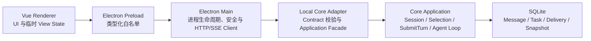
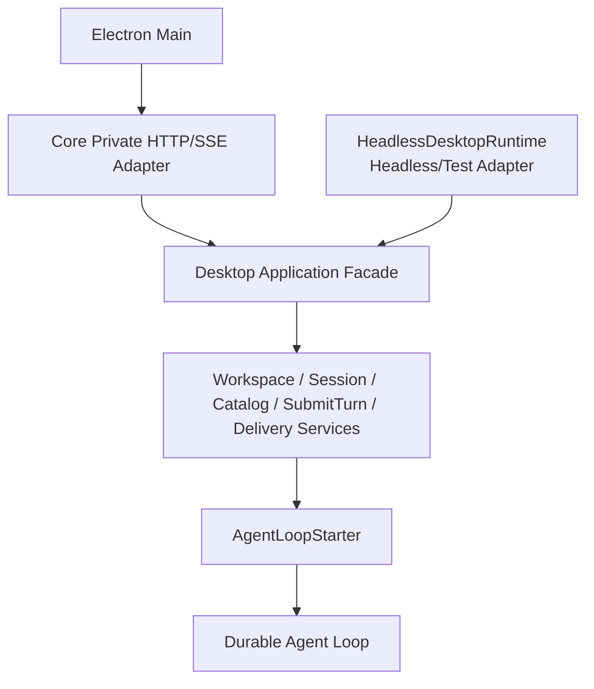
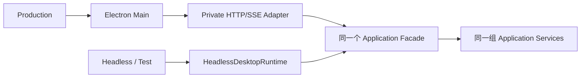
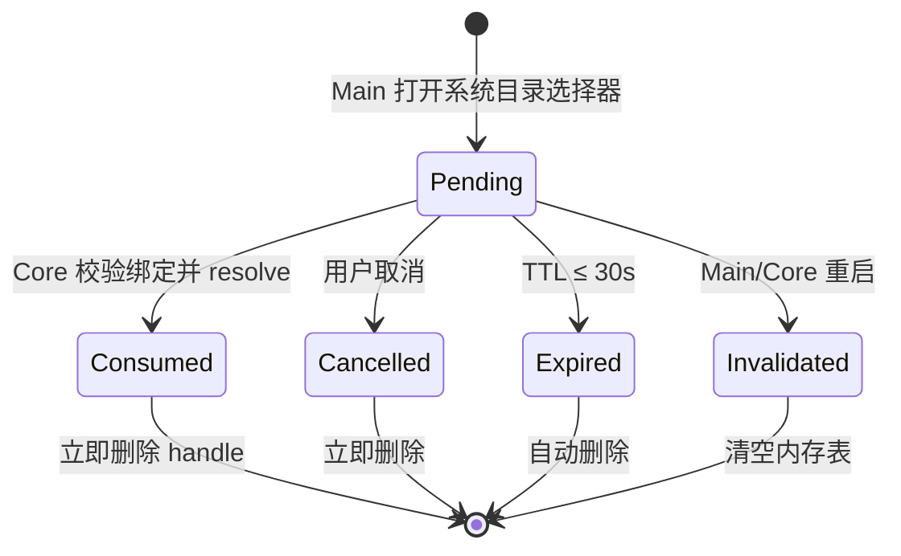
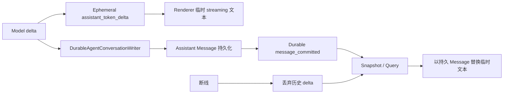

# RoboThree DCF-1.2 开发计划

> 批次：`DCF-1.2 — Desktop Bridge and Minimal Workbench`  
> 状态：**DCF-1.2A/1.2B/1.2C PASS/CLOSED — DCF-1.2 CLOSED**  
> 日期：2026-07-26  
> 前置事实：DCF-1.0、DCF-1.1A～1.1C 均已独立 QA `PASS/CLOSED`，DCF-1.1 已关闭  
> Contract 基线：Desktop Local Runtime Contract `v1alpha1 ACCEPTED`，企业配置状态 `v1alpha2 IMPLEMENTED/QA_PASS`  
> 后续边界：DCF-1.2 已关闭；已确认先 DCF-1.3、后 CGF-1.3，DCF-1.3 计划等待接受和明确授权，CGF-1.3 继续 `GATED`  
> 建议版本：`0.0.0-dcf.1.2a`、`0.0.0-dcf.1.2b`、`0.0.0-dcf.1.2c`

## 1. 目标

DCF-1.2 将已通过 Headless 验收的 Desktop Core 业务能力接入真实 Electron
进程边界，形成第一个可交互的最小工作台：

```text
启动 Desktop
→ Electron Main 启动 Local Core
→ 完成正式 Contract 握手
→ 选择 Workspace
→ 创建或打开 Session
→ 选择 Agent 和合法 Model
→ submitTurn
→ 查看 Scripted Model 流式回答
→ 断线后通过 Snapshot + durableCursor 收敛
```

本批的重点不是完成完整 Desktop 产品，而是验证：

1. Electron Main 是 Local Core 私有 HTTP/SSE 的唯一客户端；
2. Renderer 只能通过 Preload 白名单使用业务 Projection；
3. `submitTurn` 进入现有持久协调和真实 Agent Loop，而不是新的 UI 内循环；
4. ephemeral token delta 可以丢弃，最终正文必须由持久 Message 收敛；
5. Desktop/Core 进程边界、Contract、安全限制和恢复语义可以被自动化验证。

## 2. 当前代码事实

### 2.1 已有基础

- DCF-0 已建立 Electron Main、Preload、Vue Renderer 和 Core 子进程隔离；
- Main 已具备随机 loopback 端口、一次性启动令牌、有限异常重启和优雅停止骨架；
- Renderer 已启用 sandbox、context isolation、无 Node integration 和无直接网络能力；
- Desktop Local `v1alpha1` 已定义 Control、Workspace、Session、Catalog、
  SubmitTurn、Durable/Ephemeral Event 与 typed Error；
- DCF-1.1 已完成 WorkspaceGrant、Session、Agent/Model Projection、
  Runtime Selection、Task/Message 原子提交、durable delivery 和 SubmitTurn 恢复；
- KAF-5 已完成 Context Pipeline、Scripted Model、最小 Agent Loop 和持久
  Assistant/Tool Message。

### 2.2 仍存在的真实缺口

- Electron Main 当前启动的是 DCF-0 `Fake Core Fixture`，不是正式 Local Core；
- Preload 当前只暴露 `getFoundationStatus()`；
- Renderer 当前只有 Foundation 状态页，没有业务工作台；
- 正式 Desktop HTTP/SSE Server Adapter 尚未建立；
- Main 尚无正式 Contract Client、SSE Client 和重连控制器；
- `AgentLoopStarter` 仍需绑定到现有 durable Agent Loop 生产装配；
- 现有 durable Desktop delivery 主要覆盖 SubmitTurn 协调结果，Assistant
  Message 完成、Task 状态和 Runtime Notice 仍需形成安全的 Desktop 事件投影；
- streaming delta 尚未从 Model/Agent Loop 投影到 Desktop ephemeral stream。

因此 DCF-1.2 不是纯前端批次，必须先完成 Core Adapter 与 Main Client 的正式桥接。

## 3. 冻结的所有权与进程边界



### 3.1 Renderer

只负责：

- 页面、交互和无敏感 UI 偏好；
- 展示 Core 返回的 Projection；
- 发送用户选择和业务命令；
- 合并当前连接内的 ephemeral delta；
- 在收到 durable Message 或新 Snapshot 后丢弃临时 delta。

不得：

- 直接 `fetch` Local Core；
- 访问文件系统、数据库、凭证、Node 或 Electron 原始 API；
- 自行计算 Model 权限交集、Runtime Selection 或 Task 状态；
- 持久化启动令牌、完整 Prompt、企业 Credential 或 Runtime Handle；
- 根据 delta 自行认定 Assistant Message 已完成。

### 3.2 Preload

`RoboThreeDesktopApi v1alpha1` 是 Desktop Local Runtime Contract `v1alpha1`
面向 Renderer 的安全、裁剪视图。它不是新的跨进程业务 Contract 版本，也不是
第二套事实源。

冻结的业务 API 视图至少包括：

```text
Control / Compatibility
Runtime Status
Workspace choose / create / list / revoke
Session create / list / open / rename / archive
Catalog Agent / Model query
Conversation Snapshot
SubmitTurn + Receipt / Status Query
Desktop Event subscribe / unsubscribe
受控应用生命周期
```

Preload 不暴露原始 IPC channel、URL、port、authorization token、HTTP Client、
SSE 对象、`fs`、`child_process` 或 Shell。

签名摘要：

```text
RoboThreeDesktopApiV1Alpha1
├── getCompatibility()
├── getRuntimeStatus()
├── chooseWorkspace(selectionRequest)
├── createWorkspaceGrant(safeSelectionRequestId, command)
├── listWorkspaceGrants()
├── revokeWorkspaceGrant(command)
├── createSession(command)
├── listSessions()
├── openSession(sessionId)
├── renameSession(command)
├── archiveSession(command)
├── listAgents()
├── listModels(agentId?)
├── getConversationSnapshot(sessionId, page?)
├── submitTurn(command)
├── querySubmitTurn(submitTurnCommandId)
├── subscribeDesktopEvents(listener)
├── unsubscribeDesktopEvents(subscriptionId)
└── requestControlledShutdown()
```

`archiveSession` 在本批映射到 Desktop Local `v1alpha1` 已接受的
`DeleteSessionCommand` tombstone/软删除语义，不引入新的 Session 删除模型。
`safeSelectionRequestId` 只是 Renderer 可见的选择请求关联 ID，不是
`selectionHandle`。所有输入、输出和 typed error 必须映射到 Desktop Local
Contract 并在 IPC 两端 strict 校验；Renderer 输入不能直接成为 Core Request。

IPC channel 名只属于内部实现常量，集中定义并经过白名单校验，但不提升为长期
产品 Contract。DCF-1.2A 冻结上述视图，DCF-1.2B 只实现它，不再临时改变 Main
Client 的领域语义。

### 3.3 Electron Main

负责：

- 启动、监控、有限重启和停止 Local Core；
- 持有随机端口和每次启动的短期令牌；
- 正式 Compatibility/Readiness 握手；
- 类型化 Command/Query HTTP Client；
- 单一认证 SSE 连接、重连、退避、cursor 管理和背压处理；
- 系统目录选择器与一次性 opaque `selectionHandle`；
- 将经过 Contract 校验的 Projection/Event 转发给 Preload。

Main 不实现 Agent Loop、Prompt Assembly、权限判断、Runtime Selection、Task
恢复或业务 reducer。

### 3.4 Local Core

继续作为唯一业务事实源，负责：

- 校验 Contract、Command 幂等和查询权限；
- WorkspaceGrant、Session、Catalog、Conversation Snapshot；
- Runtime Selection、Task/Message 原子提交；
- 启动和恢复 Agent Loop；
- 持久 Assistant Message 与 Task 事实；
- durable Desktop Event 投影及 cursor；
- ephemeral streaming 投影；
- `replay_reset_required` 和最终状态收敛。

### 3.5 Application Facade 与 HeadlessDesktopRuntime

Application Facade 是正式、唯一的业务应用入口，统一委托现有 Application
Services。生产路径和 Headless/Test 路径必须共享它：



`HeadlessDesktopRuntime` 保留为薄的 Headless/Test Adapter，只用于：

- Headless E2E；
- Contract/恢复测试；
- CI；
- 未来可能的 CLI，但本轮不承诺 CLI 产品。

它不得复制 SubmitTurnCoordinator、Runtime Selection、Session/Task 查询、
Delivery Cursor、Agent Loop 启动、权限或恢复逻辑；不得被正式 Electron 启动流程
使用，也不得绑定第二个 Agent Loop。

两条入口关系：



生产 HTTP/SSE 与 Headless/Test 必须运行同一 Conformance Corpus，证明同一
Contract 请求产生相同业务结果。

## 4. 正式私有传输基线

DCF-1.2 只允许：

```text
Electron Main
→ 127.0.0.1 随机端口
→ HTTP Command/Query + 单一 SSE Event Stream
→ Local Core
```

必须继续满足已接受的威胁模型：

- Local Core 只绑定 loopback，不监听 LAN；
- 启动令牌只经受控子进程 IPC/匿名管道交付；
- 令牌只进入 `Authorization` header，不进入 argv、URL、Renderer、日志或业务
  Contract；
- 严格校验 Host 和 Origin，不启用 CORS，不跟随 redirect；
- JSON request body 上限 1 MiB；
- 单个 SSE event 上限 256 KiB；
- 单个 token delta 上限 64 KiB；
- 安全错误摘要上限 16 KiB；
- heartbeat 默认 15 秒，不持久化、不推进 durable cursor；
- 重连从 250 ms 指数退避到最多 10 秒，并加入 jitter；
- Contract 不兼容、未知破坏性版本和非法 payload 必须失败关闭。

正式 Route 字符串和 HTTP method 在 DCF-1.2A 内冻结为 Adapter 细节，但不得改变
Contract 的 Command、Query、Event 所有权，也不得建设万能 `/execute`。

### 4.1 selectionHandle 生命周期

`selectionHandle` 只存在于受控的 Main ↔ Core 私有选择流程：

- 默认 TTL 不超过 30 秒，并使用可注入 Clock；
- 单次使用，成功 resolve 后立即失效；
- 用户取消后立即失效；
- 超时后自动删除；
- Electron Main 或 Core 重启后全部失效；
- 绑定 `runtimeInstanceId`、`clientInstanceId` 和 correlation/selection request；
- 重复、过期、错误实例或已消费时返回 typed invalid/expired selection error。

真实 handle 不得进入 Renderer、Preload 返回值、localStorage/sessionStorage、
SQLite、Event、Audit、日志、URL 或错误详情。Main 可以向 Renderer 返回安全的
`safeSelectionRequestId` 和展示信息，但映射中的真实路径和 handle 仅保存在
有界内存中。



Main 持有的真实路径只用于本次目录选择结果；Local Core 仍须执行 realpath、
symlink、子路径和 WorkspaceGrant 安全校验。

## 5. Event、Cursor 与最终收敛

### 5.1 两类事件严格分离

Durable：

- `submit_turn` 状态摘要；
- `message_committed`；
- `task_status_changed`；
- `runtime_notice`；
- 已实现的企业配置状态变化。

Ephemeral：

- `assistant_token_delta`；
- `progress_delta`；
- heartbeat。

### 5.2 Durable 事实

- durable 事件必须来自已持久化事实或与持久化提交有明确原子关系的 delivery；
- cursor 对 Desktop 保持不透明，Renderer 不解析内部 sequence；
- 同一 durable delivery 至少一次到达，Main/Renderer 按 `eventId` 去重；
- 大正文通过 `queryRef` 回读，不把数据库内部对象直接塞入 SSE；
- 不得把 Kernel Event、OutboxRecord、Effect、Receipt、Checkpoint 或
  TaskCapabilityLock 直接暴露为 Desktop Event。
- 不把 Session、Task 或 Outbox sequence 合并成新的领域 sequence；
- 完整 Assistant Message、Conversation 和 Tool 大结果只能通过 Snapshot/Query
  获取。

### 5.3 Ephemeral 事实

- token delta 可以在慢消费者和断线时合并或丢弃；
- ephemeral event 不写入 durable delivery、不推进 cursor；
- durable 事件优先；如果 durable 事件无法在有界缓冲中承载，明确断开慢消费者；
- 断线后不补发历史 token delta。

### 5.4 Snapshot-first 重连

```text
读取最新 Conversation Snapshot
→ 获得 latestDurableCursor
→ 连接 SSE 并请求 cursor 后的 durable delivery
→ 忽略旧 runtimeInstanceId 的 ephemeral delta
→ 用持久 Assistant Message 替换临时 streaming 文本
```

cursor 无效、超出保留窗口或 projection generation 变化时：

```text
Core 返回 replay_reset_required
→ Main 停止旧 replay
→ 重新获取 Snapshot
→ 使用 replacementCursor 建立新 SSE
```

`DesktopDeliveryRecord` 必须有界保留，不建设无限增长的第二套 Event Store。
以下情况必须显式 `replay_reset_required`：

- 未知 cursor；
- 已清理或超过保留范围；
- 不属于当前 projection generation；
- 本地投影损坏或无法证明连续性。

Main 不得静默跳过 durable event、把 cursor 问题伪装成普通网络重连，或根据
Session/Task 内部 sequence 猜 cursor。具体时间或数量不是 Desktop Contract 或
产品 SLA；DCF-1.2C 在负载和恢复测试后冻结 Alpha 默认值。实现必须使用可注入
Clock、设置总容量保护、清理后显式 reset，并保证最新 Snapshot 永远是恢复起点。

最终收敛：



## 6. Agent Loop 的生产绑定

DCF-1.2 不新增第二套 Chat/Agent Runtime。

正式 `AgentLoopStarter` Adapter 必须：

1. 只在 SubmitTurn 的 Task bundle 与 Receipt 已持久化后启动；
2. 使用 `submitTurnCommandId + taskId + runtimeSelectionId` 形成稳定启动身份；
3. 绑定现有 `Context Pipeline → AgentLoopCoordinator → ModelProvider →
   ToolExecutionAgentBridge → DurableAgentConversationWriter`；
4. 使用 Task 已锁定的 Agent、Model、Tool、Skill/Knowledge 引用；
5. 相同启动身份幂等回放，不创建第二个 Agent Loop；
6. 启动失败不撤销已经 accepted 的 SubmitTurn；
7. Core 重启后通过现有 SubmitTurn/Task/Conversation 恢复入口继续；
8. 将 Model text delta 仅投影为 ephemeral Event，并将最终 Assistant Message
   持久化后产生 durable `message_committed`。
9. 启动失败写入可恢复状态和安全 Runtime Notice；
10. Renderer 或 Preload 不得直接启动 Agent Loop。

DCF-1.2 使用 Scripted/Fake Model 完成真实进程边界验收，不接真实企业 Model、
个人 Model 或 Credential。

## 7. 分批计划

### 7.1 DCF-1.2A：Core Private API 与 Electron Main Client

建议版本：`0.0.0-dcf.1.2a`

当前状态：**PASS/CLOSED — INDEPENDENT QA PASS / USER ACCEPTED**。

交付：

- 正式 Local Core 子进程启动入口，替换应用运行路径上的 Fixture；
- Core 私有 HTTP/SSE Server Adapter；
- 正式且唯一的 Application Facade；
- `HeadlessDesktopRuntime` 收敛为委托同一 Facade 的薄 Headless/Test Adapter；
- Electron Main 类型化 Contract Client；
- Compatibility、Runtime Status、Workspace、Session、Catalog、
  Conversation Snapshot 和 SubmitTurn 的 Command/Query 接线；
- 单一认证 SSE、heartbeat、退避、cursor 和 typed error；
- Main 系统目录选择器与 TTL≤30 秒、单次、实例绑定的 `selectionHandle`；
- 正式 `AgentLoopStarter` 生产装配骨架；
- `RoboThreeDesktopApi v1alpha1` Renderer 安全视图签名；
- Main/Core 使用相同 Contract corpus 的 Conformance；
- token、Host/Origin、body/event limit、redirect 和日志脱敏安全测试。
- Phoenix/WebSocket/socket client/旧 Fake transport/过期 Fixture Route 审计；

退出门槛：

```text
Electron Main 启动正式 Local Core
→ Compatibility 成功
→ 通过 Main Client 创建 WorkspaceGrant 与 Session
→ 查询 Agent/Model 和 Conversation Snapshot
→ submitTurn accepted
→ Agent Loop 启动身份幂等
→ Headless/HTTP 入口共享同一 Application Facade
→ Renderer 尚不需要业务 UI
```

明确不包含：

- Vue 工作台；
- streaming UI；
- 完整 Desktop E2E；
- 真实模型和 Credential；
- DCF-2 Task/Confirmation UI。

残留审计规则：

- Phoenix/WebSocket 不得与 SSE 并存为生产路径；
- DCF-0 Fake Core 若仍服务 Foundation smoke，必须保持 `fixtureOnly` 并与正式
  启动入口隔离；
- 删除死代码只限明确残留，不做无关大规模重构；
- Development Log 必须列出搜索结果和实际处理。

独立门槛：

- 开发者自测完整通过；
- Development Log 状态为 `READY_FOR_INDEPENDENT_QA`；
- Claude Code 独立 QA 无 P0/P1；
- 用户明确接受后，才解锁 DCF-1.2B。

### 7.2 DCF-1.2B：Preload 白名单与最小工作台

建议版本：`0.0.0-dcf.1.2b`

当前状态：**IMPLEMENTED / DEVELOPER PASS / READY_FOR_INDEPENDENT_QA**。
自动化最小工作台桥接已经通过；用户现场演示仍是本批接受前的独立产品门槛。

交付：

- 正式 `RoboThreeDesktopApi` 类型化白名单；
- IPC 输入/输出两侧 Contract 校验；
- Workspace 选择、当前授权和撤销；
- Session 列表、创建、打开、重命名和软删除；
- Chat Message 列表和输入框；
- Agent 选择、defaultModel 展示、合法 Model 候选与显式 override；
- 运行组合摘要；
- Local Core/Contract/企业配置同步状态的最小提示；
- 加载、空态、不可用和 typed error 的基本交互；
- Renderer boundary 自动化：无 Node/Electron/raw IPC/raw HTTP。

最小页面结构：

```text
App Shell
├── Session Sidebar
├── Workspace Header
├── Conversation Panel
│   ├── Message List
│   └── Composer
├── Agent / Model Selector
└── Runtime Status Strip
```

Renderer 只保存未提交输入、滚动位置和展开状态等临时 UI 状态。Session、
Message、Agent/Model 可用性和 Task 事实必须由 Core Projection 重建。

退出门槛：

```text
真实 Desktop UI
→ 系统选择 Workspace
→ 创建 Session
→ 选择 Agent/Model
→ submitTurn
→ 展示 accepted 状态
→ 重新读取并展示持久 Conversation Snapshot
```

用户必须现场完成上述最小工作台演示。这是 Desktop 真实进程边界和产品可行性
证明，不代表业务功能上线，也不代表 DCF-2/DCF-3 已完成。

独立门槛：

- DCF-1.2A 已正式 `PASS/CLOSED`；
- 开发者自测与 Renderer 边界检查通过；
- Claude Code 独立 QA 无 P0/P1；
- 用户明确接受后，才解锁 DCF-1.2C。

### 7.3 DCF-1.2C：Streaming、重连收敛与 Desktop E2E

建议版本：`0.0.0-dcf.1.2c`

交付：

- Scripted Model 的 token delta 进入 ephemeral Desktop Event；
- streaming Assistant 临时文本；
- 最终 Assistant Message durable commit 与 UI 替换收敛；
- SSE 断开、指数退避、恢复和去重；
- Snapshot-first reconnect；
- `replay_reset_required` 完整分支；
- Core 单次异常退出后的最小重连验证；
- Desktop/Main/Core/SQLite 真实进程 E2E；
- 资源释放：SSE、AbortSignal、listener、timer、child process；
- Cursor 有界保留的 Alpha 默认值；
- DCF-1.2 完整 Conformance 与安全回归。

退出链路：

```text
启动 Desktop
→ 授权 Workspace
→ 创建 Session
→ 选择 Agent 和 Scripted Model
→ submitTurn
→ 看到流式文本
→ 模拟 SSE 断线
→ 重新获取 Snapshot 和 durable delivery
→ 由持久 Assistant Message 收敛最终正文
→ 关闭 Desktop 后无残留 Core 进程和监听端口
```

DCF-1.2C 只做证明 Contract 成立所需的最小异常恢复。30～60 分钟稳定性、
多轮慢消费者压力、连续 Desktop/Core 重启矩阵和完整资源泄漏基线属于 DCF-1.3。

独立门槛：

- DCF-1.2B 已正式 `PASS/CLOSED`；
- 完整 E2E 和全量回归通过；
- Claude Code 独立 QA 无 P0/P1；
- 用户明确接受后，DCF-1.2 才可正式关闭；
- DCF-1.3 仍需独立方案确认和开发授权。

## 8. Contract 与 Persistence 变更纪律

### 8.1 优先复用现有 Contract

DCF-1.2 默认不升级 Desktop Local 主版本。只有发现现有 `v1alpha1` 无法表达已
接受语义时，才允许 additive 修订，并必须：

- 先更新 Contract 与 valid/invalid fixture；
- Main/Core 同时通过相同 Conformance corpus；
- 明确兼容策略和失败关闭行为；
- 不借机加入 DCF-2/DCF-3 字段。

### 8.2 Durable Desktop Projection

现有 SubmitTurn delivery 不应被扩成万能事件表。实现必须选择类型化的
Desktop Projection/Delivery Port，使：

- SubmitTurn accepted/rejected；
- Assistant Message committed；
- Task status changed；
- Runtime notice；

都转成现有 `DurableDesktopPayload`，并保持业务正文通过 Query 获取。

如果需要 SQLite migration，必须使用下一个连续 migration，forward-only，
补齐 schema preflight、Memory/SQLite Conformance、close/reopen 和故障注入。

### 8.3 E2E Driver

优先复用现有 Vitest、Node child-process Harness 和 Electron 测试能力。只有
DCF-1.2B 的真实用户交互无法可靠验证时才引入 Playwright；新增依赖前必须说明
收益、许可证、安装体积和 CI 影响。

### 8.4 当前传输残留审计

2026-07-26 在产品源码、包清单和 lockfile 中执行 Phoenix、WebSocket、
socket.io、SockJS、EventSource 和 `ws://` 定向扫描：

```text
生产 Phoenix/WebSocket/socket client 依赖或源码：0
DCF-0 Fake Core Fixture：存在，明确 fixtureOnly
正式 Desktop Event Transport：仍未实现，DCF-1.2A 只允许单一认证 SSE
```

DCF-0 的 `fake-core-process`、`/fixture/readiness` 和
`/fixture/compatibility` 继续只服务 Foundation smoke/test；正式 Electron 启动
路径必须在 DCF-1.2A 切换到 Core Private API，Fixture 不得成为并行生产 transport。

## 9. 统一 QA 矩阵

### 9.1 Contract 与安全

- valid/invalid corpus 在 Main/Core 一致；
- 未知版本、未知字段、非法 enum、超限 body/event 失败关闭；
- Host/Origin/Authorization/redirect 约束；
- token 不进入 argv、URL、Renderer、日志、Fixture、Snapshot；
- Renderer `connect-src 'none'`，无 Node/system capability；
- Preload 只暴露固定业务方法。
- IPC channel 集中白名单；未声明 channel 失败关闭；
- malformed payload 在 Preload/Main 边界失败关闭。

### 9.2 Command、Query 与幂等

- Session/Workspace/SubmitTurn 同 ID 同 digest 回放；
- 同 ID 不同 digest typed conflict；
- 并发双提交单写者；
- query 不泄漏内部锁、Credential、AdapterDescriptor、Runtime Handle；
- Workspace opaque handle 单次、短期、绑定 client instance。
- selectionHandle TTL≤30 秒、单次消费、取消/超时/重启失效、实例和请求绑定；
- Renderer 无法取得 handle、真实路径、Core port 或启动 token。

### 9.3 Streaming 与恢复

- durable 与 ephemeral 分区；
- durable-first 背压；
- token delta 合并/丢弃不影响最终正文；
- 断线不重放历史 token；
- eventId 去重；
- cursor 单调且不透明；
- heartbeat 不推进 cursor；
- `replay_reset_required` 四类原因；
- 旧 runtimeInstanceId delta 被丢弃；
- Snapshot 与持久 Assistant Message 最终收敛。

### 9.4 进程与资源

- Core 启动、ready、异常退出、有限重启和停止；
- Desktop 关闭后无残留 child process、port、timer、listener；
- SSE Abort/timeout/cancel；
- SQLite close/reopen；
- 测试失败路径也清理资源；
- Core 单次异常退出后不产生重复实例，不保留旧 token，不消费旧
  `runtimeInstanceId` delta；
- 优先用跨平台 Node child-process handle、port probe 和 active resource
  assertion；`lsof`/`ps` 只作 macOS/Linux 诊断证据。

### 9.5 Renderer 边界自动化

静态验证：

- `contextIsolation=true`、`nodeIntegration=false`；
- CSP `connect-src 'none'`；
- Renderer bundle 不包含 `fs`、`child_process`、`net`、原始 Electron IPC、
  HTTP/SSE Client；
- 架构检查阻止 Renderer 导入 Main/Core 包。

运行时验证：

- Renderer 直接 `fetch`/`EventSource`/`WebSocket` 访问 Core 失败；
- 未声明 Preload 方法不可用；
- 未声明 IPC channel 被拒绝；
- Renderer 读取不到启动 token、Core port、selectionHandle 和真实路径；
- malformed payload 在可信边界失败关闭。

### 9.6 回归

- DCF-1.0 Contract/Threat Model；
- DCF-1.1A～1.1C；
- KAF-0～KAF-5；
- CGF-1.2 已冻结行为不得因 Desktop 接线被修改；
- CGF-1.3 目录和语义不得提前实现。

## 10. 非目标

DCF-1.2 不建设：

- 真实企业 Model、个人 Model 或 API Key；
- OA/MDM/Device Signer UI；
- Skill Reader、`.claude/skills` 扫描或 Skill Runtime；
- Knowledge 查询执行；
- Tool Activity、用户确认、Task 详情、取消/重试 UI；
- Artifact、HTML 预览、Agent 编辑器；
- 企业 Agent/Skill 发布审核；
- Admin Console；
- Central Runtime Activation；
- CGF-1.3；
- Multi-Agent/Subagent、长期 Memory、自动模型路由；
- 30～60 分钟稳定性和完整故障压力矩阵。

## 11. 上游借鉴

所有借鉴仅为设计重写，不复制第三方源码。编码时使用下一个可用 AR 编号登记：

| 来源 | 借鉴点 | RoboThree 采用方式 | 不照搬 |
| --- | --- | --- | --- |
| OpenClaw | Local Gateway、客户端与本地运行时分离 | 私有 loopback Client/Server、Core 仍是事实源 | 不引入其完整 Gateway 或插件热加载 |
| LangGraph | Checkpoint/恢复后继续、事件驱动投影 | Snapshot-first、durable cursor、最终状态收敛 | 不把图执行模型替换现有 Task Runtime |
| Grok Build | actor/streaming UI 与后端 Agent 运行分离 | UI 只消费 Projection 和 delta | 不复制前端实现或云端部署模型 |
| Open WebUI | Chat 工作台的信息层次与投影式 UI | Session、Conversation、Selector 的最小工作台 | 不引入其服务端权限/模型路由体系 |
| Electron 安全模型 | Main/Preload/Renderer 最小权限 | context isolation、sandbox、白名单桥接 | 不暴露通用 IPC 或 Node API |

实现批次必须在 Upstream Adoption Register 写明固定 revision、许可证、参考文件和
`DESIGN_ONLY` 状态；不能只写项目名。

## 12. 工作量估算

| 批次 | 集中工程工作量 | 主要内容 |
| --- | ---: | --- |
| DCF-1.2A | 2～3 个工程工作日 | 正式 Core Server、Main Client、SSE、Agent Loop 生产绑定 |
| DCF-1.2B | 2～3 个工程工作日 | Preload 白名单、最小 Vue 工作台、Renderer 边界 |
| DCF-1.2C | 2～3 个工程工作日 | streaming、重连收敛、真实进程 E2E、资源清理 |
| 合计 | 6～9 个集中工程工作日 | 不含独立 QA 和返工 |

这里的一个“工程工作日”约等于一名工程师 8 小时的有效工程投入，不代表连续
占用自然日。包含逐批独立 QA、常规修订和跨进程调试缓冲后，PM 按约
8～12 个日历工作日管理；该估算不是 SLA。

原 DCF 总计划中的 2～3 日是高层粗估。结合当前代码事实，正式 Server、事件投影
和 Agent Loop 生产绑定尚未完成，详细计划将 DCF-1.2 修正为 6～9 个集中工程工作日。

## 13. 风险与门槛

### P0：已冻结

1. **正式 AgentLoopStarter 所有权**  
   必须确认由 Core Application/Bootstrap 绑定现有 durable Agent Loop，不能由
   HTTP Adapter、Electron Main 或 Renderer 启动模型循环。

2. **durable Desktop delivery 扩展方式**  
   必须使用类型化 Projection/Delivery Port，不能直接复用 Kernel Outbox payload
   或把内部 EventLog 暴露给 Desktop。

3. **Main/Core 认证与 SSE 单连接**  
   必须沿用一次性启动令牌、单一认证 SSE 和严格 loopback 威胁模型，不能让
   Renderer 直连或为每个 Task 建独立 SSE。

4. **最终 Assistant Message 收敛**  
   delta 只允许 ephemeral；完成事实必须先持久化，再发送 durable
   `message_committed`。不能以 UI 缓冲区作为最终正文事实。

### P1：已关闭

1. **P1-1 HeadlessDesktopRuntime 边界**  
   保留薄 Headless/Test Adapter，但它与 Production HTTP/SSE Adapter 必须委托
   同一个 Application Facade、跑同一 Conformance Corpus，且不进入正式 Electron
   启动路径。

2. **P1-2 selectionHandle 生命周期**  
   已冻结 TTL≤30 秒、单次使用、取消/超时/重启失效、实例/请求绑定、Renderer
   永不可见和 typed invalid/expired error。

### P2：已形成处理方案

1. **P2-1 cursor retention**：有界保留、显式 reset、可注入 Clock 和总容量保护；
   DCF-1.2C 测试后冻结 Alpha 默认值。
2. **P2-2 Preload API**：DCF-1.2A 冻结 `RoboThreeDesktopApi v1alpha1` 安全裁剪
   视图，DCF-1.2B 不改变领域语义。
3. **P2-3 transport 残留**：当前扫描未发现 Phoenix/WebSocket 生产实现；
   DCF-0 Fixture 保持 fixtureOnly，正式路径只允许认证 SSE。
4. **P2-SCHEDULE-RISK**：工程量 6～9 个集中工程工作日，PM 按 8～12 个日历
   工作日管理；风险包括 Electron/Core 调试、Vue 工作台、跨进程恢复、Renderer
   安全自动化和独立 QA 等待。

### P3：已落入 QA

1. **P3-1 Renderer boundary**：同时执行静态 CSP/bundle/依赖检查和运行时
   fetch/EventSource/WebSocket/IPC/secret 可达性断言。
2. **P3-2 resource release**：DCF-1.2C 使用跨平台 Node handle/port/resource
   断言；`lsof`/`ps` 仅作诊断，不是唯一门槛。

## 14. 进入与退出规则

当前状态：

```text
DCF-1.2：PASS / CLOSED
DCF-1.2A：PASS / CLOSED
DCF-1.2B：PASS / CLOSED
DCF-1.2C：PASS / CLOSED
DCF-1.3：PLAN PROPOSED / CODING GATED
CGF-1.3：GATED
```

四项 P0、两个 P1、三个 P2 和两个 P3 已按用户指定修订落位，无需再次开放总体
架构评审。`0.0.0-dcf.1.2a`、DCF-1.2B repair 和
`0.0.0-dcf.1.2c` 均已通过独立 QA 并由用户接受关闭。用户已确认先
DCF-1.3、后 CGF-1.3；DCF-1.3 等待计划接受和 DCF-1.3A 明确授权，
CGF-1.3 继续 `GATED`。

每个子批次必须依次满足：

```text
开发者实现与自测
→ Development Log READY_FOR_INDEPENDENT_QA
→ Claude Code 实际独立重跑
→ 无 P0/P1
→ 用户接受 PASS/CLOSED
→ 下一批解锁
```

DCF-1.2 已关闭，只表示 Desktop Bridge 与最小工作台关闭。DCF-1.3、DCF-2、
DCF-3 和 CGF-1.3 仍需各自方案与明确授权。
