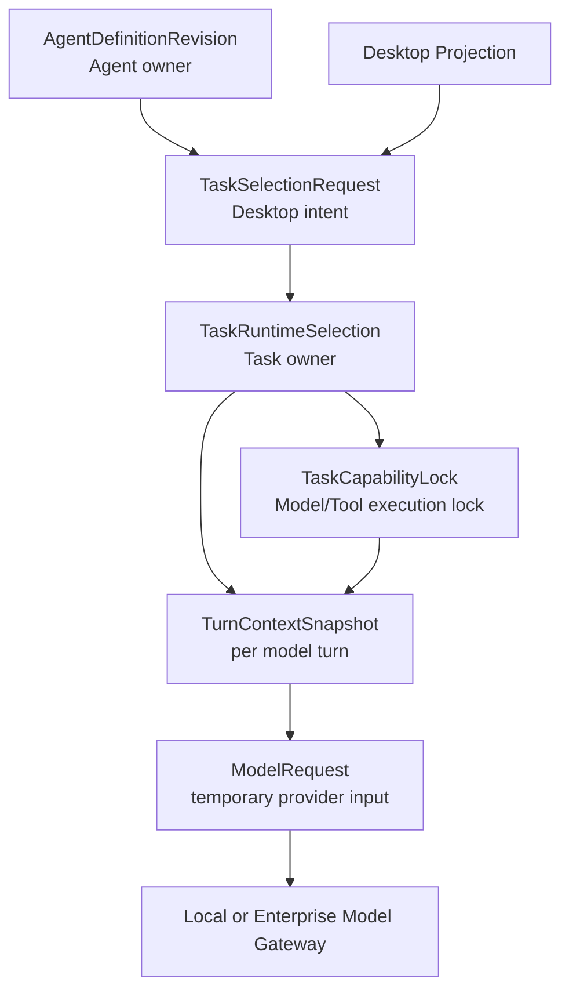
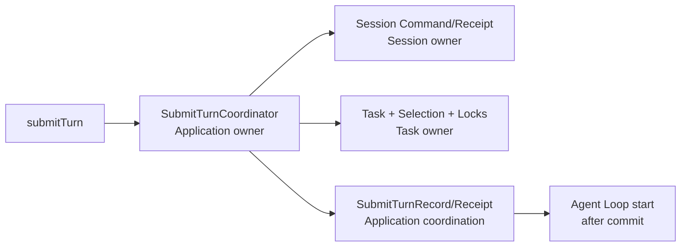
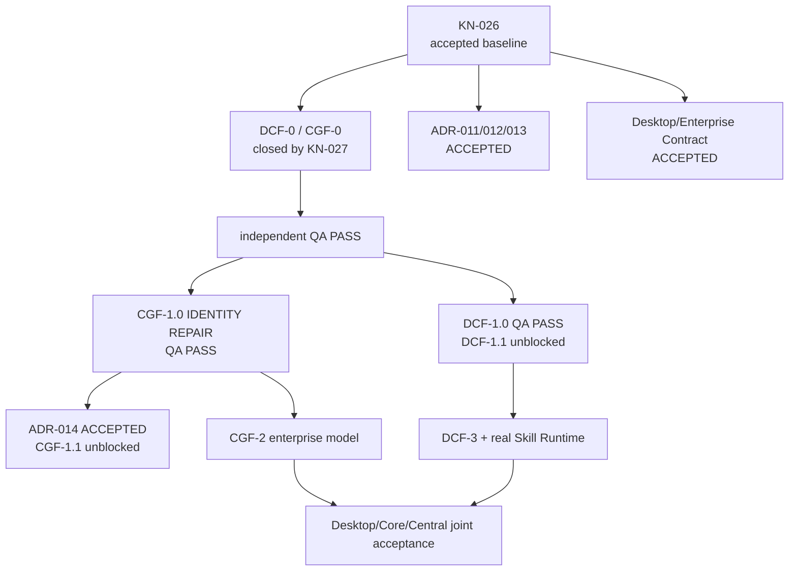

# RoboThree Desktop/Central Foundation 架构收口基线

> 状态：**CONFIRMED**  
> 日期：2026-07-24  
> 当前实施状态：**DCF-1.0/CGF-1.0/IDENTITY REPAIR QA PASS；ADR-014 ACCEPTED；DCF-1.1/CGF-1.1 UNBLOCKED**  
> 关键节点：[KN-026～KN-030](./KEY-NODES.md)  
> 前置事实：KAF-5.3 `PASS`；KAF-5 `CLOSED`

## 1. 四项文档状态

| 文档 | 状态 | 作用 |
| --- | --- | --- |
| [Desktop Client Foundation Plan](./DESKTOP-CLIENT-FOUNDATION-DEVELOPMENT-PLAN.md) | CONFIRMED | Desktop 分批、Skill Runtime 前置和 E2E 门槛 |
| [Central Gateway Foundation Plan](./CENTRAL-GATEWAY-FOUNDATION-DEVELOPMENT-PLAN.md) | CONFIRMED | Java Gateway 分批、物化配置和真实 Model/Tool 门槛 |
| [Desktop Local Runtime Contract](./contracts/DESKTOP-LOCAL-RUNTIME-CONTRACT-v1alpha1.md) | ACCEPTED | Desktop/Main/Core 的命令、查询、事件和安全边界 |
| [Enterprise Gateway Contract](./contracts/ENTERPRISE-GATEWAY-CONTRACT-v1alpha1.md) | ACCEPTED | Node/Java 的配置、Model、Tool、Audit 和离线边界 |
| [DCF-1 Contract/Threat Model/Conformance](./DCF-1-CONTRACT-THREAT-MODEL-AND-CONFORMANCE-PLAN.md) | CONFIRMED_WITH_SPECIFIED_REVISIONS | DCF-1.0 QA PASS；DCF-1.1 已解锁 |
| [CGF-1 Infrastructure/Identity/Conformance](./CGF-1-INFRASTRUCTURE-IDENTITY-AND-CONFORMANCE-PLAN.md) | CONFIRMED_WITH_SPECIFIED_REVISIONS | CGF-1.0 identity repair QA PASS；ADR-014 ACCEPTED；CGF-1.1 已解锁 |

总体方向、ADR-011/012/013 和两份 Contract 已由 KN-026 接受，不再重新选择 Renderer 直连、Central 接管 Agent Loop、自动模型路由、微服务优先或运行期 Registry 热替换。KN-027 已关闭 DCF-0/CGF-0 和 Java Toolchain；KN-028 接受 DCF-1/CGF-1 指定修订并打开两条 1.0 Contract/Conformance 工作流。DCF-1.0/CGF-1.0 初始 QA 已 `PASS`，DCF-1.1 已解锁；KN-029 冻结身份 repair，KN-030 接受 ADR-014 并解锁 CGF-1.1。

## 2. 对象所有权

## 3. 阶段依赖

## 4. P0/P2/P3 文档关闭映射

KN-026 已接受全部五项 P0 的架构解决方案。`CLOSED` 表示文档决策已冻结；具体生产实现仍须在对应批次以 Contract Conformance 和独立 QA 提供证据。

| 编号 | 名称 | 解决文档 | 状态 |
| --- | --- | --- | --- |
| P0-1 | RuntimeSelectionSnapshot 未落位 | ADR-011 Task Runtime Selection | CLOSED — ADR ACCEPTED |
| P0-2 | submitTurn 缺应用层编排 | ADR-012 Submit Turn Coordination | CLOSED — ADR ACCEPTED |
| P0-3 | Snapshot 激活与 ADR-008 冲突 | ADR-008/009 修订 | CLOSED — revisions accepted |
| P0-4 | 离线配置缺少物化依赖 | Enterprise Gateway Contract / CGF Plan | CLOSED — Contract ACCEPTED |
| P0-5 | 个人 Model 凭证所有权矛盾 | ADR-013 Personal Credential Store / Broker | CLOSED — ADR ACCEPTED |
| P2-1 | 默认 Model 基线不一致 | MVP 基线 / ADR-011 | CLOSED — document revised |
| P2-2 | 企业 Agent 修改路径不一致 | MVP 基线 / DCF Plan | CLOSED — document revised |
| P2-3 | ModelEligibilityEvaluator 边界不清 | ADR-011 | CLOSED — document revised |
| P2-4 | DCF-1 Streaming 依赖真实 Model | DCF Plan | CLOSED — Fixture/real joint gates separated |
| P2-5 | Skill Runtime 未进入计划 | DCF Plan | CLOSED — Core Skill Runtime Foundation added |
| P2-6 | Model Gateway 幂等承诺过强 | Enterprise Contract / CGF Plan | CLOSED — acceptance idempotency only |
| P3-1 | Local API 安全措辞过强 | Desktop Contract / DCF Plan | CLOSED — threat boundary corrected |
| P3-2 | “排队中”污染 TaskStatus | Desktop Contract / DCF Plan | CLOSED — UI Projection only |
| P3-3 | 三种 Model 默认值混淆 | ADR-011 / MVP 基线 | CLOSED — ownership separated |

## 5. DCF-0 / CGF-0 边界

允许：

- 工程目录、模块骨架、Build/Lint/Test/CI；
- 空模块、Fake Adapter/Model/Tool；
- 非语义测试 Harness；
- 已接受 Contract 的非业务 Fixture；
- Fixture 数据验证构建和传输 Pipeline。

禁止：

- 正式业务 HTTP/SSE 路由；
- Runtime Selection、ModelEligibilityEvaluator、TaskRuntimeSelection；
- SubmitTurnCoordinator 和正式 Session/Task 编排；
- 业务表、migration、Credential 传递；
- Configuration Runtime Activation；
- 在 Conformance 前生成或固化正式业务 DTO；
- 将 Fixture 固化为 Contract。

## 6. 后续实施门槛

1. DCF-0/CGF-0 工程骨架与独立 QA 已完成；
2. DCF-1.0 正式字段级 Schema、Threat Model、Fixture 和 Conformance 已通过
   独立 QA，DCF-1.1 已解锁；
3. CGF-1.0 初始 Contract 已通过 QA；KN-029 打开身份 repair，只修改 OA verified
   identity、Device Challenge/Proof、可选 Enrollment 和 Token Claims；
   identity repair 已通过独立 QA且 ADR-014 已 `ACCEPTED`，CGF-1.1 已解锁；
4. 真实 Skill Runtime 在 DCF-3 前完成单独实施计划和验收；
5. 个人 Credential 的 Keychain/Broker 实现在 DCF-3 独立验收。

## 7. 明确不进入

本轮没有引入长期 Memory、自动模型路由、多 Agent、复杂 RBAC、Policy Engine、完整 Admin Console、微服务拆分、实时权限撤销或多代 RegistrySnapshot 热并存。
