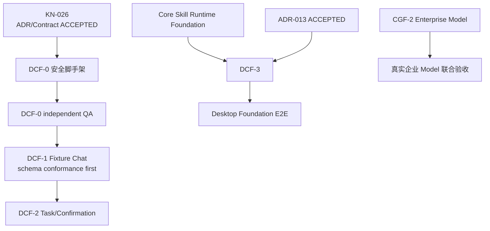

# RoboThree Desktop Client Foundation 开发计划

> 阶段：`DCF — Desktop Client Foundation`  
> 状态：**CONFIRMED**  
> 日期：2026-07-24  
> Contract：[Desktop Local Runtime Contract v1alpha1（ACCEPTED）](./contracts/DESKTOP-LOCAL-RUNTIME-CONTRACT-v1alpha1.md)  
> 编码状态：**DCF-0～DCF-2 PASS/CLOSED；CGF-2 IN PROGRESS，
> CGF-2A.2 GATED**  
> 前置事实：KAF-5.3 `PASS`、KAF-5 `CLOSED`、KN-024 已打开双线规划入口

## 1. 目标

Desktop Foundation 把已通过 Headless 验收的 Local Core 呈现为安全、可恢复的桌面产品，不在 Renderer 或 Electron Main 重新实现 Agent Runtime。

目标用户链路：

```text
启动 Desktop
→ 连接 Local Core
→ 授权 Workspace
→ 创建 Session
→ 选择 Agent
→ 使用 Agent defaultModel 或显式 requestedModel
→ submitTurn
→ 查看 Streaming 与 Task 状态
→ 处理用户确认
→ 查看 Artifact
→ 重启后恢复
```

## 2. 责任与安全边界

### Electron Main

- 启动、监控、有限重启和优雅停止 Local Core；
- 选择 loopback 随机端口并建立启动令牌；
- 通过继承 IPC、匿名管道或等价受控通道传递启动令牌，不使用命令行参数；
- 提供系统目录选择器、窗口生命周期、受控 Artifact 打开和 HTML 预览；
- 承担 Preload 白名单的可信宿主；
- DCF-0 不实现个人凭证传递；后续实现遵守已接受的 ADR-013。

### Preload

只暴露有限类型化业务 API。不得暴露：

```text
fs
child_process
Shell
SQLite
任意 IPC Channel
Local Core 原始 HTTP Client
Credential 明文读取
```

### Vue Renderer

- 只负责页面、交互、无敏感 UI 偏好和 Core Projection 展示；
- 不直接连接 Local Core；
- 不计算 Model 权限交集；
- 不解释 reducer、Effect、Receipt、Checkpoint、RegistrySnapshot 或 TaskCapabilityLock；
- 不保存 API Key、启动令牌或完整系统 Prompt。

### Local Core

继续作为 Session、Task、Runtime Selection、Prompt Assembly、用户确认、Artifact 和恢复的唯一事实源。Desktop 只能提交意图和用户决定。

## 3. Agent 与 Model 交互规则

- 每个 Agent 必须有 defaultModel；
- `allowModelOverride` 控制当前 Task 是否允许显式覆盖；
- Desktop 展示由 Core 返回的合法候选 Model，不自行计算；
- 默认 Model 不可用且允许覆盖时，必须由用户明确选择；
- Task requestedModelId 不修改 Agent defaultModel 或 User personal defaultModel；
- submitTurn 返回 resolved Model 和已锁定运行摘要；
- Task 启动后不得静默切换 Model。

用户 Agent 页面只编辑个人草稿，每次保存产生新 revision。企业已发布 Agent 版本只读；有权限创建者可以派生个人草稿。Admin Console 不承担 Agent 编辑器。

## 4. DCF-0：安全桌面壳与非语义 Core 生命周期

### 允许交付

- Electron/Vue/TypeScript 工程目录和模块骨架；
- Main/Preload/Renderer 依赖边界；
- Build、Lint、Test、CI 和打包占位；
- Local Core 子进程启动/停止的非业务 Harness；
- Fake readiness、Fake compatibility 和 Fixture 数据；
- loopback、随机端口、短期令牌的传输 Pipeline 验证；
- Fake Model Output → Fake Tool Result → Fake UI Projection → Fake Event Delivery；
- 空页面、空模块和组件测试。

### 禁止交付

- 正式业务 HTTP/SSE 路由；
- Runtime Selection 或 ModelEligibilityEvaluator；
- TaskRuntimeSelection 持久化；
- SubmitTurnCoordinator 状态机；
- 正式 Session/Task 跨领域编排；
- 业务数据库表和 migration；
- Credential 传递；
- Configuration Runtime Activation；
- 在字段级 Conformance 前生成并投入业务的正式 DTO；
- 把 Fixture Schema 当成冻结 Contract。

### 退出门槛

```text
Desktop 启动
→ 唯一 Fake/Core Harness 实例启动
→ 非语义 compatibility/readiness Fixture 成功
→ Renderer 无 Node/system capability
→ 进程退出与资源清理通过
```

KN-026 已打开 DCF-0。DCF-0 只实现安全桌面壳和非语义 Core Harness；DCF-1 的正式业务 Schema、Route 和持久化仍须在 DCF-0 独立 QA 与字段级 Conformance 后解锁。

### 实现检查点（0.0.0-dcf.0.1）

- Electron Main / Preload / Vue Renderer 已建立，Renderer 无 Node、Electron、原始 IPC 或直连 Core 能力；
- Fake Core 只绑定 `127.0.0.1` 随机端口，启动令牌经子进程 IPC 传递，不进入 argv、URL、Renderer 或公开状态；
- Core Harness 支持并发启动合并、受控停止、有限异常重启、有限 stderr 和认证 readiness/compatibility；
- BrowserWindow 使用 context isolation、Renderer sandbox、禁用 Node integration，并拒绝新窗口和外部导航；
- DCF-0 仅暴露 `getFoundationStatus` 白名单 Fixture API，未实现正式 Desktop Contract Route；
- 开发者全量门禁为 52 files / 399 tests，Core 与 Desktop smoke 均通过。

独立 QA：

```text
0.0.0-dcf.0.1
PASS
52 files / 399 tests / 3 rounds stable
P0=P1=P2=P3=0
```

状态：`CLOSED`。DCF-1.0 正式 Contract/Threat Model/Fixture/Conformance 已
完成独立 QA，用户接受 `PASS` 且 P0/P1/P2/P3 为 0；DCF-1.1A～1.1C
随后全部独立 QA `PASS/CLOSED`，DCF-1.1 已关闭。DCF-1.2 详细计划见
[DCF-1.2 开发计划](./DCF-1.2-DEVELOPMENT-PLAN.md)；DCF-1.2 与 DCF-1.3
也已通过独立 QA、用户体验验收并正式关闭。

## 5. DCF-1：Workspace、Session、Agent 与 Fixture Chat

交付候选：

- 工作台与最近 Session；
- WorkspaceGrant 创建、展示和撤销 UI；
- Session 创建、加载、重命名和删除；
- 用户消息提交和 Assistant Streaming UI；
- 最小 Agent 选择；
- Agent defaultModel、允许覆盖和合法候选 Model Projection；
- Task requestedModelId 输入；
- resolved Model/Agent/Skill/Tool/Knowledge/Workspace 运行摘要；
- Snapshot 恢复与 durable Event cursor；
- 应用重启后恢复会话和已持久消息。

本批只使用 Scripted/Fake Model 验证：

- Desktop-Core Contract；
- Streaming UI；
- Snapshot 恢复；
- durable Event Replay；
- ephemeral token delta 断线后不重放，最终正文由持久 Assistant Message 收敛。

DCF-1 不宣称真实企业或个人 Model 已接通。真实企业 Model 在 CGF-2 联合验收，个人 Model 在 ADR-013 接受且 Personal Model Adapter 完成后验收。

ADR-011、ADR-012 与 Desktop Local Runtime Contract 核心语义已经接受。
DCF-1.0 不实现正式 Route、TaskRuntimeSelection 持久化或 SubmitTurnCoordinator；
这些 Core 业务机制进入 DCF-1.1。DCF-1.0 Schema/Threat Model/Conformance
已经独立 QA，无 P0/P1。

## 6. DCF-2：Task、用户确认与恢复

DCF-2 已于 2026-07-27 以 `CONFIRMED_WITH_SPECIFIED_REVISIONS` 确认。
详细 Contract、Projection、Confirmation、恢复矩阵和 A/B/C 门槛见
[DCF-2 开发计划](./DCF-2-DEVELOPMENT-PLAN.md)。

交付范围：

- Task 列表、详情和用户语言状态；
- 停止、取消、补充输入和重试；
- Tool Activity 业务摘要；
- UserConfirmation 卡片、允许、拒绝和取消；
- waiting_user_confirmation 后 Desktop/Core 重启恢复；
- Durable Snapshot/Event Replay；
- `uncertain` 投影为“需要人工处理”。

用户状态：

```text
准备中
排队中
执行中
等待输入
等待确认
正在恢复
成功
失败
已取消
已超时
需要人工处理
```

“排队中”只根据 admission/reliability 事实形成 Desktop UI Projection，不新增 durable TaskStatus。

Desktop 只能提交版本化用户决定，不能修改 Core 生成的 ActionIntent、ConfirmationRequest 或数据库记录。

当前门槛：

```text
DCF-2.0：PASS / CLOSED
DCF-2A：PASS / CLOSED
DCF-2B：PASS / CLOSED
DCF-2C：PASS / CLOSED
DCF-2：PASS / CLOSED
CGF-2：IN PROGRESS / CGF-2A.2 GATED
```

## 7. Core Skill Runtime Foundation

这是 DCF 的 Core 前置工作包，不新增用户侧产品模块：

```text
Core Skill Runtime Foundation
├── 本地 Skill 发现
├── 企业物化 Skill 加载
├── Workspace / 用户目录边界
├── 真实路径与符号链接安全
├── 来源标签
├── 同名冲突规则
├── Skill 解析
├── Revision
├── Content Digest
├── SkillSummary Catalog
├── Locked Skill Body Materialization
└── TaskRuntimeSelection 锁定
```

Skill Runtime 采用两级渐进披露：

```text
Level 1：SkillSummary Catalog
→ 只包含 id、name、description、source、revision、digest 等有界元数据
→ 用于 Agent/用户选择和 Context 中的 available skills 摘要

Level 2：Locked Skill Body Materialization
→ 只读取当前 Agent 允许且当前 Task 明确启用的 Skill 正文
→ 校验授权路径、真实路径、revision 和 digest
→ 形成不可变 Task Skill Lock 后进入 Context Assembly
```

这借鉴 OpenWorker 的“先列摘要、后按需加载正文”方向，但不照搬其
`load_skill` Tool：

- Skill 正文读取属于 Core `SkillRuntime` 的类型化 Reader/Materializer，
  不是 Agent 可任意调用的 Tool；
- Model 不获得任意 Skill 路径，也不能绕过 Agent Allowed Skills、
  用户权限和 Task Active Skills；
- Skill Summary 不包含正文；未激活的 Skill 正文不得进入 Prompt；
- Task 启动后锁定被使用 Skill 的精确 revision/digest，源文件变化不得静默
  改变运行中 Task；
- 本地 `.claude/skills/` 与 `.robothree/skills/` 可以保持原始目录格式，
  但读取结果必须经过相同的安全边界和 Context 转换；
- 企业物化 Skill 使用同一 Summary/Body Conformance，不因来源不同形成第二套
  Prompt 注入路径。

时间门槛：

- DCF-0 不依赖真实 Skill Runtime；
- DCF-1 可以使用 Fixture 或 Materialized Fake Skill；
- DCF-3 完成前必须接入真实 Skill Runtime；
- 只扫描用户已授权的 `.claude/skills/`、`.robothree/skills/` 和已物化企业包范围；
- 本机发现不等于 Agent 允许；未被 Agent 允许、用户无权使用或 Task 未启用的 Skill 不进入 Prompt；
- 不自动加载本机全部 Skill；
- Skill 引发的程序执行和外部调用仍必须通过 Tool 与 ADR-006。

最低验证矩阵：

- 只发现未启用 Skill：仅 Summary 可见，正文 0 读取；
- Agent 未允许或用户无权限：Summary/正文均不得进入当前 Task Context；
- 同名不同来源：按已冻结冲突规则失败关闭或显式选择，不静默覆盖；
- 符号链接越界、真实路径越界、正文超限、revision/digest 漂移：全部拒绝；
- Task 启动后 Skill 文件变化：旧 Task 保持原锁，新 Task 才能锁定新 revision；
- Context token budget 只为已激活正文计费，不把整个 Skill 目录一次性塞入 Prompt；
- Reader/Materializer 不执行 Skill 中的命令，程序执行仍由 Tool Runtime 承担。

## 8. DCF-3：Artifact、Agent 草稿、个人 Model 与 E2E

交付候选：

- Artifact 列表、详情、文件变化摘要和受控 HTML 预览；
- 打开本地文件位置；
- 个人 Agent 草稿编辑、保存新 revision、本地测试；
- 基于企业发布 Agent 派生个人草稿；
- defaultModel、allowModelOverride、Skill/Tool/Knowledge 引用编辑；
- 个人 Model 添加、测试、编辑和删除；
- ADR-013 PersonalCredentialStore 与目标 OS Keychain Adapter；
- 企业配置最近同步、缓存和 pending runtime activation 状态；
- 真实 Core Skill Runtime，包括 Summary Catalog、按需 Body Materialization、
  精确 revision/digest 锁定与 Context 注入；
- Desktop Foundation E2E Harness。

个人 Model 功能开始前必须接受 ADR-013。企业已发布 Agent 仍为只读，发布审核闭环在 Core/Desktop/Central 基础稳定后接入。

Foundation E2E：

```text
授权 Workspace
→ 选择 Agent 和手动启用 Skill
→ 只物化并注入已锁定的 Active Skill 正文
→ 使用 defaultModel 或显式 requestedModel
→ submitTurn
→ 执行客户端预装本地 Tool
→ 用户确认风险操作
→ 生成并预览 Artifact
→ 重启 Desktop/Core
→ 恢复 Session、Task、Selection、Confirmation 和 Artifact
```

## 9. 依赖与联合验收



## 10. 非目标

- 完整 Agent/Skill 企业发布审核；
- 完整 Admin Console 和 Knowledge 工作台；
- 独立消息中心、多窗口和 Workflow Builder；
- Multi-Agent/Subagent；
- 长期 Memory；
- 自动模型路由；
- 复杂诊断和生产监控；
- 实时权限撤销；
- 完整自动更新平台。

## 11. 预计工程量

在 Contract 已接受、Core Runtime Selection/Submit Turn 已实现且依赖稳定后，单一主开发流预计 16～24 个工作日。其中 DCF-0 非语义脚手架预计 2～3 个工作日，已经包含在总量中；它只估算安全桌面壳、进程 Harness、边界测试和构建基础，不代表正式 Desktop Contract 已解锁。该估算不包含 ADR 等待、真实企业 Gateway、完整 Skill 兼容、Windows 分发和重大 P0 返工。
