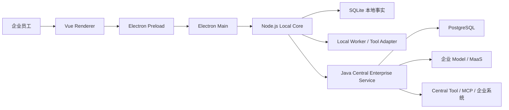
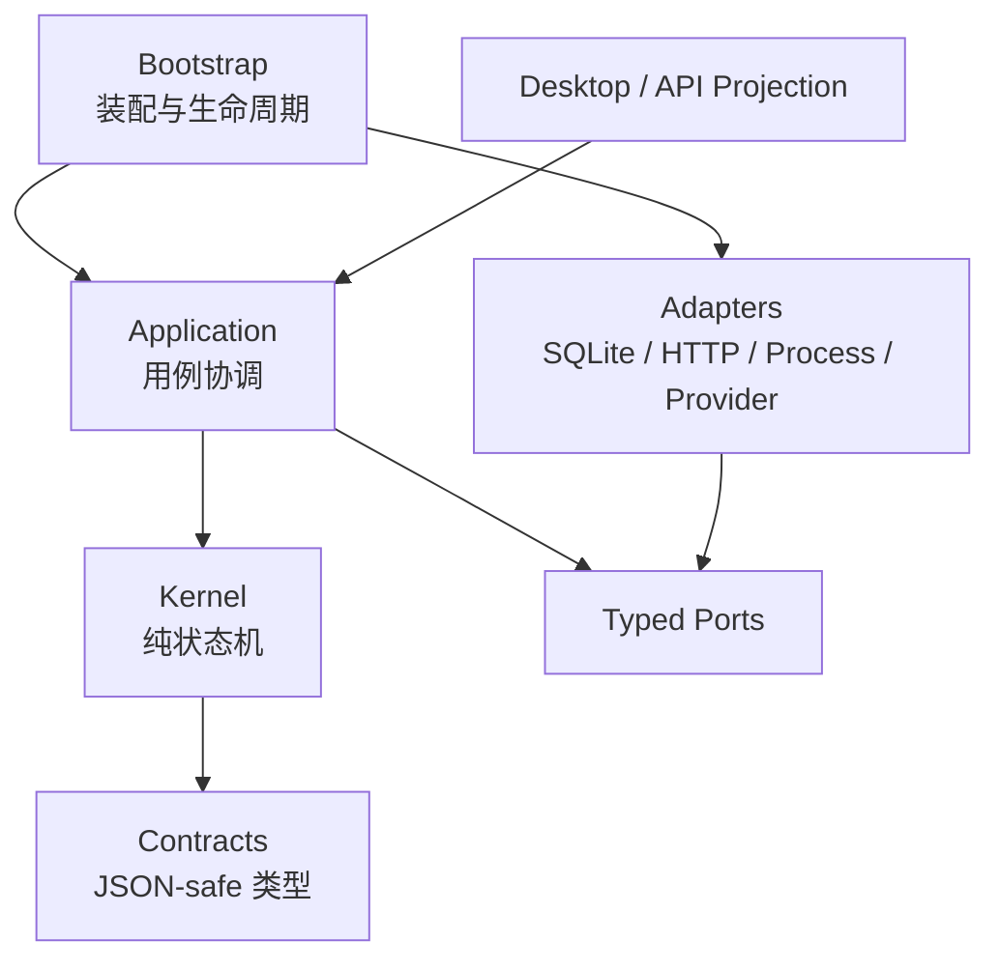

# RoboThree 技术架构与技术选型说明 v1.0

> 文档状态：**DRAFT / REVIEW REQUIRED**  
> 编制日期：2026-07-28  
> 适用范围：RoboThree Desktop、Local Core、Local Worker、Central Enterprise
> Service、Contract、Persistence、Model/Tool/Skill/Knowledge 扩展边界  
> 事实截止：Root/Desktop/Core `0.0.0-dcf.2.3-demo.2`、Central
> `0.0.0-cja.2b.3-SNAPSHOT`、CGF-1.3/DCF-2/Alignment-1/2A/2B
> `PASS/CLOSED`、CGF-2 `GATED`  
> 决策来源：产品与架构基线 v1.0、MVP 功能范围与开发基线 v1.0、
> ADR-001～ADR-014、ADR-016、ADR-015 草案及 KAF/DCF/CGF 已确认计划  
> 约束：本文汇总和解释现有选型，不以 `DRAFT` 文档替代已接受 ADR；涉及
> ADR-015 与 CGF-2 已形成重新对齐草案但仍为 `PROPOSED`；真实 DeepSeek
> 尚未验证；ADR-016 已 `ACCEPTED` 且 Alignment-1/2A/2B 已实现并关闭

## 1. 文档目的

本文回答五个问题：

1. RoboThree 各运行边界分别使用什么技术；
2. 为什么选择这些技术，而不是常见替代方案；
3. 技术如何落入 Desktop、Local Core、Worker、Central 和 Contract；
4. 哪些能力已经实现，哪些只是已接受架构，哪些仍处于提案或后置状态；
5. 后续开发如何在不破坏安全、恢复和跨语言边界的前提下演进。

本文不是依赖清单的简单复制，也不是新的“大一统平台”设计。RoboThree 的核心
策略是：

```text
本地优先
+ 企业统一治理
+ 类型化 Contract
+ 可恢复 Agent Runtime
+ 进程外能力扩展
+ 渐进式真实链路验证
```

## 2. 状态标识

| 标识 | 含义 |
| --- | --- |
| `IMPLEMENTED` | 已存在于当前工程并经过阶段测试 |
| `ACCEPTED` | 已由 ADR 或基线冻结，后续实现必须遵守 |
| `PROPOSED` | 已形成草案，但仍需评审和用户接受 |
| `DEFERRED` | 明确后置，不属于当前开发范围 |
| `REJECTED` | 当前架构明确不采用 |

同一技术可以同时具有 `ACCEPTED` 和 `IMPLEMENTED` 状态。例如 Java/Node
进程边界已经由 ADR-009 接受，且 Foundation 代码已经实现；真实企业 OA
Adapter 则属于 `ACCEPTED` 架构边界但仍为 `DEFERRED` 实现。

## 3. 架构目标与选型原则

### 3.1 产品目标

RoboThree 是面向企业员工的本地 Agent 工作台与通用能力平台，不限定招投标、
合同或某个单一业务场景。标准业务场景由以下对象按需组合：

```text
Agent Definition
+ Skill
+ Tool / MCP Source
+ Knowledge
+ Model
+ Workspace
```

开放式任务由 Local Core 在 Agent 已声明、用户已选择、管理员已开放且当前
合法的能力边界内动态编排，不建设全局能力搜索、评分或智能路由平台。

### 3.2 技术选型原则

1. **运行事实本地化**：Session、Task、Run、Step、Conversation 和本地授权
   事实优先落在本机。
2. **企业凭证中央化**：企业 Model、中央 Tool 和企业系统凭证不得下发 Desktop。
3. **Kernel 保持纯净**：Reducer 是纯函数，不依赖数据库、网络、Electron、
   Worker 或 Provider SDK。
4. **类型化 Port 优先**：Model、Tool、Knowledge、Credential 分别建立 Port，
   不建设万能 `execute()`。
5. **跨进程 Contract 优先**：跨语言、跨进程只传版本化 JSON 对象，不传运行
   Handle、PID、SDK 对象或凭证明文。
6. **Intent 先持久化**：外部副作用和关键调用先记录意图/分发事实，再调用外部
   Backend。
7. **失败关闭**：未知 Schema、未知状态、revision 漂移、权限缺失、Credential
   缺失和恢复不确定均不得静默降级。
8. **Fake-first，真实边界验收**：先用 Fake/Stub 固化语义，每个关键阶段必须
   穿透真实进程、数据库或网络边界。
9. **模块化单体优先**：在真实规模压力出现前，不提前拆微服务或引入分布式中间件。
10. **最小依赖**：能用标准库和小型显式 Adapter 解决的问题，不引入大型框架。

## 4. 总体逻辑架构



### 4.1 三个核心进程边界

#### Desktop Client

负责交互、系统选择器、应用生命周期和安全 IPC，不负责 Agent Loop、Prompt
Assembly、权限判断、Task 恢复或 Model 路由。

#### Local Core

是本地 Session、Task、Agent Loop、Runtime Selection、Context、Workspace
授权和恢复的唯一协调者，也是 Desktop 本地运行事实的权威入口。

#### Central Enterprise Service

负责企业身份验证、设备信任、企业配置、企业凭证、Model/Tool Gateway 和最小
审计，不接管本地 Task、Workspace、Conversation 或 Agent Loop。

### 4.2 部署形态

```text
Kernel Alpha：
Electron Desktop + Local Core + Local Worker + SQLite
在同一台设备部署，但保持逻辑和进程边界

企业试点：
Desktop Client + Local Core/Worker
                    ↓
Java Central Enterprise Service + PostgreSQL
                    ↓
企业 MaaS / MCP / 企业系统
```

该选择来自 ADR-001。Alpha 追求可安装、可演示和低运维成本；企业形态保留
中央治理和企业凭证边界。

## 5. 技术栈总览

| 层 | 技术选择 | 当前基线 | 状态 | 主要用途 |
| --- | --- | --- | --- | --- |
| Monorepo | pnpm Workspace | pnpm `11.11.0` | `IMPLEMENTED` | 管理 TS 应用、服务和共享 Contract |
| 本地运行时 | Node.js | `24.x`，工程要求 `>=24 <25` | `IMPLEMENTED` | Local Core、脚本、Worker Adapter |
| 本地语言 | TypeScript | `5.9.3` | `IMPLEMENTED` | Core、Desktop Main/Preload、Contract |
| 模块系统 | ESM + NodeNext | ES2023 target | `IMPLEMENTED` | 明确 Node/浏览器模块边界 |
| Contract 校验 | Zod | `4.4.3` | `IMPLEMENTED` | TypeScript strict runtime validation |
| Desktop Shell | Electron | `^43.2.0` | `IMPLEMENTED` | 跨平台桌面、Main/Preload/Renderer 隔离 |
| Desktop UI | Vue | `^3.5.40` | `IMPLEMENTED` | 响应式桌面交互与状态投影 |
| 前端构建 | Vite | `^8.1.5` | `IMPLEMENTED` | Renderer 和 Preload 构建 |
| 本地数据库 | SQLite | Node `node:sqlite` | `IMPLEMENTED` | Task、Conversation、配置与恢复事实 |
| 本地协议 | HTTP + SSE | loopback + 随机端口 | `IMPLEMENTED` | Electron Main 与 Local Core |
| 企业后端语言 | Java | `21` | `IMPLEMENTED` | Central Enterprise Service |
| 企业框架 | Spring Boot | `3.5.16` | `IMPLEMENTED` | HTTP、模块启动、测试基础 |
| 企业数据访问 | MyBatis-Plus + 显式 Mapper SQL | `3.5.16` | `IMPLEMENTED` | Adapter CRUD、关键锁/幂等/CAS |
| 企业数据库 | PostgreSQL | `16` 系列 | `IMPLEMENTED` | 企业配置、身份和后续 Gateway |
| Schema 交付 | 版本化 SQL + Manifest + Preflight | PostgreSQL `v0006` | `IMPLEMENTED` | 部署执行、应用只读校验；无 Flyway |
| Java 构建 | Maven Wrapper | Maven `3.9.x`，要求 `<4` | `IMPLEMENTED` | 可复现企业后端构建 |
| 跨语言协议 | OpenAPI + JSON Schema | OpenAPI 3.1、JSON Schema 2020-12 | `IMPLEMENTED` | Node/Java 唯一 canonical Contract |
| 企业传输 | HTTPS + JSON + SSE | Contract v1alpha1 | `ACCEPTED` | 配置、Model、Tool、Audit |
| Node 测试 | Vitest | `4.0.18` | `IMPLEMENTED` | Unit、Conformance、Integration、E2E |
| TS 静态检查 | ESLint + TypeScript ESLint | ESLint `9.39.2` | `IMPLEMENTED` | 代码质量和架构边界 |
| Java 测试 | JUnit 5 / Spring Boot Test | Boot 管理版本 | `IMPLEMENTED` | Domain、HTTP 和集成测试 |
| 数据库集成测试 | Testcontainers | PostgreSQL 16 image | `IMPLEMENTED` | 真实 PostgreSQL 验证 |
| macOS DB 备用测试 | Embedded PostgreSQL | `16.14.0` ARM binary | `IMPLEMENTED` | 本地离线/平台交叉验证 |
| 首个真实 Model | DeepSeek Adapter | 协议待 Conformance | `PROPOSED` | CGF-2 Model Gateway Foundation |
| MCP | Tool 实现来源 | 版本待接入阶段确认 | `DEFERRED` | 企业或本地 Tool 来源 |
| Python/C# | 独立 Worker/Tool | 不进入 Core 进程 | `ACCEPTED` | Office、PDF、企业 SDK 等能力 |

版本列描述当前工程声明或已验证基线，不代表未来永久锁死。任何主版本升级都必须
单独执行 Contract、恢复、Electron 安全和跨语言 Conformance 回归。

### 5.1 Central Java 当前事实与目标基线

公司 Java 技术负责人提出的 Central 目标约束已经由 ADR-016 收敛，并通过
Alignment-1、Alignment-2A、Alignment-2B 实现和独立 QA：

| 领域 | 当前已实现 | ADR-016 目标 | 状态 |
| --- | --- | --- | --- |
| ORM / 数据访问 | MyBatis-Plus Persistence Adapter；关键 SQL 显式 Mapper XML | 保持边界并用于 CGF-2 | `ACCEPTED / IMPLEMENTED` |
| Schema 交付 | v0006 Baseline/Upgrade、manifest、digest、只读 Preflight；V1～V5 仅作 legacy audit | CGF-2 使用下一个可用版本化 SQL | `ACCEPTED / IMPLEMENTED` |
| 企业身份 | 通用 OA/Fake Adapter | `CasIdentityAdapter`；具体 CAS Wire Protocol 在企业集成前另行确认 | `ACCEPTED / DEFERRED IMPLEMENTATION` |
| Java 样板 | record + 受限 Lombok | 保持受限规则 | `ACCEPTED / IMPLEMENTED` |
| HTTP | GET/POST + 架构守卫 | 保持业务 GET/POST | `ACCEPTED / IMPLEMENTED` |
| 错误处理 | 全局安全 Error Envelope | CGF-2 additive typed error | `ACCEPTED / IMPLEMENTED` |
| 可观测性 | Micrometer Tracing + OpenTelemetry | Provider/SSE 延续既有边界 | `ACCEPTED / IMPLEMENTED` |
| Controller | Thin Controller + Application Facade | CGF-2 不得回退 | `ACCEPTED / IMPLEMENTED` |
| 集群 | Stateless Foundation 双 JVM Harness | CGF-2 增加 Invocation/Durable Event 双节点恢复 | `ACCEPTED / FOUNDATION IMPLEMENTED` |

迁移顺序与当前进度：

```text
ADR-016
→ Alignment-1（PASS/CLOSED）
→ Alignment-2A（PASS/CLOSED）
→ Alignment-2B（PASS/CLOSED）
→ CGF-2 重新对齐草案（REVIEW REQUIRED / GATED）
```

真实 CAS、企业 MDM/RBAC、正式 Secret Store 和 MaaS 继续作为企业试点前置；
它们不阻塞 Development Profile 的真实 DeepSeek Foundation。

## 6. Monorepo 与工程组织

### 6.1 选择：pnpm Workspace

目录边界：

```text
apps/desktop
services/core
services/central-service
packages/contracts
contracts/enterprise-gateway
tests/e2e
docs
scripts
```

选择原因：

- Desktop、Core 和 TypeScript Contract 需要原子演进；
- `workspace:*` 保证本地包不会意外解析到外部同名版本；
- pnpm 的内容寻址依赖存储减少 Electron/TypeScript 工程磁盘重复；
- 单一 lockfile 便于供应链检查和可复现构建；
- Java 服务仍保留独立 Maven Wrapper，不强迫 Java 使用 Node 构建模型。

没有选择 npm 多包的原因是 pnpm Workspace 的严格依赖隔离更适合架构边界；
没有选择 Nx/Turborepo，是因为当前项目规模尚不需要额外任务图和远程缓存平台。

### 6.2 TypeScript 编译基线

```text
target: ES2023
module: NodeNext
moduleResolution: NodeNext
strict: true
noUncheckedIndexedAccess: true
exactOptionalPropertyTypes: true
useUnknownInCatchVariables: true
```

选择严格编译选项的原因是 Agent Runtime 大量依赖状态机、版本化 Contract 和
错误分类。可选字段、未知错误和数组索引若被宽松处理，容易造成恢复路径静默漂移。

## 7. Desktop 技术选型

### 7.1 Electron

选择 Electron 的原因：

- 与 Node.js Local Core、系统文件选择器、Keychain、子进程和本地 HTTP 生命周期
  集成成本最低；
- Windows/macOS 企业桌面分发链成熟；
- Main/Preload/Renderer 可以建立清晰的可信边界；
- 当前团队主要语言为 TypeScript，减少首版 Rust/C++ 桥接成本。

代价：

- 安装体积和内存占用高于 Tauri 或原生客户端；
- 必须持续跟进 Chromium/Electron 安全更新；
- 必须严格限制 Preload API，避免 Renderer 获得 Node 权限。

未选择 Tauri 的原因不是其能力不足，而是 Alpha 已经采用 Node Local Core；
引入 Rust Desktop Shell 会增加第二套本地系统编程栈和 IPC 维护成本。若未来
安装体积成为明确 P0 指标，可在 Contract 稳定后重新评估 Shell 替换，而不是
重写 Local Core。

### 7.2 Vue 3

选择 Vue 的原因：

- 组件和响应式状态适合 Chat、Task、Confirmation、Artifact 等投影视图；
- 学习和维护成本较低；
- 与 TypeScript、Vite 和 Electron 集成直接；
- UI 只消费 Core Projection，不需要引入复杂前端领域状态机。

未选择 React 的主要原因是项目没有依赖其生态的既有资产，Vue 可以用更小的
工程约定完成当前界面。该选择不是业务 Contract，未来不应因 UI 框架变化影响
Core。

### 7.3 Main / Preload / Renderer 安全边界

```text
Renderer
→ context-isolated Preload 白名单
→ Electron Main
→ private loopback HTTP/SSE
→ Local Core
```

Renderer 禁止直接获得：

- `fs`、`child_process`、SQLite 或任意 IPC Channel；
- Local Core 原始端口和启动 Token；
- Access Token、API Key、Device Credential；
- Runtime Handle、PID、Task 内部 Effect/Receipt；
- 任意 Core HTTP Client。

Electron Main 负责：

- 启停和监控 Local Core；
- 随机端口与单次启动 Token；
- 系统目录选择器；
- OS Credential Adapter 协调；
- Artifact 受控打开和预览；
- Contract compatibility handshake。

### 7.4 Vite

Vite 用于 Renderer 和 Preload 的构建，不作为 Local Core 运行时框架。选择原因
是 Vue 集成成熟、开发反馈快、生产静态资源输出简单。Preload 必须输出 Electron
可加载格式，不能让 Renderer 构建配置隐式改变 Preload 模块类型。

## 8. Local Core 技术选型

### 8.1 Node.js 24 + TypeScript

Local Core 选择 Node.js 而不是 Java/Python/Rust，原因是：

- 与 Electron Main 和 TypeScript Contract 共享语言和工具链；
- 流式 Model、HTTP/SSE、文件 I/O 和进程 Adapter 属于 Node 擅长的 I/O 工作负载；
- Agent Loop 的性能瓶颈主要在 Model/Tool 外部调用，不在本地数值计算；
- TypeScript discriminated union 和 Zod 适合状态、命令、事件和错误 Contract；
- Python、C# 仍可通过独立 Worker 承载 Office、PDF 或企业 SDK。

约束：

- CPU 密集任务不得阻塞 Core event loop；
- 高风险或不可信代码不得在 Core 进程热加载；
- Python/C#、Browser、Office、PDF 必须走 Tool/Worker Port；
- Node 主版本固定在 24，升级前必须重跑 SQLite、Electron 子进程和长稳 Harness。

### 8.2 分层和依赖方向



固定依赖规则：

- Kernel 不导入 Adapter、SQLite、HTTP、Electron、子进程或 Registry 实现；
- Application 可以协调 Port，但不依赖具体数据库；
- Adapter 实现 Port；
- Bootstrap 是唯一组合根；
- Contract 只包含 JSON-safe、版本化对象；
- Runtime Handle 只能存在于受信进程内。

### 8.3 Runtime Kernel

核心模型：

```text
Task
└── Run
    └── Step
        ├── Action
        └── Observation
```

技术策略：

- Reducer 是纯函数；
- 单 Task mailbox 保证单写者；
- Command 显式校验 expected revision；
- 状态对象 deep freeze；
- Retry 创建新 Run，不覆盖旧事实；
- cancel、timeout、waiting、resume 使用显式状态；
- 迟到 Observation 被拒绝且不改变新 Run。

该模式借鉴 grok-build Actor 隔离、OpenHands State/Event 和 LangGraph
Interrupt/Checkpoint，但全部按 RoboThree Contract 重新实现，不引入上游 Runtime。

### 8.4 Agent Loop

```text
Runtime Selection
→ Turn Snapshot
→ Token Budget
→ Context Assembly
→ ModelProvider
→ ModelStreamEvent
→ Tool Action（如有）
→ ToolExecutionBackend
→ Observation
→ 下一回合或终态
```

Local Core 是运行组合和 Agent Loop 的唯一协调者。Desktop 只能提交选择意图；
Central Model Gateway 只执行已经解析和锁定的 Model，不进行智能选模。

### 8.5 Context 与 Compaction

采用六类对象分离：

```text
ConversationMessage       持久原始消息
TurnContextSnapshot       每次调用冻结输入
ModelRequest              临时 Provider 输入
CompactionJob             压缩工作
CompactionRecord          压缩事实
Memory/Knowledge          独立 Provider 领域
```

技术选择：

- Context Pipeline 在 Application 层；
- static/dynamic context 分离；
- Model-aware token budget pre-check；
- Compaction append-only，不原地改写源消息；
- TaskStatus 不增加 `compacting` 等 UI/LLM 状态；
- 长期 Memory 不与 Session History 混合。

完整长期 Memory、跨会话自主记忆和通用 Knowledge 平台仍为后置范围。

## 9. 本地持久化选型

### 9.1 SQLite

选择 SQLite 的原因：

- 本地应用零运维、单文件、事务能力足够；
- Task、Conversation、Checkpoint、Outbox 和配置需要崩溃后恢复；
- 与 All-in-One Local 部署一致；
- 便于用户数据本地留存；
- 无需随 Desktop 安装数据库服务。

当前使用 Node 24 内置 `node:sqlite`，不引入 ORM。SQLite 只允许在 Adapter 层
出现。

### 9.2 为什么不采用本地 PostgreSQL

本地 PostgreSQL 会显著增加安装、升级、权限、端口、资源和故障诊断成本，不
符合 Desktop 产品。企业 Central 才使用 PostgreSQL。

### 9.3 为什么不采用 ORM

RoboThree 的关键写入依赖：

- expected revision；
- event sequence；
- command digest；
- checkpoint parent；
- outbox uniqueness；
- `BEGIN IMMEDIATE`；
- forward-only migration；
- schema preflight；
- 命名故障点。

这些语义使用显式 SQL 更容易审计。ORM 可以用于简单管理页面，但不得模糊
Runtime 的事务不变量。

### 9.4 Event、Checkpoint 与 Outbox

RoboThree 不采用“只有 Event”的纯 Event Sourcing，而采用：

```text
Current Checkpoint
+ Append-only Event
+ Command Receipt
+ Effect Attempt
+ Outbox
```

原因：

- UI 和恢复可以直接读取 Snapshot；
- Event 保留审计和因果链；
- Receipt 实现 Command 幂等；
- Outbox 提供 at-least-once 发布；
- Effect 处理外部副作用崩溃语义。

## 10. Capability、Tool、Skill 与 Worker 选型

### 10.1 Capability 四层

```text
CapabilityDefinition
CapabilityBinding
AdapterDescriptor
RuntimeAdapterHandle
```

Definition、Binding、Descriptor 可以进入版本化 Contract；Runtime Handle 不
进入 Contract。RegistrySnapshot 在启动时构建、校验、冻结，不支持未审核第三方
代码热加载。

Agent 首期只感知 Model 和 Tool。Agent、Skill、Knowledge 在产品界面和领域中
保持独立；Capability Registry 只是内部实现。

### 10.2 Tool 是唯一原子执行能力

Tool 表示 Agent 可以请求的原子操作。MCP 是 Tool 的实现来源，不与 Tool 并列。

```text
Tool Definition
→ Tool Binding
→ ToolExecutionBackend
→ Local Process / Worker / MCP / Remote Service
```

拒绝万能 `Capability.execute()`，因为 Model、Tool、Knowledge 和 Credential
具有完全不同的生命周期、错误和安全语义。

### 10.3 Worker

首版真实边界采用独立 Node 子进程和 NDJSON 协议验证：

- IPC/stdio framing；
- request ID；
- serialization；
- timeout；
- AbortSignal cancel；
- crash recovery；
- malformed response fail-closed。

未来 Python、C#、Office、PDF、Browser 通过独立 Worker 或 Tool Adapter 接入。
高风险执行不与 Core 共享线程和地址空间。

### 10.4 Skill

Skill 是声明式方法和上下文能力，不通过 Tool Runtime 读取。首版兼容 Claude
Skill 的用户级和项目级常用目录，由用户手动选择，不自动导入、转换或统一第三方
Manifest。

Skill Runtime 负责发现、读取、解析和注入允许的 Skill；Skill 不能因此绕过
WorkspaceGrant、Tool 权限或外发确认。

## 11. Contract 技术选型

### 11.1 TypeScript 进程内和本地 Contract：Zod

选择 Zod 的原因：

- TypeScript 类型与运行时校验同源；
- `.strict()` 可以拒绝未知字段；
- 适合 discriminated union；
- 可在 Main、Preload、Core 和测试中复用；
- 支持显式 JSON-safe 边界。

Contract 不允许携带函数、Class 实例、PID、Socket、Database Handle、Provider
SDK 对象或 Secret。

### 11.2 Node/Java Contract：OpenAPI 3.1 + JSON Schema 2020-12

跨语言不共享 TypeScript 或 Java 源码 DTO，而共享：

```text
OpenAPI
+ JSON Schema
+ canonical fixtures
+ digest rules
+ conformance tests
```

选择原因：

- 避免 Java 被 TypeScript 类型实现绑架；
- 支持独立实现和失败关闭；
- 便于未来其他语言 Worker/Gateway；
- Contract 可以独立版本化和审计。

canonical JSON 使用逐键排序、数组保序和 SHA-256 digest，支撑 revision、
幂等和配置完整性。

### 11.3 版本策略

- Contract 版本与产品开发版本分离；
- 破坏性变更升级 Contract Version；
- 数据库 migration forward-only；
- 新版本读旧版本必须有明确 upgrader 或失败关闭；
- 较新未知 Schema 必须拒绝启动；
- Runtime Task 锁定精确 revision，不锁定 PID 或连接实例。

## 12. 本地通信选型

### 12.1 HTTP + SSE

Electron Main 与 Local Core 使用：

```text
127.0.0.1
+ 随机端口
+ 单次启动 Token
+ HTTP Command/Query
+ 单一 SSE Event Stream
```

选择 SSE 而不是 WebSocket 的原因：

- 当前主要需求是 Core → Desktop 单向流式事件；
- Command/Query 继续使用普通 HTTP，语义更清晰；
- SSE 天然支持 event ID/cursor 和重连；
- 代理和调试成本低；
- 无需建立第二套双向消息协议。

当前可靠性规则：

- durable event 使用 cursor；
- token delta 是 ephemeral；
- 重连先 Snapshot，再补 durable event；
- `response.write() === false` 才进入 backpressure；
- slow-consumer deadline 为 30 秒；
- heartbeat 为 15 秒，只负责 keep-alive；
- 不用“多久没有 Event”判断慢消费者；
- 资源关闭后 timer/subscription 必须归零。

### 12.2 为什么不采用 gRPC

本地 Desktop 和企业 MVP 尚不需要高吞吐双向 RPC。gRPC 会引入 Protobuf、
浏览器桥接、流式代理和运维复杂度。若未来 Worker Fleet 出现高频二进制传输，
可以在 Worker 内部协议重新评估，不改变业务 Contract。

## 13. Central Enterprise Service 技术选型

### 13.1 Java 21

企业后端明确采用 Java 21。选择原因：

- 与公司常见企业技术栈、运维、监控和安全体系兼容；
- 长期支持版本，适合企业部署；
- JDBC、PostgreSQL、TLS、证书、OA/MDM SDK 生态成熟；
- Central 承载身份、配置、凭证和审计，需要稳定的服务端运行时；
- 与 Node Local Core 形成明确控制面/运行面边界。

不把 Local Core 改成 Java，是因为本地 Agent、Electron、Worker 和 TypeScript
Contract 已形成成熟链路；不把 Central 改成 Node，是因为企业集成和公司服务端
基线优先于单语言统一。

### 13.2 Spring Boot 3.5

选择 Spring Boot 的原因：

- 企业 HTTP、配置、测试和生命周期能力成熟；
- Spring MVC 足够支撑 JSON 与 SSE；
- 与 JDBC、Flyway、Testcontainers 集成稳定；
- 后续接 OA、证书、Secret Store 和企业安全组件方便；
- 可以用模块化单体保持边界，不必拆微服务。

当前 `application.yaml` 仍是 Foundation 配置，默认 loopback 和随机端口，并
显式控制 DataSource/Flyway 装配。生产网络、TLS 和外部化配置属于部署阶段，
不能把 Fixture 配置直接用于生产。

### 13.3 模块化单体

```text
central-service
├── bootstrap
├── authentication
├── compatibility
├── configuration
├── credentials
├── modelgateway
├── toolgateway
├── audit
└── persistence
```

选择模块化单体而不是微服务：

- MVP 团队和部署规模有限；
- 身份、配置、凭证和 Gateway 仍需一致事务与统一版本；
- 避免服务发现、消息总线、分布式 Trace 和跨服务事务；
- 模块 Port 保留未来按容量拆分的可能性。

只有在 Model Gateway、Tool Gateway 或 Audit 出现独立容量、安全区或发布周期
要求时，才考虑拆分。

### 13.4 Spring JDBC

选择 JDBC 而不是 JPA/Hibernate：

- Configuration revision、digest、activation 和 idempotency 需要精确 SQL；
- 恢复与并发测试要求明确事务边界；
- 避免 lazy loading、隐式 flush 和 ORM 状态影响；
- 数据模型目前偏事件/版本/配置事实，不以复杂对象关系导航为中心。

未来 Admin 查询可以增加只读 Projection，但不得让 ORM 改变 Runtime 事务语义。

### 13.5 PostgreSQL 16

选择 PostgreSQL：

- 企业级事务、约束和并发能力成熟；
- 与 Flyway、Spring JDBC、Testcontainers 配套；
- 适合配置、身份、设备、Token issuance fact、Model Invocation 和 Audit；
- 公司环境普遍可运维；
- 支持未来只读 Projection 和审计查询。

不使用 SQLite 作为 Central 数据库，因为多用户并发、企业部署、备份和运维要求
不同；不引入 MongoDB，因为当前数据具有强引用、revision、唯一性和事务约束。

### 13.6 Flyway

数据库迁移使用 Flyway forward-only：

- migration 编号不可重写；
- 启动执行 schema preflight；
- 较新未知 Schema 失败关闭；
- 历史 migration checksum 不修改；
- Testcontainers 实际执行 migration。

## 14. 企业身份、设备和 Credential

### 14.1 企业会话

ADR-014 冻结：

```text
OA Enterprise Identity
∩ Managed Device Trust
∩ RoboThree Permission
∩ Compatibility
→ Short-lived RoboThree Access Token
```

Local：

- `EnterpriseUserIdentityClient`；
- `EnterpriseCredentialStore`；
- `EnterpriseDeviceSigner`。

Central：

- `EnterpriseUserIdentityVerifier`；
- `EnterpriseDeviceTrustProvider`；
- `RoboThreeAccessTokenIssuer`。

真实 OA/MDM Adapter 尚未实现，但生产边界已经接受。Development Fake/Test
Adapter 只能验证 Foundation，不得成为生产登录模式。

### 14.2 Credential Store

个人与企业 Credential 必须使用不同 Port、namespace、reference 和生命周期。

Desktop/Local 侧优先使用：

- macOS Keychain / Secure Enclave；
- Windows CNG / TPM；
- 企业证书容器或 PKCS#11；
- 不可导出的 opaque handle。

Central Provider Credential 使用独立 Secret Store Adapter。API Key、Refresh
Token、Device Private Key 不进入 Renderer、普通 Contract、SQLite、日志或
QA 报告。

## 15. Model Gateway 选型

### 15.1 固定边界

Model 调用使用独立 `ModelProvider`，不是 Tool。Local Core 负责：

- Model eligibility；
- 默认 Model 和用户显式覆盖；
- TaskRuntimeSelection；
- Context Assembly；
- 外发确认；
- Agent Loop。

Central Model Gateway 负责：

- 验证企业 Access Token；
- 解析中央 Credential；
- 调用精确 Provider；
- 统一 Streaming、usage 和错误；
- Model Invocation 接受幂等和恢复；
- 最小审计。

Central 不负责自动选模、成本路由、失败换模或个人 Model fallback。

### 15.2 真实 DeepSeek Development Adapter

该部分来自 ADR-015 草案，状态为 `PROPOSED`。当前用户指定的非敏感测试参数：

```text
providerKind: deepseek
protocolProfile: anthropic-compatible
endpoint: https://api.deepseek.com/anthropic
modelId: deepseek-v4-pro
credentialSource: development-environment
```

上述 Endpoint、Model ID 和协议能力在 CGF-2B 前必须通过真实 Provider
Conformance，不在长期通用 Contract 中硬编码。特别是：

- 必须确认请求/响应格式；
- 必须确认 SSE Streaming；
- 必须确认 usage 和 finish reason；
- 必须确认 timeout/cancel；
- 必须确认 Tool Calling 是否真实支持；
- 不允许 Adapter 伪造能力。

API Key 不进入本文或仓库。任何曾经出现在对话、日志或截图中的 Key 都必须撤销，
CGF-2B 测试前重新生成，并只通过进程启动环境或受控 Secret Adapter 注入。

### 15.3 Provider 协议策略

长期架构采用 provider-neutral `ModelRequest` 和 `ModelStreamEvent`。Central
分别实现 Anthropic-compatible 与 OpenAI-compatible Adapter；两套 Wire DTO、
SSE parser 和错误映射互不混用，只在 provider-neutral Port 汇合。DeepSeek
Profile 通过配置选择协议，运行期不自动猜测或失败换协议。

选择该方式而不是在 Core 直接使用 Provider SDK：

- Provider Credential 不下发本地；
- Core 不被厂商消息类型绑定；
- 企业 MaaS 可以替换 Adapter；
- 统一 timeout、cancel、usage、error 和 audit；
- Provider 变化不修改 Agent Loop。

### 15.4 Model Invocation 恢复

ADR-015 提议公共状态：

```text
accepted
running
completed
failed
cancelled
timed_out
uncertain
```

`accepted` 和 `running` 均先持久化再进入下一阶段。Provider 不声明 exactly-once；
断线后先查原 Invocation，不盲目重试，不自动切换模型。无法确认 Provider 是否
收到、执行或计费时进入 `uncertain`。

Invocation、durable event、cancel intent、dispatch decision、recovery lease
和 fencing epoch 以 PostgreSQL 为权威。token delta 为 ephemeral，不承诺跨节点
重放；Central 已完成但 Local 缺少完整输出时，Local Task 进入人工处理，不把
残缺 Assistant Message 标为完成。

该语义仍需 ADR-015 接受和 CGF-2 Contract Conformance。

## 16. Tool Gateway 与 MCP

Central Tool Gateway 使用独立 Tool Contract，不复用 Model Invocation。

```text
Local Core Tool Intent
→ Effect PREPARED
→ Effect DISPATCHED
→ Central Tool Gateway
→ HTTP / MCP / 企业系统
→ typed Observation
```

MCP 是 Tool 的实现来源之一：

- MCP Tool 映射为 RoboThree Tool；
- MCP Resource 映射到 Knowledge/Resource 边界；
- MCP Prompt 不能绕过 Skill/Context 边界；
- MCP Server 不能绕过用户权限、外发确认、审计或 WorkspaceGrant。

第一条 Central Tool 链路应先使用 Remote Echo/HTTP 验证，再接真实 MCP，以
分离 Gateway 故障和 MCP 协议故障。

## 17. 安全架构选型

### 17.1 本地文件授权

使用 FileGrant / WorkspaceGrant：

- 默认只访问应用目录；
- 用户业务目录必须显式授权；
- 真实路径必须位于授权根目录；
- symlink、`..` 和越界路径失败关闭；
- WorkspaceGrant 不自动等于外发授权。

### 17.2 固定授权与用户确认

MVP 不建设完整 Policy Engine，只保留：

```text
fixed user permission
+ Workspace boundary
+ Tool risk facts
+ exact Desktop user confirmation
+ runtime availability narrowing
```

普通授权范围内文件创建/修改不重复弹窗。删除、受保护文件、本地程序执行和外部
发送按精确 Action 或 Task/目标/数据范围确认。

### 17.3 Profile 隔离

Development/Test Adapter 不得被生产配置启用：

- Test Identity；
- Test Device；
- fixture Model/Tool；
- Development Credential Source；
- 非 TLS 外部 Endpoint。

Production Profile 检测到这些对象时必须拒绝启动或调用，不能由 UI 开关临时
降级。

### 17.4 Secret 禁入

Secret 不进入：

- Git；
- Markdown；
- JSON Schema/Fixture；
- SQLite/PostgreSQL 普通业务表；
- Event/Checkpoint/Receipt/Effect/Outbox；
- Renderer store；
- Prompt；
- 日志和 QA 报告。

## 18. 测试技术选型

### 18.1 TypeScript

使用 Vitest：

- 纯 Reducer unit test；
- Port conformance；
- InMemory/SQLite 双 Adapter 测试；
- HTTP/SSE integration；
- Electron/Main/Preload smoke；
- Node/Java/Desktop E2E；
- 崩溃故障注入；
- 30/60 分钟长稳 Harness。

选择 Vitest 是因为与 ESM、TypeScript 和 Vite 工程兼容，测试启动快，适合大量
状态矩阵。

### 18.2 Java

使用 JUnit 5、Spring Boot Test 和 Testcontainers：

- Domain 和 Application unit test；
- Controller Contract；
- Java/TS 共享 Fixture Conformance；
- PostgreSQL 16 实际 migration；
- close/reopen 和并发；
- 在线/离线构建。

Testcontainers 是正式数据库门槛；Embedded PostgreSQL 是本机补充，不能替代
真实容器验证。

### 18.3 架构护栏

`scripts/check-boundaries.mjs` 使用 TypeScript AST 和文件边界检查，防止：

- Contracts 导入运行实现；
- Kernel 导入 Adapter/SQLite/Electron；
- Runtime Handle 进入 Contract；
- Desktop Renderer 获得内部对象；
- Harness 和 Demo 类型污染 Kernel；
- 阶段未授权代码提前进入。

架构护栏与普通 lint 同时执行，避免“文档说分层、代码实际穿透”。

### 18.4 独立 QA

每批必须：

1. 开发者完成完整门禁；
2. Claude Code 独立重跑；
3. 报告记录实际命令和证据；
4. digest 只用于结果比较，不替代执行；
5. 用户接受后才关闭阶段。

真实 Provider、真实 PostgreSQL、真实子进程和长稳 Harness 不能由 Mock 结果代替。

## 19. 可靠性与性能策略

### 19.1 幂等

- Command：`commandId + canonical digest`；
- SubmitTurn：`clientTurnId + digest`；
- Tool：`effectAttemptId + idempotencyKey + requestId`；
- Model：`clientRequestId + requestDigest + requestId`（提案）；
- 重复相同请求返回原结果；
- 相同 ID 不同 digest 返回 conflict。

### 19.2 恢复

- Snapshot-first；
- Event replay 用于 durable 补偿；
- token delta 不永久重放；
- Outbox at-least-once；
- Tool 非幂等且结果未知时 `uncertain`；
- Model Provider 结果未知时 `uncertain`（提案）；
- Controlled Core Restart 不改变已运行 Task 的 CapabilityLock。

### 19.3 并发

- 每 Task 单写者 mailbox；
- SQLite 显式事务；
- 同 scope activation 单写者；
- PostgreSQL 唯一约束与事务；
- 不使用共享可变全局 Runtime Handle；
- 背压不建立无界应用队列。

## 20. Observability 与审计

当前 Foundation 采用：

- typed Event；
- safe error code；
- duration/count/digest/status；
- 资源计数；
- 最小 Audit；
- 不含正文的 Harness 报告。

OpenTelemetry 作为后续基础 Observability 候选，但当前未作为已实现依赖。首版
不引入 OpenSearch、ELK、复杂成本平台或多套 LLM 可观测产品。

审计不上传完整 Prompt、Model 输出、本地文件正文或大块 Tool Result。

## 21. 构建、运行与交付

### 21.1 本地工具链

```text
Node.js 24
pnpm 11.11.0
Java 21
Maven Wrapper 3.9.x
Docker Desktop
PostgreSQL 16 Testcontainer
```

### 21.2 标准门禁

```bash
pnpm install --frozen-lockfile
pnpm run clean
pnpm run check
pnpm run check:central
pnpm run check:foundation
```

阶段专项 Harness 按对应 Development Plan 执行。

### 21.3 源码交付

使用 `pnpm run package:source` 生成源码归档和 SHA-256，不直接压缩当前工作目录。
交付排除：

- `node_modules`、`dist`、`target`、coverage；
- 运行时 SQLite；
- `.env`、`.npmrc`、私钥和证书；
- 临时日志与 QA 中间产物。

## 22. 主要替代方案评估

| 领域 | 当前选择 | 替代方案 | 未采用原因 |
| --- | --- | --- | --- |
| Desktop | Electron | Tauri / 原生 | 当前 Node Core 和 TS 团队下，桥接与双栈成本更高 |
| UI | Vue | React / Svelte | 当前无既有 React 资产；Vue 足够且边界更重要 |
| Local Core | Node + TypeScript | Python | Electron/Contract 集成和类型边界更弱；Python 保留 Worker |
| Local Core | Node + TypeScript | Rust | 性能收益不是当前瓶颈，开发和扩展成本较高 |
| Local DB | SQLite | PostgreSQL | Desktop 安装和运维成本过高 |
| Local persistence | 显式 SQL | ORM | 事务、revision、故障点和 schema preflight 需精确控制 |
| Central | Java + Spring Boot | Node | 公司企业后端基线、OA/MDM/证书生态优先 |
| Central 架构 | 模块化单体 | 微服务 | MVP 尚无独立容量和发布周期需求 |
| Central DB | PostgreSQL | MongoDB | 强事务、引用、revision 和唯一性更适合关系模型 |
| Node/Java API | OpenAPI/JSON Schema | 共享 DTO 源码 | 跨语言实现需独立，避免一方类型系统成为事实源 |
| Streaming | SSE | WebSocket | 当前主要是单向流式，HTTP Command/Query 更清晰 |
| Worker RPC | NDJSON/typed process protocol | gRPC | 首版进程边界较小，不需要 Protobuf/服务治理 |
| Agent orchestration | 自有 Runtime | LangGraph 全量 | 需要动态 Agent Loop，不需要 Pregel/Graph Runtime |
| Capability | 类型化 Port | 万能 execute | 不同能力的安全、错误、恢复语义不同 |
| Enterprise service | JDBC | JPA/Hibernate | 关键事务与恢复不变量需要显式 SQL |
| Message bus | Outbox + Adapter | Kafka | 当前单体/本地阶段无需独立集群 |
| Cache | 本地 Snapshot/DB | Redis | 尚无跨节点共享缓存需求 |

## 23. 技术风险与控制措施

| 风险 | 影响 | 控制 |
| --- | --- | --- |
| Electron 资源占用 | 客户端体验 | 控制窗口/进程数量，后续以真实指标评估 Shell |
| Node `node:sqlite` 随 Node 演进 | 本地持久化 | 固定 Node 24，SQLite 只在 Adapter，完整 conformance |
| Node/Java Contract 漂移 | 企业调用失败 | canonical Schema/Fixture，双语言独立验证 |
| Development Adapter 进入生产 | 身份/凭证绕过 | profile fail-closed，compatibility 和启动检查 |
| Provider 协议不完全兼容 | Streaming/Tool Call 错误 | Stub + 真实 Conformance，能力精确声明 |
| API Key/Prompt 泄漏 | 严重安全问题 | Secret 禁入、日志脱敏、动态扫描 |
| SQLite 与企业配置 SQLite 无跨库事务 | 恢复不一致 | 明确权威库和固定恢复顺序，不伪造原子性 |
| Central 单体增长 | 模块耦合 | Port/包边界和架构测试，按真实容量拆分 |
| 无界 Streaming | 内存和稳定性 | frame 上限、backpressure、slow-consumer deadline |
| 第三方 Tool/Skill 代码 | 本地执行风险 | 可信发布、进程外 Worker、禁止 Core 热加载 |

## 24. 演进路线

### 当前已完成

- KAF-0～KAF-5 通用 Kernel、持久化、能力、确认、Context 和 Headless；
- DCF-1 Desktop/Core 正式链路与可靠性；
- CGF-1 企业身份/设备/配置/激活 Foundation；
- DCF-2 Task、Tool Activity、用户确认和恢复体验。

### 下一阶段提案

```text
ADR-015 文档评审
→ 用户接受
→ CGF-2.0 Contract/Threat Model
→ CGF-2A Durable Model Invocation + 双节点 lease/fencing
→ CGF-2B 双协议 Adapter + synthetic 真实 DeepSeek Central Streaming
→ CGF-2C 外发确认 + Local Core/Desktop + 联合恢复
```

### 企业试点前

- 真实 OA/SSO Adapter；
- 正式 MDM/设备证书；
- 企业 RBAC/用户组到固定权限映射；
- Vault/KMS/企业 Secret Store；
- 企业 MaaS Adapter；
- TLS/CA/代理/网络白名单；
- 精简 Admin Console；
- Agent/Skill 发布审核闭环。

## 25. 当前需要确认的技术事项

本文没有改变已接受架构。以下仍需单独决策：

1. ADR-015 是否接受；
2. 是否接受 Anthropic-compatible 与 OpenAI-compatible 两套独立 Adapter；
3. `anthropic-compatible` Endpoint 与 `deepseek-v4-pro` 是否通过真实
   Conformance；
4. 是否接受 CGF-2B 只使用 synthetic Prompt、真实用户内容延后到 CGF-2C；
5. 是否接受版本化 SQL vNext、PostgreSQL Durable Event 和 lease/fencing；
6. Development Credential Source 的启动方式和生产 fail-closed 检查；
7. CGF-2.0 何时获得单独编码授权。

## 26. 结论

RoboThree 的技术架构不是“全部使用一种语言”，而是按责任边界选择：

```text
Electron + Vue + TypeScript
负责安全桌面体验

Node.js + TypeScript + SQLite
负责本地 Agent Runtime、任务状态和恢复

Java 21 + Spring Boot + PostgreSQL
负责企业身份、配置、凭证和 Gateway

OpenAPI + JSON Schema + HTTP/SSE
负责跨语言、跨进程协作

独立 Worker / Tool / MCP Adapter
负责具体执行能力
```

该组合的主要价值是：Desktop 体验与本地 Agent 开发效率高，企业后端符合 Java
治理体系，敏感凭证不下发本机，且 Model、Tool、Skill、Knowledge 可以在不
污染 Core 的情况下扩展。

## 27. 主要依据

- [RoboThree MVP 功能范围与开发基线 v1.0](../product/ROBOTHREE-MVP-FUNCTIONAL-SCOPE-AND-DEVELOPMENT-BASELINE-v1.0.md)
- [RoboThree 产品与架构基线 v1.0](../product/PRODUCT-ARCHITECTURE-BASELINE-v1.0.md)
- [ADR-001：部署边界](../adr/001-deployment-boundary.md)
- [ADR-004：Kernel Alpha 技术栈](../adr/004-kernel-alpha-technology-stack.md)
- [ADR-006：固定授权、Tool 风险与 Desktop 用户确认](../adr/006-permission-policy-data-approval.md)
- [ADR-007：Event、Checkpoint、幂等与副作用一致性](../adr/007-event-checkpoint-side-effect-consistency.md)
- [ADR-008：Capability Registry 与 Adapter 边界](../adr/008-capability-registry-and-adapter-boundary.md)
- [ADR-009：企业服务端 Java 与本地 Agent Node.js 技术边界](../adr/009-enterprise-java-and-local-node-boundary.md)
- [ADR-010：Session、Context、Compaction 与 Memory 边界](../adr/010-session-context-compaction-and-memory-boundary.md)
- [ADR-011：Agent Definition 与 Task Runtime Selection](../adr/011-task-runtime-selection.md)
- [ADR-013：Personal Credential Store 与受控 Broker 边界](../adr/013-personal-credential-store-broker.md)
- [ADR-014：Enterprise OA Identity、Managed Device Trust 与 Client Credential](../adr/014-enterprise-client-identity-and-credential-bootstrap.md)
- [ADR-015：Enterprise Model Invocation 与 Development Provider 边界（PROPOSED）](../adr/015-enterprise-model-invocation-and-development-provider-boundary.md)
- [开源 Agent 架构借鉴映射](./RESEARCH-ADOPTION-MAP.md)
- [上游借鉴登记表](./UPSTREAM-ADOPTION-REGISTER.md)
- [Central Gateway Foundation 开发计划](./CENTRAL-GATEWAY-FOUNDATION-DEVELOPMENT-PLAN.md)
- [CGF-2 Model Gateway Foundation 开发计划（DRAFT）](./CGF-2-DEVELOPMENT-PLAN.md)
