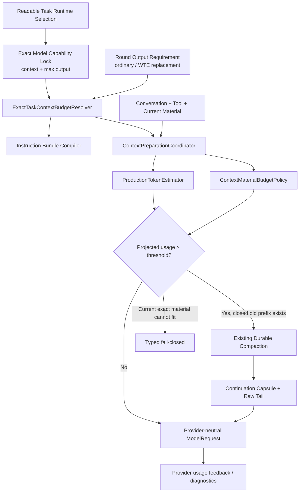

# CTX-MVP-1 Model-Aware Long Context / Continuation Compaction Development Plan

## 0. 文档状态

```text
状态：PASS/CLOSED / INDEPENDENT CODE QA PASS / USER ACCEPTED
日期：2026-09-01
目标版本：0.0.0-mvp.ctx.1
前置基线：KAF-5、ARH-2.2、ARH-2.3、MVP-VS1～VS3、WFW-1～WFW-3 repair.2
直接消费者：WTE-1 工作区文本读取与连续编辑
最高允许结论：CTX_MVP1_MODEL_AWARE_LONG_CONTEXT_CONFORMANT
后续联合门禁：REAL_PROVIDER_CALIBRATION_PENDING / WTE1_LONG_CONTEXT_JOINT_E2E_PENDING
```

本文只定义 CTX-MVP-1 的实施范围、实现顺序、测试门禁和停手条件。文档评审通过不等于
编码授权；独立评审和用户单独授权完成前，不得修改产品代码、Contract、migration、依赖或
lockfile。

CTX-MVP-1 是 WTE-1 的产品化前置批，不是新的长期 Memory、Knowledge、RAG 或通用模型平台。
本批完成后只允许恢复 WTE-1 编码，不自动解锁其他下游能力。

---

## 1. 用户问题与产品目标

### 1.1 当前问题

当前 Core 已具备 Context Assembly、预算判断、Tool Result 裁剪、durable Compaction、滚动摘要、
精确 Model invocation 恢复和 Task exact lock，但实际产品组合仍保留 KAF-5.2 Alpha 参数：

- Admin-managed internal-trial Model 在 Core 内硬编码 `contextWindow=128_000`，且没有把
  `maxOutputTokens` 作为同等重要的 exact capability；
- `ContextBudgetPolicy` 在 Core 启动时构造为全局单例，不按每个 Task 的 exact Model lock 决策；
- 生产路径仍使用位于 `adapters/fake/` 的 `ConservativeTokenEstimator`，并把 canonical JSON UTF-8
  byte 数直接当作 token 数；
- 每轮输出固定只预留 `1_024 tokens`，既不看 locked Model output cap，也不看当前任务材料；
- 每个 Tool Result 固定只保留 `4_096 bytes` preview，与模型窗口和材料用途无关；
- 既有 Compaction 主要证明 durable correctness，没有用 64～128 KiB 工作区文本、长 Tool 链和
  连续编辑验证产品有效上下文。

因此，当前的“128K”不是一个可按真实模型能力充分使用的 128K。单纯把常量改为 256K 或
400K 会扩大字节预算，却不能解决 Token 估算、Tool 内容截断、Task 锁定能力和连续编辑问题。

### 1.2 本批用户价值

CTX-MVP-1 必须让普通 Desktop 任务具备以下行为：

1. 新 Task 只使用其 exact Model lock 声明的真实上下文窗口；
2. 同一 Task lock 同时锁定该 Model 的 `maxOutputTokens`，不得由全局 8K 常量替代；
3. 受控 internal-trial deployment 可诚实声明并使用最高 400K context，而不是全局伪装；
4. 普通任务按默认 output 需求执行；WTE full replacement 按当前文件、Tool envelope 和增长 headroom
   计算 required output；
5. 长对话接近阈值时，先压缩已完成的旧完整轮次，再继续当前任务；
6. 当前用户指令、当前开放 Tool batch 和当前编辑所需完整文件正文不得被摘要或静默截断；
7. 压缩后继续保留用户目标、约束、决策、已完成动作、成果引用和待处理事项；
8. 原始 Conversation/Tool/Artifact durable facts 继续保留，摘要只是下一轮的派生 continuation
   input，不替代 source of truth；
9. WTE-1 可以在模型输入和输出预算都允许时完整读取并修改 64 KiB 和 128 KiB UTF-8 文件；无法
   完整注入或无法完整输出时
   必须明确失败，不能只给模型文件开头。

### 1.3 成功标准

本批只有同时满足以下条件才算成功：

- 8K / 128K / 400K 三种 Task-locked Model 窗口，以及相同 context/different max output capability，
  分别产生不同、可重建的 exact budget/admission；
- Core restart 后同一 Task 的 context window、max output、policy digest、available input、output reserve
  和 compaction threshold
  逐字符一致；
- normal production graph 不再实例化 `adapters/fake/ConservativeTokenEstimator`；
- 当前编辑文件结果在可用输入预算内保持全文 exact；required replacement output 超过 locked
  `maxOutputTokens` 时在 Provider Call 前返回 typed safe failure，正文与 Tool Call 零截断；
- 20 轮以上含 Tool Call 的同一 Session 至少发生一次首次 compaction 和一次 rolling compaction，
  并继续完成最终任务；
- 先以现有 durable summary 验证 raw history、source range、summary digest、Artifact identity、goal、
  constraints、decisions 和 pending work；只有验证失败才启用条件性 Capsule v2；
- 公共 Contract、Core migration、Central schema、依赖和 lockfile 不因本批变化。

---

## 2. Codex / OpenAI Compaction 参考与采用边界

### 2.1 官方事实

OpenAI 官方资料当前声明：

- GPT-5-Codex 为 `400,000 context window / 128,000 max output tokens`；
- `/responses/compact` 用于长时间、Tool-heavy 工作流，把既有 conversation 压缩成可在后续请求中
  继续使用的 compaction item；
- 推荐在接近上下文限制前规划压缩，并在重大阶段后压缩，而不是每轮无条件压缩；
- compacted item 面向 continuation，不应由调用方解析并依赖内部表示；
- 压缩可以重复执行，以支持超过单次模型窗口的长流程。

官方来源：

- <https://developers.openai.com/api/docs/models/gpt-5-codex>
- <https://developers.openai.com/api/docs/guides/compaction>

### 2.2 本批采用的原则

RoboThree 借鉴以下行为，不照搬 OpenAI 私有表示：

| Codex/OpenAI 原则 | RoboThree 对应实现 |
| --- | --- |
| 接近阈值前主动压缩 | 每轮 Context preparation 先 measure，再在 dynamic threshold 前 compact |
| 压缩产物用于后续 continuation | 继续使用 durable `CompactionRecord + raw tail` |
| 重大阶段后再压缩，不每轮压缩 | 只压缩已关闭的完整原子 conversation/tool group；每 round 最多一次 |
| 长流程可重复压缩 | 保留既有 rolling compaction：base summary + 新 closed prefix |
| 压缩表示不应成为业务真相 | 原始 Conversation、Tool、Artifact 继续是 durable source of truth |
| 当前工作材料需要保真 | 当前用户轮次、开放 Tool batch、当前 WTE read result 属 protected tail |

### 2.3 明确不照搬

本批不得：

- 直接依赖 `/responses/compact` 或 OpenAI Responses API；
- 把 OpenAI encrypted/opaque compaction item 写入公共 Contract；
- 让 OpenAI-only 行为成为 DeepSeek、Anthropic-compatible 或 Local Personal 的共同前提；
- 把隐藏 reasoning、Prompt、Credential 或完整 Tool 参数写入摘要；
- 用 Codex 400K 规格冒充所有 OpenAI-compatible Model 的真实能力；
- 因 GPT-5-Codex 支持 128K output，就让每个 RoboThree 请求默认生成 128K output。

---

## 3. 范围与非范围

### 3.1 本批允许范围

1. Core private model-aware Context budget resolution；
2. internal-trial private deployment `contextWindowTokens + maxOutputTokens` capability facts 的可信传递；
3. 生产 Token estimator 与 provider usage 校准；
4. per-material Tool Result budgeting；
5. 既有 durable Compaction 的产品验证；只有现有 summary 无法保留 accepted continuation facts 时，
   才允许条件性升级 continuation capsule；
6. `ContextPreparationCoordinator`、Instruction Bundle 和 recovery 对 per-Task policy 的接线；
7. focused tests、受控 Core process recovery、同一真实 Electron E2E driver 的长上下文场景；
8. README、CHANGELOG、DEVELOPMENT-LOG 和本批实施报告。

### 3.2 本批禁止范围

- 长期记忆、用户画像、跨 Session Memory；
- Knowledge Provider、RAG、Embedding、向量库、全文检索；
- 新 Workspace reader 或 `tool.workspace.file.read_text` 实现；
- 修改 WTE-1/WFW 产品能力；
- Admin 上下文配置 UI、模型路由、自动 fallback、模型推荐；
- 新公开 Contract、IPC、Preload API 或 Renderer 状态；
- Core SQLite migration、Central PostgreSQL migration；
- 新 npm/Maven 依赖或 lockfile 更新；
- background 静默压缩全部 Session；
- 第二套 Conversation、Task、Compaction 或 Artifact 状态机；
- 将模型隐藏 reasoning 展示给客户端；
- 修改父 WFW-3 Windows deferred 状态。

若实现证明必须触碰上述任一边界，立即停手并重新评审，不得以“上下文优化”为由扩大基线。

---

## 4. 当前代码事实与复用接缝

| 事实 | 当前落点 | 本批处置 |
| --- | --- | --- |
| Alpha budget 默认 8192/1024/512/0.8/4096 | `context-budget-policy.ts` | 只保留为 historical test fixture；生产禁止无参构造 |
| internal-trial contextWindow=128K、output 未成为 exact capability | `internal-trial-enterprise-model-deployment.ts` | 改由可信 private deployment fact 同时提供 input/output capability |
| 正常 runtime 构造全局 ContextBudgetPolicy | `create-desktop-private-runtime.ts` | 替换为 per-Task resolver |
| Fake estimator 按 JSON UTF-8 byte 计数 | `adapters/fake/conservative-token-estimator.ts` | 只留历史测试；新增 production estimator |
| Tool Result 统一 4 KiB | `context-reducer.ts` | 改为 Core-private material policy |
| durable automatic compaction 已存在 | `ContextPreparationCoordinator` | 复用，不建第二套 coordinator |
| closed atomic groups 已存在 | `CompactionSourceRangePlanner` | 保持当前轮和开放 batch 不可压缩 |
| rolling summary 已存在 | `CompactionCoordinator` | 复用 base summary + raw extension |
| model-backed summary 与恢复已存在 | `ModelBackedCompactionSummarizer` | 先验证现状；仅在 accepted facts 丢失时条件升级 |
| Task lock 包含 Model definition snapshot | `TaskCapabilityLock` | 作为 per-Task contextWindow 唯一 authority |
| Provider usage 已回传 input/output tokens | Enterprise/Local providers | 用于校准与 under-estimation 诊断，不回写历史预算 |

---

## 5. 总体设计



唯一决策链：

```text
Task exact Model lock（context + max output）
→ current round output requirement
→ exact Context policy
→ assemble protected + compressible materials
→ production token estimate
→ bounded material policy
→ projected threshold decision
→ existing durable compaction（最多一次）
→ reload + rerun
→ final hard guard
→ Provider call
```

不得在 AgentLoopCoordinator、Tool backend、Renderer 或 WTE 内复制 Context budget/compaction
判断。

---

## 6. G1：可信 Model Capability 与 per-Task Budget Authority

### 6.1 Capability 来源

internal-trial 的 context window 不再由 Core 无条件硬编码为 128K。受控部署必须从 trusted
Main/Central private deployment path 提供：

```text
contextWindowTokens
maxOutputTokens
capabilityProfileRevision
```

约束：

- 值只能来自受控 deployment 配置或 code-owned exact model profile；
- Renderer、Preload、普通 Admin response 不可写入或覆盖；
- `contextWindowTokens` 必须为 8,192～1,048,576 的 safe integer；
- `maxOutputTokens` 必须为 256～262,144 的 safe integer，且不得大于 `contextWindowTokens`；
- `capabilityProfileRevision` 必须绑定 provider family、exact upstream model id、context window 和
  max output；
- 未提供、格式错误、model id 不匹配或 profile revision 不一致时 Model unavailable；
- 不得回落 1K/4K/8K output 或 8K/128K/400K context；
- private deployment JSON 继续一次性进入 Main/Core trusted memory，不进入日志、SQLite、Evidence
  正文或 Artifact。

当前受控模型若经 profile 明确声明 400K，本批允许使用 400K；其他 Model 继续使用其自己的
真实值。不得因为参考 Codex，把 DeepSeek 或其他 Provider 自动提升为 400K。

### 6.2 Task exact lock

新 Task 的 Context/Output capability authority 是同一个 `TaskCapabilityLock` 内的复合 exact chain：

```text
TaskRuntimeSelection.modelLock.definitionSnapshot.model.contextWindow
TaskRuntimeSelection.modelLock.adapterDescriptorSnapshot.configurationRef
  → Core-private ExactModelCapabilityProfile {
      contextWindowTokens,
      maxOutputTokens,
      capabilityProfileRevision
    }
```

这样不修改 frozen public `TaskCapabilityLock`：definition snapshot 继续锁定公开 context，现有
`configurationRef` 则锁定 private profile digest；二者的 context 必须相等。不得把 max output 塞进
description、implementationRef、环境变量名称或未进入 digest 的临时字段。

`ExactTaskContextBudgetResolver` 必须：

1. 读取 readable Runtime Selection；
2. 校验 Task/selection/model lock/revision/digest；
3. 从 exact definition snapshot 取得 contextWindow，并从 locked `configurationRef` 加载 exact private
   profile；
4. 校验 profile digest/revision/model id/contextWindow/maxOutputTokens，公开 context 与 private context
   不一致即拒绝；
5. 生成 deterministic budget material 和 policy digest；
6. 将同一 policy 交给 Instruction Bundle compilation 与每轮 Context preparation；
7. restart 后从 durable lock/profile digest 重建同一 policy，不读取“当前默认模型”替换历史 Task；
8. 历史 pre-CTX Task 若没有 capability profile ref，只能使用 frozen
   `legacy.alpha.v1 = { originalContextWindow, maxOutputTokens: 1024 }` 语义，不回写旧 lock；
9. 历史 Task 的 128K/1K lock 在默认模型升级至 400K/128K 后仍保持原值；
10. 新 Task 才锁定新的 capability profile revision。

### 6.3 预算公式

MVP 使用两阶段 Core-private 公式。第一阶段先解析当前 round 的 output requirement：

```text
lockedMaxOutputTokens = exact locked Model maxOutputTokens

ordinaryDesiredOutputTokens = 8192
ordinaryRequiredOutputTokens = min(ordinaryDesiredOutputTokens, lockedMaxOutputTokens)

wteBaseReplacementTokens = outputEstimator.estimateCanonicalWriteTextToolCall(
  relativePath,
  expectedPreviousSha256,
  currentExactContent
)
wteGrowthHeadroomTokens = max(1024, ceil(wteBaseReplacementTokens * 0.25))
wteRequiredOutputTokens = wteBaseReplacementTokens + wteGrowthHeadroomTokens

requiredOutputTokens = current material is WTE full replacement
  ? wteRequiredOutputTokens
  : ordinaryRequiredOutputTokens

if requiredOutputTokens > lockedMaxOutputTokens:
  fail workspace.file.output_capacity_insufficient before Provider Call

reservedOutputTokens = requiredOutputTokens
```

WTE estimate 必须基于 canonical Tool Call envelope，而不是只数文件正文；`content` 的 JSON escaping、
relative path、expected digest 和 Tool protocol wrapper 都要计入。25% 是 MVP replacement growth headroom，
不是允许截断的额度。

第二阶段用当前 round 的 `reservedOutputTokens` 计算 input budget：

```text
contextWindow = exact locked Model contextWindow

safetyMarginTokens   = clamp(ceil(contextWindow * 0.02), 512, 16384)
availableInputTokens = contextWindow - reservedOutputTokens - safetyMarginTokens

minimumHeadroomTokens = min(
  32768,
  max(2048, reservedOutputTokens * 2, ceil(contextWindow * 0.08))
)
ratioThresholdTokens  = floor(availableInputTokens * 0.80)
headroomThreshold     = availableInputTokens - minimumHeadroomTokens
compactionThreshold   = min(ratioThresholdTokens, headroomThreshold)
```

说明：

- 普通任务默认最多请求 8K，但 4K output Model 仍可执行普通任务；8K 不是 Model admission 下限；
- WTE replacement 可以按材料需要请求超过 8K，最高不得超过 locked Model `maxOutputTokens`；
- 2% safety margin 用来容纳估算偏差和 Provider wrapper；8K 历史窗口最低保留 512，超长窗口最高
  保留 16K；
- 80% 阈值保持现有行为；headroom 随窗口缩放：8K 窗口至少保留 2K，128K 窗口至少保留 16K，
  400K 及更大窗口最多固定保留 32K；
- 公式必须是纯函数，全部字段进入 policy digest；
- 若公式无法留下正 input 或 threshold，Model 不可用于 Agent Task。

普通 round、requested output=表中 output reserve 时的冻结样例：

| contextWindow | output reserve | safety margin | available input | minimum headroom | compaction threshold |
| ---: | ---: | ---: | ---: | ---: | ---: |
| 8,192 | 1,024 | 512 | 6,656 | 2,048 | 4,608 |
| 128,000 | 8,192 | 2,560 | 117,248 | 16,384 | 93,798 |
| 400,000 | 8,192 | 8,000 | 383,808 | 32,000 | 307,046 |

### 6.4 Instruction Bundle 一致性

当前 Instruction Bundle 持有 budget policy digest。实现必须让 bundle 编译与运行时 request 使用
同一 exact policy：

- 不得用 global/default policy 先编译，再用 Task policy 调用模型；
- bundle digest mismatch 必须继续 fail-closed；
- Model revision/context window/max output 变化必须产生新 bundle/Task lock，不改写旧 bundle；
- restart 和 rolling compaction 后 policy digest 不变。

---

## 7. G2：Production Token Measurement

### 7.1 生产 estimator

新增 Core production adapter，例如：

```text
ProviderNeutralConservativeTokenEstimator
```

`adapters/fake/ConservativeTokenEstimator` 继续服务历史 deterministic tests，但 normal runtime 和
recovery fallback 禁止实例化它。

首版不新增 tokenizer 依赖，采用 deterministic、Unicode-aware、带安全系数的估算：

- JSON structural tokens 单独计入；
- ASCII 文本按有界字符组估算；
- CJK、emoji、combining mark 和 invalid surrogate 分别计入；
- Tool Schema、arguments、system messages、artifact refs 与 request wrapper 全部计入；
- 最终 estimate 增加固定 wrapper allowance 和不低于 10% 的 safety multiplier；
- 估算必须返回 token unit，不能继续把 byte count 命名为 token count；
- 算法 revision 进入 policy/measurement evidence，升级算法不得静默复用旧 digest。

estimator 不要求对所有 Provider、所有请求逐次满足 `estimate >= actual`。编码前必须为每个 admitted
provider family/profile 建立固定中英混合、代码、JSON、Tool Schema 和 WTE Tool Call corpus，得到验证过的
error envelope；`safetyMarginTokens` 至少覆盖该 envelope 与基础 margin 的较大值。若真实 usage 超过已验证
envelope，触发 typed internal alert，并阻止该 profile 继续用于新的 long-context/WTE Task，不能用无限扩大
margin 掩盖错误算法。

### 7.2 Provider usage 校准

Provider 已返回实际 input/output usage。本批只做 content-free 诊断：

```text
estimatedInputTokens
providerInputTokens
estimationErrorRatio / estimationErrorTokens
validatedErrorEnvelopeTokens
estimatorRevision
modelCapabilityRevision
```

约束：

- 不记录 Prompt、Tool content、文件正文或用户消息；
- actual usage 只用于后验诊断，不修改已完成调用的 policy；
- `actual - estimate` 位于 validated error envelope 内是允许事实，不计产品缺陷；
- 超出 envelope 时触发 typed internal alert，并在 focused/real-provider verification 中失败；
- 不在本批建设在线自学习或持久化 tokenizer calibration platform；
- Provider 不返回 usage 时保持保守 estimate，不伪造 actual usage。

### 7.3 历史兼容

- historical KAF/ARH tests 可显式继续注入旧 Fake estimator；
- production composition test 必须断言 fake estimator count=0；
- 不为适配新 estimator 改写历史 Evidence；
- 新 focused tests 使用新 estimator 的 exact revision 和边界值。

---

## 8. G3：Context Material Budget 与 WTE 保真边界

### 8.1 三类材料

Context material 分为：

| 类别 | 示例 | 处理 |
| --- | --- | --- |
| Protected | Platform/Agent 主指令、已选 Skill 主指令、当前 user turn、开放 Tool batch、当前编辑文件全文 | 不摘要、不静默截断；放不下则 typed failure |
| Compressible | 已完成旧 conversation groups、已关闭历史 Tool cycles | 可进入 durable continuation compaction |
| Referenceable | 历史大 Tool Result、非当前 Artifact 内容 | 保留 bounded preview + digest + Artifact ref |

Skill 的 `references/`、examples、模板和其他扩展材料默认属于 Referenceable/on-demand，不得因为 Skill
被选择就把整个目录固定放进 Protected context。只有本轮被 authorized reader 明确加载、且对当前步骤必要的
具体材料，才作为当前材料进入预算；下一轮是否继续 protected 必须重新判定。

### 8.2 Tool capability identity

`ContextReducer` 必须从 assistant Tool Call 的 `toolCallId → capabilityId` 关联 Tool Result，不再只看
`message.role=tool`。identity 缺失、重复、跨 group 或 drift 时失败关闭。

### 8.3 Material policy

首版建议值：

| 材料 | 单项上限 | 规则 |
| --- | ---: | --- |
| 普通历史 Tool Result preview | 8 KiB | 超出保留 digest/ref |
| 当前普通 Tool Result | 16 KiB | 仍受整体 budget |
| 文档 extract/read 当前结果 | 64 KiB | 超出需 Tool 自身分页/分块，不由 reducer 偷截 |
| WTE 当前 `read_text` result | 128 KiB | 必须全文 exact；预算不足 typed fail |
| Compaction capsule | 16 KiB UTF-8 | 超出 summary invalid |

上表是每项上限，不是保证注入额度。所有材料仍需通过整体 token budget。

### 8.4 WTE 专用保真规则

CTX-MVP-1 不实现 WTE Tool，但必须冻结可供 WTE 消费的 Core-private material policy：

```text
capabilityId = tool.workspace.file.read_text
current user edit turn = exact_required
historical completed edit turn = referenceable/compactible
```

当 `read_text` 属于当前 User Edit Turn：

- `relativePath/mediaType/byteSize/sha256/content` 必须作为同一结果原子处理；
- content 必须完整进入 request；
- 不能只保留开头、结尾或摘要后继续执行 replace；
- 若全文无法放入，返回未来 WTE 使用的 Core-private reason
  `workspace.file.context_too_large_for_edit`；
- 不创建新的公共错误码；WTE 编码时再映射到其 frozen Tool outcome；
- 当前读取结果不得成为 durable compaction source；
- 新 User Edit Turn 按 WTE 原则必须重新读取磁盘，历史全文不需要再次保留为 protected。

### 8.5 动态事实和 Tool Schema

Platform Prompt、Agent/Skill instructions、Tool Schema 与 request-scoped facts 仍属于预算：

- 禁止只预算 conversation 而忽略 Tool Schema；
- static context 自身过大继续 `context.static_context_too_large`；
- 当前用户输入或单个 exact material 自身过大继续 fail-closed；
- 不能通过删除安全 instruction、权限约束或 Tool schema 腾出空间。

---

## 9. G4：Codex-style Continuation Compaction

### 9.1 触发方式

每轮只由 `ContextPreparationCoordinator.prepare()` 判断：

```text
assemble + estimate
→ finalProjectedTokens ≤ threshold：直接继续
→ > threshold 且存在 closed old prefix：尝试一次 durable compaction
→ > threshold 但只有 bounded historical preview：只裁 referenceable material
→ protected/current material 自身超 hard limit：typed fail
```

不得：

- 每轮无条件摘要；
- background 扫描全部 Session；
- 一轮递归压缩两次；
- 拆分开放 Tool Call/Result；
- 压缩当前 User Turn；
- 为了通过预算删除 system/security instructions。

### 9.2 现有 durable summary 产品验证（默认路径）

本批默认不修改 `ModelBackedCompactionSummarizer` prompt/schema/parser。先使用现有 durable compaction 完成：

- 20+ turn Tool-heavy Session；
- first compaction + rolling compaction；
- Core SIGKILL/restart/status-first recovery；
- goal、constraints、decisions、Artifact refs、completed Tool outcomes、pending work 和 latest continuation
  point 的逐项语义断言；
- WTE-shaped current exact material no-truncation。

如果现有 summary 全部通过，则 Capsule v2 保持 `NOT_REQUIRED / NOT_IMPLEMENTED`，WTE 不等待新 schema。

### 9.3 Continuation Capsule v2（条件性分支）

只有 §9.2 证明现有摘要无法可靠保留 accepted continuation facts，并且失败会影响 long-context/WTE
产品结果时，才允许升级 Core-private compaction summary revision。升级不修改公共 `CompactionRecord`
结构，新摘要仍存入现有 `summary: string`，内容必须是可验证的 canonical continuation capsule：

```text
schemaVersion
activeGoal
userConstraints[]
decisions[]
completedActions[]
artifactReferences[]
toolOutcomes[]
pendingWork[]
unresolvedIssues[]
latestContinuationPoint
```

约束：

- 只保留 continuation 所需事实；
- Artifact 只保存 safe identity、relative display name、media type、digest 和完成状态，不保存绝对路径；
- Tool outcome 不保存 Credential、secret、完整 arguments、完整 raw result；
- 不保存或推断 chain-of-thought；
- source 内容中的指令仍是低权限 data；
- capsule 必须通过 strict Core-private parser、字段/数组/UTF-8 byte 上限和 canonical digest；
- v1 historical summary 继续可读；新 rolling compaction 读取 v1 base 时必须先作为低权限 legacy
  summary 输入，再产出 v2 capsule；
- capsule 无法验证、未减少 token、丢失 required continuation field 或 stream 不完整时不提交。

如果失败只影响非 MVP 的长期 Memory、Knowledge、跨 Session recall 或任意资料全文保留，则不得启动 v2，
按非范围记录。条件性 v2 最多增加 1～1.5 个工程日，不改变 WTE 的基础 input/output admission 前置。

### 9.4 Source of truth

与 Codex continuation 思路一致，capsule 用于继续工作，但 RoboThree 必须保留自己的 durable
审计与恢复边界：

- 原始 Conversation messages 不删除；
- CompactionRecord 继续绑定 immutable source range/source digest；
- raw tail 从 sourceEndSequence+1 开始，不能 summary + old prefix 双注入；
- Tool/Artifact/Task 状态继续从各自 persistence 加载，不能只信 capsule；
- capsule 不授予权限、不修改 Task lock、不证明文件 ownership；
- rolling compaction 继续使用 same Session、exact model/binding/adapter provenance。

### 9.5 恢复

复用既有 CompactionJob、ExecutionBinding、Model invocation link 和 status-first recovery：

- restart 恢复同一 pending compaction，不创建第二次摘要调用；
- summary output started 但不可完整恢复时保持 fail-closed；
- commit 后响应丢失 replay 同一 record；
- stale source reload 后只 rerun 一次；
- cancel/Task deadline 不提交晚到 capsule；
- 压缩完成后使用同一 exact Task budget 从头 reload + rerun；
- 新默认模型或 capability profile 不能改变历史 Task 的 compaction target/policy。

---

## 10. G5：输出预算与 Provider Request

### 10.1 主调用

`ModelRequest.maxOutputTokens` 使用 §6.3 当前 round 的 exact `requiredOutputTokens`。普通任务默认最多
8K；WTE replacement 可以超过 8K，但不得超过 locked Model `maxOutputTokens`。Provider request converter
必须逐层保持该值，不得被 Central 或 adapter 静默扩大、缩小或替换为全局常量。

Provider 返回 finish reason=length、incomplete Tool Call、unterminated JSON 或缺失 required `write_text`
arguments 时，必须判为 typed output failure，零 Tool execution；不得把已截断 content 交给 Writer。

### 10.2 Compaction 调用

现有 compaction summary，以及条件启用后的 continuation capsule，均使用：

```text
maxOutputTokens = min(4096, lockedMaxOutputTokens, floor(mainReservedOutputTokens / 2))
maxSummaryBytes = 16 KiB
tools = []
```

capsule 必须显著小于 source range。若不能减少，失败关闭并保留原始历史。

### 10.3 Provider 不兼容

Model catalog admission 只验证 exact capability profile 与 Provider 基础兼容，不要求 output 至少 8K。
每个 Task/round 再依据实际 input/output requirement 判断：

- 4K output / 128K context Model 可以执行 required output ≤4K 的普通任务；
- 同一个 Model 面对 required output >4K 的 WTE replacement 时在 Provider Call 前 typed fail；
- Provider 真实 context/max output 小于 deployment profile 时 capability admission 失败；
- 不自动换模型、不降低 WTE replacement output、不静默截断请求；
- 用户可修正受控 deployment profile 后创建新 Model revision；
- 已锁定 Task 继续使用旧 exact 事实，当前 round 不满足时给出安全 capacity failure，不换模型。

---

## 11. 数据安全与可观测性

### 11.1 禁止进入日志的内容

- Prompt 和 system instruction 正文；
- 用户消息和文件正文；
- Tool arguments/result 正文；
- compaction capsule 正文；
- Workspace absolute path/grant；
- Credential、Token、Endpoint secret；
- Provider hidden reasoning。

### 11.2 Content-free diagnostics

允许记录：

```text
taskId/sessionId/runId/round
model capability id + exact revision
contextWindow / lockedMaxOutput / requiredOutput / outputRequirementKind
availableInput / outputReserve / safetyMargin / threshold
estimatorRevision / estimatedInput / providerReportedInput / validatedErrorEnvelope
material counts and bounded/truncated booleans
compaction decision/reason/jobId/sourceRangeDigest/capsuleDigest
final outcome / typed error code / duration
```

Diagnostics 不进入 Renderer 新字段；继续供本地开发日志、focused tests 和 QA content-free
断言使用。

---

## 12. 实施顺序

### Step 0：事实冻结与 focused proof（0.5 日）

- 固定当前 normal runtime、recovery fallback、Instruction Bundle 和 Compaction 使用的 estimator/policy
  构造点；
- 固定 Task lock 中 exact contextWindow 与 `configurationRef → private capability profile` 的读取路径；
- 固定 internal-trial private discovery/transport 路径；
- 使用 8K/128K/400K context、4K/8K/128K max output fixture 证明 global policy 会产生错误，作为
  先失败测试；
- 验证当前 Provider profile 能否诚实提供 context/max output；无法提供则按停手条件返回，不编码常量替代；
- 先证明 frozen public lock 的现有 `configurationRef` 能绑定、重载并校验 private profile；不能则停手，
  不修改 frozen Contract。

### Step 1：Model capability 与 per-Task policy（1～1.5 日）

- private deployment capability profile（context + max output + revision）；
- `ExactTaskContextBudgetResolver`；
- ordinary/WTE `RoundOutputRequirementResolver` 与 pre-call admission；
- production path 禁止无参 `ContextBudgetPolicy`；
- Instruction Bundle 与 request 使用同一 policy；
- historical/new Task revision、restart 和 profile upgrade tests。

### Step 2：Production estimator 与 material policy（1～1.5 日）

- no-dependency production estimator + revision；
- per-provider validated error envelope + usage diagnostics；
- Tool Call identity → Tool Result material classification；
- 8/16/64/128 KiB policy；
- exact-required material no-truncation tests。

### Step 3：现有 Compaction 产品验证 / 条件性 Capsule v2（0.5～2 日）

- 先不改 production summarizer，完成 first/rolling compaction、pending/stale/cancel/restart regression；
- 对 goal/constraints/decisions/Artifact/Tool outcome/pending/continuation point 做语义断言；
- 基线全过：记录 `CAPSULE_V2_NOT_REQUIRED`，结束本 Step；
- 基线失败且影响 MVP：才实现 summarizer prompt revision、strict private capsule parser/canonicalizer、
  v1 historical read + v2 new write；
- protected current turn/open Tool batch invariants。

### Step 4：联合验证与治理收口（1～1.5 日）

- controlled long-context Core integration；
- 64/128 KiB WTE-shaped Tool Result fixture；
- 20+ turn Tool-heavy Session + first/rolling compaction；
- Core SIGKILL/SQLite reopen/exact policy reconstruction；
- 同一现有 Electron driver 验证 Task terminal 和 Artifact，不新增产品 UI；
- typecheck、focused lint、Core smoke、DTP-4、Central online/offline（若 Central private deployment
  有修改）、`git diff --check`；
- 版本、CHANGELOG、DEVELOPMENT-LOG、实施报告。

基线路径集中工程工作量预计 **4～6 个工程日**；只有触发 Capsule v2 条件分支时增加 **1～1.5 日**。
独立代码 QA 另计约 1 日。真实 Provider 资源等待不计入。

---

## 13. Focused QA（33 项）

### 13.1 Capability / Budget（QA-001～QA-008）

- **QA-001**：8K/128K/400K context + 4K/8K/128K max output lock 分别生成 exact deterministic policy；
- **QA-002**：缺 context/max output、超范围、非整数、profile/model/context mismatch 全 fail-closed；
- **QA-003**：历史 128K/1K Task 在默认升级 400K/128K 后仍保持原 capability；
- **QA-004**：新 400K/128K Task 的 profile revision、configurationRef、lock 和 policy digest exact 对齐；
- **QA-005**：restart 前后 context/max output/available/reserved/safety/threshold/digest 一致；
- **QA-006**：Instruction Bundle policy 与 request policy 不一致时拒绝；
- **QA-007**：normal runtime 无无参 ContextBudgetPolicy / Alpha fallback；
- **QA-008**：Provider profile 不可验证时零 catalog admission、零 Model call。

### 13.2 Estimator / Material（QA-009～QA-016）

- **QA-009**：normal runtime 与 recovery path 的 Fake estimator count=0；
- **QA-010**：中英混合、emoji、代码、JSON、Tool Schema corpus 估算 deterministic；
- **QA-011**：actual-estimate 可位于 validated error envelope；超 envelope fail；缺 usage 时不伪造；
- **QA-012**：assistant Tool Call 到 Tool Result capability identity exact，drift/duplicate/orphan 拒绝；
- **QA-013**：历史普通结果 8 KiB preview + digest/ref；
- **QA-014**：当前普通/文档结果分别遵守 16/64 KiB 上限，Skill references/examples 默认 on-demand；
- **QA-015**：64 KiB 和 128 KiB current edit result 首/中/尾 sentinel 全部进入 request；
- **QA-016**：current exact material 放不下时 typed fail，正文零截断、零 Provider call。

### 13.3 Compaction（QA-017～QA-024）

- **QA-017**：dynamic threshold N-1/N/N+1；hard available N-1/N/N+1；
- **QA-018**：低于阈值零 compaction；一 round 最多一个新 Job；
- **QA-019**：只压缩 closed old atomic groups，不含 current user turn/open Tool batch；
- **QA-020**：现有 durable summary 保留 goal/constraints/decisions/Artifact/Tool outcome/pending/continuation point；
- **QA-021**：现有 summary 完成 first + rolling + restart；基线通过时 production capsule v2 改动数=0；
- **QA-022**：基线失败时必须有逐项丢失证据；非 MVP 丢失不得触发 v2；
- **QA-023**：条件触发后 v2 才验证 strict fields/size/canonical digest、v1 read/v2 write 和敏感内容 0；
- **QA-024**：summary + raw tail 无双注入，token after < before，否则不提交。

### 13.4 Recovery / WTE / Boundary（QA-025～QA-033）

- **QA-025**：pending compaction restart 恢复 same job/binding/client request；
- **QA-026**：stale/cancel/deadline/late callback 不提交 capsule、不复活 Task；
- **QA-027**：20+ turn Tool-heavy Session 完成 first + rolling compaction 后仍 terminal completed；
- **QA-028**：当前 WTE-shaped exact content 在 compaction 前后逐字符一致；
- **QA-029**：下一 User Edit Turn 历史全文不再 protected，并要求未来 WTE 重新 read；
- **QA-030**：Core SIGKILL + 原 SQLite reopen 后 exact model/policy/capsule/artifact refs 恢复；
- **QA-031**：日志/Evidence/Artifact/Renderer 四表面正文、Prompt、Token、绝对路径命中 0；
- **QA-032**：公共 Contract、migration、Central schema、依赖、lockfile、下游 GATED 状态不漂移。
- **QA-033**：相同 128K context、不同 4K/128K max output：普通任务均 admitted；同一 64/128 KiB
  WTE replacement 只允许 output capacity 足够者，另一方在 Provider Call 前 typed fail。

QA 编号必须恰好 `QA-001..QA-033`、连续唯一。不得扩张成 96/120 项关闭账本或新 Evidence
schema。

---

## 14. 门禁

最低门禁：

```text
Node 24.13.0 / pnpm 11.11.0 / JDK 21（仅 Central 改动时）
CTX-MVP-1 focused tests PASS
KAF-5 context pipeline regression PASS
ARH-2.2 / ARH-2.3 compaction recovery regression PASS
MVP-VS1/VS2/VS3 relevant runtime regression PASS
Core typecheck PASS
focused ESLint PASS
Core smoke PASS
DTP-4 audit + self-test PASS
Central online/offline PASS（仅 private discovery 有修改时必须执行）
git diff --check PASS
```

真实联合验证必须确认 Task terminal state 和承诺的 Artifact/continuation 结果；Electron exit 0、
测试进程退出或单独 digest PASS 不能替代产品结果。

---

## 15. 停手条件（20 项）

出现任一情况立即停止编码并回到文档评审：

1. 必须修改 frozen public Contract 才能锁定 context/max output capability；
2. 必须新增 Core/Central migration；
3. 必须新增 npm/Maven dependency 或修改 lockfile；
4. 无法从可信 deployment/profile 获得当前 Model 的真实 context window 或 max output；
5. 只能把所有 OpenAI-compatible Model 统一硬编码成 400K；
6. frozen lock 的 `configurationRef` 无法绑定并重载 exact private capability profile；
7. 新默认模型会改写历史 Task budget、Model target 或 Instruction Bundle；
8. production estimator 的真实误差超出 admitted profile 的 validated envelope；
9. Model 因 max output 小于 8K 被整体排除，而不是按当前任务需求判断；
10. WTE required output 超过 locked max output 后仍进入 Provider Call；
11. finish=length/incomplete JSON/Tool Call 仍会执行 Writer；
12. 需要删除 system/security instruction 才能让请求通过预算；
13. 当前 User Turn、开放 Tool batch 或 current edit exact content 被压缩/截断；
14. Skill references/examples 因 Skill 被选择而全部固定进入 protected context；
15. 需要把 `workspaceGrantId`、绝对路径或文件正文写入新持久化事实；
16. Compaction 一 round 必须执行两次或形成递归；
17. 未先取得现有 summary 丢失 accepted continuation facts 的证据就修改 Capsule schema；
18. v1 historical CompactionRecord 无法读取；
19. 需要直接依赖 OpenAI `/responses/compact` 才能完成 provider-neutral 路径；
20. 日志/Evidence/Renderer/Artifact 出现敏感正文，或实现扩张到 Memory、Knowledge、RAG、WTE Tool、
    Admin UI、模型路由或新状态机。

---

## 16. 预期修改范围

允许修改候选：

```text
services/core/src/application/context-*.ts
services/core/src/application/instruction-bundle-compiler.ts
services/core/src/application/durable-agent-loop-starter.ts
services/core/src/application/model-backed-compaction-summarizer.ts
services/core/src/adapters/**（仅 estimator/private deployment adapter）
services/core/src/bootstrap/create-desktop-private-runtime.ts
services/core/src/bootstrap/internal-trial-enterprise-model-deployment.ts
services/core/tests/**

apps/desktop/src/main/core-private-supervisor.ts（仅 private deployment fact 透传需要时）
services/central-service/**（仅 trusted private discovery/profile 需要时）

README.md
CHANGELOG.md
docs/development/DEVELOPMENT-LOG.md
docs/development/CTX-MVP-1-*
```

预期生产代码不修改：

```text
apps/desktop/src/renderer/**
apps/desktop/src/preload/**
apps/admin-console/**
services/document-worker/**
packages/contracts/**
services/core/src/adapters/sqlite/migrations.ts
Central schema manifests/migrations
pnpm-lock.yaml
```

---

## 17. 诚实边界与后续关系

CTX-MVP-1 通过只允许声明：

```text
CTX_MVP1_MODEL_AWARE_LONG_CONTEXT_CONFORMANT
```

它不等于：

- 所有模型都是 400K；
- 所有 400K 都能装入 400K 用户正文；
- production ready；
- WTE-1 已实现；
- 长期 Memory/Knowledge/RAG ready；
- Admin 可配置上下文参数；
- OpenAI Responses compaction ready；
- WFW-3 Windows regression closed。

CTX-MVP-1 独立 QA 和用户接受完成后，下一步只恢复 WTE-1：

```text
tool.workspace.file.read_text
→ current edit exact material
→ write_text expectedPreviousSha256
→ one automatic rebase
→ Artifact / preview / continuous editing
```

---

## 18. Revision 2 聚焦复核问题

如进行独立文档复核，请只读检查并按 P0/P1/P2/P3 回答：

1. 当前 128K/global policy/Fake estimator/1K output/4 KiB preview 五项事实是否与代码一致；
2. Codex/OpenAI compaction 的采用与不照搬边界是否准确；
3. private profile 是否同时锁定 context/max output/revision，并由现有 `configurationRef` 进入 lock digest；
4. historical 128K/1K 与 new 400K/128K 是否都能从 exact lock 重启重建；
5. ordinary output 与 WTE replacement output requirement 是否按 task/material 分离；
6. 4K output Model 是否仍可执行普通任务，而对超容量 WTE pre-call fail；
7. canonical WTE Tool Call estimate 是否包含 JSON escaping、path、digest、wrapper 和 25% growth headroom；
8. no-dependency estimator + validated error envelope 是否可实施，而非要求逐请求绝对高估；
9. Tool Call identity 驱动 material policy 是否支持 current WTE exact content；
10. Skill 主指令 protected、references/examples on-demand 的边界是否可执行；
11. 是否先验证 existing durable summary，且基线通过时 Capsule v2 production diff=0；
12. 条件性 v2 是否仍复用现有 CompactionRecord/Coordinator，而非第二套状态机；
13. 33 项 focused QA、20 项停手条件和 4～6 日基线估算是否可执行；
14. 是否出现必须修改 frozen public Contract、migration、依赖或 lockfile 的 P0/P1。

Revision 2 已吸收用户 P0/P1 并取得编码授权；实施从 Step 0 focused proof 开始。任何停手条件命中
仍必须暂停并回到文档评审，不能因已有编码授权扩大范围。
