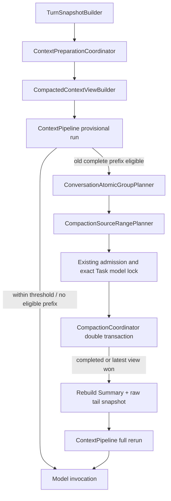

# RoboThree ARH-2 Automatic Compaction Orchestration Development Plan

## 1. 文档状态

```text
状态：CONFIRMED / ARH-2.0、ARH-2.1、ARH-2.2 PASS/CLOSED / ARH-2.3 REVISION 1 RE-REVIEW PENDING
提出日期：2026-08-12
修订日期：2026-08-13
架构基线：ADR-010 ACCEPTED
前置批次：ARH-1 PASS/CLOSED
ARH-2.1：PASS/CLOSED
ARH-2.2：PASS/CLOSED
ARH-2.3：REVISION 1 / RE-REVIEW PENDING / CODING GATED
ARH-3：GATED
```

本文件冻结 ARH-2 的实现边界、批次和验收矩阵。Revision 1 已通过复核并由用户正式确认；
ARH-2.1 已通过开发者自测、Claude Code 独立 QA 和用户接受，正式 `PASS/CLOSED`。
ARH-2.2 已形成[正式详细实施方案](./ARH-2.2-PRODUCTION-AUTOMATIC-COMPACTION-ORCHESTRATION-DEVELOPMENT-PLAN.md)，
首轮评审结论为 `PASS（P0=0 / P1=0 / P2=1 / P3=1）`；Revision 1 已补充 Core 私有
`ContextPreparationReceipt` 和 assistant provenance exact revision tuple，并通过复核及用户
授权。生产自动编排已实现，并通过 Claude Code 独立 QA 与用户接受，ARH-2.2 正式关闭。
ARH-2.3 已形成[详细恢复关闭 Harness 方案](./ARH-2.3-RECOVERY-CLOSURE-HARNESS-DEVELOPMENT-PLAN.md)，
首轮评审 `PASS（P0=0 / P1=0 / P2=1 / P3=1）`；Revision 1 已补充受控 Provider 的两种
显式故障模式与 semantic seed 稳定性定义，当前等待收口复核；ARH-3 继续 `GATED`。

## 2. 阶段目标

ARH-2 把 KAF-5 已有的 Context Pipeline、Durable Compaction 和 Compacted Context View
接入真实 `DurableAgentLoopStarter`：

```text
Turn Snapshot
→ Context Assembly 与模型相关预算测量
→ 判断是否存在可压缩的旧完整前缀
→ 通过已授权、已锁定的摘要执行路径完成 durable compaction
→ 使用 Compaction Summary + raw tail 重建 Context
→ 从头重新预算
→ Model invocation
```

一个 Model round 最多提交一次新的自动 Compaction。ARH-2 解决“生产 Agent Loop 如何自动
压缩并继续执行”，不重做 KAF-5 的持久化状态机，也不把上下文压缩扩张为长期 Memory、
知识检索或 UI 功能。

## 3. 当前代码事实与缺口

### 3.1 已具备

1. `ContextBudgetPolicy` 已按目标模型计算：
   `availableInputTokens = contextWindow - reservedOutputTokens - safetyMarginTokens`，默认
   Compaction 阈值为可用输入预算的 80%。
2. `ContextPipeline` 已完成组装、Tool Result bounded preview、token estimate、旧轮次缩减、
   Provider-neutral conversion 和 pre-call final guard。
3. `CompactionCoordinator` 已实现 request / model call / commit 双事务、pending recovery、
   completed / failed / stale 收敛、Receipt replay 和 CAS。
4. `CompactedContextViewBuilder` 已能读取最新有效 Summary 与其后的 raw tail。
5. 原始 `ConversationMessage` append-only，CompactionRecord 不可变；Task 与 Session 的
   revision、event sequence 和持久事实保持分离。

### 3.2 仍缺失

1. `DurableAgentLoopStarter.buildRequest()` 仍加载完整 Conversation，未消费 active Summary。
2. `ContextReducer` 的临时裁剪结果尚未驱动 durable Compaction。
3. 没有生产级 `ContextPreparationCoordinator` 负责判断、压缩、重建和重新预算。
4. Context reduction 与 persistent source-range selection 尚未共享同一原子分组规则。
5. pending Job 尚未锁定可恢复的摘要执行选择；重启后不得静默改用其他模型、Binding、
   Endpoint 或凭证。
6. Compaction Summary 尚未作为低权限、派生的会话上下文进入 Provider-neutral request，
   也缺少来源分类与外发授权证据。

## 4. 冻结架构



### 4.1 所有权

| 组件 | 所有权与职责 |
| --- | --- |
| `ContextPreparationCoordinator` | Application 层唯一自动压缩编排者；负责 measure、eligibility、admission、compact、reload、rerun |
| `ConversationAtomicGroupPlanner` | Core 内部纯函数；生成不会拆分用户轮次和 Tool Call Batch 的原子组 |
| `CompactionSourceRangePlanner` | 只选择旧的完整前缀；不得选择当前最新原子组或未终结 Tool Batch |
| `CompactionCoordinator` | 继续拥有双事务、Job、Record、CAS、Receipt 和恢复，不拥有 Agent Loop 或 Task 状态 |
| `CompactedContextViewBuilder` | 读取 active Summary + raw tail；不决定是否压缩 |
| `DurableAgentLoopStarter` | 每轮调用 preparation coordinator，取得最终 request 与 receipt；不内联压缩规则 |
| `Kernel reducer` | 保持纯函数，不知道 Context、Compaction、Model、SQLite 或生命周期 |

### 4.2 Task 状态不扩张

不增加 `compacting`、`awaiting_compaction` 或 `recovering_context`。Compaction 是 Application
层模型调用前准备阶段。只有既有用户确认、用户输入或真实外部依赖才进入 Task waiting。

### 4.3 原始历史与 Summary 的权限层级

- Summary 是 Conversation 的派生视图，不是新的 `ConversationMessage`；
- 不把 Summary 持久为伪造的 user / assistant 历史；
- Provider-neutral request 中以 Core 内部 `compaction_summary` segment 生成低权限的派生
  conversation context，不提升为 Platform/Agent system instruction；
- Summary 不能证明 Tool 已执行、确认已允许、Task 已完成或文件已写入；执行判断仍回到
  Task/Event/Observation/Receipt/Tool Call Batch 等持久事实；
- Context receipt 必须记录 `compactionId`、source range/digest、summary digest、context
  revision 和由原始不可变来源推导的数据类别，但不记录摘要正文。

这遵循“结构优于堆量”的上下文工程原则：模型只接收当前决策需要的 Summary + raw tail，
而不是同时注入完整历史、摘要和重复派生内容。

## 5. 自动触发与单轮规则

### 5.1 预算判定

固定判断：

```text
estimatedInputTokens <= compactionThresholdTokens
→ 不压缩

estimatedInputTokens > compactionThresholdTokens
AND 存在可压缩旧完整前缀
→ 尝试一次 durable Compaction

estimatedInputTokens > compactionThresholdTokens
AND 不存在可压缩旧完整前缀
AND estimatedInputTokens <= availableInputTokens
→ 允许本轮继续，并在 receipt 标记 compactionNotApplicable

estimatedInputTokens > availableInputTokens
AND 压缩后仍无法满足硬预算
→ context.available_input_exceeded，失败关闭
```

阈值是自动压缩触发线，不是模型硬上限。`N-1` 与 `N` 不触发，`N+1` 仅在存在合法旧
前缀时触发。一次 Model round 最多创建一个新 CompactionJob，禁止递归压缩循环。

### 5.2 何时允许 durable Compaction

临时 reduction receipt 必须显示被缩减的是旧 Conversation 原子组。以下情况不单独触发
持久 Compaction：

- 只有 Tool Result bounded preview 生效；
- 只有可选 Knowledge/Workspace preview 被有界化；
- 当前最新原子组本身过大且没有旧前缀；
- Context 超限来自 Platform/Agent instructions 或锁定 Tool Schema；
- 当前 Tool Call Batch 尚未完成；
- 当前 Task 已取消或 AbortSignal 已触发。

若没有可压缩旧前缀且 Context 超过硬预算，不做自动删减、换模型或新建会话。ARH-2.2
必须通过既有安全 typed failure 链提供可操作但不泄漏正文的原因：

| 原因 | 稳定错误语义 | 安全用户建议 |
| --- | --- | --- |
| 当前最新原子组本身超过硬预算 | `context.current_turn_too_large` | 缩短当前输入、减少本轮附件/结果，或开始新会话 |
| Platform/Agent instructions 或锁定 Tool Schema 超过硬预算 | `context.static_context_too_large` | 减少当前机器人绑定的技能/工具，或改用更大上下文模型 |
| 压缩提交后仍超过硬预算 | 复用 `context.available_input_exceeded` | 缩短任务输入或开始新会话 |

这些错误只包含 code、safe summary 和预算数字，不包含 Prompt、消息、Tool Schema、文件内容、
模型输出或完整本地路径。本批不新建 Desktop 页面；若既有错误投影无法安全承载上述语义，
必须停在 ARH-2.2 方案复核，不得顺手扩大公共 Contract。

## 6. Conversation 原子边界

### 6.1 共享原子分组器

ARH-2 必须把当前 `ContextReducer` 的私有 `conversationGroups()` 收敛为共享、纯函数的
`ConversationAtomicGroupPlanner`，同时供临时 reduction 和 persistent range planner 使用，
避免两套边界规则漂移。

### 6.2 不可拆分规则

一个 assistant Tool Call 消息、其 `ToolCallBatch`、所有 call 的 terminal disposition，以及
已经提交的 Tool Result 消息构成同一个原子组。多 Tool Call、确认 allow/reject、取消、失败、
迟到 result 都必须按 durable batch 事实判断完整性。

- Batch 有任何 call 仍非终态：边界必须停在 assistant Tool Call 之前；
- result 已提交：对应 result 必须与 call 一起进入旧前缀或一起留在 raw tail；
- rejected/cancelled/failure 等没有 result 的合法终态：必须以 terminal disposition 证明闭合；
- orphan result、identity 漂移或不完整 batch：失败关闭，不猜测配对；
- 至少保留最新一个完整用户轮次及所有 open group 为 raw tail。
- 用户确认跨越压缩边界时，从触发高风险 Tool Call 的 assistant message，到确认的 durable
  terminal disposition 与后续 result/terminal 事实全部视为同一 open group；
- `waiting_user_confirmation` 期间，该组及其因果用户轮次必须完整保留在 raw tail，不得因
  多轮补充输入或 Core 重启进入旧前缀；确认完成后，也只有整个 Tool Call Batch 已 durable
  闭合才可在后续轮次成为压缩候选；
- Summary 即使描述了确认结果，也不能成为授权事实；实际执行继续读取既有 Confirmation、
  Tool Call Batch、Receipt 与 Task Event。

Claude Code 在 ARH-0 评审留下的 P3-1，只有在共享 planner 的单元测试与真实生产链 E2E
同时通过后才能关闭。既有 ContextReducer 的简单 user-turn 分组测试不能单独作为关闭依据。

## 7. 首次与滚动 Compaction

### 7.1 source range

- 第一次压缩：选择 `1..eligibleEndSequence` 的完整前缀；
- 后续滚动压缩：新 Record 仍证明 `1..newEligibleEndSequence` 的完整原始事实范围，并锁定
  `baseActiveCompactionId + baseContextRevision`；
- 新消息可以在 `sourceEndSequence` 后追加，但不能静默进入已锁定 Job。

### 7.2 有界摘要输入

后续滚动摘要不得每次把完整原始前缀重新发送给摘要模型。Core 内部引入
`CompactionSummarizationInput`：

```text
base summary（如有）
+ base sourceEnd 之后到 new sourceEnd 的完整原子组
+ full source range/digest 的持久证据
```

CompactionRecord 仍证明完整原始范围；摘要模型只收到上次已提交 Summary 与新增 raw extension。
`CompactionSummarizer` 是内部 Port，可在不改变公共 Contract 的前提下升级输入类型。

## 8. 摘要模型、授权与恢复绑定

### 8.1 模型选择

Alpha 自动 Compaction 只能使用当前 Task 已锁定的实际 Model、Binding、Adapter Descriptor
和 Registry generation。禁止：

- 静默选择另一模型；
- 自动切到个人模型或其他企业中转站；
- 使用未锁定的 Runtime Handle；
- 把 Endpoint、API Key、Token、PID 或连接对象写入 Compaction 事实。

摘要 prompt 使用平台固定 revision；来源内容按数据而非指令处理。Summary 输出必须通过
schema、长度、token 元数据和空白检查。

### 8.2 外发授权

摘要请求属于一次真实 Model 外发。它必须复用既有 `ModelInvocationAdmission`：

- 精确外部目标保持与 Task 锁定 Model 一致；
- 数据类别和 scope digest 从被摘要的原始不可变消息推导；
- 未获授权时先走既有 `waiting_user_confirmation`，不得先调用 Provider；
- 用户拒绝时不创建 CompactionJob；
- 分发前重新检查 disabled/revoked/credential/health，只允许收窄；
- 已确认范围不足时不得把“主调用已确认”推断为“摘要调用自动确认”。

### 8.3 私有恢复绑定

现有 `CompactionJob` 没有锁定摘要执行选择。首轮评审已确认仅靠运行时重建存在 Registry
漂移风险。ARH-2.1 **必须新增** Core 私有 `CompactionExecutionBinding` 持久事实，并与
Job 第一事务在同一 SQLite 事务中原子写入：

```text
compactionJobId / sessionId / taskId
runtimeSelectionId / selectionDigest
model lock exact revision/digest
adapter descriptor exact revision
registry generation/revision
external target digest
summarizer prompt revision
```

它不得包含 Runtime Handle、PID、连接、Endpoint、Credential Reference、Token、Prompt 或
正文。重启后通过精确锁和 Registry generation 重建 Handle。实现已使用连续 Core SQLite
migration 18，并为 InMemory / SQLite 提供同一 Conformance。该绑定是不可变恢复事实，至少保留至对应 Job/Record
生命周期结束；ARH-2 不建设自动破坏性 GC。禁止用进程内 Map 代替 durable binding。

该表及 Port 只属于 Core 私有 Persistence，不从 `packages/contracts` 导出。一旦实现需要修改
公共 Contract 或跨 SQLite 事务，必须重新 GATE，不得借 ARH-2 编码顺手修改。

## 9. 并发、失败与恢复语义

### 9.1 并发

- Application per-session mailbox 只用于减少竞争，不是正确性来源；
- 数据库 `one pending job per session`、事务内重读和 CAS 是最终保证；
- 两个 Model round 同时发现超阈值时，至多一个创建 Job；另一个等待/观察 durable 结果后
  reload 最新 view；
- 不允许两个摘要结果覆盖同一 base view。

### 9.2 stale

若当前 Job 因另一合法 Compaction 已提交而 stale：

1. 不把 stale 当作 Task failure；
2. reload 最新 active view；
3. 本轮只重新执行一次 Context Pipeline；
4. 不再创建第二个 Job；
5. 若最新 view 仍超过硬预算，失败关闭。

### 9.3 failure 与 cancellation

- summary generation/validation 失败：Job durable `failed`，本轮返回安全 typed failure；
- AbortSignal：不提交 Summary；pending Job 按既有幂等终止路径收敛；
- Provider 结果不确定：不得伪造 Summary 或继续使用部分文本；
- 不因 Compaction 失败删除原始消息或替换 active view；
- 不宣称摘要模型调用 exactly-once；只保证同一 Job、Receipt replay 和 active view CAS。

### 9.4 命名崩溃窗口

必须覆盖：

1. admission 通过后、第一事务前崩溃：无 Job，无外发；
2. 第一事务提交后、摘要分发前崩溃：恢复同一 Job 与执行绑定；
3. 摘要请求已发送、结果前崩溃：按 Provider 能力 query/retry/manual 语义恢复，不盲目换目标；
4. 摘要已取得、第二事务前崩溃：重试提交或重新生成，但 Job 与执行绑定不变；
5. 第二事务提交后、响应前崩溃：Receipt replay，不重复 Record/Event/Outbox；
6. active view 被并发推进：旧 Job stale，不能覆盖新 view；
7. Summary committed、最终 Model invocation 前崩溃：重启后读取 active view 并重建同一请求语义。

## 10. 批次拆分

### 10.1 ARH-2.1：Atomic Planning 与 Compacted Context View

目标：先建立纯规划、摘要表示和可恢复选择边界，不接生产自动调用。

交付候选：

- `ConversationAtomicGroupPlanner`；
- `CompactionSourceRangePlanner`；
- `CompactionSummaryContextSource` 与 receipt evidence；
- `TurnSnapshotBuilder` 支持从 raw tail start sequence 构建派生 snapshot；
- ContextAssembler / Reducer 共享原子组；
- 首次与滚动 Compaction 输入规划；
- `CompactionExecutionBinding` 私有 SQLite migration、事务原子写入及 InMemory/SQLite Conformance；
- N-1/N/N+1、multi-tool、open batch、orphan result、latest-turn retention 单元矩阵。

退出门槛：独立 QA PASS，且 ARH-2.2 仍需用户单独授权。

### 10.2 ARH-2.2：Production Automatic Orchestration

目标：在 `DurableAgentLoopStarter` 唯一 buildRequest 路径接入正式编排。

详细实现、私有 migration 19、摘要调用身份、Provider 恢复与 47 项 QA 门槛见
[ARH-2.2 Production Automatic Compaction Orchestration Development Plan](./ARH-2.2-PRODUCTION-AUTOMATIC-COMPACTION-ORCHESTRATION-DEVELOPMENT-PLAN.md)。
该方案已经独立 QA 与用户接受，状态为 `PASS/CLOSED`。

交付候选：

- `ContextPreparationCoordinator`；
- provisional run → eligibility → admission → durable compact → reload → full rerun；
- Task-bound `ModelBackedCompactionSummarizer` 或等价官方实现；
- 同 Model round 最多一个新 Job；
- pre-call / mid-turn 均重新预算；
- stale reload、failure、cancel、confirmation pending 收敛；
- local scripted/Fake 与真实 Provider-neutral path 走相同编排边界；
- no summary/full-history double injection。

退出门槛：独立 QA PASS，且 ARH-2.3 仍需用户单独授权。

### 10.3 ARH-2.3：Recovery Harness 与关闭

目标：用真实 DurableAgentLoopStarter、InMemory/SQLite 和 restart harness 证明生产闭环。

交付候选：

- 七个命名崩溃窗口；
- 两轮并发自动压缩单 owner；
- 首次 + rolling compaction；
- 50-round Tool loop；
- Tool Call/Result 原子边界；
- waiting_user_confirmation 重启恢复；
- Summary + raw tail digest 稳定；
- 无递归压缩、无重复模型提交、无资源泄漏；
- 敏感内容四通道扫描；
- 完整 Workspace 与既有 KAF-5、DCF-2、ADR-017、ARH-1 回归。

退出门槛：完整 Harness 独立实际重跑 PASS 后，由用户决定是否关闭 ARH-2。ARH-3 不自动
解锁。

## 11. 详细 QA 验收矩阵

### 11.1 预算与选择

1. 80% 阈值 `N-1 / N / N+1`；
2. available input hard limit `N-1 / N / N+1`；
3. 无旧完整前缀但未超硬预算时不死循环；
4. static/tool schema 自身超硬预算时 typed fail-closed；
5. 一轮最多一个新 CompactionJob；
6. active Summary 后再次增长触发 rolling compaction；
7. Tool preview reduction 不误触 durable compaction。

### 11.2 Tool 原子性

8. 单 Tool Call + Result 不拆分；
9. 多 Tool Call + 乱序结果不拆分；
10. waiting confirmation batch 不进入 source range；
11. rejected/cancelled terminal disposition 可正确闭合；
12. orphan result、重复 identity、缺失 disposition 失败关闭；
13. 边界恰好落在 assistant call/result 之间时向前移动，不产生半组。
14. 用户确认跨越多个回合、补充输入或 Core restart 时，`waiting_user_confirmation` 原子组
    与其因果用户轮次始终留在 raw tail；只有 durable terminal disposition 后才重新评估。

### 11.3 摘要与上下文

15. Summary 不进入 ConversationMessage、Task state 或执行事实；
16. Summary 以派生 conversation context 进入 request，不提升为 system instruction；
17. active Summary + raw tail 不重复注入原始前缀；
18. source/context/summary/request digest 重复 10 次稳定；
19. 原始消息 append-only 且 close/reopen 后不变；
20. Summary provenance 从原始范围推导，正文不进 receipt/log/audit。

### 11.4 授权与选择锁

21. 使用当前 Task 精确锁定的 Model/Binding/Adapter/Registry generation；
22. 用户确认前零 Provider 调用、零 Job；
23. disabled/revoked/credential/health 只收窄；
24. restart 后通过 durable `CompactionExecutionBinding` 重建同一执行选择，不持久 Runtime Handle/Endpoint/Credential；
25. Binding 与 CompactionJob 第一事务原子写入，提交失败不留下孤儿事实；
26. 不允许自动换模型、Binding 或 Relay；
27. 不足的 data scope 不被静默扩张。

### 11.5 并发与恢复

28. InMemory/SQLite 相同 Conformance；
29. 并发 request 至多一个 pending；
30. 并发 commit 至多一个 active view；
31. 七个命名崩溃窗口全部实际注入；
32. stale reload 不创建第二 Job；
33. commit 后响应丢失 Receipt replay；
34. cancel/timeout/late summary 不改变 terminal Task；
35. restart 后最终 Model request 与无崩溃路径 source digest 一致。

### 11.6 架构与安全

36. 当前轮次/static context 超硬预算时返回稳定 typed code 与安全可操作建议；
37. 错误投影不包含 Prompt、消息、Tool Schema、文件内容、模型输出或完整路径；
38. Kernel reducer 无修改且保持纯函数；
39. 公共 Contract 默认零修改；若不可避免，停止编码并重新评审；
40. 不进入长期 Memory、Knowledge retrieval、Skill Reader、Desktop UI、Central Admin；
41. 不记录 Prompt、Conversation/Tool Result/Summary 正文、Token、Credential、Endpoint 或完整路径；
42. 完整 Workspace、Central online/offline 与现有 Harness 回归通过；
43. 独立 QA 必须真实重跑，不以 digest 或开发者历史报告代替执行。

## 12. 明确非目标

- 跨 Session 长期记忆与自动 Memory 提取；
- Knowledge Provider、RAG、向量库；
- Skill 目录读取；
- Prompt Cache、精确计费与 retry token dedupe（ARH-3）；
- Tool 并行执行；
- 新 Model Provider、智能路由、自动 fallback；
- Desktop/Admin 新页面或用户可见 Compaction 状态；
- 修改 Task/Run/Step/Effect/Receipt/Outbox 语义；
- 删除或覆盖原始 Conversation；
- 公开新的通用 Context/Memory Contract。

## 13. 预计工作量

| 批次 | 集中工程工作量 | 说明 |
| --- | --- | --- |
| ARH-2.1 | 3～4 个工程工作日 | 原子规划、摘要 Context、私有 migration 与恢复绑定 |
| ARH-2.2 | 5～8 个工程工作日 | 生产编排、授权、Model-backed summarizer、独立摘要 invocation link |
| ARH-2.3 | 2～4 个工程工作日 | 重启、并发、长 Tool loop、完整 Harness |
| 合计 | 10～16 个工程工作日 | 不含独立 QA、修复返工、真实 Provider 资源等待 |

这是集中工程工作量，不等于日历承诺。若文档评审要求公共 Contract 或跨 SQLite 协调，必须
重新估算并重新 GATE。

## 14. 文档评审重点

请 Claude Code 与 MiniMax 只评审本计划，不执行编码，并按 P0/P1/P2/P3 回答：

1. 80% 触发线与 available-input 硬上限是否区分清楚；
2. `ConversationAtomicGroupPlanner` 是否足以关闭 Tool Call/Result 不拆分 P3；
3. rolling compaction 的“base summary + raw extension、Record 证明完整前缀”是否正确；
4. Summary 作为低权限派生 conversation context、而非 system instruction 是否合理；
5. 模型外发授权和 exact Task model lock 是否存在遗漏；
6. 私有 `CompactionExecutionBinding`、同事务写入和连续 SQLite migration 是否已消除恢复漂移；
7. stale、并发和七个崩溃窗口是否覆盖完整；
8. ARH-2.1/2.2/2.3 拆分与工期是否可执行；
9. 是否与 ADR-010、ADR-017、ARH-1 或当前代码事实冲突；
10. 首轮 P2-1/P2-2/P3-1 是否全部关闭，是否出现新的 P0/P1。

本节是父计划的 Revision 1 历史评审范围。ARH-2.2 的阶段前详细评审问题以其独立实施方案
§18 为准；评审通过只代表可提交用户确认，不自动解锁 ARH-2.2。

## 15. Revision 1 修订映射

| 首轮问题 | 等级 | 修订结论 | 状态 |
| --- | --- | --- | --- |
| `CompactionExecutionBinding` 未裁定 | P2 | 冻结为必须新增 Core 私有 migration，与 Job 第一事务原子写入，并做 InMemory/SQLite Conformance | CLOSED |
| 无旧前缀且当前轮/static context 过大时缺少可操作失败语义 | P2 | 新增稳定 typed code、安全建议和零正文泄漏门槛，不扩大 Desktop 页面 | CLOSED |
| multi-turn user confirmation 未显式覆盖 | P3 | 将 waiting confirmation 的因果轮次、Tool Call Batch、disposition/result 冻结为 open atomic group，并新增单元/重启测试 | CLOSED |
