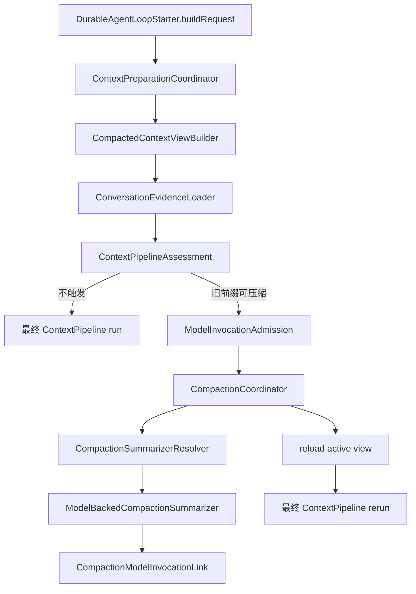

# RoboThree ARH-2.2 Production Automatic Compaction Orchestration Development Plan

## 1. 文档状态

```text
状态：PASS/CLOSED
提出日期：2026-08-12
修订日期：2026-08-12
父计划：ARH-2 Automatic Compaction Orchestration Development Plan Revision 1
前置批次：ARH-2.0、ARH-2.1 PASS/CLOSED
后续批次：ARH-2.3 GATED
关联基线：ADR-010 ACCEPTED、ADR-017 Implementation Gate PASS/CLOSED、ARH-1 PASS/CLOSED
```

本文件细化并记录 ARH-2.2 的生产接线、授权、摘要调用身份和恢复语义。Revision 1 已通过
复核并由用户明确授权编码；实现、开发者自测、Claude Code 独立 QA 和用户接受均已完成，
ARH-2.2 正式 `PASS/CLOSED`。ARH-2.3 与 ARH-3 继续 `GATED`。

## 2. 阶段目标

ARH-2.2 将 ARH-2.1 已完成的原子分组、source range、Compacted Context View 和
`CompactionExecutionBinding` 接入 `DurableAgentLoopStarter` 的唯一 `buildRequest()` 路径：

```text
读取 active Summary + raw tail
→ 生成 provisional Context assessment
→ 超过 80% 触发线且存在旧完整前缀
→ 对精确摘要外发范围执行 ModelInvocationAdmission
→ 原子创建或恢复同一 CompactionJob + ExecutionBinding
→ 使用当前 Task 锁定 Model 生成并严格验证 Summary
→ 提交 CompactionRecord / reload active view
→ 使用 Summary + raw tail 从头重新预算一次
→ 交付最终 Provider-neutral ModelRequest
```

一轮最多创建一个新 CompactionJob，不递归压缩，不静默换 Model/Binding/Relay，不把
Summary 当作授权、Tool 执行或 Task 事实。

## 3. 当前代码事实

### 3.1 ARH-2.1 已具备

- `ConversationAtomicGroupPlanner` 与 `CompactionSourceRangePlanner`；
- `CompactedContextViewBuilder` 与 raw-tail `TurnSnapshotBuilder`；
- `compaction_summary` 低权限 Context segment 与 receipt evidence；
- base Summary + raw extension 的 `CompactionSummarizationInput`；
- Core SQLite migration 18 `compaction_execution_bindings`；
- Job 与 ExecutionBinding 第一事务原子写入；
- InMemory/SQLite 同语义、digest 自校验及 close/reopen 恢复。

### 3.2 ARH-2.2 必须关闭的缺口

1. `DurableAgentLoopStarter.buildRequest()` 仍加载完整历史并直接调用 `ContextPipeline.run()`；
2. 生产路径没有 provisional assessment、自动 eligibility 和单轮 compact/reload/rerun；
3. `CompactionCoordinator` 构造时持有单一 summarizer，恢复时只检查 Binding 存在，尚未按
   Binding 精确重建 Model Provider Handle；
4. `ConversationPersistence` 只能按 batchId 读取 Tool Call Batch，不能按 Session/range 有界
   装载全部 durable batch evidence；
5. `ModelContextProvenanceClassifier` 尚未解析 `compaction_summary` 的原始来源类别；
6. 既有 `model_invocation_links` 专属于最终 Assistant Message，且唯一键为
   `(taskId, runId, round)`；摘要调用直接复用会与同轮主调用冲突，并错误要求
   `messageCommittedAt`；
7. 超预算、summary failure、confirmation pending、output unrecoverable 尚未在 Task 路径中
   使用稳定、安全的 typed outcome 收敛。

## 4. 冻结责任边界



| 组件 | 唯一职责 |
| --- | --- |
| `ContextPreparationCoordinator` | 一轮 Context 准备的唯一编排者；assessment、eligibility、admission、compact/recover、reload、final rerun |
| `ContextPipelineAssessment` | Core 私有、无 I/O 的预算与 reduction 诊断结果；不产生 Provider 调用或持久事实 |
| `ConversationEvidenceLoader` | 按 Session 与 sequence range 有界加载 Message、Batch、Disposition、active Summary provenance |
| `CompactionCoordinator` | 保留 Job/Record/CAS/Receipt 双事务；按 job 加载 Binding，并委托 resolver 获取精确 summarizer |
| `CompactionSummarizerResolver` | 从不可变 ExecutionBinding 与锁定 Registry generation 重建 Model Provider Handle；漂移失败关闭 |
| `ModelBackedCompactionSummarizer` | 构造平台摘要请求、消费并验证 Model stream、输出有界 `CompactionSummary` |
| `CompactionModelInvocationLink` | 持久摘要调用的逻辑 ID、request digest、Central invocation/cursor 与 summary committed 事实；不表示 Assistant Message |
| `DurableAgentLoopStarter` | 提供 Task/Run/Step/Action、runtime locks、AbortSignal；消费最终 request/receipt，不内联 compaction 规则 |

Kernel reducer、Desktop、Central、Document Worker 和公共 Contracts 不知道上述私有组件。

## 5. Context assessment 与一次性触发

### 5.1 私有 assessment API

在不改变公共 Contract 的前提下，为 `ContextPipeline` 增加纯 Core 内部 assessment 入口，复用
现有 Assembler、Estimator、BudgetPolicy 和 Reducer，返回：

```text
initialEstimatedInputTokens
afterBoundedPreviewTokens
finalEstimatedInputTokens
availableInputTokens
compactionThresholdTokens
reducedSegmentIds / reductionKinds
eligibleConversationGroupIds
requestCandidate / receiptCandidate
```

禁止在 `ContextPreparationCoordinator` 复制一套 token 估算或 reduction 算法。assessment 不
写数据库，不调用 Model，不改变 Session/Task。

### 5.2 决策表

| 条件 | 行为 |
| --- | --- |
| initial ≤ 80% 触发线 | 直接使用正式 pipeline 结果 |
| initial > 80%，仅 Tool/Knowledge/Workspace bounded preview 生效 | 不做 durable compaction，使用有界结果 |
| initial > 80%，存在旧完整 conversation 前缀 | 本轮允许尝试一次 durable compaction |
| initial > 80%，无旧前缀但 final ≤ available input | 继续调用，receipt 标记 not applicable |
| final > available input，最新原子组自身过大 | `context.current_turn_too_large` |
| final > available input，static/tool schema 过大 | `context.static_context_too_large` |
| 完成一次 compaction 后仍 > available input | `context.available_input_exceeded` |

压缩后即使仍高于 80% 触发线，只要不超过硬上限，也必须继续本轮，禁止第二次 compaction。

### 5.3 一轮唯一性

- `ContextPreparationCoordinator.prepare()` 每 round 只调用一次；
- per-session mailbox 只减少竞争；数据库 one-pending-job、Job/Binding identity 与 CAS 是最终
  正确性来源；
- 先查该 Session 的 pending Job：存在时恢复同一 Job，不创建新 Job；
- stale 时只 reload active view 并 final rerun 一次；
- admission 后、第一事务前崩溃可以没有 Job；重试可重新 admission，但不得发生 Provider 调用。

### 5.4 Core 私有 ContextPreparationReceipt

`ContextPreparationCoordinator.prepare()` 必须返回 Core 私有、JSON-safe 的决策 Receipt，供
本轮诊断与 ARH-2.3 Harness 比对。它不进入公共 Contract、Desktop Event、Audit 或
ConversationMessage，也不记录 Prompt/正文。最小字段：

```text
decision = not_required | skipped | compacted | pending_recovered | stale_reloaded | failed
reason = below_threshold
       | bounded_preview_only
       | no_eligible_old_prefix
       | current_turn_too_large
       | static_context_too_large
       | compacted_still_over_budget
       | admission_pending
       | admission_rejected
       | compaction_failed
initial / previewed / final token counts
threshold / available-input token counts
source-range digest（若已选择）
compactionJobId / compactionId（若已有 durable fact）
```

`static_context_too_large`、`current_turn_too_large` 与 `compacted_still_over_budget` 属于
`decision=failed`，不是成功跳过；`bounded_preview_only` 与 `no_eligible_old_prefix` 属于
`decision=skipped`。不得用自由文本 reason，避免日志和 QA 语义漂移。

## 6. Durable Tool/Conversation evidence

ARH-2.2 为 Core 私有 `ConversationPersistence` 增加有界查询，例如：

```text
listToolCallBatchesBySessionRange(sessionId, startSequence, endSequence)
```

具体命名可在编码时遵循现有 style，但必须满足：

- InMemory/SQLite 运行同一 Conformance；
- 只返回目标 Session/range 的 batch 与 disposition evidence；
- 排序稳定，不能做无界全库扫描；
- orphan result、缺 batch、identity 漂移、非终态 confirmation 均失败关闭；
- 不把 Tool 参数、Result 正文、Confirmation 正文复制进新表；
- assessment 与 source range 必须消费同一 `ConversationAtomicGroupPlanner` 结果。

## 7. Compaction provenance 与授权

### 7.1 原始来源分类

新增 Core 私有 `CompactionProvenanceResolver`。它根据 CompactionRecord 的 immutable source
range 重新读取原始消息，校验 source digest，并使用既有七类 `ModelExternalDataCategory` 推导
类别。禁止新增 `memory_content` 或新的公共 category。

`compaction_summary` 不自行声明来源权限；最终主调用中的 Summary 继承经验证的原始来源
类别。摘要正文、Prompt、Tool Result 正文不得进入 receipt、log 或 audit。

Alpha 对历史 assistant 内容保持失败关闭：只有它具备与当前 exact external target、runtime
selection 和 Model revision 兼容的 durable provenance 时，才可作为向同一目标的历史重传证据；
来自其他 Model/Relay 或无法证明 provenance 的 assistant 内容返回既有
`model.external_scope_unclassifiable`，不得省略、改标为 `user_text` 或静默扩大类别。若产品要求
跨模型自动压缩，必须另行评审公共 data category/derived provenance Contract，不在 ARH-2.2
顺手实现。

“相同 Model/Relay”不是名称、协议或 `upstreamModelId` 相同，而是以下精确 tuple 全部一致：

```text
externalTargetDigest
runtimeSelectionDigest
modelCapabilityId + exact revision/digest
bindingId + exact revision/digest
adapterDescriptorId + exact revision/digest
registry generation/revision
```

Core 私有 `AssistantMessageProvenance` 必须补齐并校验该 tuple。任一 revision/digest 不同，即使
展示名称、Provider protocol、Model ID 或 Relay Host 相同，也按 incompatible/missing
provenance 失败关闭，不允许 semantic identity 替代精确锁。

### 7.2 摘要 admission

顺序固定为：

```text
确定完整 source range 与 source digest
→ 推导原始 data categories
→ 生成 purpose-bound dataScopeDigest
→ ModelInvocationAdmission
→ 用户确认完成后的 live disabled/revoked/credential/health recheck
→ Job + Binding 第一事务
→ Provider call
```

`dataScopeDigest` 的私有 canonical material 至少包含：

```text
purpose = compaction_summary
taskId / runId / round
sourceStart / sourceEnd / sourceDigest
baseCompactionId / baseSummaryDigest（如有）
runtimeSelectionDigest
model/binding/adapter revisions
registry generation
summarizerPromptRevision
externalTargetDigest
```

加入 `purpose` 是为了防止“主回答已确认”被静默当作“摘要外发已确认”。用户未确认时零 Job、
零 Provider；用户拒绝时沿既有授权拒绝路径收敛。

## 8. 精确摘要执行与 Provider stream

### 8.1 Resolver

`CompactionCoordinator` 不再构造时固定持有一个 summarizer。每次新建或恢复 pending Job 时：

1. 加载 `CompactionExecutionBinding`；
2. 校验 binding digest、Task runtime selection、Model lock、Adapter descriptor 与 Registry
   generation；
3. 通过 `RuntimeAdapterHandleRegistry` 重建精确 Model Provider Handle；
4. 任一 revision/handle 缺失或 live 状态收窄时失败关闭，不更换目标；
5. 使用同一个 `CompactionSummarizerResolver` 构建 Model-backed summarizer。

### 8.2 平台摘要请求

- 使用当前 Task 已锁定的实际 Model；
- `tools=[]`，不得允许摘要模型调用 Tool；
- 平台摘要 Prompt 使用固定 SHA-256 revision；
- base Summary 与 raw extension 作为低权限 data，不能拼成 system instruction；
- `modelRequestId` 从 `compactionJobId + promptRevision` 稳定派生；
- logical `clientRequestId` 从 `compactionJobId` 稳定派生；网络 transport requestId 每次尝试
  新建；
- request digest 不包含 Credential、Endpoint 或 Token；
- max output、UTF-8 bytes、estimated token 均有界。

### 8.3 Stream 验证

摘要流必须先经过 ARH-1 `ModelStreamSequenceValidator`，并额外满足：

- exactly one started、exactly one terminal；
- 只接受非空 `text_delta`、单调 usage 和正常 completed；
- 任意 `tool_call`、failed terminal、自然结束无 terminal、空白最终文本均失败关闭；
- 只在完整流验证通过后构建 Summary；部分文本不得提交；
- `estimatedTokensAfter < estimatedTokensBefore`，否则 `summary_invalid`；
- Summary schema/revision/modelRef/promptRevision 必须与 Binding 一致。

## 9. 摘要调用的独立 durable identity

### 9.1 为什么不能复用主调用 Link

现有 `model_invocation_links` 服务于最终 Assistant Message，包含：

- `UNIQUE(task_id, run_id, round)`；
- `assistant_message_id` 与 `message_committed_at`；
- 主回答的 completed Message replay 语义。

摘要与主回答发生在同一 round，却不创建 Assistant Message。强行复用会发生唯一键冲突，或
伪造 `messageCommitted`。因此 ARH-2.2 必须新增 Core 私有、用途专属的持久链接。

### 9.2 migration 19

本方案拟冻结使用下一连续 Core SQLite migration 19：`compaction_model_invocation_links`。最小事实：

```text
compactionJobId PRIMARY KEY
clientRequestId UNIQUE
modelRequestId UNIQUE
modelRequestDigest
executionBindingDigest
confirmationId / scopeDigest / dataScopeDigest
centralInvocationId / statusRevision / durableCursor
acceptedAt / outputStartedAt / summaryCommittedAt
recordDigest / createdAt / updatedAt
```

约束：

- 与 migration 18、既有 migration 1～18 forward-only；不改写旧 migration；
- 不含 Prompt、Summary 正文、输出 delta、Endpoint、Credential、Token、Runtime Handle；
- InMemory/SQLite 同一 Conformance；
- same Job + same digest 幂等，same ID + different digest conflict；
- `summaryCommittedAt` 与 CompactionRecord、Job、Event、Receipt、Outbox 在第二事务中原子
  提交；若旧结果已提交而调用方丢失响应，恢复只做幂等 replay；
- 链接表与 Conversation SQLite 同库，不引入跨 SQLite 原子事务；
- 不修改公共 Model Gateway Contract 或 Central Schema。

若评审提出无需该私有 Link，必须同时给出不与主调用唯一键/Message commit 语义冲突、且能
在重启后保持 stable clientRequestId 的可验证替代方案，否则不得删除。

## 10. 恢复、失败与 Task 收敛

### 10.1 Provider 恢复

| 事实 | 恢复行为 |
| --- | --- |
| Job/Binding 已提交，尚未 accept | 使用同一 logical clientRequestId 重试 accept |
| Central 已 accept，尚未输出 | status-first，同 invocation/cursor 恢复 |
| 输出已开始但完整 stream 不可恢复 | 不提交部分 Summary；Job `failed/recovery_exhausted`，不自动创建新调用 |
| Summary 已完整取得、Record 未提交且进程仍持有完整 buffer | 同 Job 在有界重试内重新验证并提交 |
| Summary 已完整取得但第二事务前进程崩溃 | 仅当 Provider 可重放完整输出时恢复；否则 `recovery_exhausted`，不得自动新建调用 |
| Record 已提交、响应丢失 | Receipt replay，并记录 summaryCommittedAt，不重复 Record/Event/Outbox |

不增加 Compaction 公共状态。可恢复 transport error 保持 pending 并由当前恢复流程接管；
确定性 schema/stream failure 使用 `summary_invalid` 或 `summary_generation_failed`；完整输出
不可恢复使用已有 `recovery_exhausted`，不宣称 exactly-once。

### 10.2 Task outcome

| 条件 | Task 行为 |
| --- | --- |
| admission pending | 复用 `waiting_user_confirmation`，不失败 Task |
| user rejected | 复用安全授权拒绝语义；零 Provider/Job |
| Provider 可查询恢复中 | 复用 `external_dependency` waiting，不伪造失败 |
| deterministic summary invalid / recovery exhausted | 失败关闭，保留原始历史和 Job 事实 |
| stale | 不失败 Task；reload + final rerun 一次 |
| AbortSignal / Task cancel | 不提交 Summary；Job 幂等终止，Task 不复活 |

新增 Core 私有 `ContextPreparationError` 映射稳定 code、retryable 和 safe summary。不得把原始
异常消息、Prompt、消息正文、Tool Schema 或完整路径直接投影给 Desktop。

## 11. 生产接线顺序

`DurableAgentLoopStarter.buildRequest(round)` 固定执行：

1. 读取当前 Task execution、exact runtime selection、Model lock、Agent/Tool locks；
2. 读取 Session head、active CompactedContextView 与 durable Tool Batch evidence；
3. 以 Summary + raw tail 构建 snapshot，并 provisional assess；
4. 不触发时生成最终 request/receipt；
5. 触发时先查 pending Job，再进行 exact admission 或恢复；
6. 完成/stale 后 reload view、重新加载消息/evidence；
7. 从头只 rerun 一次 pipeline；
8. 保存本轮最终 receipt/messages/provenance，供现有 `buildInvocation()` 做主调用 admission；
9. 主调用逻辑、Assistant Message commit 和 Tool Loop 保持既有路径。

禁止：

- Summary 与完整旧前缀双重注入；
- 直接把 Summary 放进 system instruction；
- 在 `AgentLoopCoordinator`、Renderer、Kernel reducer 中加入 compaction if/else；
- background 静默压缩所有 Session；
- 为摘要调用创建伪 Assistant Message、Task Step、Effect 或 Tool Receipt。

## 12. 修改范围

允许修改：

```text
services/core/src/application/**
services/core/src/ports/**
services/core/src/persistence/**
services/core/src/adapters/memory/**
services/core/src/adapters/sqlite/**
services/core/tests/**
services/core/package.json
package.json（仅新增 ARH-2.2 harness 脚本时）
docs/development/arh/**
docs/development/DEVELOPMENT-LOG.md
docs/architecture/KEY-NODES.md
docs/architecture/UPSTREAM-ADOPTION-REGISTER.md
README.md
CHANGELOG.md
```

禁止修改：

```text
packages/contracts/**
services/core/src/kernel/**
apps/desktop/**
services/central-service/**
services/document-worker/**
现有 SQLite migration 1～18
pnpm-lock.yaml 与依赖
```

若实现确实需要公共 Contract、Central Schema、Desktop UI 或新依赖，立即停止并重新 GATE。

## 13. 实施顺序

### Step 1：Assessment 与 Evidence

- Context private assessment；
- Session/range Tool Batch evidence query；
- Compaction provenance resolver；
- N-1/N/N+1、open batch、Summary + raw tail 单元矩阵。

### Step 2：Exact Summarizer 与 Link

- migration 19 + InMemory/SQLite conformance；
- resolver 按 ExecutionBinding 重建 Handle；
- platform summary request、stable IDs、ARH-1 stream validation；
- admission、live recheck、非法输出与 output-unrecoverable 测试。

### Step 3：Production Coordinator Integration

- `ContextPreparationCoordinator`；
- `DurableAgentLoopStarter` 唯一 buildRequest 接线；
- pending/stale/cancel/failure typed convergence；
- focused production E2E 与完整回归。

三步属于同一 ARH-2.2 批次，不拆成新的用户门槛；任一步失败都不能宣称 ARH-2.2 完成。

## 14. QA 验收矩阵

### 14.1 Budget 与原子边界

1. 80% threshold N-1/N/N+1；
2. available input N-1/N/N+1；
3. bounded Tool preview 不误触 durable compaction；
4. 无旧前缀、未超硬预算可继续；
5. current turn/static/compacted-still-too-large 三种 typed error；
6. 一 round 最多一个新 Job，压缩后不递归；
7. Tool Call/Result、多 Tool、waiting confirmation 与因果用户轮次不拆分；
8. orphan/identity drift/缺 disposition 失败关闭；
9. Session/range evidence query 有界、排序稳定、双 Adapter 一致。

### 14.2 Summary 与 provenance

10. active Summary + raw tail 无双注入；
11. Summary 不进入 system、ConversationMessage、Task、Effect 或 Receipt 正文；
12. compaction provenance 由原始 range 重建并校验 source digest；
13. summary admission scope 含 purpose，不能复用不等价主调用确认；同目标 assistant
    provenance 可验证，跨 Model/Relay 或 provenance 缺失时 fail-closed；
14. 用户确认前零 Job/Provider，拒绝后零 Job/Provider；
15. live disabled/revoked/credential/health 只收窄；
16. exact Task Model/Binding/Adapter/Registry generation，重启不漂移；
17. prompt revision、request ID、clientRequestId 和 digest 重复十次稳定。

### 14.3 Provider 与 durable Link

18. migration 19 fresh、migration 18 upgrade、close/reopen；
19. InMemory/SQLite same-digest replay / different-digest conflict；
20. 摘要 Link 与主回答 Link 可在同一 round 共存，不碰 `(task,run,round)` 主唯一键；
21. Summary committed 不伪造 Assistant `messageCommittedAt`，并与 Record/Job/Event/Receipt/
    Outbox 在第二事务原子提交；
22. started/text/usage/completed 合法流；
23. tool_call、blank delta/final、duplicate started/terminal、usage regression 全拒绝；
24. 部分文本、failed terminal、自然结束不能提交 Summary；
25. before≥after、schema drift、prompt/model ref drift 返回 summary_invalid；
26. Provider credential/endpoint/token/output delta 不入 SQLite/log/receipt/audit。

### 14.4 Recovery 与 Task convergence

27. admission 后第一事务前崩溃：零 Job、零外发；
28. 第一事务后崩溃：恢复同一 Job/Binding/clientRequestId；
29. accept 前重试、accept 后 output 前 status-first；
30. output started 且不可恢复：无部分 Summary、无自动新调用；
31. Summary obtained/commit 前重放不改变 Job/Binding；
32. commit 后响应丢失 Receipt replay，不重复 Record/Event/Outbox；
33. stale reload 一次且不创建第二 Job；
34. cancel/timeout/late callback 不提交 Summary、不复活 Task；
35. admission pending 进入 waiting_user_confirmation；
36. recoverable external dependency 使用 waiting，不伪造 terminal failure；
37. 三种安全 Context error 不泄漏正文并给出可操作建议。

### 14.5 Architecture 与回归

38. Kernel reducer 无修改且保持纯函数；
39. Contracts/Desktop/Central/Document Worker 零修改；
40. 现有 migration 1～18 字节不变；
41. 不新增依赖或 lockfile 变化；
42. ARH-1 stream conformance、ARH-2.1 harness、KAF-5、DCF-2、ADR-017 回归；
43. 完整 Workspace、Central online/offline、Core/Desktop/Preload smoke PASS；
44. 独立 QA 真实重跑，不以 digest 或历史报告替代；
45. ARH-2.3 Recovery Harness 未超前实现。
46. `ContextPreparationReceipt` 对 below-threshold、bounded-preview-only、no-old-prefix、三类
    hard failure、pending/rejected、compacted/stale 分支给出稳定枚举 reason，且零正文泄漏；
47. 历史 assistant 的 Model/Binding/Adapter/Registry 任一 exact revision 或 digest 漂移均
    fail-closed；仅名称、协议、upstreamModelId 或 Relay Host 相同不能视为兼容 provenance。

## 15. 完成门槛

ARH-2.2 只有同时满足以下条件才可提交独立 QA：

- 47 项验收范围全部有代码或测试证据；
- focused `harness:arh2.2` PASS；
- 完整 Workspace 与 Central online/offline PASS；
- P0/P1=0；
- 文档、版本、CHANGELOG、Development Log、KEY-NODE 与 adoption register 同步；
- ARH-2.3 仍保持 GATED。

独立 QA PASS 后仍需用户接受才能关闭 ARH-2.2，不自动进入 ARH-2.3。

## 16. 非目标

- ARH-2.3 的七窗口完整 restart/并发/50-round closure Harness；
- ARH-3 Prompt Cache、token accounting 与 retry dedupe；
- 长期 Memory、Knowledge/RAG、Skill Runtime；
- 新 Model Provider、智能路由、自动 fallback；
- Desktop/Admin Compaction 页面；
- background Session maintenance、自动 GC；
- Tool 并行、Subagent、多 Agent；
- 修改企业网关协议、Central 数据库或真实 Provider 资源门槛。

## 17. 工作量

| 内容 | 集中工程工作量 |
| --- | --- |
| Assessment、Evidence、Provenance | 1～2 个工程工作日 |
| migration 19、Summarizer Resolver、Provider Link | 2～3 个工程工作日 |
| Production 接线、typed convergence、专项回归 | 2～3 个工程工作日 |
| 合计 | **5～8 个工程工作日** |

这比父计划原 3～5 日增加，原因是当前代码事实证明摘要调用不能安全复用主 Assistant
invocation link。估算不含独立 QA、返工和真实 Provider 资源等待；ARH-2.2 正式门禁不依赖
付费外网 Provider。

## 18. 文档评审问题

请 Claude Code 与 MiniMax 只做文档/代码事实评审，不编码，并按 P0/P1/P2/P3 回答：

1. 当前七项生产缺口是否与代码一致；
2. private assessment 是否避免复制预算/reduction 算法；
3. Session/range Tool Batch evidence query 是否足够有界；
4. `compaction_summary` provenance 重新从 immutable source range 推导是否正确；
5. purpose-bound admission 是否避免主调用确认被静默复用；
6. `CompactionCoordinator` 改为按 Binding resolve summarizer 是否关闭重启漂移；
7. 独立 `compaction_model_invocation_links` migration 19 是否必要、最小且不与主调用冲突；
8. stable logical ID + new transport requestId 的生命周期是否正确；
9. output-started-but-unrecoverable 的 fail-closed 语义是否合理；
10. Task waiting/failure/stale/cancel 收敛是否与既有 reducer 不变量一致；
11. 47 项 QA、5～8 个工程工作日是否可执行；
12. 是否出现需用户重新决策的 P0/P1，或公共 Contract/Central/Desktop 范围扩张。

评审通过后由 Codex 5.6 修订/收口，再提交用户确认。不得自动进入编码。

## 19. Revision 1 修订映射

| 首轮问题 | 等级 | 修订结论 | 状态 |
| --- | --- | --- | --- |
| skipped 分支缺少稳定诊断原因 | P2 | 新增 Core 私有 `ContextPreparationReceipt`，区分 not_required/skipped/compacted/pending/stale/failed，并以固定枚举记录 bounded preview、no old prefix 与三类 hard failure | CLOSED |
| “相同 Model/Relay”精度不清 | P3 | 冻结 external target、runtime selection、Model/Binding/Adapter/Registry 的 exact revision/digest tuple；任一漂移均 fail-closed | CLOSED |

Revision 1 已由用户接受并授权编码；以下实现结果不改变后续门禁：ARH-2.2 必须经过独立 QA
及用户接受才能关闭，ARH-2.3 与 ARH-3 不自动解锁。

## 20. 实施结果

```text
版本：0.0.0-arh.2.2
状态：PASS/CLOSED
```

- `ContextPreparationCoordinator` 已成为生产 Agent Loop 每轮 Context 准备的唯一入口，复用
  `ContextPipeline.assess()` 执行 bounded preview、阈值判断、一次性 compact/reload/rerun，
  并返回不含正文的稳定 Receipt；
- Session/range Tool Call Batch evidence、immutable source range provenance、历史 assistant
  exact Model/Binding/Adapter/Registry tuple 与 active Summary 原始类别继承均已接入；
- `ModelInvocationAdmission` 的摘要 scope 固定绑定 `purpose=compaction_summary`，用户确认前
  不创建 Job；恢复按 ARH-2.1 ExecutionBinding 重建精确 Model Provider；
- Core migration 19 新增私有 `compaction_model_invocation_links`，与主 Assistant link 分离，
  stable logical ID、status-first cursor、output-started 与 summary committed 第二事务原子事实
  已完成 InMemory/SQLite 同语义；
- `ModelBackedCompactionSummarizer` 复用 ARH-1 stream validator，强制 `tools=[]`、有界输出、
  完整 terminal 与实际 token reduction，部分输出和不可恢复输出不提交；
- 公共 Contracts、Kernel reducer、Desktop、Central、Document Worker、依赖和 lockfile 均未修改；
  ARH-2.3 七窗口完整恢复 Harness 与 ARH-3 仍未实现。

开发者验证：

```text
Node v24.13.0 / pnpm 11.11.0
CI=true pnpm run harness:arh2.2 → PASS
CI=true pnpm run check → PASS
CI=true pnpm run check:central → BUILD SUCCESS
CI=true pnpm run check:central:offline → BUILD SUCCESS
```

Claude Code 已独立串行复跑 ARH-2.2 Harness 9 files / 47 tests、完整 Workspace
156 files / 1067 tests + 3 smoke 及 Central online/offline，结论
`PASS（P0=0 / P1=0 / P2=0 / P3=0）`；用户已于 2026-08-13 正式接受并关闭 ARH-2.2。
ARH-2.3、ARH-3 不因本批关闭自动解锁。
