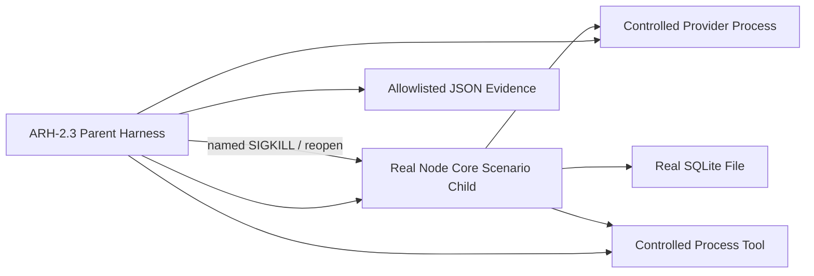

# RoboThree ARH-2.3 Recovery Closure Harness Development Plan

## 1. 文档状态

```text
状态：ARH-2.3 PASS/CLOSED；ARH-2 PASS/CLOSED
提出日期：2026-08-13
架构基线：ADR-010 ACCEPTED、ADR-017 IMPLEMENTATION GATE CLOSED
前置批次：ARH-1、ARH-2.0、ARH-2.1、ARH-2.2 PASS/CLOSED
ARH-2.3：repair.1 独立 QA P0～P3=0，用户正式接受并关闭
ARH-3：GATED
```

本批只关闭 ARH-2 的恢复与长循环证据，不增加新的产品功能、公共 Contract、Task 状态、
Compaction 状态或 Provider 能力。独立 QA 必须实际运行 Harness；源码摘要、digest 或历史报告
只能用于结果比对，不能替代执行。

## 2. 阶段目标

使用真实 `DurableAgentLoopStarter`、生产 `ContextPreparationCoordinator`、
`CompactionCoordinator`、`ModelBackedCompactionSummarizer`、Tool Call Batch/Effect 链、
InMemory/SQLite Adapter 和真实 Node 子进程，证明：

```text
长 Conversation / Tool loop
→ 自动判断并执行首次 Compaction
→ Summary + raw tail 继续 Agent Loop
→ 新增完整旧前缀后执行 rolling Compaction
→ 任一命名崩溃窗口重启恢复或明确失败关闭
→ 不重复 Tool 副作用、不重复 Summary、不中断原子边界
→ 最终完成或进入已有 typed terminal/waiting 状态
```

ARH-2.3 结束后只能证明自动 Context Compaction 的 Foundation 恢复闭环，不代表长期 Memory、
Prompt Cache、精确 token 计费、跨 Session 摘要或生产 SLA 已实现。

## 3. 当前代码事实

### 3.1 可以直接复用

1. ARH-2.1 已完成共享 `ConversationAtomicGroupPlanner`、首次/rolling source planner、
   active Summary + raw tail view 和 immutable `CompactionExecutionBinding`；
2. ARH-2.2 已完成生产自动触发、purpose-bound admission、Model-backed summarizer、专用
   compaction invocation link、status-first Provider 恢复和第二事务原子提交；
3. SQLite 已具有命名故障点：`request_compaction.after_job_before_binding`、
   `request_compaction.after_commit`、`commit_compaction.after_commit`；Coordinator 已具有
   `compaction.summary_obtained_before_commit`；
4. ADR17-I3 已完成 Tool Call/Result、Effect、取消、Retry、确认和 SQLite 并发恢复矩阵；
5. KAF-5.3、DCF-2C 已具有等待确认、Headless/Desktop restart、durable cursor 和安全报告经验；
6. ARH-1 已保证非法或不完整 Model stream 不能制造 completed Message 或 Summary。

### 3.2 本批必须补齐的证据

1. 七个窗口尚未由同一生产自动 Compaction 链和真实进程重启逐个覆盖；
2. 既有首次与 rolling Compaction 分散在组件测试中，尚未由真实 Agent Loop 连续完成；
3. 既有 50-round 测试只证明 `AgentLoopCoordinator` 有界，未同时覆盖 durable Tool Batch、
   自动压缩、SQLite reopen 和资源归零；
4. Tool/Compaction 两类 `waiting_user_confirmation` 尚未在长循环和 Context source-range
   选择中联合验证；
5. 重启前后 Summary、raw tail、source range 和 Context source digest 尚未形成统一证据报告。

## 4. 冻结范围与非目标

### 4.1 允许修改

```text
services/core/src/application/**
services/core/src/ports/**                 # 仅内部测试观测/故障注入接缝，禁止公共 Contract
services/core/tests/**
tests/e2e/**
scripts/run-arh2.3-harness.mjs
scripts/check-boundaries.mjs              # 只增加阶段护栏
services/core/package.json                # 编码时升 0.0.0-arh.2.3
package.json                              # 只增加 harness:arh2.3
docs/development/arh/**
docs/development/DEVELOPMENT-LOG.md
docs/architecture/KEY-NODES.md
docs/architecture/UPSTREAM-ADOPTION-REGISTER.md
README.md
CHANGELOG.md
```

如果实现需要修改公共 Contracts、Central Schema、Desktop IPC、Kernel reducer 或新增 SQLite
migration，必须停止编码并重新评审，不得以“测试需要”为由扩大范围。

### 4.2 明确不实现

- ARH-3 的 token accounting、retry usage dedupe、Prompt Cache、跨 Session 隔离报告；
- 新 Model Provider、真实厂商网络调用、Provider 自动 fallback 或智能路由；
- 长期 Memory、Knowledge retrieval、Skill Reader；
- 并行 Tool Call、Subagent、Inbox 或新消息总线；
- Desktop/Admin 新页面或用户可见 Compaction 状态；
- 新 Task/Run/Step、Effect、Receipt、Outbox 或 Compaction 公共状态；
- 精确 token 计费、跨机器性能 SLA 或长时间稳定性平台。

## 5. Harness 拓扑与真实性标准



### 5.1 真实执行要求

- 七个崩溃窗口必须由真实 Node 子进程运行生产 Application 路径；需要模拟进程死亡的窗口由
  Parent 在命名 barrier 到达后执行 `SIGKILL`，不得只用 `throw` 冒充所有崩溃；
- SQLite 窗口必须关闭旧进程、由新 PID 重新打开同一数据库文件；
- Provider 与 Tool 使用独立受控进程，确保 Core crash 后外部执行事实仍存在；
- 受控 Provider 必须具有两种独立、可观测且可断言的故障模式：
  `accepted_without_output` 在逻辑请求已接受后阻塞且不发送 `started/text_delta/terminal`；
  `output_started_unreplayable` 在请求已接受后进入 output-started，并能分别制造“仅部分输出”与
  “完整 Summary 已交付给 Core、但 Provider 状态接口无法重放完整输出”两种子场景；
- Provider 控制面必须能按 stable logical identity 报告 accepted、output-started、terminal 与
  replayability，不得依赖 Core 内存或墙钟推断；W3 使用 accepted/no-output 与 partial-output
  子场景，W4 使用 full-output-delivered-but-unreplayable 子场景；
- InMemory 仅用于相同状态/幂等 Conformance，不得代替 SQLite restart 证据；
- 不要求真实外网或付费 Provider，避免资源可用性污染 Foundation QA；
- 测试 Hook 只能接受固定枚举并通过构造注入，默认生产装配不得启用，不得读取环境变量决定
  业务结果，不得进入公共 Contract、SQLite、Event、Receipt、Audit 或 Renderer。

### 5.2 内部故障注入接缝

允许新增或收敛一个 Core 私有 `CompactionRecoveryFaultInjector`，覆盖七个固定 barrier。它只能：

```text
observe(fixedFaultPoint)
```

禁止 Hook 读取或返回 Prompt、Conversation、Summary、Tool 参数、结果、Credential、Endpoint、
Runtime Handle。Harness 进程可在收到固定 barrier ID 后终止 Core 子进程；生产代码不得包含
`process.exit()`、测试环境变量分支或诊断后门。

## 6. 七个命名崩溃窗口

### 6.1 固定窗口、恢复分类与断言

| ID | 窗口 | 崩溃前允许存在的持久事实 | 重启恢复分类 | 必须断言 | 禁止行为 |
| --- | --- | --- | --- | --- | --- |
| W1 | admission 通过后、第一事务前 | 可存在精确 Confirmation 决定；无 Job/Binding/invocation link | 重新进入 preparation，复用等价授权事实 | Job=0、Provider accept=0；重启后只创建一个 Job | 先外发、伪造 Job、重复确认 |
| W2 | 第一事务提交后、摘要分发前 | 一个 pending Job + 同事务 Binding/Event/Receipt/Outbox；无 invocation | `recoverSessionPending` 使用同一 Job/Binding | Job ID、Model/Binding/Adapter/Registry digest 不变；一个 logical clientRequestId | 新 Job、换模型/Relay、重复 source range |
| W3 | 摘要请求已接受、完整结果前 | invocation link 含同一 logical identity、invocationId、status/cursor；可能尚未 output-started | status-first；未开始输出可按同一 invocation 续接；已开始但不能完整重放则 `recovery_exhausted` | 不重复 logical accept；transport attempt 可更新但 logical IDs 不变；部分输出零 Summary | 盲目新建调用、提交部分 Summary |
| W4 | 完整 Summary 已取得、第二事务前 | Job 仍 pending，link 已 output-started；Summary 只在已死亡进程内存中 | Alpha 保守失败关闭为 `recovery_exhausted`，除非受控 Provider 能证明完整可重放；默认门禁验证失败关闭 | 原始消息不变、active view 不变、Record=0、Job 明确 failed | 猜测 Summary、从 partial delta 拼接、静默再调用 |
| W5 | 第二事务提交后、调用方收到响应前 | Record/Job/Head/Session Event/Receipt/Outbox/summaryCommitted 已原子提交 | 从 active view/Receipt replay 收敛 | 恰好一个 Record、一次 contextRevision 前进、一个 logical Summary；不再调用摘要 Provider | 回滚已提交事实、重复 Record/Event/Outbox |
| W6 | active view 被并发推进、旧结果延迟提交 | 新 active Compaction 已获胜；旧 Job/结果基于旧 base revision | 旧 Job `stale`，reload winner view | activeCompactionId/contextRevision 不倒退；旧结果不覆盖；不创建第二恢复 Job | last-writer-wins 覆盖、静默回退 |
| W7 | Summary committed、最终主 Model invocation 前 | active Summary、raw tail 和 preparation receipt 已完成；主 invocation link 尚不存在 | 重启重新 build Context，再进入主调用 | sourceRangeDigest、summaryDigest、contextSourceDigest 和最终 Model 语义稳定；一个主 Assistant commit | 重做 Summary、重复原始前缀、要求 requestId 跨进程相同 |

### 6.2 W3/W4 的保守边界

RoboThree 不宣称通用 exactly-once，也不在本批新增 Provider 输出恢复协议。`requestId` 是单次
传输尝试，可以变化；`compactionJobId`、`modelRequestId`、`clientRequestId`、Binding digest
是逻辑身份，必须稳定。若 `outputStartedAt` 已存在而完整输出不可查询/重放，恢复必须明确
`recovery_exhausted`。该结果是安全关闭，不是 Harness 失败。

### 6.3 W7 digest 语义

W7 不要求新进程生成相同的临时 `requestId` 或 transport requestId。必须稳定的是：

```text
Compaction source range/digest
Summary digest/context revision
raw-tail range/digest
Context source digest
Model/Binding/Adapter/Registry exact lock tuple
Provider-neutral semantic payload（排除新尝试 ID）
```

## 7. 首次与 Rolling Compaction 闭环

### 7.1 首次 Compaction

1. 构造至少两个已闭合旧原子组和一个最新 raw group；
2. 预算跨过 80% 触发线，但仍存在可压缩旧前缀；
3. source range 固定为 `1..E1`，最新组保持 raw；
4. Summary 调用只收到原始 `1..E1`，产生 Record 1；
5. reload 后 Model Request 只含 Summary 1 + `E1+1..head` raw tail，不重复注入 `1..E1`。

### 7.2 Rolling Compaction

1. 在 Record 1 后追加多个完整原子组，使预算再次跨阈值；
2. Job 2 固定 `baseActiveCompactionId=Record1`，完整证明范围仍为 `1..E2`；
3. 摘要 Provider 只收到 `base Summary 1 + raw extension E1+1..E2`，不得重新发送原始
   `1..E1`；
4. Record 2 的 source digest 继续由不可变原始 `1..E2` 计算；
5. active view 原子前进至 Record 2，Record 1 保持不可变，ConversationMessage 仍 append-only；
6. SQLite close/reopen 10 次后，active Record、Summary digest、raw-tail digest 与
   contextSourceDigest 稳定一致。

## 8. 50-round Durable Tool Loop

### 8.1 固定场景

使用真实 `DurableAgentLoopStarter`、SQLite、受控 Model/Process Tool 执行：

```text
1 个初始 User Message
→ 50 个连续 Model Tool Call round
→ 50 个严格串行 Tool Effect/Observation/Tool Result
→ 第 51 个 Model round 返回最终 Assistant 文本
```

预算设置必须在循环中实际触发至少一次首次 Compaction 和至少一次 rolling Compaction，不能
使用预先写入的 Record 冒充自动触发。

### 8.2 必须证明

- 51 次主 Model round、50 次 Tool 调用、50 个匹配 Result，ordinal 和 identity 一一对应；
- 每个 Tool Call Batch、disposition、Effect、Observation、Result 保持 ADR-017 原子边界；
- 同一 Model round 最多一个新 CompactionJob，preparation 最大并发深度为 1，不通过递归调用
  `buildRequest()` 或 `prepare()` 实现滚动压缩；
- 每次压缩仅删除旧闭合组，当前开放组、最新用户轮次和 waiting confirmation 组始终留 raw；
- 结束时 pending CompactionJob、pending Tool Batch、active Effect、timer、subscription、
  child process、open response、未清理 AbortController 均为 0；
- 同一 semantic seed 完整执行至少 3 次，durable timeline digest、最终 active view digest 和
  计数一致；semantic seed 只固定 Conversation/Model/Tool 脚本、业务身份、故障窗口与决策序列，
  不固定进程 PID、临时端口、wall-clock、requestId/transportRequestId 或操作系统调度顺序；
- timeline digest 只消费规范化 durable semantic facts，不得包含时间戳、进程调度次序或其他
  ephemeral transport facts；
- 对运行时间只设宽松灾难退化门槛，不宣称 SLA。

## 9. `waiting_user_confirmation` 重启恢复

### 9.1 Compaction Summary 外发确认

当 `purpose=compaction_summary` 需要用户确认：

```text
admission pending
→ Task waiting_user_confirmation
→ Core 子进程退出
→ SQLite reopen
→ 恢复同一 Confirmation scope
→ allow：创建一个 Job 并继续
→ reject：零 Job、零 Provider 调用，Task 按既有拒绝语义收敛
```

主 Model 调用的确认不得静默授权 Summary；Summary 确认也不得扩张为后续不同 source range。

### 9.2 Tool Action 确认与 Compaction 边界

在 50-round 的中间 round 设置一个高风险 Tool Action：

- 确认未决定时，因果用户轮次、Assistant Tool Call Batch 和所有非终态 disposition 保持同一
  open atomic group；
- Core close/reopen 后恢复同一 Tool Action、confirmationId、scope digest 和顺序；
- allow 后恰好一次执行并产生 Result；reject 后零 Effect/Backend 调用；
- open group 在 durable terminal disposition 前不得进入首次或 rolling source range。

## 10. 并发、幂等与资源模型

1. 两个恢复者竞争同一 pending Job 时，只允许一个 active Record 和一次 contextRevision 前进；
2. Provider 侧以相同 `clientRequestId + digest` 收敛为同一 logical invocation；不得将两个网络
   尝试误报为两个业务调用；
3. 相同恢复命令/commit digest 幂等 replay，不同 digest conflict；
4. stale Job 不创建第二 Job，不替换 winner view；
5. cancel/timeout/late Summary 不复活 terminal Task；
6. 每个场景结束时 Parent 必须确认 Core/Provider/Tool 子进程全部退出、loopback 端口关闭、
   SQLite handle 关闭、临时目录可删除；
7. Harness 只记录 `count/digest/status/duration/resource metrics/typed error code`。

## 11. 机器可读证据与泄漏扫描

Harness 最终只允许输出：

```text
schemaVersion
status
scenarioCount
scenarioDigest
windowResults[{windowId,status,recoveryClass,durationMs}]
counters
resourceMetrics
typedErrorCodes
durationMs
```

不得输出消息、Prompt、Summary、Tool 参数/结果、Workspace 路径、Endpoint、Credential、Token、
Runtime Handle 或 PID。PID 仅在测试进程内用于存活断言，不写报告。

四通道动态扫描固定覆盖：

1. Core/Provider/Tool 子进程捕获的 stdout；
2. Core/Provider/Tool 子进程捕获的 stderr；
3. 最终 allowlisted JSON 报告；
4. Session Event/Receipt/Outbox、Task Audit 和 typed error 的安全序列化投影。

ConversationMessage、CompactionRecord Summary 和 Tool Result 是业务持久正文，不以“正文不得存储”
为目标；但它们不得被复制进上述诊断、审计或报告通道。每次运行生成唯一 canary，扫描结果必须
为 0。

## 12. 实施步骤

### Step 1：Executable Matrix 与测试接缝

- 建立稳定 `ARH23-W1..W7` 场景清单和文件存在性 guard；
- 建立受控 Provider 的 `accepted_without_output` 与 `output_started_unreplayable` 模式；后者必须
  同时支持 partial-output 与 full-output-delivered-but-unreplayable，以真实触发 W3/W4；
- 冻结 semantic seed 与 canonical durable timeline digest 规则，明确排除墙钟、PID、端口、
  transport attempt 和调度时序；
- 补齐固定 fault barrier 与 test-only observation probe；
- 不改变未注入时的生产行为；
- 先验证 InMemory/SQLite transaction 与 CAS Conformance。

### Step 2：真实进程恢复 Harness

- 建立 Parent/Core child/Provider/Tool 受控进程；
- 七窗口逐一执行真实 crash/reopen；
- 首次/rolling、两恢复者竞争和 digest 稳定矩阵；
- Summary output-unrecoverable 明确验证安全失败关闭。

### Step 3：50-round 与阶段关闭

- 真实 Durable Tool loop、两次以上自动压缩和确认重启；
- 资源归零、四通道泄漏扫描、3 次固定 seed 重放；
- 回归 KAF-5、DCF-2、ADR17-I1/I2/I3、ARH-1、ARH-2.1/2.2；
- 完整 Workspace、Central online/offline；
- 更新版本、日志和 QA 指令，等待独立 QA。

以上三步属于同一 ARH-2.3 编码批次，不增加新的用户门槛。任何一步发现需要公共 Contract、
新 migration 或 ARH-3 能力时停止并重新评审。

## 13. QA 验收矩阵（52 项）

### 13.1 七窗口（1～16）

1. W1 真实 child crash 后 Job/Provider 均为 0；
2. W1 重启复用同一有效授权，只创建一个 Job；
3. W2 重启恢复同一 Job；
4. W2 exact ExecutionBinding tuple 不漂移；
5. W3 accept 后、output 前以 status-first 恢复；
6. W3 logical clientRequestId/modelRequestId 不变；
7. W3 新 transport requestId 不改变逻辑身份；
8. W3 output-started 不可完整恢复时进入 `recovery_exhausted`；
9. W4 完整 Summary 只在死亡进程内存时不提交 Record；
10. W4 原始 Conversation 与 active view 不变；
11. W5 丢失响应后恰好一个 Record/Event/Receipt/Outbox；
12. W5 reload 不重复摘要调用；
13. W6 延迟旧结果收敛 stale，winner view 不变；
14. W6 contextRevision 不回退；
15. W7 重启前后 source/summary/raw-tail/context digest 稳定；
16. W7 主 Assistant Message 只提交一次。

### 13.2 首次、Rolling 与原子性（17～28）

17. 首次 source range 只含旧完整前缀；
18. 首次 active view 为 Summary 1 + raw tail 且不重复原文；
19. rolling Job 精确引用 Record 1；
20. rolling 输入仅为 base Summary + raw extension；
21. Record 2 仍证明原始 `1..E2`；
22. Record 1 与原始 Message 保持不可变；
23. active view 只前进一次；
24. SQLite reopen 10 次 digest 一致；
25. 单 Tool Call/Result 不拆分；
26. multi-tool/乱序结果不拆分；
27. waiting confirmation/open disposition 留在 raw tail；
28. orphan、identity drift、缺 evidence 失败关闭。

### 13.3 50-round 与确认（29～40）

29. 51 个 Model round 与 50 个 Tool 调用完整结束；
30. 50 个 Tool Result 与调用 identity 一一匹配；
31. Tool 顺序严格串行；
32. 实际触发首次及至少一次 rolling Compaction；
33. 每 round 新 Job 数不超过 1；
34. preparation/compaction 最大嵌套深度为 1；
35. 结束后 pending Job/Batch/Effect 为 0；
36. Tool confirmation close/reopen 后恢复同一 Action；
37. Tool allow 恰好一次执行；
38. Tool reject 零 Effect/Backend；
39. Summary admission pending 在重启前零 Job；
40. Summary allow/reject 分别收敛为单 Job/零 Job。

### 13.4 并发、安全与回归（41～50）

41. 两恢复者竞争只有一个 active Record；
42. 相同 digest replay、不同 digest conflict；
43. cancel/timeout/late Summary 不复活 terminal Task；
44. 三次固定 semantic seed 的 timeline/view digest 与计数一致，且不比较墙钟或进程调度时序；
45. child/port/SQLite/timer/subscription/response/AbortController 资源归零；
46. 四通道唯一 canary 扫描为 0；
47. 报告字段严格 allowlist，不含 PID、正文、路径或凭据；
48. Kernel reducer、公共 Contracts、Desktop、Central Schema、migration 1～19 不改写；
49. KAF-5、DCF-2、ADR17-I1/I2/I3、ARH-1、ARH-2.1/2.2 与完整 Workspace 回归；
50. Central online/offline 串行通过，且 ARH-3 token accounting/retry dedupe/prompt cache 零超前。

### 13.5 Revision 1 补充（51～52）

51. 受控 Provider 分别真实制造 accepted/no-output 与 output-started/unreplayable；W3/W4 必须依据
    Provider 状态与 durable `outputStartedAt` 进入不同恢复分支，不得由 Harness 直接伪造分类；
52. semantic seed 重放允许 PID、端口、requestId、transportRequestId、wall-clock 与线程/进程
    调度不同，但规范化 durable timeline/view digest 与业务计数必须一致。

## 14. 验证命令与独立 QA 纪律

计划新增：

```text
CI=true pnpm run harness:arh2.3
CI=true pnpm run check
CI=true pnpm run check:central
CI=true pnpm run check:central:offline
```

独立 QA 必须：

- 实际串行重跑全部命令；
- 真实执行七窗口和 50-round，不以 manifest/digest/源码标题代替场景运行；
- 对每个窗口检查预期 recovery class，而非只判断 Harness 总体 exit code；
- 使用新生成的临时数据库和 canary，不复用开发者证据目录；
- 如 loopback 被沙箱禁止，应在受控允许 loopback 的环境重跑并如实记录；
- 报告 P0/P1/P2/P3，用户接受前不得关闭 ARH-2.3 或 ARH-2。

## 15. 预计工作量

| 工作 | 集中工程工作量 |
| --- | ---: |
| 七窗口 fault barrier、process runner 与状态断言 | 2～3 个工程工作日 |
| 首次/rolling、确认恢复、并发/digest matrix | 1～2 个工程工作日 |
| 50-round、资源/泄漏、回归与文档收口 | 2～3 个工程工作日 |
| 合计 | 5～8 个工程工作日 |

该估算不含独立 QA、返工和人工等待，不等于日历交付承诺。真实外网 Provider 不属于门槛。

## 16. Revision 1 修订映射

| 评审项 | 修订 | 状态 |
| --- | --- | --- |
| P2-1 | §5.1、Step 1、QA 51 明确受控 Provider 的 accepted/no-output 与 output-started/unreplayable 两种模式，并以 partial/full-delivered 子场景真实触发 W3/W4 | CLOSED / RE-REVIEW PASS |
| P3-1 | §8.2、Step 1、QA 44/52 将“同一 seed”冻结为 semantic script seed，明确排除 wall-clock、PID、端口、传输 ID 与调度时序 | CLOSED / RE-REVIEW PASS |

Revision 1 未改变七窗口恢复语义、公共 Contract、SQLite schema、产品范围或工期；QA 从 50 项增至
52 项。Claude Code 复核 `P0～P3=0`，用户已明确授权 ARH-2.3 编码。

## 17. 文档评审问题

请 Claude Code 只做文档与当前代码事实评审，不执行编码，并按 P0/P1/P2/P3 回答：

1. 七个窗口的持久事实、恢复分类、断言和禁止行为是否与 ARH-2.2 当前实现一致；
2. W3/W4 的 `outputStartedAt → recovery_exhausted` 保守语义是否正确，是否存在伪 exactly-once；
3. W5/W7 是否清楚地区分第二事务提交、响应丢失和主 Model 尚未调用；
4. 真实子进程/SIGKILL/SQLite reopen 标准是否足以证明 crash recovery；
5. 首次 + rolling 的 base Summary/raw extension/full immutable range 是否完整；
6. 50-round 是否真正使用 DurableAgentLoopStarter、Tool Batch/Effect 与自动 Compaction；
7. 两类 `waiting_user_confirmation` 是否均覆盖且不扩大确认 scope；
8. Tool Call/Result 原子边界在长循环、重启、rolling 下是否仍由同一 Planner 证明；
9. digest 稳定范围是否正确排除了可变 requestId/transportRequestId；
10. 资源归零、四通道泄漏和机器报告 allowlist 是否足够可执行；
11. 52 项 QA 与 5～8 个工程工作日是否合理；
12. 是否与 ADR-010、ADR-017、KAF-5、DCF-2、ARH-1/2.1/2.2 冲突或提前实现 ARH-3；
13. 是否出现需要用户重新决策的 P0/P1 或必须新增 Contract/migration 的缺口。

## 18. 实施与开发者自测结果

ARH-2.3 已按 Revision 1 完成实现。生产链只补齐 Core 私有故障观察接缝、closed Tool cycle 原子
分组和摘要恢复的精确状态分类；未新增公共 Contract、Kernel 状态、数据库 migration、Desktop
接口或 ARH-3 能力。

关键结果：

- 七个命名窗口 W1～W7 通过真实 Core child、受控 Provider、SQLite close/reopen 与命名
  `SIGKILL` 场景验证；W3 使用 status-first 恢复，W4 明确收敛为 `recovery_exhausted`；
- 同一 50-round 场景已通过真实 `DurableAgentLoopStarter`、Process Model/Tool、durable Effect/
  Tool Batch 运行，完成 51 个主 Model round、50 次串行 Tool 调用以及首次和 rolling Compaction；
- 实现过程发现并修复 `ModelBackedCompactionSummarizer` 的内部 `invocationCommit` 被误投影进
  strict `CompactionRecord` 的生产缺陷；内部提交材料现与持久 Summary Record 明确分离；
- 52 项场景、三次 semantic seed、资源归零和四通道 canary 扫描均通过。

开发者串行验证：

```text
CI=true pnpm run harness:arh2.3
→ PASS：17 files / 115 tests；52/52 scenarios；W1～W7 PASS；sensitive match 0

CI=true pnpm run check
→ PASS：160 files / 1087 tests + 3 smoke

CI=true pnpm run check:central
→ BUILD SUCCESS：215 tests / 0 failures / 0 errors / 0 skipped

CI=true pnpm run check:central:offline
→ BUILD SUCCESS：215 tests / 0 failures / 0 errors / 0 skipped
```

独立 QA 必须重新串行执行全部门禁；上述 digest 和开发者报告只能用于比较，不能替代实际执行。
用户接受独立 QA 前，ARH-2.3 不得关闭；ARH-3 继续 `GATED`。

### 18.1 `0.0.0-arh.2.3-repair.1` Harness 稳定性修复

独立 QA 确认生产功能通过，但完整 Workspace 门禁在 W6 两个 fresh recovery owner 并发场景中
出现 1 次 flaky。进一步诊断证明“固定 10 秒过紧”不是完整根因：

1. 两个子进程曾在并发执行 `PRAGMA journal_mode=WAL` 时让其中一个立即以
   `database is locked` 退出，而旧 helper 未监听提前退出，将其延迟误报为 timeout；
2. 两个测试 Owner 曾复用同一确定性 ID 序列，造成双方同时产生
   `persistence.session_command_idempotency_conflict`，不符合真实生产 UUID 不碰撞前提。

repair.1 只修复 W6 Harness：两个 Owner 分别完成 SQLite 启动并发出 ready 后才同时释放恢复；
每个 Owner 使用独立确定性 ID 序列；W6 recovery helper 为 30 秒、外层为 40 秒；helper 监听
子进程提前退出并立即报告真实 exit，不再伪装成 timeout。生产 Application、SQLite Adapter、
Contract 和恢复语义未修改。

```text
W6 专项连续复跑 10 次
→ PASS：10/10

CI=true pnpm run harness:arh2.3
→ PASS：17 files / 115 tests；52/52 scenarios

CI=true pnpm run check
→ PASS：160 files / 1087 tests + 3 smoke
```

Claude Code 已独立复跑 W6 10/10、ARH-2.3 52/52、Workspace 1087/1087 和 Central
online/offline，结论 `PASS（P0～P3=0）`；用户已正式接受并依次关闭 repair.1、ARH-2.3 与
ARH-2。ARH-3 继续 `GATED`，等待详细方案评审和用户明确授权。
