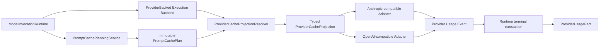

# RoboThree ARH-3.2.3 Provider Cache Projection Closure Development Plan

## 1. 文档状态

```text
状态：CONFIRMED REVISION 1 / PASS/CLOSED
日期：2026-08-14
前置：ARH-3.2.1、ARH-3.2.2 PASS/CLOSED
ARH-3.2.3：PASS/CLOSED
ARH-3.3：GATED
```

本文件冻结 ARH-3.2.3 的实施边界和验收标准。Revision 1 已通过差异复核并由用户明确授权；
`0.0.0-arh.3.2.3` 已按本方案完成实现、开发者门禁、独立 QA 与用户接受并正式关闭，未修改公共
Contract、数据库 Schema、migration 或依赖。ARH-3.2 整体已正式关闭，ARH-3.3 继续 `GATED`。

## 2. 阶段目标

ARH-3.2.1 已建立 Enterprise Gateway `v1alpha2 cacheContext` 与 exact Session scope，ARH-3.2.2
已建立不可变 Prompt Cache Plan、Profile、四层缓存身份和 C3～C7 恢复。ARH-3.2.3 只完成最后一段：

```text
immutable PromptCachePlan
→ exact Profile / Binding / static prefix 重新校验
→ typed provider projection
→ Anthropic/OpenAI-compatible request body
→ Provider stream / Usage
→ ARH-3.1 durable ProviderUsageFact
```

阶段结果是“RoboThree 能按已审核、已持久、可恢复的 Plan 向 Provider 投影缓存提示，并如实记录
Provider 返回的 cache Usage”。它不等于自建缓存平台，也不保证 Provider 实际命中、节省费用、
retention 或物理隔离 SLA。

## 3. 当前代码事实与精确缺口

### 3.1 已有事实

1. `PromptCachePlanningService` 已在 Provider dispatch 前持久化不可变 `PromptCachePlan`；
2. `ModelInvocationExecution.Request` 已携带 Core-private `PromptCacheExecutionContext`；
3. recovery/takeover 会加载同一 Plan，保持稳定 plan/key identity；
4. `ProviderBackedModelInvocationExecutionBackend` 已是 Central Provider 调用的统一真实入口；
5. Anthropic-compatible Adapter 已解析 `cache_read_input_tokens` 与
   `cache_creation_input_tokens`；
6. OpenAI-compatible Adapter 已解析 `prompt_tokens_details.cached_tokens`；
7. `ProviderResultCollector` 已把可选 cache-read/cache-write breakdown 投影到 Runtime Result；
8. ARH-3.1 已将 winner/superseded attempt、fencing、Usage digest 与 terminal 事务绑定；
9. `StaticPromptPrefixProjector` 已按 leading system sources 与 allowed Tool schema 计算
   `staticSourceLockDigest/staticPrefixDigest`；
10. ARH-3.2.2 已验证 v1alpha1 no-cache、C3～C7、双 JVM与四层身份。

### 3.2 剩余缺口

1. Backend 构造 `ModelProviderRequest` 时没有消费 `PromptCacheExecutionContext`；
2. 两个 Provider Adapter 当前均不发送 `cache_control` 或 `prompt_cache_key`；
3. 内部 Execution Context 尚不足以独立重算完整 Plan digest，也没有在投影点显式复核 exact
   Binding/Profile；
4. 已持久 Plan 的 `staticPrefixDigest` 尚未与**最终 wire static material**在调用前再次比对；
5. `StaticPromptPrefixProjector` 对 Tool 做稳定排序，但当前 Adapter 使用原输入顺序，cache-enabled
   wire prefix 与 canonical prefix 仍缺一条明确的同源证明；
6. `markerPolicyRevision` 已存在于 versioned Profile，但尚无 typed projection policy consumer；
7. automatic-observed、explicit marker、explicit key 与 disabled 的 request-body 差异尚无统一
   Conformance；
8. Usage parser 已有字段，但尚未证明“启用 cache projection → Provider Usage → durable
   ProviderUsageFact”完整闭环；
9. C8～C10 尚未在 cache-enabled Provider 路径验证；
10. 没有进程外 Controlled Provider 对 request body、重试、取消、deadline、泄漏和资源回收做阶段
    关闭证明。

## 4. 冻结不变量

1. **Plan 是唯一投影授权事实**：Adapter 不自行判断是否启用缓存，不从 Endpoint、协议名、正文
   或 Provider 响应反推 Plan；
2. **Projection 不是命中事实**：`eligible=true` 只允许发送字段；cache hit/write 只能来自 Provider
   Usage；
3. **Runtime 是 durable terminal 唯一提交者**：Backend/Adapter 只返回 typed Result/Usage，不直接
   写 Repository；
4. **disabled 路径字节和 shape 不变**：v1alpha1、无 Plan、skipped Plan、automatic-observed 都不应
   因 ARH-3.2.3 被重排或新增 cache 字段；
5. **exact recovery**：重试与 takeover 必须复用同一 Plan、Profile revision、Binding revision、
   static prefix digest 和 cache key；只允许 transport request identity/fencing owner 变化；
6. **Static Prefix Monotonicity 在 wire 前复核**：同 source/execution/Profile identity 出现不同
   canonical prefix 时失败关闭，不发送请求；
7. **dynamic 永不标记**：用户/Assistant 消息、Tool Result、Compaction Summary、Knowledge、
   Workspace preview 不得带 cache marker；
8. **协议能力不继承**：direct Provider、custom Relay、Anthropic-compatible、OpenAI-compatible
   分别由 exact Profile 明示；同协议名不代表同缓存能力；
9. **Unknown 不伪造 0**：Provider 未返回 cache Usage 时保持 unknown；不估算 hit、节省 Token 或费用；
10. **失败不降级重试**：cache 字段被 Provider 确定拒绝时进入 typed deterministic failure，不静默
    删除字段再调用一次；
11. **不宣称通用 exactly-once**：恢复继续遵循既有 RecoveryMode/status-first/fencing；
12. **不增加公共状态**：不新增 Task、Invocation、Effect 或 cache 状态；
13. **不扩大个人模型范围**：`local_personal` 只回归既有 Port/Fake/Conformance；
14. **不保存缓存正文**：Plan、日志、Evidence、Usage Fact 不保存 Prompt、Provider body 或 cache
    contents；
15. **不静默启用**：延续 ARH-3.2.2 的默认关闭规则，只有 exact、active、已审核 Profile 才能
    生成 eligible Plan；本批不改变 Profile Seed、默认启用状态或业务开关；
16. **Foundation 不等于生产上线**：受控 Provider 证明协议、恢复与安全闭环；真实 Provider/Relay
    上线仍需单独的资源授权、真实兼容验证和生产集成门禁。

## 5. 所有权与调用链



### 5.1 Application 层

负责：

- 读取同一 invocation 的 immutable Plan；
- 解析 exact Profile revision/digest；
- 对照当前锁定 Binding revision/digest；
- 从 transient canonical provider-neutral request 重建 canonical static material；
- 复核 source lock、static prefix、compatibility 与 plan digest；
- 生成只读、穷尽的 typed projection。

### 5.2 Backend

负责：

- 在调用 Adapter 前请求 Projection Resolver；
- 把 typed projection 放入 Core-private `ModelProviderRequest`；
- 保持 cancel/deadline/uncertain/deterministic failure 的既有映射；
- 不访问 Prompt Cache Repository，不提交 Usage/terminal。

### 5.3 Provider Adapter

负责：

- 验证 projection mode 与自身协议一致；
- 只把 typed projection 翻译为本协议字段；
- 保持 provider-neutral semantic content 等价；
- 解析 Provider 明确返回的 Usage；
- 不生成 Plan、不解析权限、不访问数据库、不重试无-cache 请求。

## 6. Core-private 类型与接缝

### 6.1 完整 execution evidence

允许对 Central-private `PromptCacheExecutionContext` 做最小补全，使它能携带并自校验投影所需的
immutable Plan facts：

```text
planDigest
cacheContextDigest
cacheScopeIdDigest
staticSourceLockDigest
staticPrefixDigest
compatibilityFingerprintDigest
cacheKeyDigest?
cachePolicyRevision
bindingRevision / bindingDigest
profileId / profileRevision / profileDigest
providerProjectionMode
eligible / skipReason?
```

这些字段不进入 Enterprise Gateway Schema、公共 `ModelRequest`、Desktop Contract 或日志。
Context 必须能重算 `planDigest`；缺字段、digest 不符或 eligibility/skipReason 矛盾均在网络调用前
失败关闭。

### 6.2 typed projection

建议建立 Central-private 穷尽类型：

```text
ProviderCacheProjection
├── Disabled(reason)
├── AnthropicExplicit(markerPolicy, retentionPolicy)
├── OpenAiAutomaticObserved
└── OpenAiPromptCacheKey(opaqueKey, maxBytes)
```

禁止万能 `Map<String,Object>`、Provider 原始 JSON 或自由字段进入 Application/Runtime。只有 Adapter
可以构造最终 wire JSON。

### 6.3 Versioned marker policy

`markerPolicyRevision` 必须解析到不可变内部 Policy。Alpha 首期冻结：

```text
anthropic_ephemeral_default_system_last_static_v1
anthropic_ephemeral_default_tool_last_static_v1
openai_prompt_cache_key_v1
openai_automatic_observed_v1
```

`Disabled` 是类型化 Projection 结果，不是 marker policy，因此不创建伪造的 `disabled_v1`
Policy revision。

Policy ID 只表达协议模式、marker 位置和不可变 revision，不把 `5m` 等 Provider 时间常量写进
名称。Anthropic 首期语义仍是“不发送显式 TTL，使用 Provider 当前默认 ephemeral TTL”；该语义、
官方依据版本和支持字段集合进入不可变 Policy 描述及 digest。Provider 将来调整默认 TTL 不会让
旧 ID 产生错误字面承诺；若 RoboThree 改变发送字段或成本/retention 行为，必须创建新 Policy
revision。现有 Profile 仍只持久其不可变 `markerPolicyRevision` digest，不新增可变策略名称或用户
可填写字段。

首期不发送 Anthropic `ttl: "1h"` 或 OpenAI `prompt_cache_retention`。它们属于新的成本/retention
行为，必须以后通过新 Profile/Policy revision、Fixture、官方协议核验和用户授权引入，不能在旧
Profile 上静默增加。

### 6.4 Resolver 失败关闭

以下情况不得调用 Provider：

- Plan/Execution Context digest 漂移；
- current locked Binding 与 Plan binding revision/digest 不一致；
- exact Profile 缺失、digest 不符或 recovery identity 不一致；
- ProjectionMode 与 Binding protocol 不匹配；
- marker policy 缺失或未审核；
- transient request 重建的 source lock/static prefix 与 Plan 不一致；
- explicit key 缺失、不是 64 字符小写 SHA-256 或超过 Profile 上限；
- eligible/skipped 语义矛盾；
- 新 provider-neutral 字段未被 Compatibility Classifier 分类。

## 7. Provider 协议投影

### 7.1 Anthropic-compatible

仅当 `eligible && mode=anthropic_explicit`：

1. disabled 路径继续使用现有 string system/body shape；
2. enabled 路径把已证明的 leading static system material 投影为受控 content blocks；
3. `system_last_static_v1` 只在最后一个 leading static system block 添加
   `cache_control: {"type":"ephemeral"}`；
4. `tool_last_static_v1` 只在 canonical 最后一个 allowed Tool definition 添加同一 marker；
5. marker 只能出现一次；若策略要求的目标不存在则失败关闭，不回退到另一个位置；
6. Tool 的 enabled wire 顺序必须消费与 `StaticPromptPrefixProjector` 相同的 canonical planner，
   不能再复制一套排序；
7. 用户/Assistant/Tool Result/Summary 等动态 message 永远没有 marker；
8. 不发送未经本批冻结的 TTL 字段；
9. Provider 返回的 `cache_creation_input_tokens` 与 `cache_read_input_tokens` 保持独立字段，不与
   ordinary input tokens 重复相加。

### 7.2 OpenAI-compatible

`openai_provider_automatic_observed`：

- request body 完全不新增 cache 字段；
- 只接受 Provider 明确返回的 `cached_tokens` 作为 cache-read 事实；
- 不生成 key，不把没有 Usage 当作 miss；
- Provider 是否缓存、何时命中及保留多久完全由 Provider 决定，RoboThree 不把
  automatic-observed 解释为“已主动启用”或“保证命中”。

`openai_prompt_cache_key`：

- 仅 exact direct/relay Profile 明确支持时发送；
- wire 值使用 64 字符 opaque `cacheKeyDigest`，不得含企业、用户、Session、Agent 或业务名称；
- 发送前执行 UTF-8 byte 上限校验；
- 不发送 `prompt_cache_retention`；
- Provider 确定拒绝该字段时返回 typed failed，不自动移除 key 再调用。

### 7.3 Direct Provider 与 custom Relay

- Profile 必须同时匹配 protocol、connection mode、route family、Binding capability revision；
- direct profile 不得用于 relay，relay profile 不得用于 direct；
- “OpenAI-compatible/Anthropic-compatible”只表示 wire family，不代表缓存字段被 Relay 支持；
- 未声明、未审核或兼容指纹未知时 cache disabled，模型正常调用；
- 已持久 eligible Plan 在 recovery 时若 exact retired Profile 仍可重建，允许精确恢复；不得创建新
  Plan，不静默换新 Profile。

## 8. Static Prefix 同源与语义等价

### 8.1 单一 planner

应把 canonical leading systems、canonical Tool definitions 与 digest 计算收敛到同一纯组件，供：

- ARH-3.2.2 Planner；
- ARH-3.2.3 Projection Resolver；
- Provider enabled request builder；
- Conformance/Harness

共同消费。禁止 Planner 排一遍 Tool、Adapter 再按另一顺序发送。

### 8.2 disabled 与 enabled 差异边界

- disabled/no-cache body 必须继续通过 byte/shape regression；
- enabled body 只允许出现协议必要的 block shape、一个 marker 或一个 opaque key；
- model、max tokens、Tool schema、system text、dynamic message、Tool 参数的 semantic digest 必须
  与 disabled request 等价；
- Provider cache metadata 不进入 provider-neutral semantic request digest，也不改变主 invocation
  idempotency；
- 同一 Plan 在 restart/takeover 后生成相同 cache projection digest。

## 9. Usage、终态与恢复

### 9.1 Usage Fact

- Anthropic：普通 input、cache read、cache creation/write 分开保存；
- OpenAI-compatible：cached tokens 是 input tokens 子集，不与 input 重复相加；
- missing 保持 `null/unknown`，不得落 0；
- cache projection mode、eligible 或 key 不能推导 Usage；
- winner 与 `superseded_confirmed` 继续按 attempt/fencing identity 分离；
- terminal winner 的 Usage Fact、Event、Outbox、terminal status 继续同一事务；
- 不新增成本、价格、节省 Token、账单或 cache hit rate 持久字段。

### 9.2 C8～C10

| 窗口 | 故障位置 | 必须结果 |
| --- | --- | --- |
| C8 | Provider accept 后、首 delta 前 | status-first；Plan/Profile/projection digest 不变，不盲目无-cache retry |
| C9 | Provider output started 后断线 | 沿用既有 RecoveryMode；不拼接未知输出、不换 key/Profile |
| C10a | Provider Usage 已收到、terminal transaction 前崩溃 | 未提交 Fact；恢复按 attempt/status evidence 收敛 |
| C10b | terminal/Usage transaction commit 后响应丢失 | 幂等 replay，不新增第二 winner Fact |
| C10c | stale owner 迟到 Usage | 只能形成 bounded superseded evidence，不覆盖 winner |

Plan 与 projection 都不是新的事务权威；不新增跨 PostgreSQL/Provider 原子事务，也不宣称
exactly-once。

## 10. Controlled Provider Harness

### 10.1 形态

使用独立进程的受控 Anthropic-compatible/OpenAI-compatible Provider：

- 数据面只接受固定 POST 路由和 bounded JSON body；
- 控制面只允许 Harness 设置命名场景；
- 记录 request-body **结构断言结果与 digest**，Evidence 不输出正文；
- 能返回 cache miss/read/write/unknown Usage；
- 能制造 accept-no-output、partial-output、disconnect、deterministic reject、cancel、deadline；
- 能验证重复调用次数、projection digest 和 transport attempt；
- 生命周期结束后 PID、端口、连接、subscriber、buffer、timer 全部归零。

### 10.2 真实 Provider

真实 OpenAI、Anthropic、DeepSeek 或企业 Relay 的 cache hit、retention、费用与 SLA 继续
`RESOURCE_GATED`，不作为 Foundation 关闭门槛。未经用户单独授权不得读取 Key 或发起付费网络
调用。受控 Provider + 官方协议 Fixture 是 ARH-3.2.3 的确定性验收事实源。ARH-3.2.3 关闭只表示
Foundation 能正确投影、恢复和记录事实，不得标记真实 Provider cache 为 production-ready；真实
上线必须另行执行 Provider/Relay 兼容、凭据、网络、retention 与泄漏验证。

## 11. 实施步骤

### Step 1：Projection foundation

- 补全 private execution evidence 自校验；
- 建立 `ProviderCacheProjectionResolver` 与穷尽 projection 类型；
- 建立 versioned marker policy registry；
- 收敛 static prefix canonical planner；
- 增加 Profile/Binding/protocol/drift fail-closed 测试；
- 尚不修改真实 Adapter body。

### Step 2：双协议 Adapter

- Anthropic system/tool explicit marker；
- OpenAI automatic-observed/explicit-key；
- disabled body byte/shape regression；
- direct/relay exact Profile 隔离；
- Usage parser 与 semantic equivalence 回归。

### Step 3：Runtime/Recovery closure

- Provider-backed Runtime 全链；
- C8～C10；
- cancel/deadline/deterministic reject；
- restart/takeover 同 Plan/projection；
- 受控双协议进程 Harness；
- 四通道泄漏、资源归零、完整门禁与独立 QA。

ARH-3.2.3 作为一个授权批次实施，不再拆出隐藏子阶段；任一步发现公共 Contract 或数据库持久事实
缺失时必须停止，回到文档决策，不能顺手扩张。

## 12. QA 验收矩阵（至少 41 项）

### 12.1 Projection integrity（10 项）

1. private execution context 可重算 plan digest；
2. missing/unknown/digest drift 失败关闭且 Provider count=0；
3. Plan Binding revision/digest 与 current locked Binding 精确匹配；
4. exact Profile revision/digest/marker policy 精确恢复；
5. protocol/mode mismatch 失败关闭；
6. transient request source lock drift 失败关闭；
7. transient request static prefix drift 失败关闭；
8. explicit key 64 字符与 byte limit；
9. same Plan restart/takeover projection digest 稳定；
10. 新 provider-neutral 字段未分类时 cache disabled。

### 12.2 Anthropic-compatible（8 项）

11. disabled body byte/shape unchanged；
12. system-last-static 恰好一个 marker；
13. tool-last-static 恰好一个 marker；
14. policy target 缺失失败关闭，不 fallback；
15. dynamic user/assistant/tool-result/summary 无 marker；
16. canonical Tool 顺序与 static prefix planner 同源；
17. 未授权 TTL 字段零出现；
18. cache read/write/input Usage 分离且单调。

### 12.3 OpenAI-compatible（7 项）

19. automatic-observed body 无新字段；
20. explicit key exact route/profile 才发送；
21. direct/relay profile 不串用；
22. undeclared Relay 不发送 key；
23. `prompt_cache_retention` 零出现；
24. cached tokens 是 input 子集且不重复相加；
25. missing cached tokens 保持 unknown。

### 12.4 Runtime/recovery（8 项）

26. Provider-backed 全链生成 durable winner Usage Fact；
27. deterministic cache-field reject 不无-cache retry；
28. cancel 收敛为 cancelled；
29. deadline 收敛为 timed_out；
30. C8 status-first 复用同 Plan/projection；
31. C9 output-started 遵循 RecoveryMode；
32. C10 commit-response-loss 幂等 replay；
33. stale owner Usage 不覆盖 winner。

### 12.5 安全与回归（8 项）

34. 进程外受控双协议 request-body Conformance；
35. disabled/enabled semantic payload digest 等价；
36. 四通道 canary 泄漏 0；
37. connection/subscriber/buffer/timer/child resource 全归零；
38. ARH-3.1、3.2.1、3.2.2、v1alpha1、完整 Workspace、Central online/offline 全部回归，
    且无 ARH-3.3、真实个人模型、UI、真实付费 Provider 超前。
39. marker Policy ID 不包含 `5m`/`1h` 等时间常量，默认 ephemeral 语义由不可变描述与 digest
    精确锁定；
40. Profile 默认关闭不变，只有 exact active reviewed Profile 生成 eligible Plan，未审核配置不
    静默启用；
41. 无真实资源时 Provider 集成命令保持 `RESOURCE_GATED` 且零网络；Foundation Evidence 不得
    宣称真实 Provider hit、retention、费用、SLA 或 production-ready。

独立 QA 必须串行实际执行专项 Harness、完整 Workspace、Central online/offline；历史报告、开发者
digest 或代码阅读不能代替重跑。

## 13. Evidence 与泄漏边界

只允许：

```text
scenarioId / status / duration
protocol / connectionMode / projectionMode / markerPolicyRevision
eligible / skipReason / requestCount / deltaCount / usageFactCount
plan/projection/static/profile/binding/usage digest
cache-read/cache-write/input/output numeric breakdown
resource metrics / typed error code
```

禁止：Prompt、system text、用户/Assistant 正文、Tool schema/参数/Result、Summary、Knowledge、
Workspace 内容、完整 Provider body、Session/enterprise/user/device/client 原值、API Key、Credential、
Access Token、Endpoint、完整路径、PID、端口或 cache contents。

## 14. 公共边界、Schema 与版本

本批原则上：

- 不修改 Enterprise Gateway v1alpha1/v1alpha2 Schema、OpenAPI 与 canonical digest；
- 不修改公共 `ModelRequest`、Desktop Contract、Task/Run/Step/Effect/Receipt；
- 不新增 PostgreSQL v0010 或 Core SQLite migration 22；
- 不修改 v0008/v0009、Core migration 20/21；
- 不新增依赖，不引入 Provider SDK；
- 只允许 Central-private domain/port/application/adapter/test 变化；
- 若编码证明需要公共 Contract 或新 durable fact，ARH-3.2.3 必须暂停并重新评审。

## 15. 非目标与 PRD 依赖

本批不实现：

- Provider cache Admin UI、用户开关、费用报表、命中率页面；
- 自建 Prompt Cache、Redis、缓存正文或跨 Session 共享；
- 真实个人 Model Provider、个人 Credential Store 或本地 Usage 权威表；
- Anthropic 1h TTL、OpenAI retention、自动 rotation/GC/invalidation；
- 自动模型路由、fallback、Binding 切换或 Relay 能力猜测；
- 长期 Memory、Subagent、多 Agent、Tool 并行；
- ARH-3.3 Multi-Session Evidence Closure；
- 真实 Provider 的 cache hit、计费或 SLA 声明。

本批是运行时协议与恢复工程，不依赖 PRD/UX。若后续让用户配置缓存、查看命中率/费用或在 Admin
管理 Profile，必须先有 PRD 与 Feature Spec。

## 16. 上游依据与借鉴登记

- OpenAI Prompt Caching 官方指南：
  `https://developers.openai.com/api/docs/guides/prompt-caching`；
- Anthropic Prompt Caching 官方指南：
  `https://platform.claude.com/docs/en/build-with-claude/prompt-caching`；
- Codex 研究：只借鉴 exact Session cache identity、稳定 key 与 transport identity 分离；
- RoboThree 自有基线：复用 CGF-2 Provider Adapter、ARH-3.1 Usage Fact、ARH-3.2.1 sidecar、
  ARH-3.2.2 durable Plan 与 lease/fencing。

采用：

```text
DESIGN_ONLY
+ OWN_CACHE_CONTEXT
+ OWN_CACHE_PLANNER
+ OWN_PROVIDER_PROJECTION
+ OWN_USAGE_FACT
+ OWN_RECOVERY
+ OWN_CONFORMANCE
```

不复制第三方 SDK、源码、DTO、Fixture、SQL 或 Prompt。实际采用已登记为 `AR-061`。

## 17. 工期

| 工作项 | 集中工程工作量 |
| --- | --- |
| Projection foundation / static 同源 | 1～2 工程工作日 |
| 双协议 Adapter 与 Usage | 1～2 工程工作日 |
| Recovery Harness / 完整门禁 | 1～2 工程工作日 |
| 合计 | **3～6 工程工作日** |

相对父计划 3～5 天增加 1 天上限，原因是代码核验发现 static prefix canonical order 与当前 Adapter
wire order 尚未形成单一事实源。该估算不含文档评审、独立 QA、真实 Provider 资源等待和返工，
不是日历交付承诺。

## 18. 文档评审问题

请 Claude Code 与 MiniMax 按 P0/P1/P2/P3 评审：

1. 当前 10 项代码事实和缺口是否准确；
2. ARH-3.2.3 是否严格只补 Plan 消费与 Provider projection，不重建 Planner/Usage 权威；
3. private Execution Context 补全是否是自校验 Plan 的最小范围；
4. Resolver/Application/Backend/Adapter 所有权是否保持 Controller/Adapter 无业务决策；
5. typed projection 是否避免万能 Map 与 Provider JSON 泄漏到 Runtime；
6. marker policy 首期只支持 Anthropic Provider-default ephemeral、OpenAI key/automatic observed
   是否合理，Policy ID 与时间常量分离是否清晰；
7. 不发送 Anthropic 1h TTL/OpenAI retention 是否避免未经授权的成本行为；
8. static prefix planner 与 enabled wire builder 共用同一 canonical material 是否关闭顺序漂移；
9. Anthropic marker 位置与动态消息排除是否足够严格；
10. OpenAI explicit key、automatic observed、direct/relay 是否完全分离；
11. Usage unknown、不估算 hit/节省/费用是否与 ARH-3.1 一致；
12. deterministic reject 禁止静默 no-cache retry 是否正确；
13. C8～C10 是否保持既有 RecoveryMode、fencing 与 terminal 单写者；
14. Controlled Provider 是否足以作为 Foundation 关闭事实源，真实付费 Provider 保持
    `RESOURCE_GATED` 是否合理；
15. 41 项 QA、3～6 工程工作日是否可执行；
16. 是否出现公共 Contract、数据库 migration、P0/P1 或需要用户重新决策的范围。

## 19. 当前门禁

```text
ARH-3.2.1：PASS/CLOSED
ARH-3.2.2：PASS/CLOSED
ARH-3.2.3 detailed plan Revision 1：PASS/CLOSED
ARH-3.2.3 coding：PASS/CLOSED
ARH-3.3：GATED
```

Revision 1 已通过差异复核、实现、独立 QA 与用户接受；ARH-3.2.3 和 ARH-3.2 已正式关闭。
`CTR-P3-001` 作为独立测试可靠性维护项跟踪，不属于 ARH-3.3；ARH-3.3 不自动解锁。
