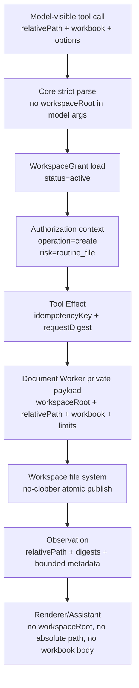

# DWE XLSX Write Development Plan

> Owner: Codex 5.6
> Status: DWE-0 -> DWE-3 PASS/CLOSED
> Date: 2026-08-05

## 1. Current Gate

```text
DTP-0 -> DTP-4: PASS/CLOSED

DWE-0: PASS/CLOSED
DWE-1: PASS/CLOSED
DWE-2: PASS/CLOSED
DWE-3: PASS/CLOSED

DWE overall: PASS/CLOSED

APV-0: PASS/CLOSED
APV-1.0: IMPLEMENTED / SELF-TEST PASS / INDEPENDENT QA PENDING
APV-1A / APV-1B / APV-1C / APV-2: GATED
```

DWE-0 was a contract and security freeze only. It did not implement production code,
did not register a new Tool, did not modify public Contracts, did not change
`pnpm-lock.yaml`, and did not enter Artifact Preview.

DWE-1 implements only the Document Worker private XLSX writer. It does not register
`tool.document.xlsx.write`, does not modify Core / Contracts / Desktop / Central,
does not change `pnpm-lock.yaml` or root `tsconfig.json`, and leaves DWE-2 / DWE-3 /
APV-0 / APV-1 gated.

The formal Tool ID for the future capability is:

```text
tool.document.xlsx.write
```

## 2. Scope Freeze

DWE P0 supports only creating a new `.xlsx` file inside an already authorized
Workspace.

Allowed:

- create a new `.xlsx` file under an active WorkspaceGrant;
- use existing public Contract values `routine_file` and ResourceAccess operation
  `create`;
- generate bounded workbook content with existing SheetJS `xlsx@0.20.3`;
- return bounded metadata only.

Forbidden in P0:

- overwrite, modify, delete, rename, append, patch, or bulk-write existing files;
- dynamic Risk Inspector;
- overwrite confirmation UI;
- `destructive_file`, `bulk_overwrite`, or file-system CAS behavior in runtime;
- DOCX parser rewrite;
- Artifact Preview implementation;
- public Contracts changes unless a hard blocker is reported first.

If target already exists, the result must be a typed `target_exists` failure.

## 3. Existing Facts

- `tool.document.xlsx.write` is implemented as create-only XLSX writer.
- Current Document Tools include three read tools and one create-only write tool:
  `tool.document.pdf.extract_text`, `tool.document.xlsx.read`,
  `tool.document.docx.read`, and `tool.document.xlsx.write`.
- `tool.document.docx.read` is implemented and was covered by DWE-3 Desktop E2E
  regression without rewriting the parser.
- `xlsx@0.20.3` is already a Document Worker production dependency and is the
  only approved writer dependency for DWE.
- Public Contracts already include ResourceAccess operation `create`.
- Public Contracts already include risk fact `destructive_file`, but DWE P0 does
  not use it because overwrite is out of scope.

## 4. Model-Visible Tool Schema Draft

DWE-2 will expose this schema to the model. DWE-1 must not register it.

```json
{
  "type": "object",
  "additionalProperties": false,
  "required": ["relativePath", "workbook"],
  "properties": {
    "relativePath": {
      "type": "string",
      "minLength": 1,
      "maxLength": 1024,
      "description": "Workspace-relative .xlsx target path. Absolute paths are rejected."
    },
    "workbook": {
      "$ref": "#/$defs/workbook"
    },
    "options": {
      "$ref": "#/$defs/options"
    }
  },
  "$defs": {
    "workbook": {
      "type": "object",
      "additionalProperties": false,
      "required": ["sheets"],
      "properties": {
        "sheets": {
          "type": "array",
          "minItems": 1,
          "maxItems": 32,
          "items": { "$ref": "#/$defs/sheet" }
        }
      }
    },
    "sheet": {
      "type": "object",
      "additionalProperties": false,
      "required": ["name", "rows"],
      "properties": {
        "name": {
          "type": "string",
          "minLength": 1,
          "maxLength": 31
        },
        "rows": {
          "type": "array",
          "maxItems": 10000,
          "items": { "$ref": "#/$defs/row" }
        }
      }
    },
    "row": {
      "type": "object",
      "additionalProperties": false,
      "required": ["rowNumber", "cells"],
      "properties": {
        "rowNumber": {
          "type": "integer",
          "minimum": 1,
          "maximum": 1048576
        },
        "cells": {
          "type": "array",
          "maxItems": 256,
          "items": { "$ref": "#/$defs/cell" }
        }
      }
    },
    "cell": {
      "type": "object",
      "additionalProperties": false,
      "required": ["column", "type", "value"],
      "properties": {
        "column": {
          "type": "string",
          "pattern": "^[A-Z]{1,3}$"
        },
        "type": {
          "enum": ["blank", "boolean", "number", "date", "string"]
        },
        "value": {
          "type": ["string", "number", "boolean", "null"]
        }
      }
    },
    "options": {
      "type": "object",
      "additionalProperties": false,
      "properties": {
        "dateSystem": {
          "enum": ["1900", "1904"]
        }
      }
    }
  }
}
```

Rules:

- formulas are not supported in P0;
- dates are ISO-8601 UTC strings and are written as date cells;
- sheet names must reject Excel-invalid characters `: \ / ? * [ ]`, control
  characters, leading/trailing apostrophe ambiguity, and duplicates after
  normalization;
- empty sheets are allowed;
- duplicate cell addresses are typed `duplicate_cell`;
- string cells whose first character is `=`, `+`, `-`, or `@` must still be
  emitted as plain text cells and must not become formulas;
- values must be JSON-safe and must not include `undefined`, `NaN`, `Infinity`,
  functions, binary data, or rich text objects.

## 5. Worker-Private Input Schema

Core owns authorization and dispatch. The Worker-private payload is never model
visible and never sent to Renderer.

```json
{
  "type": "object",
  "additionalProperties": false,
  "required": [
    "workspaceRoot",
    "relativePath",
    "workbook",
    "options",
    "limits",
    "idempotencyKey",
    "requestDigest"
  ],
  "properties": {
    "workspaceRoot": {
      "type": "string",
      "minLength": 1,
      "maxLength": 4096
    },
    "relativePath": {
      "type": "string",
      "minLength": 1,
      "maxLength": 1024
    },
    "workbook": {
      "$ref": "model-visible:#/$defs/workbook"
    },
    "options": {
      "$ref": "model-visible:#/$defs/options"
    },
    "limits": {
      "$ref": "#/$defs/limits"
    },
    "idempotencyKey": {
      "type": "string",
      "minLength": 1,
      "maxLength": 240
    },
    "requestDigest": {
      "type": "string",
      "pattern": "^[a-f0-9]{64}$"
    }
  },
  "$defs": {
    "limits": {
      "type": "object",
      "additionalProperties": false,
      "required": [
        "maxSheets",
        "maxRowsPerSheet",
        "maxColumnsPerSheet",
        "maxCells",
        "maxCellStringBytes",
        "maxOutputBytes"
      ],
      "properties": {
        "maxSheets": { "type": "integer", "minimum": 1 },
        "maxRowsPerSheet": { "type": "integer", "minimum": 1 },
        "maxColumnsPerSheet": { "type": "integer", "minimum": 1 },
        "maxCells": { "type": "integer", "minimum": 1 },
        "maxCellStringBytes": { "type": "integer", "minimum": 1 },
        "maxOutputBytes": { "type": "integer", "minimum": 1 }
      }
    }
  }
}
```

`workspaceRoot` is permitted only in the Core-to-Worker private payload because
the Worker must publish a local workspace file. It remains forbidden in model
input, Renderer IPC payloads, Event payloads, Observation output, log messages,
and assistant-visible context.

## 6. Worker-Private Output Schema

Successful output:

```json
{
  "type": "object",
  "additionalProperties": false,
  "required": [
    "format",
    "relativePath",
    "sha256",
    "logicalWorkbookDigest",
    "byteSize",
    "sheetCount",
    "cellCount",
    "mediaType",
    "warnings"
  ],
  "properties": {
    "format": { "const": "xlsx" },
    "relativePath": { "type": "string" },
    "sha256": { "type": "string", "pattern": "^[a-f0-9]{64}$" },
    "logicalWorkbookDigest": {
      "type": "string",
      "pattern": "^[a-f0-9]{64}$"
    },
    "byteSize": { "type": "integer", "minimum": 1 },
    "sheetCount": { "type": "integer", "minimum": 1 },
    "cellCount": { "type": "integer", "minimum": 0 },
    "mediaType": {
      "const": "application/vnd.openxmlformats-officedocument.spreadsheetml.sheet"
    },
    "warnings": {
      "type": "array",
      "maxItems": 16,
      "items": { "type": "string", "maxLength": 200 }
    }
  }
}
```

Failure output uses existing typed Observation failure shape in DWE-2. DWE-1
must expose typed Worker errors so Core can map them without string parsing.

## 7. Hard Limits

Initial DWE-1 defaults:

```text
maxSheets: 32
maxRowsPerSheet: 10000
maxColumnsPerSheet: 256
maxCells: 50000
maxCellStringBytes: 32767
maxOutputBytes: 10485760
maxRelativePathBytes: 1024
maxWarnings: 16
```

Excel physical limits remain hard stops even if the configured DWE limits are
raised later:

```text
maxRowsPerSheet <= 1048576
maxColumnsPerSheet <= 16384
maxSheetNameCharacters <= 31
```

Output-size enforcement must happen before final publish. If SheetJS generation
requires buffering before size is known, DWE-1 must generate into an isolated
bounded buffer or temp file and reject before no-clobber publish when the byte
budget is exceeded.

## 8. Ownership Diagram



Ownership rules:

- Core owns model argument parsing, WorkspaceGrant lookup, authorization context,
  effect lifecycle, idempotency, request digest, and pre-dispatch recheck.
- Document Worker owns bounded XLSX materialization, private target validation,
  temp cleanup, no-clobber publish, file digest, logical workbook digest, and
  resource cleanup.
- Renderer owns only projection of bounded result metadata.
- Model owns no path authority beyond `relativePath`.

## 9. Authorization And Risk Matrix

| Case | ResourceAccess operation | Risk facts | Confirmation | Result |
| --- | --- | --- | --- | --- |
| Active workspace, target absent, `.xlsx` path | `create` | `routine_file` | none | allowed |
| Missing or revoked WorkspaceGrant | `create` | `routine_file` | none | `authorization.grant_missing` or workspace unavailable |
| Workspace boundary violation | `create` | `routine_file` | none | `path_outside_workspace` / authorization denied |
| Absolute path / drive / UNC / traversal / null byte | none | none | none | `invalid_path` |
| Parent directory does not exist | `create` | `routine_file` | none | `parent_missing` |
| Target exists before dispatch | `create` | `routine_file` | none | `target_exists` |
| Target appears between validation and publish | `create` | `routine_file` | none | `target_exists` |
| Symlink target or symlink parent escape | `create` | `routine_file` | none | `path_outside_workspace` or `symlink_not_allowed` |
| `.xls`, `.xlsm`, `.docx`, no extension | none | none | none | `unsupported_extension` |
| Overwrite requested | none | none | none | `unsupported_feature` |
| Modify/delete/bulk overwrite | none | none | none | `unsupported_feature` |

DWE-0 deliberately avoids `destructive_file` at runtime. Overwrite support will
be a separate extension using the already existing public Contract enum, exact
confirmation, old-file digest, and file-system CAS semantics.

## 10. Path And Workspace Guard

The future implementation must apply these checks in both Core and Worker:

1. Reject empty `relativePath`, absolute POSIX path, Windows drive path, UNC
   prefix, URL-like path, null byte, `.` and `..` segments.
2. Normalize separators; reject backslash ambiguity rather than silently
   accepting Windows-style traversal.
3. Require `.xlsx` extension after normalized case-insensitive extension check.
4. Resolve parent directory through `realpath`.
5. Verify parent realpath is inside active `WorkspaceGrant.rootRealPath`.
6. Reject symlink target and parent symlink escape.
7. Check target absence before generation.
8. Recheck target absence during no-clobber publish.
9. Do not create missing parent directories. If the normalized parent directory
   does not already exist, fail with `parent_missing`.

The final target may not be opened with a mode that truncates or overwrites an
existing file.

## 11. No-Clobber Atomic Publish

Plain rename is not sufficient because it can overwrite a concurrently created
target on POSIX platforms. Opening the final target with `wx` and then copying
bytes into it is also insufficient: it is no-clobber, but the final path becomes
visible before the XLSX is complete, so a crash can leave a partial workbook at
the target path. DWE-1 must use a publish primitive that is both atomic-visible
and no-clobber.

Frozen publish algorithm:

```text
validate relative target
-> realpath workspace root and target parent
-> reject target exists
-> create same-directory private temp file with exclusive create
-> write bounded XLSX bytes to temp
-> fsync temp file
-> close temp file
-> verify temp byte size and sha256
-> fs.link(temp, target) atomically publishes a full file and fails if target exists
-> fsync parent directory when supported
-> verify final file sha256 and logical workbook digest
-> unlink temp
```

Mandatory publish strategy:

1. Generate the complete XLSX into a same-directory exclusive temp file.
2. Fsync and close the temp file before publishing.
3. Publish with `fs.link(temp, target)` or the Node equivalent of hard-linking
   the temp inode to the final path.
4. Treat `EEXIST` as typed `target_exists`.
5. Treat unsupported hard links, cross-device behavior, privilege denial, or
   platform-specific inability to guarantee hard-link no-clobber semantics as
   typed `publish_failed`.
6. Do not fall back to ordinary rename, final-path `wx` copying, or non-atomic
   copy.
7. Unlink the temp name after final verification.

The temp file must be in the target directory so `link` is same-device. If the
platform does not support this strategy for regular files, DWE-1 must fail
closed for XLSX write on that platform.

If target appears after validation but before `link`, the result is
`target_exists`; no existing file may be truncated or replaced.

Crash-window matrix:

| Crash window | Expected recovery classification |
| --- | --- |
| Before temp create | target absent; safe retry |
| After temp create, before complete write | temp may exist; target absent; remove temp and retry if request still valid |
| After complete write, before temp fsync/close | temp may be incomplete; target absent; remove temp and retry |
| After temp fsync/close, before `link` | complete temp only; target absent; remove temp and retry, or reuse only after digest verification |
| During `link` | inspect target and temp; if target exists, verify logical digest before deciding success/conflict/uncertain |
| After `link`, before parent fsync | target complete but directory durability uncertain after process crash; on recovery verify target logical digest |
| After parent fsync, before final verification | target complete; verify binary and logical digest |
| After final verification, before temp unlink | target complete and temp residue may exist; remove temp after classifying target success |
| After temp unlink | success |

## 12. Cancel, Deadline, And Cleanup

DWE-1 must maintain DTP Runtime terminal ownership:

- Runtime owns deadline, cancel, worker busy, and terminal result.
- Writer code must poll the active signal between validation, generation,
  writing, fsync, and publish phases.
- On cancel/deadline, it must close handles and remove temp files.
- If cancellation happens after final no-clobber publish succeeds, result is
  not blindly rolled back. Runtime must report the real terminal based on
  publish state and digest evidence.
- Late callbacks/messages must be discarded using existing attempt identity.

Cleanup evidence required:

- no file handle leak;
- no temp file residue;
- no active timer/listener growth;
- no worker thread/process growth;
- no leaked workbook body in logs or events.

## 13. Idempotency And Recovery

DWE uses a logical workbook digest, not binary XLSX determinism.

Definitions:

- `requestDigest`: canonical digest over model-visible `relativePath`,
  normalized workbook data, normalized options, limits, capability ID, and
  idempotency key material selected by Core.
- `logicalWorkbookDigest`: canonical digest over normalized workbook logical
  content and write options, excluding ZIP container bytes.
- `sha256`: binary digest of the final `.xlsx` file.

Logical workbook canonicalization algorithm:

1. Parse strict input and apply fixed option defaults. P0 default:
   `dateSystem = "1900"`.
2. Normalize sheet names with Unicode NFC. Reject names whose NFC-normalized
   value is empty, over 31 characters, Excel-invalid, or duplicated.
3. Preserve sheet order exactly as provided after sheet-name normalization.
4. Normalize each sheet's rows by sorting ascending `rowNumber`; reject duplicate
   `rowNumber`.
5. Normalize each row's cells by converting column letters to one-based column
   indexes, sorting ascending by column index, and rejecting duplicate addresses.
6. Normalize blank/null cells to one canonical blank representation:
   `{ "type": "blank", "value": null }`.
7. Normalize string values with Unicode NFC. Strings starting with `=`, `+`,
   `-`, or `@` remain canonical string values and must be written/read back as
   text, never formula.
8. Normalize numbers by rejecting non-finite values and canonicalizing `-0` to
   `0`. Finite numbers are serialized through the canonical JSON number form
   used by RoboThree.
9. Normalize dates to UTC millisecond precision. Accepted date inputs must parse
   to a valid instant; canonical value is `Date.toISOString()` with exactly
   millisecond precision and `Z`.
10. Produce canonical JSON with lexicographically sorted object keys and array
    order preserved.
11. Compute SHA-256 over UTF-8 bytes of that canonical JSON and render lowercase
    hex.

Required digest evidence:

- two inputs with identical logical workbook content but different row/cell input
  ordering produce the same `logicalWorkbookDigest`;
- sheet order changes produce a different digest;
- string Unicode representation differences that normalize to the same NFC form
  produce the same digest;
- writing followed by SheetJS readback and re-normalization produces the expected
  `logicalWorkbookDigest`;
- if readback cannot reliably re-normalize the workbook, Core recovery must
  classify the attempt as `uncertain` and must not assume success.

Recovery rules:

| State | Recovery result |
| --- | --- |
| Same request replay, target exists, logical readback digest matches expected | converge to success |
| Same request replay, target absent | safe retry |
| Same request replay, target exists, logical digest differs | `conflict` or `uncertain`; never overwrite |
| Same ID / different requestDigest | `conflict` |
| Temp exists, target absent | remove temp and retry if request still valid |
| Temp exists, target exists | verify target logical digest; remove temp only after final state is classified |
| Final file exists but cannot be read back | `uncertain` |

Because SheetJS/OOXML ZIP output may contain non-semantic differences, recovery
must not rely on byte-for-byte ZIP determinism.

Readback safety checks:

- formula fields must be absent for every cell;
- hyperlinks must be absent;
- macro-enabled content, VBA, ActiveX, OLE, custom external relationships, and
  external targets must be absent from the generated OOXML package;
- if any of these checks cannot be performed reliably, the result must not be
  classified as success.

## 14. Typed Errors

DWE-1 must expose typed Worker errors that align with the existing Document
Worker private protocol. DWE write requires an additive private protocol update:
`robothree-document-worker` **v1alpha2**. This does not modify public Contracts.
DWE-2 must prove that the existing three read tools remain compatible and pass
their complete regression suite under the updated private protocol.

Top-level Worker error codes remain the protocol taxonomy:

```text
invalid_format
encrypted
corrupt
limit_exceeded
unsupported_feature
worker_busy
cancelled
timed_out
internal_failure
```

`deadline_exceeded` is forbidden; the top-level timeout code is `timed_out`.
`uncertain` is not a Worker error. It is produced only by the DWE-2/Core recovery
layer after inspecting durable Effect state and filesystem evidence.

DWE-specific conditions are `detailCode` values carried inside the private
v1alpha2 error payload:

| detailCode | top-level code |
| --- | --- |
| `invalid_arguments` | `invalid_format` |
| `invalid_path` | `invalid_format` |
| `parent_missing` | `invalid_format` |
| `path_outside_workspace` | `invalid_format` |
| `symlink_not_allowed` | `invalid_format` |
| `target_exists` | `invalid_format` |
| `duplicate_sheet` | `invalid_format` |
| `invalid_sheet_name` | `invalid_format` |
| `duplicate_row` | `invalid_format` |
| `duplicate_cell` | `invalid_format` |
| `invalid_cell` | `invalid_format` |
| `unsupported_extension` | `unsupported_feature` |
| `overwrite_not_supported` | `unsupported_feature` |
| `formula_not_supported` | `unsupported_feature` |
| `input_too_large` | `limit_exceeded` |
| `output_too_large` | `limit_exceeded` |
| `generation_failed` | `internal_failure` |
| `publish_failed` | `internal_failure` |
| `cleanup_failed` | `internal_failure` |

Guidance:

- `target_exists` is not retryable unless caller changes target.
- `input_too_large` and `output_too_large` map to top-level `limit_exceeded`.
- `publish_failed` is retryable only when Core can prove no target was created.
- `cleanup_failed` must be surfaced without leaking absolute temp paths.
- `conflict` is produced by Core recovery for same-id/different-request or
  target-existing-with-different-logical-digest cases; Worker should not emit
  `conflict` directly.

Existing read-tool errors must remain wire-compatible at the semantic level:
read tools continue to return the same top-level codes and result schemas, and
DWE-2 must include full PDF/XLSX/DOCX read regression.

## 15. Leakage Boundary

Never include these in logs, Events, Observation, Renderer IPC, assistant-visible
context, or error messages:

- `workspaceRoot`;
- absolute path;
- temp path;
- FileHandle/fd;
- workbook body or cell contents beyond explicitly bounded preview rules;
- full generated XLSX bytes;
- Credential or Runtime Handle;
- environment variables.

Allowed in Observation:

```text
format
relativePath
sha256
logicalWorkbookDigest
byteSize
sheetCount
cellCount
mediaType
warnings
```

Warnings must be bounded, typed, and free of cell data unless the warning itself
is about a bounded address or sheet name.

## 16. DWE-1 Allowed File Scope

DWE-1 may modify only:

```text
services/document-worker/src/**
services/document-worker/tests/**
services/document-worker/package.json only if scripts/metadata need no-dependency test wiring
```

DWE-1 must not modify:

```text
pnpm-lock.yaml
package.json at root
tsconfig.json at root
packages/contracts/**
services/core/**
apps/desktop/**
services/central-service/**
formal ADR files
default Agent wiring
Tool Registry
Artifact Preview UI
```

If DWE-1 discovers that Core, public Contracts, or lockfile changes are required,
it must stop and report the blocker before changing those files.

## 17. DWE-1 QA Acceptance Matrix

DWE-1 must provide focused tests and static checks for:

- private schema rejects unknown fields and invalid JSON-safe values;
- valid workbook with one sheet;
- multi-sheet workbook;
- empty sheet;
- Unicode sheet/cell values;
- text, number, boolean, date, blank cells;
- strings beginning with `=`, `+`, `-`, or `@` are written/read back as plain
  text, with no formula object;
- finite number normalization, including `-0 -> 0`;
- UTC millisecond date normalization;
- fixed option defaults in request and logical digest;
- sheet name invalid characters, overlength, duplicates;
- Unicode NFC sheet/string normalization;
- duplicate row numbers;
- row/cell input-order-insensitive digest for equivalent logical content;
- changed sheet order changes digest;
- SheetJS readback canonicalization digest matches expected digest;
- readback failure causes Core recovery to classify `uncertain` in DWE-2 and
  must not be treated as Worker success;
- row, column, cell, string, sheet, and output budgets;
- duplicate cell addresses;
- `.xlsx` extension accepted and `.xls/.xlsm/other` rejected;
- absolute path, drive, UNC, traversal, null byte, and backslash ambiguity rejected;
- parent directory missing -> `parent_missing`; DWE P0 must not create parents;
- parent realpath containment;
- symlink parent escape and symlink target rejected;
- target exists before write -> `target_exists`;
- target concurrently appears before `fs.link` -> `target_exists`;
- output too large before final publish;
- generation failure cleans temp;
- publish failure cleans temp when no final target exists;
- unsupported hard-link/no-clobber publish path fails closed and does not fall
  back to rename/copy;
- crash-window harness or deterministic fault injection for before temp create,
  after temp create, after write before fsync, after fsync before link, during
  link, after link before parent fsync, after parent fsync before temp unlink,
  and after temp unlink;
- generated OOXML readback confirms no formula, hyperlink, macro, ActiveX, OLE,
  or external relationship;
- cancel before generation;
- cancel during generation;
- cancel during write;
- timed_out before publish;
- late callback/message discarded;
- 100 to 1000 repeated executions show bounded timers/listeners/temp files;
- no network, no shell, no nested worker, no stdout/stderr protocol leak;
- static scan: no `DW_DIAGNOSTIC`, no test backdoor, no new dependencies.

Expected effort: 4 to 6 concentrated engineering days.

## 18. DWE-2 Expected Work

DWE-2 remains gated. Expected work:

- register `tool.document.xlsx.write` Definition, Binding, and descriptor wiring;
- expose model-visible schema only after Worker-private capability passes QA;
- set `readOnlyHint: false`;
- declare `risk.staticFacts: ["routine_file"]`;
- move Document Worker private protocol to `v1alpha2` if DWE-1 introduced the
  additive `detailCode` error field; keep read-tool behavior compatible;
- build Core authorization context with WorkspaceGrant operation `create`;
- parse and strip model arguments so model/Renderer never see `workspaceRoot`;
- inject private payload to Document Worker;
- recheck grant and target status before dispatch;
- map typed Worker result to bounded Observation;
- implement recovery classification around `idempotencyKey`, `requestDigest`,
  `logicalWorkbookDigest`, and target existence;
- preserve all existing read Tool behavior.

Expected effort: 3 to 5 concentrated engineering days.

## 19. DWE-3 Expected Work

DWE-3 has been implemented and is pending independent QA. Scope:

- Desktop E2E for a real user turn creating a new XLSX file;
- user-visible Task/Tool Activity convergence;
- restart/reopen recovery proof;
- manual open smoke in Excel, WPS, or LibreOffice;
- target exists path returns typed failure and does not modify file;
- DOCX Read Desktop E2E regression without rewriting parser.

Expected effort: 1 to 2 concentrated engineering days.

Overall DWE estimate:

```text
DWE-1: 4 to 6 concentrated engineering days
DWE-2: 3 to 5 concentrated engineering days
DWE-3: 1 to 2 concentrated engineering days
Total: 8 to 13 concentrated engineering days
```

This estimate excludes independent QA, rework, and user on-site acceptance.

## 20. APV Boundary

APV-0 and APV-1 remain gated.

Artifact Preview is a Desktop/Application capability, not a Tool. DWE must
produce stable workspace-file result metadata that APV can reuse later, but DWE
must not implement preview UI, right-side panels, artifact cards, custom
protocols, HTML/Markdown rendering, or opening file locations.

APV-1 requires separate PRD, UX, and Feature Spec.

## 21. DWE-0 Exit Criteria

DWE-0 is complete when:

- this plan is written;
- the private schema draft is present;
- Core/Worker ownership is frozen;
- authorization and risk matrix is frozen;
- no-clobber publish and crash recovery are frozen;
- typed errors are listed;
- leakage boundaries are listed;
- DWE-1 allowed file scope is listed;
- QA matrix and DWE-1/2/3 estimates are listed;
- the discussion thread `DISC-20260804-013-xlsx-write-preview-cx` is updated;
- DWE-1 remains gated.

## 22. Revision History

### Revision 1

Status: `IMPLEMENTED / DOCUMENT REVIEW PENDING`.

Closed review findings:

- Replaced final-path `wx` copy with same-directory exclusive temp plus
  `fs.link(temp, target)` atomic-visible no-clobber publish.
- Added crash-window matrix around temp creation, fsync, link, parent fsync,
  final verification, and temp unlink.
- Froze logical workbook canonicalization: NFC names/strings, sheet order,
  sorted rows/cells, duplicate rejection, blank/null, finite numbers, `-0`,
  UTC millisecond dates, option defaults, canonical JSON, and SHA-256.
- Added readback proof requirements and `uncertain` classification rule when
  readback cannot reliably prove logical success.
- Aligned DWE write errors with the private Document Worker protocol:
  `timed_out` not `deadline_exceeded`, DWE-specific `detailCode`, and `uncertain`
  only in Core recovery.
- Added P2 boundaries: no parent creation, formula-injection prevention,
  generated OOXML active-content/readback checks, and concrete engineering
  estimate.

— Codex 5.6
