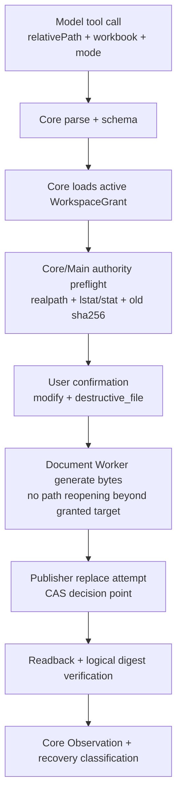

# DWO XLSX Overwrite Development Plan

> Owner: Codex 5.6
> Status: DWO-0 PASS/CLOSED; DWO-1 PASS/CLOSED; DWO-2 PASS/CLOSED; DWO-3 PASS/CLOSED; DWO series PASS/CLOSED
> Date: 2026-08-06

## 1. Current Gate

```text
DTP-0 -> DTP-4: PASS/CLOSED
DWE-0 -> DWE-3: PASS/CLOSED
APV-0 -> APV-3B: PASS/CLOSED

DWO-0: PASS/CLOSED
DWO-1: PASS/CLOSED
DWO-2: PASS/CLOSED
DWO-3: PASS/CLOSED
DWO series: PASS/CLOSED

APV-3C: GATED / no known P0-P3 driver after APV-3B QA
manual artifact registration: GATED
OS Sandbox: GATED
formal installer: GATED
```

DWO is a separate destructive-write extension for the existing
`tool.document.xlsx.write` capability. It does not reopen the create-only DWE
baseline. DWO-0 is closed as a documentation freeze. DWO-1 implemented the
Document Worker private foundation and is closed after independent QA. DWO-2
implements Core authorization, dynamic risk, exact confirmation scope, recovery
material, and registry mode schema. DWO-3 implements the Desktop confirmation
UX, scripted overwrite intent, durable ToolCallBatch resume bridge, and focused
product E2E; it is closed after independent QA.

DWO-0 review result:

- accepted Option A, advisory lock + digest best-effort, as the DWO-1 CAS
  baseline;
- reserved platform-specific atomic compare-and-replace helpers for later
  hardening;
- kept bulk overwrite, manual artifact registration, OS Sandbox, and formal
  installer gated;
- incorporated both review observations into DWO-2 schema revision and
  confirmation-copy requirements.

DWO-1 implementation result:

- added Worker-private `overwrite_existing` execution mode behind required
  `overwrite.confirmedOldSha256`;
- kept default `create_new` behavior and digest compatibility unchanged;
- rejected missing private confirmation with `unsupported_feature` +
  `overwrite_requires_confirmation`;
- added advisory same-directory lock, target identity checks, old digest
  verification, final re-stat/re-hash, atomic `rename` replacement, parent fsync
  best effort, readback verification, and temp/lock cleanup;
- kept model-visible registry, Core authorization, confirmation UI, recovery
  classification, Desktop E2E, and bulk overwrite out of scope.

DWO-2 implementation result:

- added model-visible `mode=create_new|overwrite_existing` to
  `tool.document.xlsx.write`;
- bumped the Document Tool risk source revision and declared both
  `routine_file` and `destructive_file` for XLSX write;
- kept `create_new` on WorkspaceGrant `create` + `routine_file` without user
  confirmation;
- routed `overwrite_existing` through WorkspaceGrant `modify` +
  `destructive_file`, exact single-action confirmation, and private payload
  confirmation material;
- bound old target SHA-256, new workbook requestDigest, workspaceGrantId,
  action identity, and idempotencyKey before dispatch;
- kept the Worker dispatch disabled until the persisted confirmation is
  confirmed and revalidated;
- left DWO-3 Desktop UX/productized overwrite flow to a separate batch; bulk
  overwrite, manual artifact registration, OS Sandbox, and formal installer
  stayed gated.

DWO-3 implementation result:

- extended the Desktop scripted model so explicit `overwrite` / `replace` /
  `覆盖` / `替换` intent emits `mode=overwrite_existing`, while create-only
  requests keep their existing model-visible payload shape;
- projected overwrite confirmations with destructive copy, relative target, and
  a clear no-undo consequence without exposing workspaceRoot, workbook,
  confirmedOldSha256, or private requestDigest material;
- wired Desktop confirmation decisions to resume durable ToolCallBatch work:
  the runtime recovers pending tool calls, dispatches the confirmed overwrite,
  then resumes the normal Agent loop for successful final assistant output;
- keeps the first confirmation-time old file digest in a process-private
  task/toolCall/action-bound material cache until recover completes, so target
  drift between confirmation request and dispatch fails closed instead of
  silently rebasing to the drifted file;
- added Desktop E2E coverage for confirmed overwrite success and post-confirmation
  target drift failure without overwriting the drifted file;
- did not implement bulk overwrite, manual artifact registration, OS Sandbox,
  formal installer, or APV-3C.

## 2. Product Scope

P0 supports only a single overwrite of an existing `.xlsx` file inside an active
WorkspaceGrant.

Allowed:

- overwrite exactly one existing `.xlsx` file;
- keep create-only behavior as the default for existing model calls;
- require explicit user confirmation before destructive execution;
- bind confirmation to the target, old file digest, new workbook logical digest,
  capability identity, action id, idempotency key, and workspace grant;
- use existing SheetJS `xlsx@0.20.3`;
- reuse DWE logical workbook canonicalization and readback checks.

Forbidden:

- bulk overwrite, glob, folder overwrite, append, patch, merge, delete, rename,
  or format conversion;
- overwriting missing targets;
- creating parent directories;
- overwriting symlinks, hardlinks, directories, sockets, FIFOs, or non-regular
  files;
- overwriting macro-enabled or encrypted OOXML files;
- formula generation, hyperlink generation, macro/ActiveX/OLE/external
  relationship generation;
- direct Renderer path authority;
- silent overwrite without a confirmed destructive scope;
- claiming OS sandbox guarantees.

## 3. Contract Position

No public Contract changes are required for DWO-0.

Existing public Contract facts already include:

- `ResourceAccess.operation = "modify"`;
- `ResourceAccess.operation = "bulk_overwrite"` for future bulk cases;
- `ToolRiskFactKind = "destructive_file"`;
- `UserConfirmationRequest` and exact confirmation scope machinery.

DWO must stop for Contract review if implementation discovers that existing
Contracts cannot express:

- exact single-file `modify` access;
- destructive file risk;
- user confirmation request/decision;
- idempotency conflict;
- manual attention / uncertain recovery.

## 4. Model-Visible Schema Draft

The current create-only model schema remains backward compatible.

Proposed additive input:

```json
{
  "mode": {
    "type": "string",
    "enum": ["create_new", "overwrite_existing"],
    "default": "create_new",
    "description": "create_new creates a missing .xlsx file. overwrite_existing replaces an existing .xlsx file only after user confirmation."
  }
}
```

Rules:

- omitted `mode` means `create_new`;
- `create_new` keeps current DWE semantics and returns `target_exists` if the
  file already exists;
- `overwrite_existing` requires target existence and a destructive confirmation;
- model-visible arguments must not contain `workspaceRoot`, `rootRealPath`,
  absolute path, old digest, lock token, temp path, file descriptor, or user
  confirmation decision.
- adding `mode` is a model-visible schema revision. DWO-2 must bump the
  document tool descriptor/registry revision intentionally and add drift tests
  for existing capability locks and registry material.

## 5. Authorization And Confirmation

Overwrite uses:

```text
ResourceAccess.operation: modify
risk fact: destructive_file
confirmation scope: exact single Action
```

Confirmation summary must include bounded, non-secret facts:

- display file name;
- workspace display name;
- relative path;
- old file SHA-256;
- old file byte size;
- new logical workbook digest;
- new estimated sheet/cell counts;
- consequence: existing file will be replaced;
- consequence: RoboThree does not guarantee undo for overwrite; recovery depends
  on user backups, file history, or other system-level recovery outside this
  Tool.

Confirmation must not include:

- `workspaceRoot`;
- `rootRealPath`;
- absolute target path;
- workbook contents;
- generated bytes;
- temp path;
- lock path;
- credentials or model prompts.

The confirmation decision is valid only for the exact request digest and exact
old file digest observed during preflight.

## 6. Execution Ownership



Renderer owns only the command UI and confirmation decision UI. Core owns
authorization, confirmation scope, request digest, Effect identity, and recovery.
Main/Worker own filesystem operations only after Core has built a confirmed
authority payload.

## 7. Filesystem CAS Decision

This is the main DWO-0 review point.

The desired guarantee is:

```text
Replace target only if it is still the same file content the user confirmed.
```

Portable Node APIs provide:

- `open(..., "wx")` for no-clobber create;
- `link(temp, target)` for no-clobber publish;
- `rename(temp, target)` for atomic replacement, but not compare-and-replace;
- advisory lock files, which protect RoboThree processes but not every external
  writer.

Therefore DWO-0 freezes this rule:

```text
DWO-1 baseline: Option A.

Use advisory lock + digest/CAS best effort with explicit residual
external-writer risk and postcondition recovery.
```

Option B, a platform-specific atomic compare-and-replace helper, remains a later
hardening candidate. Option C, keeping overwrite unsupported, is no longer the
DWO-1 baseline after DWO-0 review.

Option A minimum algorithm:

1. acquire same-directory exclusive lock file with `open(lock, "wx")`;
2. `realpath` parent and target, reject symlink/hardlink/non-file/outside root;
3. read old bytes bounded and compute `oldSha256`;
4. build confirmation scope with `oldSha256`;
5. after confirmation, reacquire/verify lock and re-stat/re-hash target;
6. generate full XLSX temp in same directory;
7. fsync temp and parent where supported;
8. perform atomic `rename(temp, target)`;
9. fsync parent where supported;
10. readback target and verify new logical digest;
11. cleanup lock/temp.

This option must explicitly document that non-cooperating external writers between
the final verification and `rename` are not prevented by portable Node APIs. The
accepted DWO-0 position is that RoboThree is a local-first single-user
workstation product, so this residual risk is acceptable for DWO-1 if recovery
continues to detect old digest, new digest, and neither-digest outcomes without
silent success.

## 8. Recovery Semantics

Recovery keys:

- `idempotencyKey`;
- `requestDigest`;
- `relativePath`;
- `oldSha256`;
- `newLogicalWorkbookDigest`;
- `newSha256` after generation;
- `effectAttemptId/actionId`;
- confirmation request digest and decision id.

Recovery matrix:

| State | Result |
| --- | --- |
| Same command replay, target logical digest equals new expected digest | success replay |
| Same command replay, target still has confirmed old digest | safe retry if no terminal commit |
| Same command replay, target digest is neither old nor new | uncertain/manual attention |
| Same command id, different requestDigest | conflict |
| Confirmation missing/expired/rejected | cancelled or denied, no write |
| Lock exists but no active attempt | inspect age + target digest; cleanup only when safe |
| Temp exists, target old digest intact | remove temp and retry |
| Temp exists, target new digest already published | cleanup temp and converge success |
| Readback cannot verify generated workbook | uncertain/manual attention |

Worker must not emit top-level `uncertain`; Core recovery classifies uncertain
states.

## 9. Typed Errors

Worker top-level errors remain DWE v1alpha2 compatible:

```text
invalid_format
encrypted
corrupt
limit_exceeded
unsupported_feature
worker_busy
cancelled
timed_out
internal_failure
```

Proposed overwrite `detailCode` values:

| detailCode | top-level code |
| --- | --- |
| `overwrite_requires_confirmation` | `unsupported_feature` before Core integration |
| `target_missing` | `invalid_format` |
| `target_not_regular_file` | `invalid_format` |
| `target_symlink_not_allowed` | `invalid_format` |
| `target_hardlink_not_allowed` | `invalid_format` |
| `target_digest_changed` | `invalid_format` |
| `target_not_xlsx` | `unsupported_feature` |
| `overwrite_cas_unsupported` | `unsupported_feature` |
| `publish_failed` | `internal_failure` |
| `readback_mismatch` | `internal_failure` |

Core/Desktop public errors should reuse existing conflict/confirmation/runtime
families where possible. If no safe public error exists, DWO-1 must stop for
Contract review.

## 10. Security Matrix

DWO-1/DWO-2 must prove:

- create mode remains create-only and no-clobber;
- overwrite mode requires target existence;
- overwrite mode requires active WorkspaceGrant with `modify`;
- overwrite mode requires `destructive_file` confirmation;
- confirmation binds exact old digest and new logical digest;
- model-visible schema leaks no root/path authority or old digest;
- Renderer leaks no root/path/workbook bytes in command/result/event surfaces;
- symlink, hardlink, traversal, null byte, UNC, Windows drive, root, directory,
  socket, FIFO, and extension mismatch fail closed;
- target drift before confirmation and after confirmation fails closed;
- generated formulas/hyperlinks/macros/external relationships remain absent;
- readback digest matches expected logical workbook digest;
- crash/restart recovery never blindly repeats destructive overwrite;
- no bulk overwrite or folder overwrite;
- no OS sandbox claims;
- existing read tools and create-only write behavior fully regress.

## 11. Work Breakdown

DWO-0: Contract / security / CAS review

- create this plan;
- decide CAS option A/B/C: Option A accepted for DWO-1;
- decide model schema additive `mode`;
- decide confirmation copy and typed errors;
- no production code.

Estimate: 0.5 to 1.5 concentrated engineering days.

DWO-1: Worker and private protocol foundation

- extend Worker-private schema for overwrite execution payload;
- add old digest / new digest verification hooks;
- implement temp generation and readback reuse;
- implement Option A advisory-lock + digest/CAS foundation;
- keep model-visible production overwrite disabled until DWO-2 registry,
  authorization, confirmation, and recovery integration is separately
  authorized.

Status: implemented in `0.0.0-dwo.1`; independent QA PASS; user accepted as
`PASS/CLOSED`.

Estimate: 3 to 5 concentrated engineering days.

DWO-2: Core authorization, confirmation, recovery, registry schema

- add `mode` to model-visible schema;
- bump descriptor/registry revision for the `mode` schema change and prove
  capability lock drift behavior;
- dynamic risk inspection for create vs overwrite;
- build exact confirmation scope;
- classify recovery states;
- preserve create-only behavior.

Status: implemented in `0.0.0-dwo.2`; independent QA PASS; user accepted;
PASS/CLOSED.

Estimate: 4 to 7 concentrated engineering days.

DWO-3: Desktop E2E and UX

- confirmation UI copy;
- end-to-end scripted model overwrite scenario;
- conflict/uncertain/manual attention UI;
- platform smoke tests.

Status: implemented in `0.0.0-dwo.3`; independent QA PASS; user accepted;
PASS/CLOSED.

Estimate: 2 to 4 concentrated engineering days.

Total: 9.5 to 17.5 concentrated engineering days, excluding independent QA,
review, and rework.

## 12. Allowed Modification Scope

DWO-0:

```text
docs/development/dwe/**
docs/development/DEVELOPMENT-LOG.md
CHANGELOG.md
README.md
```

DWO-1 implemented scope:

```text
services/document-worker/src/**
services/document-worker/tests/**
services/document-worker/package.json
```

DWO-2 implemented scope:

```text
services/core/src/**
services/core/tests/**
packages/contracts/src/**
packages/contracts/tests/**
packages/contracts/package.json
services/core/package.json
```

DWO-3 implemented scope:

```text
apps/desktop/src/**
apps/desktop/tests/**
apps/desktop/package.json
services/core/src/**
services/core/tests/**
services/core/package.json
tests/e2e/**
scripts/audit-dtp4-packaging.mjs
scripts/audit-dtp4-packaging.test.mjs
CHANGELOG.md
README.md
docs/development/DEVELOPMENT-LOG.md
docs/development/dwe/DWO-XLSX-OVERWRITE-DEVELOPMENT-PLAN.md
```

Forbidden until separately authorized:

```text
bulk overwrite
manual artifact registration
OS Sandbox
formal installer
Central changes
pnpm-lock.yaml
root package.json
root tsconfig.json
```

## 13. QA Gate

Every implementation batch must pass:

```text
pnpm --config.verify-deps-before-run=false run build
pnpm --config.verify-deps-before-run=false exec vitest run <focused DWO tests>
pnpm --config.verify-deps-before-run=false exec vitest run services/document-worker/tests
pnpm --config.verify-deps-before-run=false exec vitest run services/core/tests
pnpm --config.verify-deps-before-run=false exec vitest run packages/contracts/tests
pnpm --config.verify-deps-before-run=false exec vitest run apps/desktop/tests
pnpm --config.verify-deps-before-run=false run lint
CI=true pnpm install --frozen-lockfile --offline
pnpm --config.verify-deps-before-run=false run check
```

DWO-0 docs-only validation:

- no production code changes;
- no package version changes;
- no lockfile/root config changes;
- status is `PASS/CLOSED`;
- DWO-1 has since been separately authorized and implemented as
  `0.0.0-dwo.1`; independent QA passed and the stage is closed.
