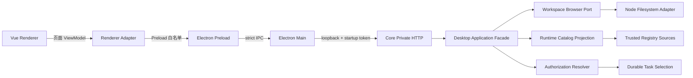

# RoboThree Desktop P0 接口补齐开发计划

## 1. 文档状态

```text
阶段：DFI — Desktop Frontend Interface Completion
状态：CONFIRMED / DFI-0、DFI-1A、DFI-1B、DFI-2A PASS/CLOSED / DFI-3A DOCUMENT REVIEW PENDING / 其余 GATED
日期：2026-08-17
范围：Desktop P0 页面所需的版本化 Contract、Core Application、私有 HTTP、
      Electron Main/Preload 白名单接口及跨层 Conformance
不包含：Renderer 页面实现、Admin Console、企业集成、发布审核、长期记忆
```

本计划负责补齐 RoboThree Desktop 前端从 Mock/GATED 页面切换为真实数据所需的
最小接口。接口不是只增加 HTTP Route 或 TypeScript 方法；每一个正式接口都必须具有：

```text
已接受产品语义
→ strict versioned Contract
→ Core 唯一业务 owner
→ 类型化 Application Port / Projection
→ loopback private HTTP
→ Electron Main / Preload 双重校验
→ Renderer-safe 结果
→ Conformance + E2E + 独立 QA
```

本计划不修改 Renderer 页面。前端窗口继续负责
`apps/desktop/src/renderer/**`；DFI 开发只在经过单批授权后修改 Contract、Core、Main、
Preload、shared API 和对应测试，避免两个开发窗口修改同一页面文件。

### 1.1 Revision 1 修订摘要

Revision 1 吸收首轮文档评审的 `P2=2 / P3=2`：

1. Workspace Browser 查询 authority 冻结为 `taskId`，只允许浏览该 Task 已锁定的
   Workspace；不开放脱离 Task 的 `workspaceGrantId` 浏览；
2. DFI-2A 预留当前 Core SQLite migration 链的下一个连续编号 `22`，migrations
   `1～21` 不改写；
3. Robot/Tool Catalog list Query 增加 `limit 1..100`、opaque cursor 和响应上限；
4. DFI-2 工作量调整为 `10～16` 个集中工程工作日，首轮总计调整为 `19～31` 天。

### 1.2 DFI-1A 关闭与 DFI-1B 实施状态同步

- DFI-1A 已通过独立 QA、用户接受并正式 `PASS/CLOSED`；
- DFI-1B 详细方案见
  [`DFI-1B-DEVELOPMENT-PLAN.md`](./DFI-1B-DEVELOPMENT-PLAN.md)，Revision 1 已通过复核并由用户
  明确授权；独立 QA 已 `PASS（P0～P3=0）` 并由用户正式接受，DFI-1B 已 `PASS/CLOSED`；
- 详细拆解后 DFI-1B 从原粗估 `2～3` 调整为 `4～7` 个集中工程工作日；随后 DFI-2A
  分解为 2A.1/2A.2/2A.3，并在 2A.2 详细方案中增加 Application Materializer、coverage CAS 与
  双 Adapter 原子 Conformance，当前首轮总计同步为 `25～41`；该变化不扩大功能范围。

---

## 2. 事实来源与冲突规则

### 2.1 事实来源

| 优先级 | 事实来源 | 本计划用途 |
| --- | --- | --- |
| 1 | 已接受 ADR / Desktop Local Runtime Contract / 安全边界 | 决定所有权、版本、进程和敏感数据边界 |
| 2 | `PRD-ROBOTHREE-MVP.md` v1.6 Final | 决定 P0 页面、用户术语和业务结果 |
| 3 | 已冻结模块 Feature Spec | 决定可以进入真实编码的行为 |
| 4 | `FRONTEND-EXPERIENCE-SPEC-v1.0.md` | 决定页面需要的 Projection 和状态 |
| 5 | `DESKTOP-FRONTEND-DEVELOPMENT-PLAN.md` 与 Living Spec | 决定前端批次和真实/Mock/GATED 边界 |
| 6 | 当前代码 | 判断可复用接口和真实缺口，不反向定义产品语义 |

冲突时执行：

```text
Accepted Contract / ADR
> PRD
> 已确认 Feature Spec
> 全局体验 Spec
> Frontend Living Spec
> 当前实现便利性
```

### 2.2 当前代码事实

现有 `RoboThreeDesktopApiV1Alpha1` 已覆盖：

- Core Runtime 状态；
- WorkspaceGrant 创建、列表与撤销；
- Session 创建、打开、重命名和删除；
- Agent/Model 任务选择 Projection；
- Conversation Snapshot；
- Task 列表、详情和控制；
- 用户确认；
- SubmitTurn 与 Receipt 查询；
- Artifact 列表、登记、预览、生命周期、导出和打开位置；
- durable/ephemeral Desktop Event。

现有真实缺口：

| 前端模块 | 缺口 | 是否已有产品语义 | 本计划处置 |
| --- | --- | --- | --- |
| 新任务智能授权 | `submitTurn v1alpha1` 无 requested/resolved authorization mode | 已有正式 Feature Spec | DFI-2 实现 |
| 任务详情工作空间文件 | 无受控目录树 Query；无打开当前 Task Workspace 的专用 Command | PRD/体验 Spec 已冻结只读浏览 | DFI-1 实现 |
| 智能中心机器人 | `listAgents` 只面向任务选择，缺完整只读目录/详情 Projection | PRD 已定义列表和详情 | DFI-3A 实现最小只读 Projection |
| 智能中心工具 | 只有 Task Tool Activity，缺正式 Tool Catalog Projection | PRD 已定义只读浏览 | DFI-3A 实现最小只读 Projection |
| 智能中心技能 | 没有真实 Skill Runtime、Summary Catalog 和 Renderer API | 产品边界已定义，运行源尚未实现 | 先单独完成 Skill Runtime Foundation，再进入 DFI-3B |
| 知识中心 | 没有正式 Knowledge Provider 和 Query Projection | P0 Conditional，Feature Spec 未冻结 | 保持 GATED |
| 个人模型管理 | 无 CRUD/Test/Credential 输入链路 | Feature Spec 与凭证接缝未冻结 | 保持 GATED |
| 机器人/技能创建发布 | 无草稿、测试、固定 Package、提交审核 Contract | Agent/Skill Feature Spec 未冻结 | 保持 GATED |

结论：DFI 不重做已经通过 DCF/DFE 验收的任务闭环，只补真实页面缺口。

---

## 3. 阶段目标

### 3.1 用户目标

首轮关闭以下真实链路：

```text
任务详情
→ 读取当前 Task 锁定的 Workspace
→ 展开安全目录树
→ 在系统文件管理器中打开该 Workspace

新任务
→ 选择手动复核 / 智能确认 / 任务内授权
→ Core 解析并锁定 resolved mode
→ 重启恢复仍保持同一授权模式

智能中心
→ 浏览真实机器人与工具目录
→ 查看来源、版本、能力和不可用原因
```

### 3.2 工程目标

- 保持 Core 是 Workspace、授权策略、Catalog 可用性的唯一业务 owner；
- Renderer 只消费安全 Projection，不读取文件系统、不推导权限、不重建 Registry；
- 保持 Desktop Main/Preload 白名单和 loopback private HTTP 边界；
- 所有新接口 strict、JSON-safe、有界、可取消、可超时、失败关闭；
- 保持现有 `v1alpha1` 行为和 Fixture 不变；
- 新接口与前端页面可以并行开发，但只有通过独立 QA 后才能删除对应 Mock。

---

## 4. 明确非目标

DFI 首轮不实现：

- 文件编辑、移动、重命名、删除或批量操作；
- 任意路径输入、Shell、终端或通用文件系统 API；
- 文件正文通过目录树接口返回；
- Agent/Skill 创建、测试、提交、发布或审核；
- Skill 安装/卸载、正文编辑或静默导入；
- Knowledge Provider、向量检索或长期记忆；
- 个人模型 Key、凭证保存、连通性测试或默认模型写入；
- Admin Console、CAS/SSO、RBAC、MDM 或企业配置管理；
- 万能 `/execute`、万能 `Capability` 查询或智能搜索/评分/路由；
- 在 Renderer 建立第二套 Task、Authorization、Registry 或文件权限状态机。

---

## 5. 所有权与进程边界



### 5.1 Renderer

Renderer 可以：

- 发送类型化 Query/Command；
- 展示安全相对层级、资源摘要、状态和错误；
- 保持页面折叠、标签和本次视图状态。

Renderer 不得：

- 接收或拼接真实绝对路径；
- 直接调用 `fs`、Shell、数据库、Core HTTP 或 Central；
- 自行判断 symlink 是否安全；
- 自行解析 Tool/Skill/Agent 权限；
- 将 Mock 结果伪装成 durable Receipt。

### 5.2 Electron Main / Preload

- Main 继续拥有系统文件管理器调用和 Core 连接令牌；
- Preload 只暴露固定方法，不暴露任意 IPC channel；
- Main 和 Preload 均对输入/输出执行 strict Schema 校验；
- Main 不承载 Workspace、授权模式或 Catalog 业务规则。

### 5.3 Local Core

- Core 校验 WorkspaceGrant、Task lock、授权模式和 Registry revision；
- Core 通过类型化 Port 调用 Node filesystem 或 Registry Source；
- Kernel reducer 不导入文件系统、HTTP、Electron 或 Registry Adapter；
- 新接口不修改 KAF-2 Effect/Receipt/Outbox 和 ADR-017 Tool 语义。

---

## 6. Contract 与版本策略

### 6.1 冻结原则

现有 Desktop Local `v1alpha1` 和 `RoboThreeDesktopApiV1Alpha1` 已被多个已关闭阶段
作为严格基线使用。DFI 不得静默修改既有必填字段、枚举、digest 或业务语义。

推荐策略：

1. 保持 `v1alpha1` Schema、Route 和 Fixture 字节/语义不变；
2. 复用已经存在的 Desktop Local `v1alpha2` 版本空间，以 additive sidecar 形式增加：
   - workspace browser；
   - workspace reveal；
   - authorization-aware submit turn；
   - read-only intelligence catalog；
3. 未变化的旧能力继续复用现有 v1alpha1 路径，不复制第二套实现；
4. Compatibility Feature 明确声明客户端实际支持的新增能力；
5. 新客户端调用新能力前必须完成版本/Feature 协商；旧 Core 不支持时返回 typed
   unavailable，不能静默退回无效 UI；
6. TypeScript Contract、Core HTTP、Main、Preload 使用同一 valid/invalid Fixture corpus。

DFI-0 文档复核必须最终冻结 Renderer-safe v1alpha2 surface 的组织方式；编码批次不得
自行决定把新方法直接塞回冻结的 `RoboThreeDesktopApiV1Alpha1`。

### 6.2 公共对象边界

允许进入 Contract：

- 有界 Query/Command；
- opaque entry/resource ID；
- 安全显示名称、来源、revision、状态和 typed error；
- 分页 cursor、truncated、count 和 digest。

禁止进入 Contract：

- 真实 Workspace root 或未经脱敏的绝对路径；
- symlink target；
- Runtime Handle、PID、Connection、SQLite row；
- Credential Reference、API Key、Token、Device Credential；
- Agent/Skill/Tool 正文、Prompt、Tool 参数和输出正文；
- RegistrySnapshot、TaskCapabilityLock、Effect、Receipt、Outbox 等内部对象。

---

## 7. 批次设计

## 7.1 DFI-0：接口差异与 Contract 冻结

状态：`REVISION 1 / DIFFERENCE REVIEW PASS / PASS/CLOSED`。

交付：

- 本计划；
- `v1alpha1 → v1alpha2 sidecar` 兼容矩阵；
- 页面 → Adapter → Preload → HTTP → Core owner 反向矩阵；
- Workspace Browser threat model；
- Authorization Mode persistence/recovery 差异清单；
- Catalog source ownership 表；
- valid/invalid Fixture 清单；
- 与前端窗口的文件所有权表。

退出门槛：

- Claude Code 与 MiniMax 文档评审无 P0/P1；
- 用户接受版本策略、批次顺序和非目标；
- 用户单独授权 DFI-1A；
- 不修改生产代码、Contract、IPC 或版本号。

## 7.2 DFI-1：Workspace Browser 与 Workspace Reveal

### DFI-1A：Contract、Core 与安全 Adapter

状态：`INDEPENDENT QA PASS / USER ACCEPTED / PASS/CLOSED`。

目标：提供当前 Task 已锁定 Workspace 范围内的只读、惰性、单层目录查询。

建议语义：

```text
ListWorkspaceEntriesQuery
├── taskId
├── parentEntryId（opaque，可选；缺省表示 root）
├── cursor（opaque，可选）
└── limit（1..200）

WorkspaceDirectoryProjection
├── workspaceGrantId
├── parentEntryId
├── breadcrumbDisplayNames[]
├── entries[]
├── nextCursor（可选）
├── truncated
└── snapshotDigest

WorkspaceEntryProjection
├── entryId（opaque）
├── displayName
├── kind: directory | file | symlink
├── navigable
├── sizeBytes（文件可选）
├── modifiedAt（可选）
└── unavailableReason（可选）
```

冻结行为：

- 每次只读取一个目录层级，不递归扫描整个 Workspace；
- Core 只从 `taskId` 对应的持久 TaskRuntimeSelection/Workspace lock 解析 authority；
- 不接受 `workspaceGrantId`、相对路径或绝对路径作为浏览 authority；
- 新任务创建前不提供目录树浏览；未来如果产品明确需要 Workspace 独立浏览，必须新建
  Feature Spec 和独立 Contract，不复用本接口扩大授权范围；
- Grant missing/revoked、root missing、权限不足、cursor 漂移全部 typed fail-closed；
- 使用 lexical containment + `realpath` containment；
- 首期 symlink 只作为不可导航条目展示，不跟随、不暴露 target；
- entry ID 为 Core 生成的 opaque proof，不把相对路径当作 authority；
- 目录结果稳定排序：directory 在前，其余按规范化名称排序；
- 单页最多 200，单响应、名称长度和总 JSON bytes 有硬上限；
- 不读取文件正文，不计算全文件 digest，不扫描整个目录大小；
- deadline、AbortSignal、FileHandle/DirHandle cleanup 和错误脱敏必须可测。

目录可见性推荐：

- 默认不递归进入 `.git`、`.svn`、`.hg`、`node_modules`、`.pnpm` 等已知内部或
  依赖目录；
- 不采用“隐藏全部点目录”，避免误伤已确认的 `.claude` / `.robothree`；
- 过滤规则由 Core 的固定 `WorkspaceEntryVisibilityPolicy` 控制，不由 Renderer 传任意 glob；
- 最终 denylist 在 DFI-1A 评审中冻结并进入 Fixture。

### DFI-1B：Main/Preload、Reveal 与真实 E2E

详细实施方案：[`DFI-1B-DEVELOPMENT-PLAN.md`](./DFI-1B-DEVELOPMENT-PLAN.md)。

当前状态：`INDEPENDENT QA PASS / USER ACCEPTED / PASS/CLOSED`。

交付：

- 版本化 `listWorkspaceEntries` Preload 白名单；
- `openTaskWorkspaceLocation` 或等价高层 Command；
- Main 只能根据 Core 返回的受信 authority 打开文件管理器，不接受 Renderer 路径；
- Core private HTTP Route、host/origin/token/size/deadline 规则；
- Desktop E2E：Task → locked Workspace → tree → reveal；
- Renderer-safe Error 映射，但不修改前端页面。

DFI-1 退出门槛：

- WorkspaceGrant active/revoked/missing 三分支；
- root、嵌套目录、空目录、分页、排序、unicode、长名称；
- traversal、absolute path、Windows drive、UNC、null byte 全拒绝；
- root 外 symlink、父目录 symlink、TOCTOU 替换全部失败关闭；
- 1000 次惰性目录查询后 handle/timer/subscription 归零；
- Renderer、日志、Trace、Fixture 不出现完整路径、正文或凭据；
- Node 24 完整门禁和独立 QA PASS。

## 7.3 DFI-2：智能授权真实链路

前置：`WORKSPACE-AUTHORIZATION-FEATURE-SPEC-v1.0.md` 已冻结；DFI-2 不重新讨论
三个模式的产品含义。

### DFI-2A：版本化 Contract、Selection 与 Persistence

详细实施方案：[`DFI-2A-DEVELOPMENT-PLAN.md`](./DFI-2A-DEVELOPMENT-PLAN.md)。当前状态：
`PLAN REVIEW PASS/CLOSED`；DFI-2A.1、DFI-2A.2 已通过独立 QA、用户接受并正式
`PASS/CLOSED`。DFI-2A.3 Revision 1 已通过差异复核并获用户明确编码授权；实现与开发者
门禁与独立 QA 已完成，当前等待用户接受；DFI-2B 继续 `GATED`。

交付：

- authorization-aware SubmitTurn 新版本；
- requested mode、resolved mode、policy revision 和 source；
- request digest、幂等/冲突和 RuntimeSelection identity 纳入 resolved fact；
- Task 创建、Selection、Lock、Receipt 同一原子提交链；
- Core SQLite forward-only migration `22` + InMemory/SQLite Conformance；
- migration `22` 只增加智能授权持久事实；migrations `1～21` 的 ID、name、SQL 和
  checksum/历史预期不得改写；
- fresh database、migration `21 → 22`、close/reopen、较新 Schema 和缺表/缺列均进入
  preflight 验证；
- migration `22` 自本 Revision 起为 DFI-2A 保留；如果 DFI-2A 编码前其他已授权阶段
  占用 `22`，必须回到文档评审显式调整编号，禁止实现时静默改号；
- v1alpha1 legacy default 行为保持不变并明确标记 `legacy_default`。

### DFI-2B：确认策略、恢复与 Desktop E2E

DFI-2B 只负责智能授权风险矩阵、Confirmation 策略、恢复和 Desktop E2E。Model Experience 文档冻结、DFE-5A 评审或个人模型后端规划均不构成 DFI-2B 编码授权；DFI-2B 继续独立评审、独立授权。

交付：

- Core `AuthorizationModeResolver` 与固定 MVP 风险矩阵；
- 手动复核、智能确认、任务内授权三条真实行为差异；
- 复用现有精确 Confirmation Scope，不新增企业审批；
- 分发前 revoked/disabled/health/credential 实时重检只收窄；
- 重启、retry、新 Run、迟到结果和策略 revision 漂移恢复；
- Desktop 选择 → Contract → Core resolved → Task projection E2E。

DFI-2 不允许：

- 跨任务“永不询问”；
- 用模式扩大 RBAC、WorkspaceGrant 或 Tool 权限；
- 自动放行删除、程序执行或 Workspace 外访问；
- Renderer 自行判断 Tool 风险；
- 将旧 v1alpha1 请求静默解释为用户显式选择。

## 7.4 DFI-3：智能中心只读 Catalog

### DFI-3A：机器人与工具

交付：

- 新建面向浏览的 `RobotCatalogProjection`，不复用任务选择器对象承载全部详情；
- 新建类型化 `ToolCatalogProjection`，从 Registry/Tool Catalog 的可信定义派生；
- list/detail 两类有界 Query；
- list Query 固定 `limit 1..100`，使用 opaque cursor；单响应条目数与 JSON bytes 均有
  上限，未知或过期 cursor 失败关闭；
- 来源、创建人/所有者显示摘要、revision、能力介绍、风险摘要、可用性和不可用原因；
- 权限和实时 disabled/revoked/health 只能收窄；
- 详情不包含 AdapterDescriptor 内部连接信息、Binding、Handle 或 Credential；
- Agent/Tool 精确 revision 与 Registry generation 漂移失败关闭；
- 搜索、筛选首期在 Renderer 对已返回的有界页执行；Core 不建设通用评分和智能路由。

数据源边界：

- 机器人来自 `TrustedAgentRepository` 和已物化企业/个人只读定义；
- 工具来自类型化 Tool Catalog/Registry，只投影 `kind=tool`；
- Agent、Skill、Knowledge 不被塞进 Capability Registry；
- Tool 是唯一原子能力类型，MCP 只作为 Tool 实现来源。

### DFI-3B：技能目录（独立 GATED）

DFI-3B 不能在没有真实 Skill Runtime 的情况下创建空壳接口。进入条件：

```text
Core Skill Runtime Foundation 计划通过评审并完成
AND
项目级/用户级 .claude 与 .robothree 目录授权规则冻结
AND
SkillSummary Catalog + Locked Body Materialization Conformance PASS
AND
用户明确授权 DFI-3B
```

DFI-3B 只把真实 SkillSummary 投影给 Renderer，不返回正文。技能广场、已安装、本地目录、
我创建的四类产品关系需要由可信来源显式提供，不能由前端根据路径猜测。

## 7.5 DFI-4：后续接口（保持 GATED）

| 模块 | 进入条件 | 当前处置 |
| --- | --- | --- |
| Knowledge | Knowledge Feature Spec + Provider Port + 数据外发规则 | 不建空接口 |
| 个人模型 | `MODEL-EXPERIENCE-FEATURE-SPEC-v1.0.md` 文档复核 + PersonalCredentialStore + OS 安全输入链路；保存后查看另需 ADR-013 反向敏感通道增补 | 建议形成 DFI-4A 独立方案；未接入前不接收/回显真实 Key，不展示测试连接 |
| 机器人/技能创建 | Agent/Skill Feature Spec + 草稿 revision + 测试结果 + 固定 Package | 不伪造保存/发布 |
| 发布审核 | Core/Desktop/Central 基础稳定 + Package Contract + 审核状态 | 不建设独立企业审批平台 |
| 长期记忆 | 客户端完成后按已冻结 Memory PRD 单独规划 | 不进入 DFI |

---

## 8. 与前端并行开发的协作边界

### 8.1 文件所有权

| 区域 | DFI 后端接口窗口 | 前端窗口 |
| --- | --- | --- |
| `packages/contracts/src/desktop-local/**` | 独占 | 不修改 |
| `services/core/src/**` | 独占 | 不修改 |
| `apps/desktop/src/main/**` | 独占 | 不修改 |
| `apps/desktop/src/preload/**` | 独占 | 不修改 |
| `apps/desktop/src/shared/foundation-api.ts` | DFI 批次修改，提前通知 | 只读消费 |
| `apps/desktop/src/renderer/**` | 不修改 | 独占 |
| `apps/desktop/tests/**` | 按文件清单分配，禁止并发改同一文件 | 按前端计划修改 |
| 版本/CHANGELOG/DEVELOPMENT-LOG | 单窗口串行收口 | 不并发修改 |

### 8.2 前端无需等待的范围

- DFE-2B、DFE-3A 继续使用现有真实 Task/Conversation/Confirmation API；
- DFE-3B 先开发面板布局、Artifact 标签和既有预览，Workspace tree 保持明确 Mock；
- DFE-4A 先开发 ViewModel、卡片和通用状态，Catalog API PASS 后替换对应 Mock；
- DFE-4B/5A/5B 在 Feature Spec 门槛前只做静态/GATED 页面。

### 8.3 Mock 删除纪律

接口实现完成不等于前端可以直接删除 Mock。必须满足：

```text
接口批次开发者门禁 PASS
AND 独立 QA PASS
AND 用户接受并关闭接口批次
AND 前端 Adapter 接入 E2E PASS
→ 才删除对应 Mock
```

---

## 9. 通用安全与质量门槛

每个 DFI 编码批次必须验证：

1. Contract `.strict()`，未知字段、枚举和版本失败关闭；
2. 请求/响应/body/cursor/name/count/depth 均有上限；
3. Main 与 Preload 对输入、输出进行同一 Schema 校验；
4. Renderer 不获得路径 authority、Credential、Handle、PID 或内部状态对象；
5. Core private HTTP 只绑定 loopback，保留 Host/Origin/Bearer/redirect/timeout 限制；
6. 日志、Trace、Error、Fixture、Evidence 五通道敏感扫描为 0；
7. cancel、deadline、client disconnect 和 Core restart 资源收口；
8. 同一 Query/Command ID 幂等，不同 digest conflict；
9. v1alpha1 回归和既有 DCF/DFE/KAF/ARH/Artifact 门禁不回退；
10. Kernel reducer 保持纯函数，不导入 Electron、HTTP、filesystem、Registry Adapter；
11. 不新增万能 execute/search/permission API；
12. 正式 Harness 与 Central 测试串行执行。

---

## 10. 验证命令与独立 QA

正式命令以每批计划最终冻结为准，最低包含：

```bash
source ~/.nvm/nvm.sh
nvm use 24.13.0
cd /Users/changzhengyi/Desktop/RoboThree/RoboThree_workspace
pnpm run clean
pnpm run build
CI=true pnpm exec vitest run
CI=true pnpm run check
pnpm run check:central
pnpm run check:central:offline
```

规则：

- Workspace、专项 Harness、Central online/offline 严格串行；
- 独立 QA 必须从源码重新构建并实际重跑，不以 digest 或开发者报告替代；
- 文件系统 E2E 使用真实临时目录、symlink 和权限负向 Fixture；
- Desktop E2E 使用真实 Main/Preload/Core 子进程边界；
- Evidence 只记录 count、digest、status、duration、resource metrics 和 typed error code；
- 不记录正文、路径、Prompt、Tool 参数、Token、Credential 或 API Key。

---

## 11. 工作量估算

以下为集中工程工作量，已包含普通恢复时序调试余量，但不包含文档等待、独立 QA
等待或重大 P0/P1 返工：

| 批次 | 集中工程工作日 |
| --- | ---: |
| DFI-0 文档/Contract 冻结 | 1～2 |
| DFI-1A Workspace Contract/Core | 3～5 |
| DFI-1B Main/Preload/E2E | 4～7 |
| DFI-2A Authorization Contract/Persistence | 8～12 |
| DFI-2B Policy/Recovery/E2E（含恢复时序返工余量） | 6～10 |
| DFI-3A Robot/Tool Catalog | 3～5 |
| 首轮合计 | 25～41 |

Skill Runtime Foundation、DFI-3B Skill Catalog、Knowledge、个人模型和创建发布不在
上述估算内。日历交付时间取决于逐批评审、用户授权、独立 QA 和前端接入，不等同于工程工作日。

---

## 12. 文档评审重点

请评审者逐项确认：

1. DFI 是否只补 P0 页面接口，没有扩成后台平台；
2. 复用 Desktop Local `v1alpha2` additive sidecar、保持 `v1alpha1` 不变是否正确；
3. Workspace tree 只接受 `taskId` 并绑定持久 Task Workspace lock，拒绝独立
   `workspaceGrantId` 浏览是否正确；
4. symlink 首期只展示、不导航是否符合安全与产品需求；
5. `.claude` / `.robothree` 可见但 VCS/依赖目录默认过滤是否合理；
6. DFI-2 是否完全复用已冻结智能授权 Feature Spec，没有引入 Policy Engine；
7. DFI-3A 是否只做机器人/工具只读目录，不把 Skill/Knowledge 塞进 Registry；
8. DFI-3B 是否必须等待真实 Skill Runtime，而不是建设无数据空接口；
9. Renderer 与后端接口窗口文件边界是否足以支持并行开发；
10. migration `22` 预留、Catalog `limit 1..100` 和 DFI-2 `10～16` 天估算是否合理；
11. 是否出现新的 P0/P1、Contract 冲突或需要用户重新决策的范围变化。

---

## 13. 阶段门禁

当前状态：

```text
DFI-0：PASS/CLOSED
DFI-1A：PASS/CLOSED
DFI-1B：INDEPENDENT QA PASS / USER ACCEPTED / PASS/CLOSED
DFI-2A.1：PASS/CLOSED
DFI-2A.2：PASS/CLOSED
DFI-2A.3：PASS/CLOSED
DFI-2A：PASS/CLOSED
DFI-2B：GATED
DFI-3A：DOCUMENT REVIEW PENDING / CODING GATED
DFI-3B：GATED（同时依赖 Skill Runtime Foundation）
DFI-4A Plan Revision 1：CONFIRMED
DFI-4A.0：DEVELOPER PREFLIGHT PASS / INDEPENDENT REVIEW PENDING
DFI-4A.1～DFI-4A.4：GATED
```

下一步：

```text
DFI-2A 已关闭
→ DFI-4A.0 完成开发者 Preflight，进入独立复核
→ DFI-3A 已输出详细方案并进入文档评审，不自动编码
→ DFI-2B / DFI-3B 与 DFI-4A.4.1～DFI-4A.4.3 继续 GATED
→ 用户逐批明确授权后才可编码
```

DFI-1B、DFI-2A.1、DFI-2A.2、DFI-2A.3 与 DFI-2A 整体已正式关闭；DFI-2B、DFI-3 和
DFI-4A.1～DFI-4A.4 均不得进入编码。DFI-4A.0 仍需独立复核和用户接受，不自动解锁后续批次。
DFI-4A 具体边界见
[`DFI-4A-PERSONAL-MODEL-CREDENTIAL-DEVELOPMENT-PLAN.md`](./DFI-4A-PERSONAL-MODEL-CREDENTIAL-DEVELOPMENT-PLAN.md)。
