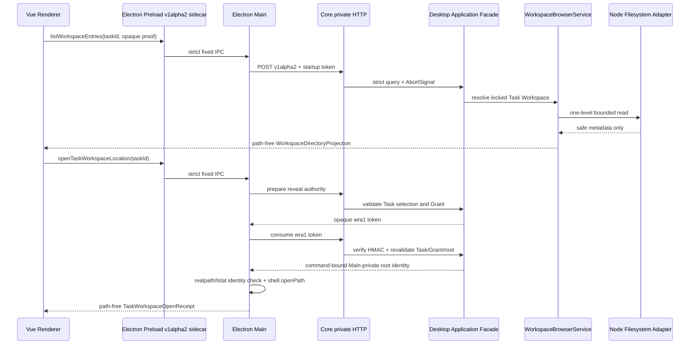

# DFI-1B Main/Preload、Workspace Reveal 与真实 E2E 开发计划

## 1. 文档状态

```text
阶段：DFI-1B — Desktop Workspace Browser Cross-Process Integration
状态：INDEPENDENT QA PASS / USER ACCEPTED / PASS/CLOSED
日期：2026-08-17
上游：DFI-0 PASS/CLOSED；DFI-1A PASS/CLOSED
范围：v1alpha2 compatibility、Core private HTTP、Electron Main/Preload sidecar、
      Workspace Reveal 高层命令、跨进程 Conformance 与真实 E2E
不包含：Renderer 页面接入、文件正文读取、文件编辑、DFI-2/3/4
```

DFI-1A 已完成 Workspace Browser strict Contract、Core authority 解析、HMAC entry/cursor
proof 和安全 Node 目录 Adapter，并经独立 QA 与用户接受正式 `PASS/CLOSED`。

DFI-1B 只把这条能力接入既有 Desktop 私有进程链，并补齐“在系统文件管理器中打开当前
Task 锁定 Workspace”的高层命令。Revision 1 已通过差异复核并由用户明确授权；实现和开发者
门禁、独立 QA 与用户接受均已完成，DFI-1B 正式 `PASS/CLOSED`；该关闭不自动进入 DFI-2/3/4。

### 1.1 Revision 1 修订摘要

Revision 1 吸收文档评审的两项非阻断 P3：

1. 冻结 `shell.openPath` 的 5 秒外部动作 deadline、确定性错误与结果不确定的分流、
   同 command 幂等和禁止自动重试；
2. 删除未定义的 `authorityDigest`，改为复用 DFI-1A 同一实例级 HMAC key、使用独立
   `wra1` domain 的短期 opaque reveal authority token；不新增第二套密钥或算法。

### 1.2 实施结果

- Desktop Local `v1alpha2` 已新增 Workspace Browser / Reveal feature、strict Query、Command、
  Receipt 与 typed error envelope，`v1alpha1` 保持不变；
- Core private HTTP 已接入 compatibility、单层目录查询和 reveal prepare/consume；Renderer 仍只
  能提交 `taskId`、opaque entry/cursor 与高层 command，不接触路径；
- Electron Main / Preload 以独立 `window.robothreeDesktopV1Alpha2` sidecar 暴露三个成员，
  Main 在 `shell.openPath` 前重新验证 exact root identity；
- `wra1` authority、3/5 秒分层 deadline、有界 Attempt Registry、同 command 幂等和
  `workspace.reveal_outcome_uncertain` 已进入实现与测试；
- Renderer 页面、Mock 删除、文件正文读取、DFI-2/3/4 均未进入本批。

---

## 2. 目标与用户结果

### 2.1 用户结果

```text
打开已存在 Task
→ Desktop 查询该 Task 锁定的 Workspace
→ 惰性展开单层目录
→ 只看到 Renderer-safe 文件元数据
→ 点击“打开本地文件夹”
→ Main 根据 Core 当下重新签发的私有 authority 打开精确 Workspace 目录
```

### 2.2 工程结果

- 保持 Core 是 Workspace authority 的唯一业务 owner；
- 保持 Renderer 不接触绝对路径、文件系统、Shell、连接令牌或 HMAC 密钥；
- 保持现有 `RoboThreeDesktopApiV1Alpha1`、v1alpha1 Route、Fixture 和行为不变；
- 通过 Desktop Local `v1alpha2` additive sidecar 暴露新能力；
- 对 Contract、Core HTTP、Main、Preload 使用同一 strict Schema 和 Fixture；
- 用真实 Core child、SQLite reopen 和临时 Workspace 证明跨进程恢复与安全边界；
- DFI-1B 独立 QA 和用户接受前，前端 Workspace tree 占位不得删除。

---

## 3. 当前代码事实与缺口

### 3.1 已存在且直接复用

1. `v1alpha2` 已存在 compatibility、feature negotiation 和 Workspace Browser Contract 空间；
2. DFI-1A 已存在：
   - `ListWorkspaceEntriesQuery`；
   - `WorkspaceDirectoryProjection`；
   - `WorkspaceBrowserService`；
   - `NodeWorkspaceDirectoryReader`；
   - `HmacWorkspaceBrowserProofCodec`；
3. Core private HTTP 已具备 loopback、随机 startup token、Host/Origin/Bearer、请求/响应上限；
4. Desktop Main/Preload 已具备固定 IPC channel、双向 strict 校验和 Renderer-safe result；
5. Artifact 打开位置链路已证明“绝对路径只在 Core→Main 私有链路出现，Renderer 只拿安全 Receipt”；
6. Core supervisor 已具备 compatibility handshake、单 Core 实例和 restart/recovery 生命周期。

### 3.2 DFI-1B 必须补齐

| 缺口 | 当前状态 | 本批处置 |
| --- | --- | --- |
| DFI-1A service 未在生产 bootstrap 创建 | 只有测试装配 | 在 Desktop private runtime 组合根显式创建并注入 Facade |
| v1alpha2 Workspace feature 未加入 compatibility | feature enum 无 browser/reveal | 新增精确 feature 并协商 |
| Core private HTTP 无 v1alpha2 Workspace Route | 仅 v1alpha1 route | 新增三条 POST route |
| Main private client 无 v1alpha2 方法 | 仅 v1alpha1 | 增加 strict v1alpha2 client 方法 |
| Main/Preload 无新白名单 | v1alpha1 API 已冻结 | 新增独立 v1alpha2 sidecar，不改 v1alpha1 |
| Workspace Reveal 无专用命令 | Artifact open 不能代表 Task root | 新增 task-bound 高层 Command 与私有 authority |
| 无真实跨进程 E2E | DFI-1A 只到 Core service | 增加 Core child → HTTP → Main → Preload E2E |

---

## 4. 冻结架构决策

### 4.1 v1alpha2 使用独立 Renderer sidecar

新增稳定全局：

```text
window.robothreeDesktopV1Alpha2
```

首批只包含：

```text
contractVersion: "v1alpha2"
getCompatibility(query)
listWorkspaceEntries(query)
openTaskWorkspaceLocation(command)
```

禁止：

- 向 `RoboThreeDesktopApiV1Alpha1` 追加方法或字段；
- 修改 `window.robothreeDesktop` 的形状或行为；
- 复制全部 v1alpha1 能力到 v1alpha2；
- 不经 feature negotiation 静默调用新能力；
- 在旧 Core 不支持时回退为 Renderer 路径或任意 IPC。

Preload 始终暴露固定 sidecar 形状；Main/Core 不支持所需 feature 时返回 typed
`contract.feature_unavailable`，不以 `undefined`、异常栈或空数组掩盖兼容性问题。

### 4.2 Compatibility feature

新增两个穷尽 feature：

```text
task_workspace_browser
task_workspace_reveal
```

两者分离的原因：只读 Projection 与 OS 外部动作风险不同，客户端必须能够独立判断。

`v1alpha2` compatibility 至少证明：

- selected version 为 `v1alpha2`；
- `runtimeInstanceId` 与当前 ready Core 一致；
- feature 显式存在；
- Core restart 后重新协商，旧协商结果不得跨 `runtimeInstanceId` 复用。

### 4.3 查询 authority 继续只接受 taskId

`listWorkspaceEntries` 继续使用 DFI-1A 已冻结 Query：

```text
taskId
parentEntryId?  // Core opaque proof
cursor?         // Core opaque proof
limit?
```

不得增加：

- `workspaceGrantId`；
- 相对或绝对路径；
- Renderer 指定 denylist/glob；
- symlink target；
- Workspace root；
- “新任务创建前浏览目录”的旁路。

### 4.4 Workspace Reveal 是 task-bound 高层命令

公共 v1alpha2 Command：

```text
OpenTaskWorkspaceLocationCommand
├── contractVersion
├── commandId
├── correlationId
├── clientInstanceId
├── type: open_task_workspace_location
└── taskId
```

Renderer-safe Receipt：

```text
TaskWorkspaceOpenReceipt
├── contractVersion
├── commandId
├── taskId
├── workspaceGrantId
└── openedAt
```

Receipt 不包含 path、entryId、selectionDigest、root identity 或 Shell 结果正文。

点击时必须重新执行：

```text
读取 TaskRuntimeSelection
→ 校验 selection digest
→ 校验 exact WorkspaceGrant identity
→ 校验 Grant 仍 active
→ realpath/lstat 精确解析 Workspace root
→ Core 生成 Main-private reveal authority
→ Main 再次 realpath/lstat 校验同一目录 identity
→ shell.openPath(exact root)
→ 返回 path-free Receipt
```

目录树中已有的 `entryId`、`cursor` 或旧 Projection 不能作为 Reveal authority。

### 4.5 绝对路径只允许 Core→Main 私有传递

Main-private `TaskWorkspaceRevealAuthority` 不进入公共 Contract。Reveal 复用 DFI-1A 同一个
`HmacWorkspaceBrowserProofCodec` 实例和同一个 256-bit runtime key，以独立 domain prefix
`wra1` 封装短期 opaque authority token。

token claims 至少绑定：

```text
taskId
workspaceGrantId
selectionDigest
rootRealPath
rootIdentity(dev/ino/mode)
runtimeInstanceId
commandId
expiresAt（≤5s）
```

约束：

- HMAC-SHA-256、canonical JSON 和 constant-time verification 复用 DFI-1A 实现；
- 使用独立 `wra1` domain separation，entry/cursor token 不能冒充 reveal token；
- 不向 Main、Preload 或 Renderer 暴露 HMAC key；
- Main 先从 Core 取得 `wra1` token，再通过同一 reveal-authority private route 消费 token；
- Core consume 时验证 HMAC、runtime、command、expiry，并再次检查 Task/Grant/root；
- consume 成功后 Core 才向 Main 返回绑定同一 command 的 root path/identity 私有结果；
- Main 必须 strict parse，并在调用 OS 前重新验证真实目录与 identity；
- authority 绑定当前 `runtimeInstanceId`，Core restart 后旧值失效；
- 不持久化、不进入 IPC response、Renderer、日志、Trace、Audit 或 Fixture；
- 不提供通用 `openPath(path)`、`reveal(path)` 或 Shell channel。

`wra1` 不宣称跨 Core exactly-once，也不是 durable Workspace 事实；它只用于同一 runtime 内
“准备→消费”两步私有授权。Grant 在 prepare 后、consume 前被撤销时必须失败关闭。

### 4.6 OS 打开动作的超时与结果不确定语义

Electron `shell.openPath` 不提供 AbortSignal，因此 OS 动作 deadline 与 Core HTTP deadline
分开处理：

```text
Core prepare/consume deadline：3s
Main shell.openPath deadline：5s
```

| 实际结果 | Renderer-safe 结果 | 自动重试 |
| --- | --- | --- |
| resolve 空字符串 | 成功 Receipt | 否 |
| resolve 非空错误文本 | `workspace.reveal_unavailable`，不回显原文 | 否 |
| reject | `workspace.reveal_unavailable`，不回显异常 | 否 |
| 5 秒内未 settle | `workspace.reveal_outcome_uncertain`，`retryable=false` | **禁止** |

超时不等于确定失败：系统文件管理器仍可能稍后打开。safe summary 必须说明“响应超时，操作
可能仍会完成，请勿重复点击”，不能显示“打开失败”。

Main 增加有界、纯内存 `WorkspaceRevealAttemptRegistry`：

- 以 `commandId + commandDigest` 绑定一次 OS 动作；
- 同 ID/同 digest 重放相同 completed/error/uncertain 结果，不二次调用 Shell；
- 同 ID/不同 digest 返回 idempotency conflict；
- 一个 timed-out 且未 settle 的 adapter promise 存在时，新 reveal 返回 typed busy；
- late resolve/reject 只释放 busy 标记，不改写已经返回的 uncertain 结果；
- 最多 256 项、TTL 10 分钟，Desktop 退出时清理，不进入 SQLite/Event/Audit。

自动化测试使用可控 Fake OS adapter 验证 resolve/reject/never-settle/late-settle，不真实打开
大量系统窗口。

### 4.7 私有 HTTP Route

仅新增：

```text
POST /v1alpha2/control/compatibility
POST /v1alpha2/workspaces/entries
POST /v1alpha2/workspaces/reveal-authority
```

`reveal-authority` 使用两个 strict Main-private operation：`prepare` 只返回 path-free `wra1`
token；`consume` 验证 token 并只向 Main 返回一次 root path/identity。两者都不进入 Preload
或 Renderer Contract。

继续复用现有约束：

- 只绑定 `127.0.0.1` 随机端口；
- 精确 Host、无 Origin、Bearer startup token；
- `redirect: manual`；
- 非 POST、未知 route、非法 JSON、未知字段全部失败关闭；
- query/command body 上限 `16 KiB`；
- Workspace public projection 在应用层保持 `256 KiB` 上限；
- transport 总响应仍受既有 `2 MiB` 防线限制；
- list deadline `5s`，reveal-authority prepare/consume deadline `3s`；
- request aborted/closed 或 deadline 到达时传播 `AbortSignal`；
- 一次请求只能产生一个 typed terminal response。

### 4.8 typed error 映射

必须区分：

| 类别 | 示例语义 |
| --- | --- |
| invalid | Contract/ID/proof/cursor 非法、未知字段 |
| permission | Task 未锁 Workspace、Grant missing/revoked、scope mismatch |
| unavailable | root missing、不可读、Core feature 不可用、OS 确定性错误 |
| conflict | cursor stale、目录 identity 漂移、命令 digest 冲突 |
| cancelled/deadline | request 取消或超时 |
| uncertain | `shell.openPath` 5 秒未 settle，结果不可确认且不可自动重试 |

错误 Envelope 只包含稳定 code、safe summary、category、retryable 和 correlationId；不得包含
绝对路径、系统异常、用户名、目录正文、Token 或调用栈。

---

## 5. 进程与所有权



所有权：

- Core：Task selection、Grant、Workspace root、可见性、proof、错误语义；
- Main：Core token、Main-private authority 校验、唯一 OS 打开动作；
- Preload：固定 IPC surface 和 strict 双向 parse；
- Renderer：提交 taskId/opaque proof，展示安全 Projection；
- Kernel reducer：保持不变，不导入 HTTP、Electron、filesystem 或 runtimeInstanceId。

---

## 6. 实施步骤

### Step 1：v1alpha2 Contract 与 compatibility

- 新增 strict `CompatibilityQueryV1Alpha2`；
- 扩展 v1alpha2 feature enum；
- 新增 `DesktopCommandMetadataV1Alpha2`；
- 新增 Workspace Reveal Command/Receipt；
- 增加 valid/invalid Fixture 和 canonical export；
- 保持 v1alpha1 Schema/Fixture/接口不变。

### Step 2：Core 生产装配与 private HTTP

- 在 Desktop private runtime 组合根创建 DFI-1A service；
- Facade 新增 v1alpha2 compatibility、list entries、resolve reveal authority；
- 增加三条 v1alpha2 Route；
- 增加 route-specific body/deadline/AbortSignal；
- 将 Workspace typed error 映射为 Desktop safe Envelope；
- 扩展 DFI-1A HMAC codec 的 `wra1` domain，增加 Main-private prepare/consume parser，
  不导出到公共 Contract。

### Step 3：Main/Preload sidecar

- 新增固定 v1alpha2 IPC channels；
- `CorePrivateClient` 增加 v1alpha2 compatibility/list/reveal-authority；
- supervisor 按 `runtimeInstanceId` 缓存并失效 feature negotiation；
- Main 增加 `openTaskWorkspaceDirectory` 注入，生产使用 `shell.openPath`；
- 增加 5 秒 deadline、结果不确定收敛和有界 Attempt Registry；
- Main 重验 root identity，错误脱敏；
- Preload 暴露 `window.robothreeDesktopV1Alpha2`；
- v1alpha1 global 和既有 smoke 保持完全兼容。

### Step 4：Conformance、E2E 与收口

- 同一 Fixture 覆盖 Contract、HTTP client/server、IPC/Preload；
- 真实 Core child + SQLite + 临时 Workspace E2E；
- Core restart、proof 失效、重新协商与重新查询；
- revoke/missing/root drift/OS open failure 负向场景；
- 1000 次惰性查询资源有界；
- 静态与动态敏感扫描；
- Node 24 完整门禁、Central online/offline 串行回归、独立 QA。

---

## 7. 测试与验收矩阵

### 7.1 Contract 与兼容性

1. v1alpha2 compatibility valid Fixture 通过；
2. version、feature、runtimeInstanceId 缺失或未知字段拒绝；
3. `task_workspace_browser` 与 `task_workspace_reveal` 可独立协商；
4. v1alpha1 Contract/Fixture/digest/全局 API 未改；
5. 旧 Core 缺 feature 返回 typed unavailable，不静默 fallback；
6. Core restart 后重新协商，旧 runtimeInstance 的结果不能复用；
7. Reveal Command 只接受 taskId 和标准 metadata；
8. Renderer-safe Receipt 不含路径或私有 authority 字段。

### 7.2 Core private HTTP

9. 只接受 loopback、正确 Host、无 Origin、正确 Bearer；
10. 非 POST、redirect、未知 route、非法 JSON、未知字段失败关闭；
11. request 16 KiB、projection 256 KiB 和 transport 2 MiB 三层上限成立；
12. list deadline、reveal deadline、client disconnect 都传播取消；
13. 取消/超时后 DirHandle、timer、subscriber 归零；
14. typed Workspace 错误不被塌缩为 `contract.invalid`；
15. 同 commandId + 同 digest 幂等，同 ID + 不同 digest 冲突；
16. public response、日志和 Trace 不出现 startup token 或绝对路径。

### 7.3 Main/Preload

17. IPC channel 固定且无动态 channel 输入；
18. Main 和 Preload 对输入/输出均 strict parse；
19. sidecar 只暴露三个冻结成员；
20. `window.robothreeDesktop` v1alpha1 形状和行为不变；
21. Renderer 只能提交 taskId/entryId/cursor，不能提交 path；
22. Reveal authority 只在 Main-private 内存存在；
23. Main 在 OS 调用前执行 realpath/lstat exact identity 校验；
24. root 漂移、symlink 替换、非目录、权限不足全部失败关闭；
25. Main 对同 command 只调用一次注入的 `openTaskWorkspaceDirectory`；
26. OS 非空错误/reject 只投影 typed safe error，不回显系统路径；
27. OS never-settle 在 5 秒收敛为 uncertain，禁止自动重试；
28. late settle 不改写已返回结果，busy/timer/registry 最终释放；
29. `wra1` 复用 DFI-1A runtime HMAC key、独立 domain，错 domain/篡改/过期均拒绝；
30. prepare 后 revoke、Core restart 或 runtime mismatch 时 consume 失败关闭。

### 7.4 真实 E2E 与恢复

31. Task → locked Workspace → root list；
32. opaque directory proof → nested list；
33. empty、pagination、stable sort、Unicode 和长名称；
34. active/missing/revoked Grant 三分支；
35. traversal、absolute、Windows drive、UNC、null byte 全拒绝；
36. symlink 只显示不可导航，不能借 reveal 打开 target；
37. Core restart 后旧 entry/cursor/reveal proof 全失效；
38. restart 后重新协商、重新 list 可收敛；
39. reveal 点击时撤销 Grant，不执行 OS 调用；
40. reveal 成功只返回 path-free Receipt；
41. 1000 次 list 后 handle/timer/subscription/child resource 归零；
42. repeated reveal 使用 Fake OS adapter，不在自动测试真实弹 1000 个窗口；
43. never-settle 与 late-settle 后 attempt registry/timer 归零且不重复 Shell；
44. Renderer source、IPC capture、process output、test evidence 四通道路径/Token/正文扫描 0；
45. DFI-2/3/4、Renderer 页面和 Mock 删除均未提前实现。

---

## 8. 安全负向 Fixture

至少包含：

- tampered entry/cursor proof；
- proof 来自另一 Task、selection、Grant 或 runtimeInstance；
- stale cursor；
- missing/revoked Grant；
- root deleted/replaced/not-directory；
- root 或父目录 symlink 替换；
- `../`、POSIX absolute、Windows drive、UNC、null byte；
- oversized request/response/name/breadcrumb/page；
- Host/Origin/Bearer/method/route 错误；
- client disconnect、deadline、late callback；
- Shell/openPath 非零错误、reject、never-settle 和 late-settle；
- `wra1` wrong-domain、tampered、expired、replayed-after-restart；
- 错误对象携带 canary path/token 时的脱敏断言。

---

## 9. 文件修改边界

允许修改：

```text
packages/contracts/src/desktop-local/v1alpha2/**
packages/contracts/tests/**v1alpha2**
services/core/src/application/**
services/core/src/adapters/http/**
services/core/src/bootstrap/**
services/core/tests/**workspace**
apps/desktop/src/main/**
apps/desktop/src/preload/**
apps/desktop/src/shared/foundation-api.ts
apps/desktop/tests/**workspace**
对应版本、audit、CHANGELOG、DEVELOPMENT-LOG
```

禁止修改：

```text
apps/desktop/src/renderer/**
Kernel reducer 与 KAF/ADR-017 语义
Central Service
Document Worker
Core SQLite migration
DFI-2/3/4 Contract 或代码
依赖与 pnpm-lock.yaml（除非出现单独评审的必要性）
```

前端窗口在 DFI-1B 期间不得修改 `foundation-api.ts`、Main、Preload 或本批 Workspace E2E
文件；DFI-1B 不修改 Renderer 页面。接口通过独立 QA 并由用户接受后，再由前端批次接入 sidecar。

---

## 10. 验证顺序

环境：Node `24.13.0`、pnpm `11.11.0`、JDK 21、Docker/Testcontainers。

```text
1. Contract / Workspace focused tests
2. Desktop Main/Preload/Core private HTTP focused tests
3. Desktop build + preload/core smoke
4. CI=true pnpm run lint
5. CI=true pnpm run check
6. CI=true pnpm run check:central
7. CI=true pnpm run check:central:offline
8. 独立 QA 从零串行重跑
```

`check`、Central online、Central offline 和正式 Harness 必须串行，禁止并行争抢
Testcontainers、Surefire 或共享构建目录。

Evidence 只允许记录 count、digest、status、duration、resource metrics 和 typed error code；
不得记录正文、绝对路径、Prompt、Tool 参数、Token、Credential 或 API Key。

---

## 11. 工作量

| 工作项 | 集中工程工作日 |
| --- | ---: |
| Contract/compatibility/Core HTTP | 1～2 |
| Main/Preload/reveal | 1～2 |
| E2E、安全负向、恢复与收口 | 2～3 |
| 合计 | 4～7 |

日历时间参考为 `6～11` 天，取决于文档评审、独立 QA 和普通返工；不等同于工程工作日。

---

## 12. 文档评审问题

请 Claude Code、MiniMax 逐项确认：

1. 独立 `window.robothreeDesktopV1Alpha2` sidecar 是否是保持 v1alpha1 冻结的最小方案；
2. browser/reveal 两个 feature 分离是否合理；
3. list 与 reveal 是否都只接受 taskId，且不允许 workspaceGrantId/path 旁路；
4. Main-private authority 和 Main 二次 identity 校验是否关闭路径泄漏与 TOCTOU；
5. 三条 Core private POST route、三层 size limit 和 5s/3s deadline 是否合理；
6. Core restart 后重新协商、旧 proof/authority 失效语义是否完整；
7. 45 项 QA 是否覆盖跨进程安全、恢复、OS 结果不确定、资源和泄漏；
8. Renderer 不修改、Mock 不删除、DFI-2/3/4 不提前是否清楚；
9. `4～7` 集中工程工作日是否可执行；
10. 是否存在新的 P0/P1、Contract 冲突或需要用户决策的范围变化。

Revision 1 还请确认：

11. `shell.openPath` 5 秒超时进入 uncertain、禁止自动重试和有界 Attempt Registry 是否合理；
12. `wra1` 复用 DFI-1A runtime HMAC key、独立 domain、prepare/consume 两步是否关闭
    authorityDigest 的算法与 key 来源歧义。

---

## 13. 阶段门禁

```text
DFI-1A：PASS/CLOSED
DFI-1B：INDEPENDENT QA PASS / USER ACCEPTED / PASS/CLOSED
DFI-2：GATED
DFI-3：GATED
DFI-4：GATED
```

本批进入编码的门槛已满足：

```text
Claude Code / MiniMax 文档评审完成
AND P0/P1 关闭
AND 用户接受最终计划
AND 用户明确授权 DFI-1B 编码
```

文档评审通过不等于自动授权编码。

阶段关闭门槛已满足：Claude Code 已实际串行重跑 Workspace 与 Central online/offline，结论
`INDEPENDENT_QA_PASS（P0～P3=0）`；用户已正式接受并关闭 DFI-1B。该关闭不授权 DFI-2/3/4，
也不自动删除 Renderer Mock。

— Codex 5.6
