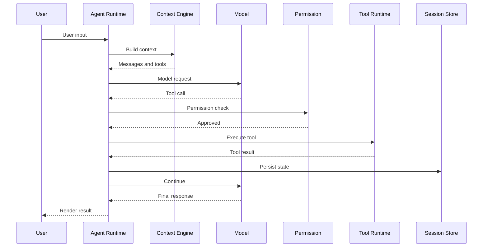
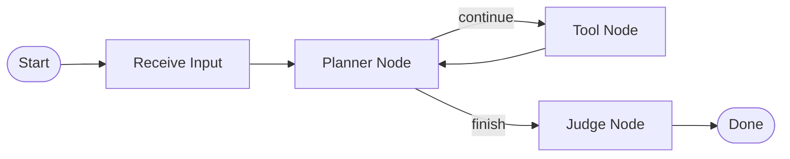
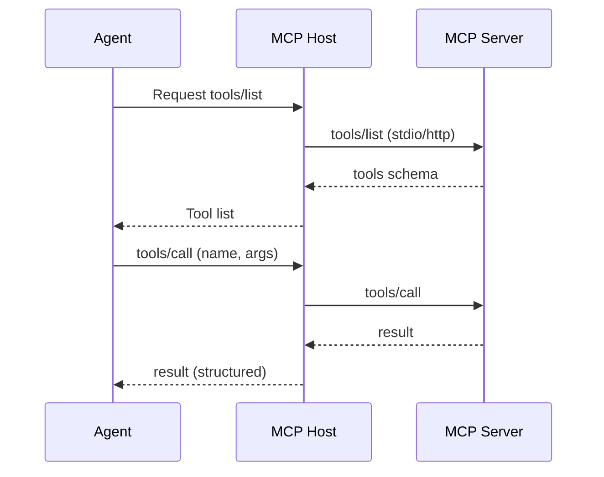
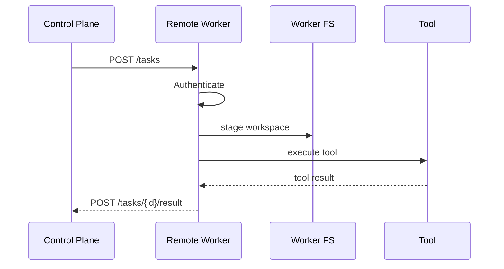

# Runtime Tracing

> 如何在不同架构风格下追踪 Agent Runtime、启动、模型、上下文、工具、权限、状态、持久化、流、错误、取消、恢复。
> 每种架构都给出：追踪步骤、必抓符号、常见入口陷阱、Mermaid 模板。

---

## 0. 通用追踪总则

1. 找到**真实入口**（避免 `dist/`、`build/`、`bin/<name>` 背后的真实 `.js`/`.ts`）。
2. 找到**主循环实体**：函数 / 类 / Task / Workflow / Actor。
3. 抓**入口 → 用户输入接收 → Context 构造 → 模型调用 → 工具调用 → 状态写回 → 终止**全链路。
4. 每跳记录 `File / Lines / Symbol / Caller → Callee`。
5. 不在 README 推断运行行为；必要时跑测试看 log。
6. 同步代码用 call trace；异步用 event loop / scheduler trace。
7. Mermaid 图必须基于真实调用关系（推断用虚线箭头或显式标注）。

---

## 1. 同步调用（直接 while / for / recursion）

**典型栈**

- Python：`while True` / `for ... in range(...)`。
- Node.js：`while (true) { await ... }`。
- Go：`for { ... }`。

**追踪步骤**

1. `grep -n "while\|for\s*(" <runtime-file>`。
2. 找到循环变量递增 / 递减点。
3. 找到条件分支：`if step >= MAX`、`if finish_reason`。
4. 找到每个分支里的 `await call_model(...)` 或 `stream(...)`。
5. 把循环嵌在哪个函数（`agent.run()`、`runner.start()`）。

**必抓符号**

- 循环函数名（如 `step`、`tick`、`loop`）。
- Step 计数器（`step_count`、`iteration`）。
- Termination 标志（`done`、`finished`、`stop_reason`）。

**Mermaid 模板**：本文件末尾"通用模板 1：Loop / Event Loop"。

---

## 2. 异步调用 / Promise / Future / Event Loop

**典型栈**

- Node.js / Deno：`async` + `await` + `Promise`。
- Python：`asyncio.run` + `await`。
- Rust：`tokio::spawn` + `await`。

**追踪步骤**

1. 找到顶层入口函数签名（`async fn`、`pub async fn`）。
2. 找到 await 的关键调用：`await send_message`、`await dispatch`。
3. 找到事件循环驱动：`tokio::main`、`asyncio.run`。
4. 用 Source Map / 函数调用图（IDE）反向追踪。

**必抓符号**

- `main`、`bootstrap`、`entry` 等顶层 async 函数。
- 后台任务创建点：`setTimeout`、`setInterval`、`tokio::spawn`。
- 取消：`AbortController`、`CancellationToken`。

---

## 3. Event Loop / Reactor / State Machine

**典型栈**

- Figma-like：`event → reducer → new_state`。
- 内置 event bus：`emit('tool_call')`。

**追踪步骤**

1. 找状态字段（如 `state: AgentState`）。
2. 找 reducer / transition：`reduce(state, event) -> newState`。
3. 找事件源：`emit('tool_result')`、`emit('user_input')`。
4. 找事件循环：`while (event = queue.pop())`。
5. 把所有事件类型列出。

**必抓符号**

- 状态枚举。
- Reducer 函数。
- Event 名称常量（`TOOL_CALL`、`USER_INPUT`、`MODEL_RESPONSE`）。

---

## 4. State Machine (XState / 显式 FSM)

**典型栈**

- XState：`createMachine(config)`。
- Spring Statemachine。
- 自写 FSM。

**追踪步骤**

1. 找 `createMachine` / `StateMachine`。
2. 列出所有 `states` 与 `on`。
3. 列出所有 `actions` 与 `guards`。
4. 找 `transition` / `send`。

**必抓符号**

- 状态机名。
- Transition 函数。
- Guards（如 `canContinue`）。

---

## 5. Workflow Graph (LangGraph / LlamaIndex Workflow / 自写 DAG)

**典型栈**

- LangGraph：`StateGraph`、`addNode`、`addEdge`、`addConditionalEdges`。
- 自写 DAG。

**追踪步骤**

1. 找 `StateGraph` / `Workflow` / `Pipeline`。
2. 列出所有 nodes 与 edges。
3. 找出 conditional edges 的判断逻辑。
4. trace 一次 start → end 的真实路径。

**必抓符号**

- Node 名。
- Edge 函数 / conditional function。
- State 字段。

---

## 6. Message Queue / Producer-Consumer

**典型栈**

- Celery / RQ / BullMQ / Sidekiq / Dramatiq / Kafka / NATS。

**追踪步骤**

1. 找到 Producer：把任务推到哪个 queue。
2. 找到 Consumer：哪个 worker 进程订阅了哪个 queue。
3. 找到 Task 函数定义。
4. 找到 ack / retry / DLQ 行为。

**必抓符号**

- queue 名。
- consumer 函数。
- retry policy。

---

## 7. Actor Model (Erlang / Akka / Orleans / Microsoft.AutoGen)

**典型栈**

- Actor：每个 actor 有 mailbox，处理消息。

**追踪步骤**

1. 找到 actor 注册表。
2. 找到 actor 实现：`receive`, `on_message`。
3. 找到 supervisor 与生命周期。

**必抓符号**

- actor 名。
- receive 函数。
- supervisor 策略。

---

## 8. Background Worker / Long-running Service

**典型栈**

- Sidekiq / Celery Worker / 自写 worker 进程。

**追踪步骤**

1. 找到 worker 启动入口（worker.ts / worker.py）。
2. 找到 task handler。
3. 找到任务恢复 / 重入逻辑。

**必抓符号**

- worker 启动函数。
- task handler。
- 幂等键。

---

## 9. Remote Worker / Control Plane + Data Plane

**典型栈**

- 控制面 / 数据面分离；Worker 远程 RPC。

**追踪步骤**

1. 找到 Control Plane API（HTTP/gRPC）。
2. 找到 Worker 注册逻辑。
3. 找到任务下发协议。
4. 找到结果回传协议。
5. 找到认证 / 鉴权。

**必抓符号**

- `/v1/tasks` 等 endpoint。
- `register_worker`、`claim_task`、`report_status`。

---

## 10. Client-Server（TUI / Web / Desktop 调用远端 Runtime）

**追踪步骤**

1. 客户端入口（Tauri / Electron / Web）。
2. IPC / WebSocket / HTTP 通道。
3. 服务端 Runtime 入口。
4. 鉴权 / Session 协议。

---

## 11. Tool 调用追踪（跨所有架构）

通用调用链：

```text
User Input
→ Session 获取或创建
→ Context 构造
→ System Prompt 组装
→ Model Request
→ Model Response（含 tool_calls）
→ Tool Call 解析
→ Permission Check（执行前真实拦截）
→ Tool Dispatcher
→ Tool Execution（含 timeout / cancel）
→ Tool Result（结构化 / 字符串）
→ Context 更新 / Session 持久化
→ 下一轮模型调用
→ 终止判定
→ 最终输出
```

每跳都记录：

- `File / Lines / Symbol`
- `Caller → Callee`
- 是否含错误处理 / 取消 / 重试。

---

## 12. 模型请求构造

必须抓到：

- `ModelRequest.builder()` / `ChatCompletion.create()`。
- `messages` 来源（`context.toMessages()`?）。
- `tools` 来源（`registry.list()`?）。
- `temperature` 等参数来源。

---

## 13. 模型响应处理

必须抓到：

- 是否 stream。
- 何时取 `tool_calls`。
- 何时取 `content` / `text`。
- 是否有 `finish_reason` 判断。

---

## 14. 权限检查拦截点

必须抓到：

- `permission.check(...)`、`requireApproval(...)`、`RiskClassifier.classify(...)`。
- 是不是在 Tool dispatcher 之前。
- 是不是异步 UI。

`grep -n` 检查：

```text
grep -rn "requireApproval\|permission.check\|allowTool\|denyTool\|policy.evaluate" <runtime-dir>
```

---

## 15. Tool 执行

必须抓到：

- 超时（`withTimeout`、`asyncio.wait_for`）。
- 取消（`AbortSignal`）。
- 重试（指数退避）。
- 大结果处理（截断 / artifact）。

---

## 16. 状态写回与持久化

必须抓到：

- 写回时机：每 step / 每轮 / checkpoint / 终止。
- 格式：JSONL / SQLite / Postgres / blob。
- 加密 / 压缩。

---

## 17. Streaming 输出

必须抓到：

- 流协议：SSE / WebSocket / 自有协议。
- Backpressure。
- Cancel 传播。
- 错误透传。

---

## 18. 错误路径

必须 trace：

- 模型错误（rate limit / overload / unsupported tool / context too long）。
- Tool 错误（timeout / permission denied / internal）。
- 网络错误。
- 取消错误。

---

## 19. 取消路径

- 用户中断。
- 父子取消。
- 超时取消。

必须 trace `AbortSignal` / `CancellationToken` 的传播链。

---

## 20. 恢复 / 续传

- 进程崩溃后能否从断点续做。
- 是否依赖外部 Queue。
- 是否有幂等键。

---

## 21. 调用链文字 + Mermaid 模板

### 通用模板 1：Loop / Event Loop

```text
UserInput
→ SessionManager.getOrCreate()
→ ContextBuilder.build()
→ ModelAdapter.stream()
→ ToolCallParser.parse()
→ PermissionManager.check()
→ ToolDispatcher.execute()
→ SessionStore.append()
→ AgentLoop.continue()
```



### 通用模板 2：Workflow / DAG



### 通用模板 3：MCP Host



### 通用模板 4：Remote Worker



---

## 22. 实战搜索命令模板

下面是常用的 `grep` / `rg` 命令组合：

```bash
# 找主循环
rg -n "while\s*\(|for\s*\(.*;" <runtime-dir>
rg -n "async function run\(|async fn run\(|def run\(" <runtime-dir>

# 找模型入口
rg -n "createChatCompletion|invokeModel|chat\.completions|anthropic\.messages" <runtime-dir>

# 找工具注册与执行
rg -n "registerTool|@tool|toolRegistry|tools\.register|ToolRegistry\." <runtime-dir>
rg -n "executeTool|dispatchTool|runTool|invokeTool|tools\.call" <runtime-dir>

# 找权限
rg -n "requireApproval|permission\.check|policy\.evaluate|allowTool|denyTool" <runtime-dir>

# 找会话存储
rg -n "sessionStore|saveSession|writeMessages|persistConversation" <runtime-dir>

# 找 MCP
rg -n "MCPClient|@modelcontextprotocol|mcpServer|tools/list|tools/call" <runtime-dir>

# 找子 Agent
rg -n "subagent|subAgent|spawnAgent|newAgent|cloneAgent" <runtime-dir>
```

---

## 23. 验证闭环

完成追踪后必须能够回答：

- [ ] 主循环在哪里？
- [ ] 如何继续 / 停止？
- [ ] 最大轮次如何设置？
- [ ] 超时 / 中断如何处理？
- [ ] 错误如何恢复？
- [ ] 多 Tool Call 是否并发？
- [ ] Streaming 如何实现？
- [ ] 是否存在二次模型调用？
- [ ] 是否存在后台 Loop？
- [ ] Mermaid 图每跳都有 Evidence？

任一项缺失 → 在 `open-questions.md` 登记并继续补做。
