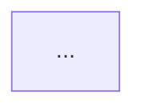

# Architecture

> 架构总览。Phase 3 必交付。

## Metadata

- Project:
- Repository:
- Branch:
- Commit:
- Analyzed at:
- Analyzer:
- Phase: 3
- Confidence:

## Scope

> 本文件覆盖到 Phase 3（含）之前的总览；不重复 phase-specific 内容。

## Executive Summary

> 三到五条 bullet，给 RoboThree 读者抓重点。

## Project Positioning

> 与 `project-overview.md` 引用对齐。

## Architectural Style

> Monolith / Modulith / Microservice / Pipeline / DAG / Event-driven / Actor / FSM。

## Runtime Boundary

> 哪些进程 / 容器 / Worker / Gateway；信任边界在哪。

## Major Components

| Component | Role | Layer | Verified |
| --- | --- | --- | --- |
| | | | |

## Component Relationships

## Entry Points

> 引用 `source-map.md`。

## Agent Runtime

> 主循环实体、推进机制、终止条件。

## Model Layer

> Provider 抽象、ChatCompletion / AnthropicMessages / Custom、统一接口。引用 `model-system.md`。

## Context Layer

> System Prompt、注入、压缩。引用 `context-system.md`。

## Tool Layer

> Registry、Dispatch、Error 标准化。引用 `tool-system.md`。

## Session and State

> 引用 `session-state-memory.md`。

## Memory

> 引用 `session-state-memory.md`。

## Skill, Plugin, Hook and MCP

> 引用 `skill-plugin-mcp.md`。

## Subagent and Worker

> 引用 `subagent-system.md`。

## Permission and Security

> 引用 `permission-system.md` / `security-review.md`。

## Persistence

> 存储介质、格式、时机。

## Deployment

> 引用 `deployment-model.md`。

## Observability and Reliability

> 引用 `observability-reliability.md`。

## Key Design Decisions

| Decision | Alternative | Trade-off |
| --- | --- | --- |
| | | |

## Strengths

## Limitations

## Open Questions

> 引用 `open-questions.md`。

## RoboThree Implications

> 高层判断。等 phase-specific 文件完成后补完整。

## Evidence Index

## Last Updated
