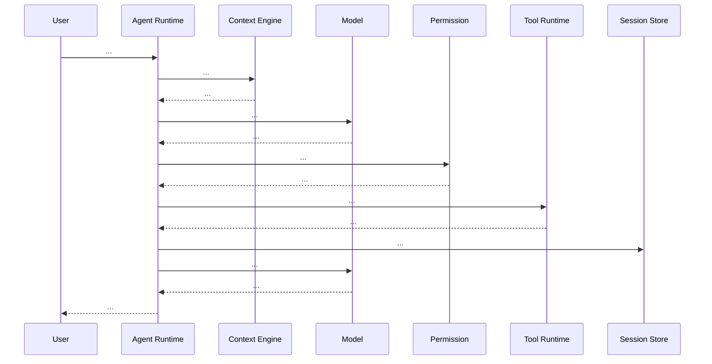

# Runtime Sequence

> 一次完整请求的运行时调用链。Phase 3 的核心交付，与 `architecture.md` 并列。

## Metadata

- Project:
- Repository:
- Branch:
- Commit:
- Analyzed at:
- Analyzer:
- Phase: 3
- Confidence:

## Scope

> 本文件专注于"一次正常请求"的最长调用链；含错误 / 重试 / 取消 / 恢复 / 终止等分支。

## Scenario

> 一句话描述本次 trace 的典型场景（如 "用户在 CLI 输入一个 Bash 任务并允许所有工具执行"）。

## Preconditions

- Workspace:
- Permission:
- Skill loaded:
- MCP servers:
- Memory:

## Entry Point

> File / Lines / Symbol。

## End-to-End Sequence

```text
UserInput
→ <...>
→ Model Response
→ <...>
→ Final Response
```

## Detailed Call Chain

| Step | Symbol | File:Line | Caller | Callee |
| --- | --- | --- | --- | --- |
| 1 | | | | |

## Context Assembly

> 哪些 source 进 Context，谁负责拼接。

## Model Request Construction

> Messages、Tools、参数来源。

## Model Response Handling

> Stream、ToolCall、Content 分支。

## Tool Call Handling

> 解析、归一化、参数校验。

## Permission Check

> 拦截点位置、allowlist 校验、UI 触发。

## Tool Execution

> 超时、取消、并发、结果截断、artifact。

## State Mutation

> 写入 Session、写入 Checkpoint、写入 Memory（如有）。

## Persistence

> 写入数据库、落盘。

## Streaming

> 流协议、Backpressure、Cancel 传播。

## Error Path

- 模型错误：
- Tool 错误：
- 网络错误：
- 取消错误：

## Retry Path

> 哪种错误触发 retry。Backoff 算法。

## Cancellation Path

> AbortSignal / CancellationToken 传播链。

## Resume Path

> 进程退出后能否恢复。依赖外部 Queue？幂等键？

## Stop Conditions

> finish_reason、step_count、user stop、tool error budget。

## Mermaid Sequence Diagram



> 实线 = 实测；虚线 = 推断；显式标注 UNKNOWN。

## Verified Facts

## Inferences

## Unknowns

## RoboThree Implications

## Evidence Index

## Last Updated
