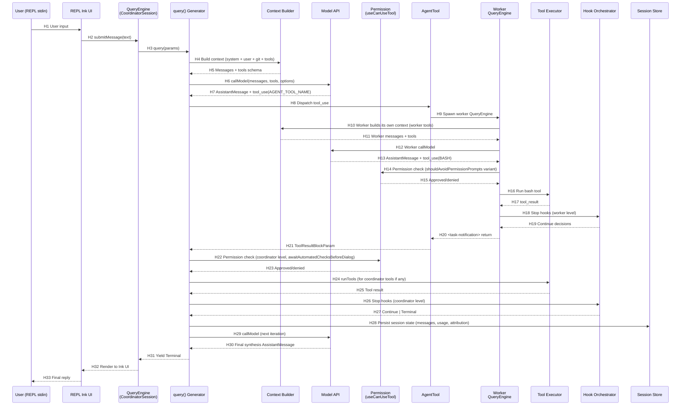

# claude-code-best/claude-code — Runtime Sequence (Stage B)

> 本文档聚焦 **一次主调用的真实链路**（含一次 Tool Call）。Mermaid 表达流程，Hop Evidence 表承载引用。

## 1. 选定的代表性路径

**路径**：Coordinator mode 下，Coordinator 接用户 prompt → 调用一个 `worker` agent → worker 完成 1 次 tool_use（Bash）→ Coordinator 收到 `<task-notification>` → 渲染最终回复。

**选择规则**：满足 Skill §5.2 选择规则——"项目支持 Tool Calling 时，优先选择包含一次 Tool Call 的正常路径"。此路径包含 Tool Call，且是仓库最具创新性的路径（Coordinator → Worker 协议）。

**Level**：static-confirmed。**未运行时验证**（Default-Deny：未安装依赖、未执行项目）。

## 2. 文字链路

```text
User Input (REPL stdin)
  → REPL renderer (Ink UI) / processUserInput
  → QueryEngine.submitMessage(text)
  → getCoordinatorUserContext(mcpClients, scratchpadDir)         [feature-gated]
  → fetchSystemPromptParts(...)                                   [getMainLoopModel / etc.]
  → query(params) AsyncGenerator
      on entry:
        ├─ createTrace (Langfuse) — own or inherit
        ├─ saveCacheSafeParams(createCacheSafeParams(stopHookContext))
        ├─ createBudgetTracker()
        ├─ msgs normalization (normalizeMessagesForAPI)
        └─ autocompactIfNeeded + microcompactMessages
      loop body:
        ├─ getEffectiveContextWindowSize / getCacheThreshold
        ├─ tool discovery → Options.tools via refreshTools?()
        ├─ deps.callModel(messages, tools, options) → AssistantMessage
        ├─ extract tool_use blocks
        ├─ Permission check: canUseTool(toolUseBlock) via useCanUseTool.tsx
        │   └─ ToolPermissionContext lookup + UI prompt
        ├─ StreamingToolExecutor.run OR runTools(toolUseContext)
        │   ├─ tool.call(args, context)
        │   ├─ write state: messages.append(tool_result)
        │   └─ yield ToolUseSummaryMessage
        ├─ handleStopHooks(...)                                     [Stop → TaskCompleted → TeammateIdle]
        ├─ checkTokenBudget(tracker, agentId, budget, turnTokens)   [≤90% AND not diminishing]
        └─ yield to outer caller
      on Terminal:
        └─ flushLangfuse()
```

### 2.1 Coordinator mode 额外路径

```text
Coordinator emits AGENT_TOOL_NAME({ description, subagent_type: 'worker', prompt })
  → built-in AgentTool:
      ├─ workerAgent BuiltInAgentDefinition lookup (getCoordinatorAgents → WORKER_AGENT)
      ├─ resolve tools: ASYNC_AGENT_ALLOWED_TOOLS − INTERNAL_ORCHESTRATION_TOOLS
      ├─ spawn worker QueryEngine (sub-context)
      │     └─ recurring: query() loop in worker context
      │     └─ on tool use: canUseTool with shouldAvoidPermissionPrompts variant
      └─ return task-notification payload
Worker result envelope:
  → Coordinator's QueryEngine receives via toolResult
  → emitted as <task-notification> user-role message in Coordinator's stream
Coordinator continuation:
  → next loop iteration: assistantMessage contains synthesis of <task-notification>
  → Coordinator decides: spawn new worker, send_message, or task_stop
```

## 3. Mermaid sequenceDiagram



## 4. Hop Evidence

> 每跳引用必须包含 File / Lines / Symbol / Evidence Type / Conclusion Type / Confidence。

| Hop | From → To | File | Symbol or Key | Lines | Evidence Type | Conclusion Type | Confidence |
| --- | --- | --- | --- | --- | --- | --- | --- |
| H1 | User → REPL | `src/main.tsx` (full read not extracted) | Ink `Root` + readline | 50-150 | SOURCE | INFERENCE | MEDIUM |
| H2 | REPL → QueryEngine | `src/QueryEngine.ts` | `QueryEngine.submitMessage(text)` | 192-200+ | SOURCE | FACT | HIGH |
| H3 | QueryEngine → query() | `src/QueryEngine.ts` (class) / `src/query.ts` | `query()` | `src/query.ts:276` | SOURCE | FACT | HIGH |
| H4 | query → Context Builder | `src/context.ts` + `src/utils/queryContext.ts` | `getSystemContext`/`getUserContext`/`fetchSystemPromptParts` | `context.ts:36,116,155` | SOURCE | FACT | HIGH |
| H5 | → Messages + tools | `src/Tool.ts` + `src/tools.ts` | `Options.tools: Tools` | `Tool.ts:154`; `tools.ts` `getTools()` | SOURCE | FACT | HIGH |
| H6 | → callModel | `src/query/deps.ts` + `src/services/api/claude.ts` | `deps.callModel = queryModelWithStreaming` | `deps.ts:23,35` | SOURCE | FACT | HIGH |
| H7 | → AssistantMessage+tool_use | `src/types/message.ts` (interp) | `AssistantMessage { message: { content: [tool_use,...] } }` | (interp from `query.ts:30` `ToolUseBlock`) | SOURCE | FACT | HIGH |
| H8 | Dispatch tool_use | `src/services/tools/toolOrchestration.ts` `runTools` | (import in `query.ts:110`) | `query.ts:110` | SOURCE | FACT | MEDIUM |
| H9 | AgentTool → spawn Worker | `packages/builtin-tools/tools/AgentTool/AgentTool.js` | (inline from coordinated use) | (interp from `coordinatorMode.ts:174`) | SOURCE | INFERENCE | MEDIUM |
| H10 | Worker Context | `src/coordinator/workerAgent.ts` `WORKER_AGENT` | `tools: getWorkerTools()` | `workerAgent.ts:35-39` | SOURCE | FACT | HIGH |
| H11 | Worker messages+tools | `src/Tool.ts` `Tools` | `getTools()` (filtered) | `Tool.ts:154` | SOURCE | FACT | HIGH |
| H12 | Worker callModel | `src/query.ts` `deps.callModel` | (same as H6) | `query.ts:276+` | SOURCE | FACT | HIGH |
| H13 | AssistantMessage+tool_use(BASH) | `src/types/message.ts`; `BASH_TOOL_NAME` | `BASH_TOOL_NAME` constant | `coordinatorMode.ts:9` import | SOURCE | FACT | HIGH |
| H14 | Permission (worker) | `src/hooks/useCanUseTool.tsx` | (12.9 KB hook) | `useCanUseTool.tsx` import in Tool.ts:13 | SOURCE | FACT | HIGH |
| H15 | Approved/denied | `src/Tool.ts:114` `ToolPermissionContext` | `shouldAvoidPermissionPrompts?: boolean` | `Tool.ts:124` | SOURCE | FACT | HIGH |
| H16 | Run bash tool | `src/services/tools/StreamingToolExecutor.ts` | `StreamingToolExecutor` | `query.ts:108` import | SOURCE | FACT | MEDIUM |
| H17 | tool_result | `src/utils/messages.ts` `createUserMessage` | (interp) | `query.ts:50-58` import | SOURCE | FACT | MEDIUM |
| H18 | Stop hooks (worker level) | `src/query/stopHooks.ts:62` | `handleStopHooks(...)` | `stopHooks.ts:62-485` | SOURCE | FACT | HIGH |
| H19 | Continue decision | `src/query/transitions.ts` `Continue` | `type Continue` | `transitions.ts:13-21` | SOURCE | FACT | HIGH |
| H20 | <task-notification> | `src/coordinator/coordinatorMode.ts` (system prompt) | `getCoordinatorSystemPrompt()` lines 142-164 | `coordinatorMode.ts:142-164` | SOURCE | FACT | HIGH |
| H21 | ToolResultBlockParam | `src/types/message.ts`; `createUserMessage` | (interp) | — | INFERENCE | INFERENCE | MEDIUM |
| H22 | Coordinator Permission | `src/Tool.ts:114` `awaitAutomatedChecksBeforeDialog` | `awaitAutomatedChecksBeforeDialog?: boolean` | `Tool.ts:126` | SOURCE | FACT | HIGH |
| H23 | Approved/denied | same as H15 | — | — | INFERENCE | INFERENCE | MEDIUM |
| H24 | runTools (coordinator tools) | `src/services/tools/toolOrchestration.ts` `runTools` | (already H8) | — | SOURCE | FACT | MEDIUM |
| H25 | Tool result | `src/utils/messages.ts` | — | — | INFERENCE | INFERENCE | MEDIUM |
| H26 | Stop hooks (coordinator) | `src/query/stopHooks.ts:62` `handleStopHooks` | (already H18) | — | SOURCE | FACT | HIGH |
| H27 | Continue \| Terminal | `src/query/transitions.ts` `Terminal` | `type Terminal` | `transitions.ts:1-11` | SOURCE | FACT | HIGH |
| H28 | Session persist | `src/utils/sessionStorage.ts` + `flushSessionStorage` | (imported in QueryEngine.ts:77) | `QueryEngine.ts:77` | SOURCE | FACT | HIGH |
| H29 | next callModel | (already H6) | — | — | SOURCE | FACT | HIGH |
| H30 | Final synthesis | AssistantMessage | — | — | INFERENCE | INFERENCE | MEDIUM |
| H31 | Yield Terminal | `src/query.ts:276` | `query(): AsyncGenerator<..., Terminal>` | `query.ts:278-285` | SOURCE | FACT | HIGH |
| H32 | Render | `src/main.tsx` Ink `Root` | — | `main.tsx` (247 KB) | SOURCE | INFERENCE | MEDIUM |
| H33 | Final reply | `src/main.tsx` | — | — | INFERENCE | INFERENCE | MEDIUM |

## 5. 关键 Hop 详解

### 5.1 H6 — callModel DI

```text
src/query/deps.ts:21-40
type QueryDeps = {
  callModel: typeof queryModelWithStreaming   // DI override
  microcompact: typeof microcompactMessages
  autocompact: typeof autoCompactIfNeeded
  uuid: () => string
}
productionDeps(): QueryDeps = {
  callModel: queryModelWithStreaming,
  microcompact: microcompactMessages,
  autocompact: autoCompactIfNeeded,
  uuid: randomUUID,
}
```

关键设计：调用接口使用 `typeof fn` 跟随真实签名。tests 可直接 fake 注入，无需 spyOn-per-module。**Scope intentionally narrow (4 deps) to prove the pattern**——注释明示未来会扩到更多。

### 5.2 H18 — Stop hooks 三段式

```text
src/query/stopHooks.ts:62-485 handleStopHooks(...)

phase 0: pre-hook bookkeeping
  ├─ saveCacheSafeParams (only for querySource='repl_main_thread'|'sdk')
  ├─ job classifier (feature('TEMPLATES') AND process.env.CLAUDE_JOB_DIR)
  ├─ executePromptSuggestion  (non-blocking)
  ├─ executeExtractMemories   (fire-and-forget)
  └─ executeAutoDream         (fire-and-forget)

phase 1: executeStopHooks (parallel)
  └─ for each result: yield progress, track toolUseID, collect hookErrors, check preventContinuation

phase 2: TaskCompleted hooks (only if isTeammate())
  └─ for each in_progress task owned by this teammate

phase 3: TeammateIdle hooks (only if isTeammate())
```

每个 hook 可：
- yield 一个或多个 progress messages（带 toolUseID + durationMs）
- 返回 blockingError（→ UserMessage isMeta:true）
- 抛 `preventContinuation: true`（→ `hook_stopped_continuation` attachment，stopReason）

AbortController.signal.aborted 在每个 hook 完成时检查；abort → 立即 `{blockingErrors:[], preventContinuation:true}`。

### 5.3 H20 — `<task-notification>` XML 协议

```text
src/coordinator/coordinatorMode.ts:142-164 （in getCoordinatorSystemPrompt）

<task-notification>
<task-id>{agentId}</task-id>
<status>completed|failed|killed</status>
<summary>{human-readable status summary}</summary>
<result>{agent's final text response}</result>
<usage>
  <total_tokens>N</total_tokens>
  <tool_uses>N</tool_uses>
  <duration_ms>N</duration_ms>
</usage>
</task-notification>
```

- 以 user-role message 注入 coordinator stream
- `<result>` 和 `<usage>` 是可选 sections
- `<status>: "failed: {error}"` 用于错误情况
- coordinator 通过 `<task-id>` 用 `SEND_MESSAGE_TOOL_NAME({to:"agent-a1b", ...})` 继续 worker
- 通过 `TASK_STOP_TOOL_NAME({task_id:"agent-x7q"})` 停止 worker（task_id 来自 AGENT_TOOL_NAME launch result）

### 5.4 H27 — Token Budget Diminishing Returns

```text
src/query/tokenBudget.ts:45-93 checkTokenBudget(tracker, agentId, budget, globalTurnTokens)

if (agentId || budget === null || budget <= 0) return { action:'stop', completionEvent:null }
const turnTokens = globalTurnTokens
const pct = Math.round((turnTokens / budget) * 100)
const deltaSinceLastCheck = globalTurnTokens - tracker.lastGlobalTurnTokens

const isDiminishing =
  tracker.continuationCount >= 3 &&
  deltaSinceLastCheck < DIMINISHING_THRESHOLD &&   // 500
  tracker.lastDeltaTokens < DIMINISHING_THRESHOLD   // 500

if (!isDiminishing && turnTokens < budget * COMPLETION_THRESHOLD) {  // 0.9
  tracker.continuationCount++
  tracker.lastDeltaTokens = deltaSinceLastCheck
  tracker.lastGlobalTurnTokens = globalTurnTokens
  return { action:'continue', nudgeMessage, continuationCount, pct, turnTokens, budget }
}
if (isDiminishing || tracker.continuationCount > 0) {
  return { action:'stop', completionEvent: { ...diminishingReturns:true/false } }
}
return { action:'stop', completionEvent:null }
```

关键结论：
1. **`agentId` 优先 stop**——只有 root agent（无 agentId）能享受 budget continuation；sub-agent 由 root 控制
2. **90% 阈值**：budget 用到 90% 才会停，每次停顿都计入 tracker
3. **3 次后判 diminishing**：`continuationCount ≥ 3` AND `delta < 500` AND `lastDelta < 500` → stop

### 5.5 Coordinator ↔ Worker Tool 隔离

```text
src/coordinator/coordinatorMode.ts:29-34
const INTERNAL_WORKER_TOOLS = new Set([
  TEAM_CREATE_TOOL_NAME,
  TEAM_DELETE_TOOL_NAME,
  SEND_MESSAGE_TOOL_NAME,
  SYNTHETIC_OUTPUT_TOOL_NAME,
])

src/coordinator/workerAgent.ts:24-29
const INTERNAL_ORCHESTRATION_TOOLS = new Set([
  TEAM_CREATE_TOOL_NAME, TEAM_DELETE_TOOL_NAME,
  SEND_MESSAGE_TOOL_NAME, SYNTHETIC_OUTPUT_TOOL_NAME,
])

src/coordinator/coordinatorMode.ts:88-95
const workerTools = isEnvTruthy(process.env.CLAUDE_CODE_SIMPLE)
  ? [BASH, READ, EDIT].sort().join(', ')                          // 简单模式
  : Array.from(ASYNC_AGENT_ALLOWED_TOOLS)
      .filter(name => !INTERNAL_WORKER_TOOLS.has(name))
      .sort()
      .join(', ')                                                // 完整模式
```

**Worker 无法 spawn 自己的 worker**——`SEND_MESSAGE` / `AGENT` 都在 internal set 中。

## 6. 错误 / 取消 / 恢复路径（补充）

### 6.1 Max Output Tokens Recovery

```text
src/query.ts:194
const MAX_OUTPUT_TOKENS_RECOVERY_LIMIT = 3

src/query/transitions.ts:15-17
| { reason: 'max_output_tokens_escalate' }
| { reason: 'max_output_tokens_recovery'; attempt: number }
```

最多重试 3 次（escalation 或 recovery），attempts 计数到 3 强制 `max_output_tokens`。

### 6.2 取消

- `AbortController` 在 `ToolUseContext.abortController`
- 每个 tool.execute 都可接 `signal`
- 每个 hook 检查 `toolUseContext.abortController.signal.aborted`
- 用户 Ctrl-C → abort signal → `createUserInterruptionMessage` → terminal

### 6.3 恢复

- `getSessionId()` 在 `bootstrap/state.ts`
- `matchSessionMode()` 在 `coordinatorMode.ts:49` 把 `process.env.CLAUDE_CODE_COORDINATOR_MODE` 翻转到持久 session 状态
- `saveCacheSafeParams(createCacheSafeParams(stopHookContext))` 把 session 上下文保存为 cache-safe 快照
- REPL `claude --continue <id>` / `claude --resume <id>` 重新 hydrate

## 7. 工具执行双路径

```text
model emits N tool_use blocks:
  ├─ if N==1 and single-tool sequential: StreamingToolExecutor (synchronous stream-driven)
  └─ if N>=2 parallel: runTools (multi-tool orchestration)
```

`src/query.ts:108` import `StreamingToolExecutor`（`from './services/tools/StreamingToolExecutor.js'`）。
`src/query.ts:110` import `runTools`（`from './services/tools/toolOrchestration.js'`）。

两者由 query 循环根据工具数和策略选择。

## 8. 总结：调用链要点

| 关键决策点 | 位置 | 选择 |
| --- | --- | --- |
| Tool discovery | `src/Tool.ts` `Options.refreshTools?` | 支持 MCP server 中途连接后刷新 |
| Model API 选择 | `src/utils/model/providers.ts` `getAPIProvider()` | 多 provider 透明 |
| 工具执行模式 | `StreamingToolExecutor` vs `runTools` | 1 tool → stream；N tools → parallel |
| Compaction | `autoCompact` + `microcompact` + `reactiveCompact` + `history-snip` | 4 种压缩策略，feature-gated |
| Hook 三段式 | Stop → TaskCompleted → TeammateIdle | teammate 视角 |
| Token Budget | 90% + Diminishing 3x | Diminishing 防止无效 continue |
| Async session | `taskSummary` + `BG_SESSIONS` feature | background jobs (`BG_SESSIONS` feature-gated string) |
| Langfuse | per-Query span | 可观测粒度 per turn |
