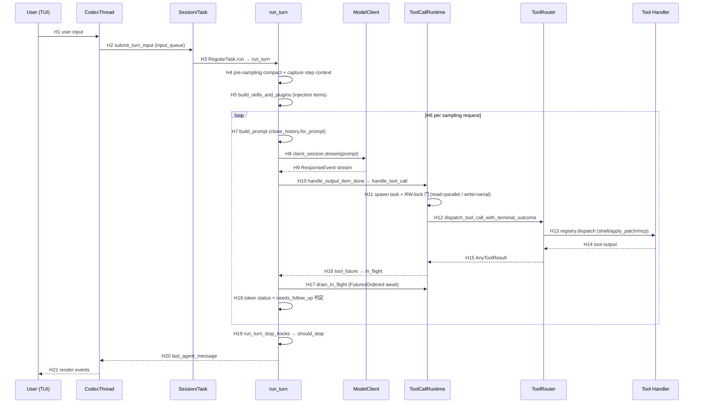

# Runtime Sequence — Codex CLI 一次完整调用链

> Commit `e766f7598993ce37cf61b9c26c80cc2ba3a4f2d7`。
> **Confirmed by**: source（静态源码分析；未运行时验证）。

## 1. 文字链路

```text
User input (TUI)
→ CodexThread.submit()                      [codex_thread.rs:193]
→ start_or_steer_turn()                      [codex_thread.rs:265]
→ submit_turn_input_with_mode()              [codex_thread.rs:317]
→ Session.io.submit_turn_input()             → 入队 input_queue
→ tasks/RegularTask::run()                   [tasks/regular.rs:39]
→ run_turn()                                 [session/turn.rs:153]
   ├─ run_pre_sampling_compact()             [turn.rs:997]
   ├─ capture_step_context_with_required_mcp_servers()  [turn.rs:207]
   ├─ build_skills_and_plugins()             [turn.rs:740]
   └─ loop {
        run_sampling_request()               [turn.rs:1325]
          → build_prompt()                    [turn.rs:1297]
          → try_run_sampling_request()        [turn.rs:2154]
             → ModelClientSession.stream()    [client.rs:1851]
             → loop over ResponseEvent        [turn.rs:2219]
                ├─ OutputItemDone → handle_output_item_done()  [stream_events_utils.rs:288]
                │    → ToolRouter.build_tool_call()             [router.rs:154]
                │    → ToolCallRuntime.handle_tool_call()       [parallel.rs:73]
                │        → handle_tool_call_with_source()       [parallel.rs:92]
                │            → tokio::spawn + RW-lock 门
                │            → ToolRouter.dispatch_tool_call_with_terminal_outcome()  [router.rs:233]
                │                → ToolRegistry.dispatch_any_with_terminal_outcome()
                │                    → handler（shell/apply_patch/mcp/…）
                │    → tool_future 入 in_flight: FuturesOrdered
                └─ Completed → record_token_usage_info + end_turn 判定
             → drain_in_flight()              [turn.rs:2105]  （并发 await 工具）
        → context_window_token_status()       [turn.rs:396]
        → needs_follow_up 判定 → 压缩 / 继续 / 停止
        → run_turn_stop_hooks()               [turn.rs:484] → break
      }
→ last_agent_message → 事件流 → TUI 渲染
```

## 2. Mermaid 调用链



## 3. Hop Evidence

| Hop | From → To | File | Symbol or Key | Lines | Evidence Type | Conclusion Type | Confidence |
|---|---|---|---|---|---|---|---|
| H1 | UserInput → CodexThread | codex-rs/core/src/codex_thread.rs | `submit()` | 193-206 | SOURCE | FACT | HIGH |
| H2 | CodexThread → Session | codex-rs/core/src/codex_thread.rs | `start_or_steer_turn()` / `submit_turn_input_with_mode()` | 265-331 | SOURCE | FACT | HIGH |
| H3 | Session → run_turn | codex-rs/core/src/tasks/regular.rs | `RegularTask::run()` | 39-91 | SOURCE | FACT | HIGH |
| H4 | run_turn → pre-sampling | codex-rs/core/src/session/turn.rs | `run_pre_sampling_compact()` | 997-1029 (call 169) | SOURCE | FACT | HIGH |
| H5 | run_turn → skills/plugins | codex-rs/core/src/session/turn.rs | `build_skills_and_plugins()` | 740-882 (call 230) | SOURCE | FACT | HIGH |
| H6 | run_turn → loop | codex-rs/core/src/session/turn.rs | `loop {}` | 281-568 | SOURCE | FACT | HIGH |
| H7 | loop → build prompt | codex-rs/core/src/session/turn.rs | `clone_history().for_prompt()` | 351-356 | SOURCE | FACT | HIGH |
| H8 | loop → model stream | codex-rs/core/src/session/turn.rs | `client_session.stream(...)` | 2184-2197 | SOURCE | FACT | HIGH |
| H8b | ModelClientSession.stream | codex-rs/core/src/client.rs | `ModelClientSession::stream()` | 1851+ | SOURCE | FACT | HIGH |
| H9 | model → ResponseEvent | codex-rs/core/src/session/turn.rs | `ResponseEvent` match | 2262-2701 | SOURCE | FACT | HIGH |
| H10 | OutputItemDone → handle_output_item_done | codex-rs/core/src/stream_events_utils.rs | `handle_output_item_done()` | 288-390 | SOURCE | FACT | HIGH |
| H10b | item → ToolCall | codex-rs/core/src/tools/router.rs | `ToolRouter::build_tool_call()` | 154-206 | SOURCE | FACT | HIGH |
| H11 | ToolCallRuntime → spawn + RW-lock 门 | codex-rs/core/src/tools/parallel.rs | `handle_tool_call_with_source()` | 92-222 | SOURCE | FACT | HIGH |
| H11b | RW-lock 门 | codex-rs/core/src/tools/parallel.rs | `lock.read()` vs `lock.write()` | 153-157 | SOURCE | FACT | HIGH |
| H12 | ToolCallRuntime → ToolRouter | codex-rs/core/src/tools/router.rs | `dispatch_tool_call_with_terminal_outcome()` | 233-253 | SOURCE | FACT | HIGH |
| H13 | ToolRouter → handler | codex-rs/core/src/tools/router.rs | `registry.dispatch_any_with_terminal_outcome()` | 287-289 | SOURCE | FACT | HIGH |
| H14-15 | handler → AnyToolResult | codex-rs/core/src/tools/registry.rs | `AnyToolResult` | — | SOURCE | FACT | HIGH |
| H16 | tool_future → in_flight | codex-rs/core/src/session/turn.rs | `in_flight.push_back(tool_future)` | 2360-2362 | SOURCE | FACT | HIGH |
| H17 | drain_in_flight (并发 await) | codex-rs/core/src/session/turn.rs | `drain_in_flight()` | 2105-2129 (call 2718) | SOURCE | FACT | HIGH |
| H18 | token + follow_up 判定 | codex-rs/core/src/session/turn.rs | `context_window_token_status()` + `needs_follow_up` | 393-480 | SOURCE | FACT | HIGH |
| H19 | stop hooks | codex-rs/core/src/session/turn.rs | `run_turn_stop_hooks()` | 484-519 | SOURCE | FACT | HIGH |
| H20-21 | result → TUI | codex-rs/core/src/session/turn.rs | `last_agent_message` return | 570 | SOURCE | FACT | HIGH |

## 4. 补充路径

### 4.1 取消路径

**[F]** 取消令牌从 `run_turn` 一路下传到工具层：`cancellation_token.child_token()`（[turn.rs:371](../../sources/codex/codex-rs/core/src/session/turn.rs#L371)）。工具层 `tokio::select!` 在 `cancellation_token.cancelled()` 分支处理（[parallel.rs:180-219](../../sources/codex/codex-rs/core/src/tools/parallel.rs#L180-L219)）：

- 若 `terminal_outcome_reached` 或 dispatch 已结束 → await 取回结果。
- 若 `wait_for_runtime_cancellation`（持久 runtime 如 shell）→ 等 runtime 完成进程回收再返回 aborted。
- 否则 `dispatch_handle.abort()` → 立即 aborted。

**[F]** `try_run_sampling_request` 在流事件 `or_cancel` 时返回 `CodexErr::TurnAborted`（[turn.rs:2242-2244](../../sources/codex/codex-rs/core/src/session/turn.rs#L2242-L2244)）。

### 4.2 错误 / 重试路径

**[F]** `run_sampling_request` 的重试循环（[turn.rs:1355-1427](../../sources/codex/codex-rs/core/src/session/turn.rs#L1355-L1427)）：`try_run_sampling_request` 返回 `is_retryable()` 的错误时，走 `handle_retryable_response_stream_error`（带 `stream_max_retries`），复用 `client_session` 的 sticky routing。

### 4.3 压缩路径

**[F]** 两种压缩时机：pre-turn（`run_pre_sampling_compact`）与 mid-turn（`should_roll_over` → `run_auto_compact`，[turn.rs:452-479](../../sources/codex/codex-rs/core/src/session/turn.rs#L452-L479)）。

## 5. 置信度说明

- **H1-H21 主链路**：HIGH — 全部由源码交叉验证（codex_thread.rs + tasks/regular.rs + turn.rs + stream_events_utils.rs + parallel.rs + router.rs）。
- **取消时机**：MEDIUM — 静态代码路径确认，未运行时验证。
- **实际并发度**：MEDIUM — `FuturesOrdered` 语义明确，但具体并发上限未实测。
