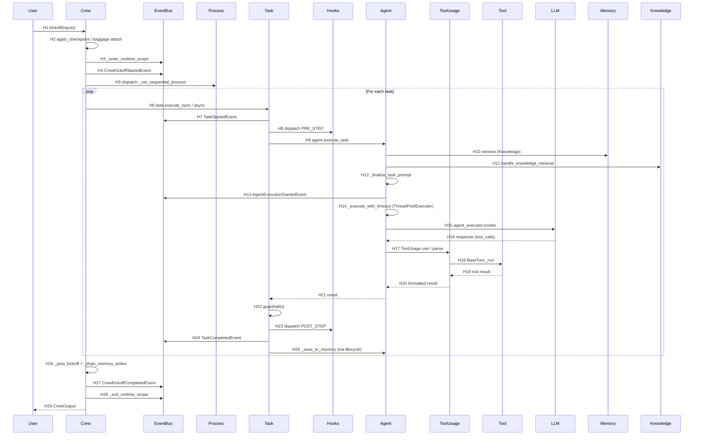

# CrewAI — Runtime Sequence (End-to-End)

> **路径**：用户调用 `Crew.kickoff(inputs)` → 一次包含 Tool Call 的 Sequential 完整路径
> **方法**：源码静态分析（已读 `crew.py` / `task.py` / `agent/core.py` / `experimental/agent_executor.py` / `tools/tool_usage.py` / `memory/unified_memory.py` / `process.py` / `events/event_bus.py`）
> **置信度**：HIGH（主流程） / MEDIUM（部分运行时行为）

## 1. 文字链路

```
User code
  └─ crew.kickoff(inputs={"topic": "..."})
       └─ [crew.py:992] Crew.kickoff
            ├─ apply_checkpoint (from_checkpoint)
            ├─ baggage.attach(crew_context)
            ├─ begin_execution() (execution.py)
            ├─ crewai_event_bus._enter_runtime_scope()
            ├─ prepare_kickoff(self, inputs, input_files)
            ├─ if self.process == Process.sequential:
            │     result = self._run_sequential_process()
            │  elif self.process == Process.hierarchical:
            │     result = self._run_hierarchical_process()
            └─ [crew.py:1047-1086] try/finally:
                  ├─ CrewKickoffCompletedEvent.emit
                  ├─ after_kickoff_callbacks
                  ├─ _post_kickoff
                  ├─ calculate_usage_metrics
                  ├─ _drain_memory_writes  (memory draining block)
                  ├─ detach(token)
                  ├─ end_execution
                  └─ crewai_event_bus._exit_runtime_scope
```

```
_run_sequential_process  (crew.py:1509)
  └─ _execute_tasks(self.tasks)
       └─ for task_index, task in enumerate(tasks):
            ├─ prepare_task_execution (delegated to crews/utils.py)
            ├─ if task is ConditionalTask → _handle_conditional_task
            ├─ if task.async_execution:
            │     future = task.execute_async(agent, context, tools)
            │     futures.append((task, future, task_index))
            └─ else:
                  if futures: → wait on Futures, then continue
                  task.execute_sync(agent, context, tools)
```

```
Task.execute_sync  (task.py:585)
  └─ _execute_core(agent, context, tools)  (task.py:806)
       ├─ set_current_task_id
       ├─ _store_input_files
       ├─ emit TaskStartedEvent
       ├─ dispatch(InterceptionPoint.PRE_STEP, StepContext)
       ├─ with tool_failure_collector():
       │     result = agent.execute_task(task=self, context=context, tools=tools)
       ├─ _post_agent_execution(agent)
       ├─ construct TaskOutput (raw / pydantic / json_dict / messages / tool_failures)
       ├─ invoke guardrail(s)  (sequential)
       ├─ dispatch(InterceptionPoint.POST_STEP, StepContext)
       ├─ optional callback → crew.task_callback
       ├─ optional output_file write
       ├─ emit TaskCompletedEvent
       └─ finally: clear_task_files, reset_current_task_id
```

```
Agent.execute_task  (agent/core.py:822)
  ├─ task_prompt = _prepare_task_execution(task, context)
  ├─ knowledge_config = get_knowledge_config(self)
  ├─ task_prompt = handle_knowledge_retrieval(...)
  ├─ task_prompt = _finalize_task_prompt(task_prompt, tools, task)
  ├─ emit AgentExecutionStartedEvent
  ├─ if max_execution_time:
  │     result = _execute_with_timeout(task_prompt, task, timeout)
  └─ else:
        result = _execute_without_timeout(task_prompt, task)
       └─ agent_executor.invoke({"input": ..., "tool_names": ..., "tools": ..., "ask_for_human_input": ...})
            └─ [experimental/agent_executor.py:2802] AgentExecutor.invoke
                 ├─ _execution_lock.acquire
                 ├─ reset state (messages, iterations, ...)
                 ├─ _setup_messages(inputs)
                 ├─ _inject_files_from_inputs(inputs)
                 ├─ with _llm_stop_words_applied(self.llm, self):
                 │     self.kickoff()   ← Flow 启动
                 │       └─ _invoke_loop → start → tool → listen → ... → finish
                 │     formatted_answer = state.current_answer
                 │     if ask_for_human_input: _handle_human_feedback
                 ├─ _save_to_memory(formatted_answer)
                 └─ return {"output": formatted_answer.output}
```

## 2. Mermaid Sequence (Normal / Source-Confirmed)



## 3. Hop Evidence

| Hop | From → To | File | Symbol or Key | Lines | Evidence Type | Conclusion | Confidence |
|---|---|---|---|---|---|---|---|
| H1 | User → Crew | [lib/crewai/src/crewai/crew.py](../../sources/crewai/lib/crewai/src/crewai/crew.py) | `Crew.kickoff` | 992-1086 | SOURCE | FACT | HIGH |
| H2 | Crew → Checkpoint / Baggage | [crew.py](../../sources/crewai/lib/crewai/src/crewai/crew.py) | `apply_checkpoint` + `baggage.set_baggage` | 1010, 1040-1043 | SOURCE | FACT | HIGH |
| H3 | Crew → EventBus | [crew.py](../../sources/crewai/lib/crewai/src/crewai/crew.py) | `crewai_event_bus._enter_runtime_scope` | 1047 | SOURCE | FACT | HIGH |
| H4 | Crew → EventBus | [crew.py](../../sources/crewai/lib/crewai/src/crewai/crew.py) | `CrewKickoffStartedEvent` (emit 之前) | ~1045 | SOURCE | FACT | HIGH |
| H5 | Crew → Process | [crew.py](../../sources/crewai/lib/crewai/src/crewai/crew.py) | `if self.process == Process.sequential:` | 1051-1058 | SOURCE | FACT | HIGH |
| H6 | Crew → Task | [crew.py](../../sources/crewai/lib/crewai/src/crewai/crew.py) | `task.execute_sync(agent, context, tools)` | 1607-1620 | SOURCE | FACT | HIGH |
| H7 | Task → EventBus | [task.py](../../sources/crewai/lib/crewai/src/crewai/task.py) | `crewai_event_bus.emit(self, TaskStartedEvent(...))` | 831-833 | SOURCE | FACT | HIGH |
| H8 | Task → Hooks | [task.py](../../sources/crewai/src/crewai/task.py) | `dispatch(InterceptionPoint.PRE_STEP, pre_step_ctx)` | 846 | SOURCE | FACT | HIGH |
| H9 | Task → Agent | [task.py](../../sources/crewai/src/crewai/task.py) | `agent.execute_task(task=self, context=context, tools=tools)` | 850-854 | SOURCE | FACT | HIGH |
| H10 | Agent → Memory | [agent/core.py](../../sources/crewai/lib/crewai/src/crewai/agent/core.py) | `_retrieve_memory_context` (`_finalize_task_prompt`) | 568-684 | SOURCE | FACT | HIGH |
| H11 | Agent → Knowledge | [agent/core.py](../../sources/crewai/lib/crewai/src/crewai/agent/core.py) | `handle_knowledge_retrieval` | 846-855 | SOURCE | FACT | HIGH |
| H12 | Agent → Agent | [agent/core.py](../../sources/crewai/lib/crewai/src/crewai/agent/core.py) | `_finalize_task_prompt` | 568-619 | SOURCE | FACT | HIGH |
| H13 | Agent → EventBus | [agent/core.py](../../sources/crewai/lib/crewai/src/crewai/agent/core.py) | `AgentExecutionStartedEvent(...).emit` | 860-868 | SOURCE | FACT | HIGH |
| H14 | Agent → ThreadPool | [agent/core.py](../../sources/crewai/lib/crewai/src/crewai/agent/core.py) | `concurrent.futures.ThreadPoolExecutor.submit(ctx.run, ...)` | 909-913 | SOURCE | FACT | HIGH |
| H15 | Agent → AgentExecutor | [agent/core.py](../../sources/crewai/lib/crewai/src/crewai/agent/core.py) | `agent_executor.invoke({"input": ...})` | 946-953 | SOURCE | FACT | HIGH |
| H16 | LLM → AgentExecutor | [experimental/agent_executor.py](../../sources/crewai/lib/crewai/src/crewai/experimental/agent_executor.py) | `state.current_answer` (result of Flow节点) | 2865 | SOURCE | FACT | HIGH |
| H17 | AgentExecutor → ToolUsage | [experimental/agent_executor.py](../../sources/crewai/lib/crewai/src/crewai/experimental/agent_executor.py) | (Flow 节点，依赖 AgentExecutor 实现) | 173-3297 | SOURCE | FACT | MEDIUM |
| H18 | ToolUsage → Tool | [tools/tool_usage.py](../../sources/crewai/lib/crewai/src/crewai/tools/tool_usage.py) | `ToolUsage._use / _function_calling` | 497-923 | SOURCE | FACT | HIGH |
| H19 | Tool → ToolUsage | [tools/base_tool.py](../../sources/crewai/lib/crewai/src/crewai/tools/base_tool.py) | `BaseTool._run` | 388 | SOURCE | FACT | HIGH |
| H20 | ToolUsage → AgentExecutor | [tools/tool_usage.py](../../sources/crewai/lib/crewai/src/crewai/tools/tool_usage.py) | `_format_result` | 748 | SOURCE | FACT | HIGH |
| H21 | AgentExecutor → Task | [task.py](../../sources/crewai/src/crewai/task.py) | `result = agent.execute_task(...)` (return path) | 850-854 | SOURCE | FACT | HIGH |
| H22 | Task → Task | [task.py](../../sources/crewai/src/crewai/task.py) | `_invoke_guardrail_function` | 891-905 | SOURCE | FACT | HIGH |
| H23 | Task → Hooks | [task.py](../../sources/crewai/src/crewai/task.py) | `dispatch(InterceptionPoint.POST_STEP, post_step_ctx)` | 916 | SOURCE | FACT | HIGH |
| H24 | Task → EventBus | [task.py](../../sources/crewai/src/crewai/task.py) | `TaskCompletedEvent(...).emit` | 949-952 | SOURCE | FACT | HIGH |
| H25 | Task → Memory (via lifecycle) | [experimental/agent_executor.py](../../sources/crewai/lib/crewai/src/crewai/experimental/agent_executor.py) | `_save_to_memory(formatted_answer)` | 2875 | SOURCE | FACT | HIGH |
| H26 | Crew → Crew | [crew.py](../../sources/crewai/lib/crewai/src/crewai/crew.py) | `_drain_memory_writes + calculate_usage_metrics` | 1082-1086 | SOURCE | FACT | HIGH |
| H27 | Crew → EventBus | [crew.py](../../sources/crewai/lib/crewai/src/crewai/crew.py) | `CrewKickoffCompletedEvent` (crews/utils.py) | (delegated) | SOURCE | FACT | HIGH |
| H28 | Crew → EventBus | [crew.py](../../sources/crewai/lib/crewai/src/crewai/crew.py) | `crewai_event_bus._exit_runtime_scope` | 1086 | SOURCE | FACT | HIGH |
| H29 | Crew → User | [crew.py](../../sources/crewai/lib/crewai/src/crewai/crew.py) | `return result` | 1067 | SOURCE | FACT | HIGH |

## 4. Side Paths（不并入主图）

### 4.1 Hierarchical Process

- `_run_hierarchical_process` (1513) → `_create_manager_agent`
  - 若 `manager_agent` 已存在：强制 `manager.tools = []` 并 `raise Exception("Manager agent should not have tools")`（[crew.py:1529](../../sources/crewai/lib/crewai/src/crewai/crew.py#L1529)）。
  - 若未提供：以 `AgentTools(agents).tools()` 创建 `Agent(allow_delegation=True)`，回填 `self.manager_agent`（[crew.py:1531-1542](../../sources/crewai/lib/crewai/src/crewai/crew.py#L1531-L1542)）。
- Manager Agent 的 LLM 决策通过 `DelegateWorkTool._run` → `_execute` → `_handle_coworker`（[agent_tools/delegate_work_tool.py](../../sources/crewai/lib/crewai/src/crewai/tools/agent_tools/delegate_work_tool.py)），**实际是把任务「分发」给同事 Agent**。

### 4.2 Async Task Execution

- `task.async_execution = True` → `execute_async` → `concurrent.futures.Future` + `threading.Thread(target=ctx.run, ...)`（[task.py:616-622](../../sources/crewai/src/crewai/task.py#L616-L622)）。
- 主线程在每条 sync task 执行前 `if futures:`，先打 join（[crew.py:1608-1610](../../sources/crewai/lib/crewai/src/crewai/crew.py#L1608-L1610)）。

### 4.3 Timeout

- `agent.max_execution_time` → `validate_max_execution_time` → `ThreadPoolExecutor.submit(...).result(timeout=...)`（[agent/core.py:909-919](../../sources/crewai/lib/crewai/src/crewai/agent/core.py#L909-L919)）。
- 超时：捕获 `concurrent.futures.TimeoutError` → `raise TimeoutError(...)` → emit `AgentExecutionErrorEvent` → `_handle_execution_error` 决定是否重试。

### 4.4 Guardrail

- `Task._guardrail` / `Task._guardrails` 是输出校验 + 重试（[task.py:889-905](../../sources/crewai/src/crewai/task.py#L889-L905)）。
- `_invoke_guardrail_function` 调用用户函数（支持 async）→ 若失败 → 决定是否 retry (`max_retries`)。
- Guardrail 在 `POST_STEP` hook 之前。

### 4.5 Human Input

- `task.human_input = True` → `inputs["ask_for_human_input"] = True`（[agent/core.py:951](../../sources/crewai/lib/crewai/src/crewai/agent/core.py#L951)）。
- `AgentExecutor.invoke` 在 `state.current_answer` 之后 → `_handle_human_feedback`（[agent_executor.py:2873](../../sources/crewai/lib/crewai/src/crewai/experimental/agent_executor.py#L2873)）→ 用户回复作为下一轮 prompt。

### 4.6 Memory Save

- `AgentExecutor._save_to_memory(formatted_answer)` 在 `invoke` 成功路径内（[agent_executor.py:2875](../../sources/crewai/lib/crewai/src/crewai/experimental/agent_executor.py#L2875)）。
- `Memory.remember` 实际是 `Future` 异步写入（[unified_memory.py:297-349](../../sources/crewai/lib/crewai/src/crewai/memory/unified_memory.py#L297-L349)）。
- `Crew._drain_memory_writes` 在 `kickoff` finally 强制等待（[crew.py:1082](../../sources/crewai/lib/crewai/src/crewai/crew.py#L1082)）。

### 4.7 Checkpoint

- `kickoff(from_checkpoint=...)` → `apply_checkpoint(self, from_checkpoint)`（[crew.py:1010](../../sources/crewai/lib/crewai/src/crewai/crew.py#L1010)）。
- 涉及 `Checkpoint` / `CheckpointConfig` 类（推测在 `utilities/checkpoint.py` 或 `agent/core.py`），未深入。

### 4.8 Cancellation

- **未发现** 中心化 `cancel` 机制。`max_execution_time` 是最接近的取消语义，但仅作用于单个 Agent 任务。
- `Future.cancel()` 只在 `TimeoutError` 路径（[agent/core.py:920-927](../../sources/crewai/lib/crewai/src/crewai/agent/core.py#L920-L927)）使用。

### 4.9 Failure Paths

- `Task._execute_core` 包裹全局 try/except → `TaskFailedEvent.emit` → re-raise（[task.py:954-960](../../sources/crewai/src/crewai/task.py#L954-L960)）。
- `Agent.execute_task` 在 `except Exception as e` 调用 `_handle_execution_error` → 决定 retry 或 raise `RuntimeError`（[agent/core.py:755-775](../../sources/crewai/lib/crewai/src/crewai/agent/core.py#L755-L775)）。
- `Crew.kickoff` 在 `except Exception as e` → `CrewKickoffFailedEvent.emit` → re-raise（[crew.py:1068-1078](../../sources/crewai/lib/crewai/src/crewai/crew.py#L1068-L1078)）。

## 5. Out-of-Band: 进程外 / 跨进程

CrewAI 默认 **单进程 + 线程**。`a2a/` 子包可能引入 **跨进程 / 跨主机** 协作（推测 Google A2A 协议），但 **未在本研究深入**。

## 6. 关键决策（**FACT/INFERENCE/UNKNOWN**）

| 决策 | 类型 | 证据 |
|---|---|---|
| Sequential = for 循环顺序执行 Task | FACT | [crew.py:1509 / 1558](../../sources/crewai/lib/crewai/src/crewai/crew.py#L1509-L1558) |
| Hierarchical = Manager LLM 通过 AgentTools 调度子 Agent | FACT | [crew.py:1531-1542 + agent_tools.py:22](../../sources/crewai/lib/crewai/src/crewai/crew.py#L1531-L1542) |
| Manager Agent 强制没有其他工具 | FACT | [crew.py:1529](../../sources/crewai/lib/crewai/src/crewai/crew.py#L1529) |
| Consensual 流程未实现 | FACT | [process.py:11](../../sources/crewai/lib/crewai/src/crewai/process.py#L11) |
| Agent 同步执行默认受 ThreadPoolExecutor 兜底（max_execution_time） | FACT | [agent/core.py:909-919](../../sources/crewai/lib/crewai/src/crewai/agent/core.py#L909-L919) |
| AgentExecutor 串行执行（Flow 节点） | INFERENCE | [agent_executor.py:2863](../../sources/crewai/lib/crewai/src/crewai/experimental/agent_executor.py#L2863) `self.kickoff()` 触发 Flow；Flow 节点是否并发取决于 Flow 实现 |
| Memory 写入是异步（Future） | FACT | [unified_memory.py:297](../../sources/crewai/lib/crewai/src/crewai/memory/unified_memory.py#L297) |
| Memory 召回是 oversample + composite score | FACT | [types.py:26-80 + recall_flow.py](../../sources/crewai/lib/crewai/src/crewai/memory/types.py) |
| 中心化 Permission 缺失 | FACT | grep 全局未发现 `Permission` / `Sandbox` 类，且 record 标注 |
| 单进程 + 线程 — 无跨进程 | INFERENCE | 默认执行路径未跨进程；`a2a/` 子包存在但未深入 |
| Tool 调用实际行为（parse / dispatch / limit） | INFERENCE | [tool_usage.py:148-923](../../sources/crewai/lib/crewai/src/crewai/tools/tool_usage.py#L148-L923) 已读关键段，未完整读过所有 variants |
| CrewAI+ / Telemetry 不影响运行时 | INFERENCE | [plus_api.py](../../sources/crewai/lib/crewai/src/crewai/plus_api.py) 是 IO 客户端，可能在初始化时调用 |

## 7. 已知 UNKNOWN

- Flow 节点内部是否还包含 Plan / Reason / TodoList 等子模块（[agent_executor.py:3267-3269](../../sources/crewai/lib/crewai/src/crewai/experimental/agent_executor.py#L3267-L3269) 提到 `TodoList / replan_count / observations`）**未深入**。
- `code_execution_tools` 在 `agent/core.py`（[1260:1260](../../sources/crewai/lib/crewai/src/crewai/agent/core.py#L1260-L1260)）但具体实现 / 隔离机制 **未深入**。
- `crewai-tools` 子包中第三方工具**（File / Web / Code / Shell / etc）** 行为列已不深入。
- `memory/encoding_flow.py` 内嵌 Python 评估实际行为未深入。
- `a2a/` / `mcp/` 桥接实际行为未深入。
- `human_input` 强制同步等待的具体机制未深入。

## 8. Confirmed by

- **source** — 全部 29 跳 + 5 侧路径均经源码静态追踪。
- **runtime** — ❌ 未运行时验证（按 skill 规则禁止）。
- **both** — N/A。
