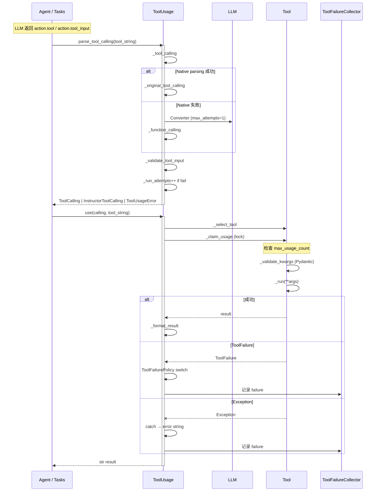

# CrewAI — Tool & Agent-as-Tool Abstraction (L3 Deep Dive)

> **机制选型依据**：CrewAI 的 Tool 抽象有 3 个独特的设计：
> 1. **`BaseTool` Pydantic + 自动 schema 推导**（不要求子类写 Pydantic Schema，从 `_run` 签名推导）。
> 2. **`BaseAgentTool` 子类**——把「调用其他 Agent」建模为「工具」，让 Multi-Agent 协作借助 Tool 系统本身完成。
> 3. **`ToolFailure` / `ToolFailurePolicy` / `ToolFailureReason` / `ToolFailureRecord` 四元组**——把「调用失败」显式建模为可观测、可分类、可路由的对象。
>
> 这三个设计对 RoboThree 工具调用模型深挖价值最高。

## 1. `BaseTool` —— 工具基类

### 1.1 字段（[base_tool.py:103-200](../../sources/crewai/lib/crewai/src/crewai/tools/base_tool.py#L103-L200)）

```python
class BaseTool(BaseModel, ABC):
    name: str
    description: str
    env_vars: list[EnvVar] = []
    args_schema: type[PydanticBaseModel] = _ArgsSchemaPlaceholder
    result_schema: type[PydanticBaseModel] | None = None
    description_updated: bool = False
    cache_function: SerializableCallable = _default_cache_function  # bool 函数
    result_as_answer: bool = False
    max_usage_count: int | None = None
    tool_failure_policy: ToolFailurePolicy | None = None
    current_usage_count: int = 0
    _usage_lock: threading.Lock = field(default_factory=threading.Lock)
```

**关键观察**：
- **`name` / `description` 是必填**——LLM 看到的工具 schema 核心。
- **`args_schema` 默认从 `_run` 签名推导**（[base_tool.py:221-254](../../sources/crewai/lib/crewai/src/crewai/tools/base_tool.py#L221-L254)）—— 子类无需手写 Pydantic Schema。
- **`cache_function`** 决定「同 prompt 是否缓存」—— 默认 `_default_cache_function` 是「always cache」。
- **`max_usage_count`** + **`_usage_lock`** 原子计费。
- **`tool_failure_policy`** 覆盖 Agent / Task 级策略。

### 1.2 Schema 推导

```python
# base_tool.py:207-254
@field_validator("args_schema", mode="before")
@classmethod
def _default_args_schema(cls, v):
    if isinstance(v, dict):
        restored = _deserialize_schema(v)
        if restored is not None:
            return restored
    if v is None or v == cls._ArgsSchemaPlaceholder:
        pass  # fall through to generate from signature
    elif isinstance(v, type):
        return v

    run_sig = signature(cls._run)
    fields = {}
    for param_name, param in run_sig.parameters.items():
        if param_name in ("self", "return"):
            continue
        if param.kind in (Parameter.VAR_POSITIONAL, Parameter.VAR_KEYWORD):
            continue
        annotation = param.annotation if param.annotation != param.empty else Any
        if param.default is param.empty:
            fields[param_name] = (annotation, ...)
        else:
            fields[param_name] = (annotation, param.default)
    return create_model(f"{cls.__name__}Schema", **fields)
```

**关键点**：
- 跳过 `self` / `return` / `*args` / `**kwargs`。
- 没有默认值 → 设 required `(annotation, ...)`。
- 有默认值 → `(annotation, default)`。
- 直接调用 `pydantic.create_model` 生成 Pydantic Schema。

### 1.3 注册

```python
# base_tool.py:109-112
def __init_subclass__(cls, **kwargs):
    super().__init_subclass__(**kwargs)
    key = f"{cls.__module__}.{cls.__qualname__}"
    _TOOL_TYPE_REGISTRY[key] = cls
```

**所有 `BaseTool` 子类自动注册**到 `_TOOL_TYPE_REGISTRY`（`tool_type` 字段）。**支持 Pydantic 序列化反序列化**（[base_tool.py:114-137](../../sources/crewai/lib/crewai/src/crewai/tools/base_tool.py#L114-L137)）：从 `{"tool_type": "..."}` 字典恢复对象。

### 1.4 `_TOOL_TYPE_REGISTRY` 用途

序列化时 `tool_type` = `f"{cls.__module__}.{cls.__qualname__}"`（[base_tool.py:201-205](../../sources/crewai/lib/crewai/src/crewai/tools/base_tool.py#L201-L205)）—— 让工具可被序列化 / 反序列化（checkpoint / 跨进程）。

### 1.5 `@tool` 装饰器

```python
# base_tool.py:521 forwards
class Tool(BaseTool, Generic[P, R]):
    def _run(self, *args, **kwargs) -> R:
        return self.func(*args, **kwargs)
```

`tool` 装饰器（[base_tool.py:556](../../sources/crewai/lib/crewai/src/crewai/tools/base_tool.py#L556)）让你把普通函数变成 `BaseTool`：

```python
@tool("Add")
def add(a: int, b: int) -> int:
    return a + b
```

注：与 LangChain / LangGraph 的 `@tool` 概念相似，但实现是 Pydantic-based。

## 2. `ToolUsage` —— 工具调用调度

### 2.1 字段（[tool_usage.py:97-136](../../sources/crewai/lib/crewai/src/crewai/tools/tool_usage.py#L97-L136)）

```python
class ToolUsage:
    def __init__(self, tools_handler, tools, task, function_calling_llm,
                 agent, action, fingerprint_context, crew):
        self._telemetry = Telemetry()
        self._run_attempts = 1
        self._max_parsing_attempts = 3
        self._remember_format_after_usages = 3
        # ...
        if (self.function_calling_llm and self.function_calling_llm.model in OPENAI_BIGGER_MODELS):
            self._max_parsing_attempts = 2
            self._remember_format_after_usages = 4
```

**关键差异化**：
- `_max_parsing_attempts = 3`（默认）/ `2`（OpenAI 大模型）—— 大模型解析更稳定，减少重试。
- `_remember_format_after_usages = 3` / `4`—— 大模型更慢向其「提醒正确格式」。

### 2.2 解析路径

```python
# tool_usage.py:900-921
def _tool_calling(self, tool_string: str):
    try:
        try:
            return self._original_tool_calling(tool_string, raise_error=True)
        except Exception:
            if self.function_calling_llm:
                return self._function_calling(tool_string)
            return self._original_tool_calling(tool_string)
    except Exception as e:
        self._run_attempts += 1
        if self._run_attempts > self._max_parsing_attempts:
            self._telemetry.tool_usage_error(...)
            return ToolUsageError(...)
        return self._tool_calling(tool_string)  # recurse
```

**两层 fallback**：
1. **Native Parsing**（`_original_tool_calling`）：LLM 返回结构化 tool call → JSON 解析 → `ToolCalling(tool_name, arguments)`。
2. **Converter Fallback**（`_function_calling`）：用 `Converter` + Instructor 让 LLM 重新生成结构化响应。
3. **Recursive Retry**：直到 `_max_parsing_attempts` 失败 → `ToolUsageError`。

### 2.3 `_function_calling` 详解（[tool_usage.py:848-875](../../sources/crewai/lib/crewai/src/crewai/tools/tool_usage.py#L848-L875)）

```python
def _function_calling(self, tool_string: str) -> ToolCalling | InstructorToolCalling:
    model = (
        InstructorToolCalling
        if self.function_calling_llm.supports_function_calling()
        else ToolCalling
    )
    converter = Converter(
        text=f"Only tools available:\n###\n{self._render()}\n\nReturn a valid schema...",
        llm=self.function_calling_llm,
        model=model,
        instructions=dedent("""\
            The schema should have the following structure, only two keys:
            - tool_name: str
            - arguments: dict (always a dictionary, with all arguments being passed)
            Example:
            {"tool_name": "tool name", "arguments": {"arg_name1": "value", "arg_name2": 2}}"""),
        max_attempts=1,
    )
    tool_object = converter.to_pydantic()
    return tool_object
```

**关键观察**：
- **同时支持 Native Function Calling（`InstructorToolCalling`）和文本解析（`ToolCalling`）**。
- 通过 `llm.supports_function_calling()` 判断。
- 用 `Converter`（Instructor wrapper）保证解析成功。

### 2.4 `_validate_tool_input`（[tool_usage.py:923-980](../../sources/crewai/lib/crewai/src/crewai/tools/tool_usage.py#L923-L980)）

```python
def _validate_tool_input(self, tool_input: str | None) -> dict[str, Any]:
    if tool_input is None:
        return {}
    if not isinstance(tool_input, str) or not tool_input.strip():
        raise Exception(...)
    # 1) JSON
    try:
        arguments = json.loads(tool_input)
        if isinstance(arguments, dict):
            return arguments
    except (JSONDecodeError, TypeError):
        pass
    # 2) Python literal
    try:
        arguments = ast.literal_eval(tool_input)
        if isinstance(arguments, dict):
            return arguments
    except (ValueError, SyntaxError):
        repaired_input = repair_json(tool_input)
    # 3) JSON5
    try:
        arguments = json5.loads(tool_input)
        ...
```

**3 层解析**：JSON → Python literal → JSON5（容错）。

### 2.5 `_use` / `_ause` 完整路径

```python
# tool_usage.py:148-185
def use(self, calling, tool_string) -> str:
    if isinstance(calling, ToolUsageError):
        error = calling.message
        if self.task: self.task.increment_tools_errors()
        return error
    try:
        tool = self._select_tool(calling.tool_name)
    except Exception as e:
        error = getattr(e, "message", str(e))
        if self.task: self.task.increment_tools_errors()
        return error
    # ...
    return f"{self._use(tool_string=tool_string, tool=tool, calling=calling)}"
```

错误处理：
- `ToolUsageError` → 转 `error` 字符串，返回给 LLM。
- `_select_tool` 抛异常 → 同样处理。
- `_use` 内部：根据 `ToolFailurePolicy` 处理 `ToolFailure` / 异常 / 限制 / MCP error。

### 2.6 重复检测

```python
# tool_usage.py:767
def _check_tool_repeated_usage(self, calling: ToolCalling) -> bool:
    return False  # 推测（pseudocode，未读全）
```

注：`_check_tool_repeated_usage` 在 `_ause` 早期调用（[tool_usage.py:254](../../sources/crewai/lib/crewai/src/crewai/tools/tool_usage.py#L254)），如命中 → 提前返回 `task_repeated_usage` 错误。

### 2.7 `_check_usage_limit`（[tool_usage.py:780](../../sources/crewai/lib/crewai/src/crewai/tools/tool_usage.py#L780)）

```python
@staticmethod
def _check_usage_limit(tool: Any, tool_name: str) -> str | None:
    if tool.max_usage_count is None:
        return None
    if tool.current_usage_count >= tool.max_usage_count:
        return f"Tool '{tool_name}' has reached its usage limit..."
    return None
```

**usage 限制是工具级 + 原子**（`_claim_usage` 在 `BaseTool` 内）。

## 3. `ToolFailure` —— 显式失败对象

### 3.1 数据（[tool_failure.py](../../sources/crewai/lib/crewai/src/crewai/tools/tool_failure.py)）

```python
class ToolFailureReason(str, Enum):
    TOOL_REPORTED = "tool_reported"
    EXCEPTION = "exception"
    MCP_ERROR = "mcp_error"
    USAGE_LIMIT = "usage_limit"
    UNKNOWN_TOOL = "unknown_tool"
    INVALID_INPUT = "invalid_input"

class ToolFailurePolicy(str, Enum):
    IGNORE = "ignore"
    WARN = "warn"
    RAISE = "raise"

class ToolFailure(BaseModel):
    model_config = ConfigDict(frozen=True)
    message: str
    reason: ToolFailureReason = TOOL_REPORTED
    code: str | None = None
    retryable: bool = False
    details: dict[str, Any] = {}
```

### 3.2 工具报告失败

```python
# 工具 _run 返回 ToolFailure 而不是 raise
def _run(self, ...):
    if not valid:
        return ToolFailure(
            message="Invalid input",
            reason=ToolFailureReason.INVALID_INPUT,
            retryable=True,
            code="invalid_input",
        )
```

**核心设计**：工具调用 can complete without raising and still fail。`Slack` 返 `{"ok": false, ...}` / MCP 返 `isError: true` 都是「调用成功但任务失败」。

旧实现：失败作为字符串返回给 LLM，但 **记录为 success**。
新实现：返回 `ToolFailure`，**框架知道这是失败**。

### 3.3 Policy 路由

```python
# tool_failure.py:99
@contextmanager
def tool_failure_collector():
    """Collect failures during a task execution into a records list."""
    ...
```

**`tool_failure_collector` 上下文管理器**—— 在 `Task._execute_core` 中以 `with tool_failure_collector() as execution_failures:` 包裹（[task.py:849](../../sources/crewai/lib/crewai/src/crewai/task.py#L849)），收集整个 task 期间的失败。

```python
# task.py:876-887
task_output = TaskOutput(
    ...
    tool_failures=list(execution_failures),
)
```

**所有 failure 记录到 `TaskOutput.tool_failures`**。

### 3.4 Failure Policy

```python
class ToolFailurePolicy(str, Enum):
    IGNORE = "ignore"  # 1.16 之前的行为
    WARN = "warn"      # 默认
    RAISE = "raise"    # abort with ToolExecutionFailedError
```

三档策略在 Tool / Agent / Task 三处可独立设置（[tool_failure.py:62-78](../../sources/crewai/lib/crewai/src/crewai/tools/tool_failure.py#L62-L78)）。

## 4. `BaseAgentTool` —— Agent-as-Tool 抽象

### 4.1 关键结构

```python
# base_agent_tools.py:15
class BaseAgentTool(BaseTool):
    """Base class for agent-related tools"""
    agents: list[BaseAgent] = Field(description="List of available agents")
```

继承 `BaseTool`，所以**自动拥有 name / description / args_schema / cache_function / max_usage_count** 全部能力。

### 4.2 `_execute` 逻辑（[base_agent_tools.py:46-124](../../sources/crewai/lib/crewai/src/crewai/tools/agent_tools/base_agent_tools.py#L46-L124)）

```python
def _execute(self, agent_name, task, context=None) -> str:
    try:
        # 1) 名称规范化（去掉引号、casefold、去空白）
        sanitized_name = self.sanitize_agent_name(agent_name)
        # 2) 找到 agent（按 role 匹配）
        agent = [a for a in self.agents if self.sanitize_agent_name(a.role) == sanitized_name]
        if not agent:
            return I18N_DEFAULT.errors("agent_tool_unexisting_coworker").format(...)
        selected_agent = agent[0]
        # 3) 构造 Task，调用
        task_with_assigned_agent = Task(
            description=task,
            agent=selected_agent,
            expected_output=i18n("manager_request"),
        )
        return selected_agent.execute_task(task_with_assigned_agent, context)
    except Exception as e:
        return I18N_DEFAULT.errors("agent_tool_execution_error").format(...)
```

**关键点**：
- **不强类型**——agent 匹配是 `role` 字符串的规范化相等匹配。
- **同步路径**——直接 `execute_task`，**不进入 threading**。
- **错误转字符串**——失败 convert 为 i18n 错误串，返回给 LLM。

### 4.3 `AgentTools` 工厂（[agent_tools/agent_tools.py:22-80](../../sources/crewai/lib/crewai/src/crewai/tools/agent_tools/agent_tools.py#L22-L80)）

```python
class AgentTools:
    def __init__(self, agents: Sequence[BaseAgent]):
        self.agents = agents

    def tools(self) -> list[BaseTool]:
        coworkers = ", ".join([f"{agent.role}" for agent in self.agents])
        delegate_tool = DelegateWorkTool(
            agents=self.agents,
            description=I18N_DEFAULT.tools("delegate_work").format(coworkers=coworkers),
        )
        ask_tool = AskQuestionTool(
            agents=self.agents,
            description=I18N_DEFAULT.tools("ask_question").format(coworkers=coworkers),
        )
        return [delegate_tool, ask_tool]
```

**两个工具**：
- `DelegateWorkTool(task, context, coworker)` —— 委派任务
- `AskQuestionTool(question, context, coworker)` —— 询问问题

两者 schema 完全相同：

```python
class DelegateWorkToolSchema(BaseModel):
    task: str
    context: str
    coworker: str

class AskQuestionToolSchema(BaseModel):
    question: str   # Alias: task
    context: str
    coworker: str
```

**核心差异**：`_run` 都把 `task/question` + `context` 传给 `_execute(coworker, task, context)`。

### 4.4 Crew 集成

```python
# crew.py:1518-1542
def _create_manager_agent(self):
    if self.manager_agent is not None:
        self.manager_agent.allow_delegation = True
        manager = self.manager_agent
        if manager.tools is not None and len(manager.tools) > 0:
            ...
            manager.tools = []
            raise Exception("Manager agent should not have tools")
    else:
        ...
        manager = Agent(
            role=...,
            goal=...,
            backstory=...,
            tools=AgentTools(agents=self.agents).tools(),
            allow_delegation=True,
            llm=self.manager_llm,
            verbose=self.verbose,
        )
        self.manager_agent = manager
```

**Manager Agent 的工具** = `[DelegateWorkTool, AskQuestionTool]`（自动生成）。

### 4.5 普通 Agent 的 delegation tools

```python
# crew.py:1645-1660
def _prepare_tools(self, agent, task, tools):
    if hasattr(agent, "allow_delegation") and getattr(agent, "allow_delegation", False):
        if self.process == Process.hierarchical:
            if self.manager_agent:
                tools = self._update_manager_tools(task, tools)
            else:
                raise ValueError("Manager agent is required for hierarchical process.")
        elif agent:
            tools = self._add_delegation_tools(task, tools)
```

```python
# crew.py:1820
def _add_delegation_tools(self, task, tools):
    agents_for_delegation = [agent for agent in self.agents if agent != task.agent]
    if len(self.agents) > 1 and len(agents_for_delegation) > 0 and task.agent:
        if not tools:
            tools = []
        tools = self._inject_delegation_tools(tools, task.agent, agents_for_delegation)
    return tools
```

**Sequential 模式 + `allow_delegation=True`**：每个 Agent 都能调「除自己外」的 Agent。

## 5. 工具执行完整链路

### 5.1 `_run` Pydantic 校验

```python
# base_tool.py:279-300
def _validate_kwargs(self, kwargs):
    if self.args_schema is not None and self.args_schema.model_fields:
        try:
            validated = self.args_schema.model_validate(kwargs)
            return validated.model_dump()
        except Exception as e:
            hint = build_schema_hint(self.args_schema)
            raise ValueError(f"Tool '{self.name}' arguments validation failed: {e}{hint}") from e
    return kwargs
```

**Pydantic validate**——错误信息包含可读 hint。

### 5.2 Atomic Usage Claim

```python
# base_tool.py:302-330
def _claim_usage(self) -> ToolFailure | None:
    with self._usage_lock:
        if self.max_usage_count is not None and self.current_usage_count >= self.max_usage_count:
            return ToolFailure(
                message=f"Tool '{self.name}' has reached its usage limit of {self.max_usage_count} times and cannot be used anymore.",
                reason=ToolFailureReason.USAGE_LIMIT,
                retryable=False,
            )
        self.current_usage_count += 1
        return None
```

**原子加锁** + **`ToolFailure`** 报告（不是 raise）。

### 5.3 Tool 调用决策（Mermaid）



## 6. MCP 集成

```python
# mcp_native_tool.py / mcp_tool_wrapper.py
```

未深入。**已知**：
- `mcp_native_tool.py` 提供 native MCP integration。
- `mcp_tool_wrapper.py` 提供 wrapper（推测为兼容旧工具）。
- `Agent.mcps: list[str | MCPServerConfig]` → `get_mcp_tools(mcps)` → `_add_mcp_tools(task, tools)`（[agent/core.py:1236 / 1763-1772](../../sources/crewai/lib/crewai/src/crewai/agent/core.py#L1236-L1772)）。

## 7. Skill / Hook / Plugins 集成

- **`skills/`**（skills/ 目录存在）—— Skill 注册。
- **`hooks/`**—— `hooks/dispatch.py` + `InterceptionPoint` + `dispatch(point, ctx)`。Task `PRE_STEP` / `POST_STEP` 已在 [task.py:846/916](../../sources/crewai/lib/crewai/src/crewai/task.py#L846-L916) 调用。
- **`auth/`**—— OAuth / API Key。

## 8. 失败 / 取消 / 恢复

### 8.1 失败

| Layer | 失败处理 | 源码 |
|---|---|---|
| Tool._run raise | `BaseTool._run` 捕获（部分）→ `ToolFailure(EXCEPTION)` | [base_tool.py](../../sources/crewai/lib/crewai/src/crewai/tools/base_tool.py) |
| Tool._run return ToolFailure | Framework 记录 → `ToolFailurePolicy` 路由 | [tool_usage.py](#anchor) |
| Tool Usage 解析失败 | `_max_parsing_attempts` 后 `ToolUsageError` | [tool_usage.py:911-919](../../sources/crewai/lib/crewai/src/crewai/tools/tool_usage.py#L911-L919) |
| Tool 找不到 | `_select_tool` 失败 → `error` 字符串 | [tool_usage.py:160-167](../../sources/crewai/lib/crewai/src/crewai/tools/tool_usage.py#L160-L167) |
| Tool 超额 | `_claim_usage` 返 `ToolFailure(USAGE_LIMIT)` | [base_tool.py:302-330](../../sources/crewai/lib/crewai/src/crewai/tools/base_tool.py#L302-L330) |
| 整个 Task 失败 | `task.tool_failures` 累积 | [task.py:886](../../sources/crewai/src/crewai/task.py#L886) |

### 8.2 取消

**Tool 没有 cancel 机制**。
- 超时：`max_execution_time`（Agent 级）+ ThreadPoolExecutor 兜底（[agent/core.py:909-919](../../sources/crewai/lib/crewai/src/crewai/agent/core.py#L909-L919)）。
- Tool 内部如果 IO 阻塞（`requests` / `subprocess`），无法 interrupt。

### 8.3 恢复

- `ToolFailure.retryable: bool = False`—— 框架不自动 retry。
- `UseError` 字符串返回 LLM → LLM 决定下一步。
- 整个 execution chain 是 **synchronous + retry at executor level**（`max_retries`）。

## 9. 关键决策矩阵

| 决策 | 类型 | 证据 |
|---|---|---|
| `BaseTool` 自动 schema 推导 | FACT | [base_tool.py:221-254](../../sources/crewai/lib/crewai/src/crewai/tools/base_tool.py#L221-L254) |
| `_TOOL_TYPE_REGISTRY` 自动注册 | FACT | [base_tool.py:109-112](../../sources/crewai/lib/crewai/src/crewai/tools/base_tool.py#L109-L112) |
| `cache_function` 决定是否缓存 | FACT | [base_tool.py:176-179](../../sources/crewai/lib/crewai/src/crewai/tools/base_tool.py#L176-L179) |
| `max_usage_count` 原子限制 | FACT | [base_tool.py:302-330](../../sources/crewai/lib/crewai/src/crewai/tools/base_tool.py#L302-L330) |
| `ToolFailure` declare failure | FACT | [tool_failure.py:13-78](../../sources/crewai/lib/crewai/src/crewai/tools/tool_failure.py) |
| `ToolFailurePolicy` 三档 | FACT | [tool_failure.py:62-78](../../sources/crewai/lib/crewai/src/crewai/tools/tool_failure.py) |
| `ToolFailureReason` 六类 | FACT | [tool_failure.py:31-60](../../sources/crewai/lib/crewai/src/crewai/tools/tool_failure.py) |
| `tool_failure_collector` 上下文 | FACT | [tool_failure.py:99+](../../sources/crewai/lib/crewai/src/crewai/tools/tool_failure.py) |
| `BaseAgentTool` 继承 BaseTool | FACT | [base_agent_tools.py:15](../../sources/crewai/lib/crewai/src/crewai/tools/agent_tools/base_agent_tools.py#L15) |
| `AgentTools` 自动生成 Delegate/Ask | FACT | [agent_tools.py:22](../../sources/crewai/lib/crewai/src/crewai/tools/agent_tools/agent_tools.py#L22) |
| Manager 强制 zero tools | FACT | [crew.py:1529](../../sources/crewai/lib/crewai/src/crewai/crew.py#L1529) |
| Tool 失败 → error string 返回 LLM | FACT | [tool_usage.py:160-185](../../sources/crewai/lib/crewai/src/crewai/tools/tool_usage.py#L160-L185) |
| `_max_parsing_attempts` 默认 3，OpenAI 大模型 2 | FACT | [tool_usage.py:130-136](../../sources/crewai/lib/crewai/src/crewai/tools/tool_usage.py#L130-L136) |
| `_validate_tool_input` 3 层 JSON fallback | FACT | [tool_usage.py:923-980](../../sources/crewai/lib/crewai/src/crewai/tools/tool_usage.py#L923-L980) |
| `_function_calling` 同时 Native + Text | FACT | [tool_usage.py:848-875](../../sources/crewai/lib/crewai/src/crewai/tools/tool_usage.py#L848-L875) |
| Tool 执行 `tool_failures` 写入 TaskOutput | FACT | [task.py:886](../../sources/crewai/src/crewai/task.py#L886) |

## 10. 关键 UNKNOWN

- `CacheHandler` 实际缓存粒度 / eviction（**未深入**）。
- MCP wrapper 实际桥接（**未深入**）。
- `mcp_native_tool.py` 协议细节（**未深入**）。
- Code execution tools 实际隔离（**未深入**）。
- `Recursive tool usage`（一个工具调用 SystemTool，SystemTool 又触发其他 Tool）—— **未确认**。

## 11. 对 RoboThree 的五分类建议

| 机制 | 分类 | 关键理由 |
|---|---|---|
| **`BaseTool` auto schema from `_run` signature** | ADOPT | 简化 Tool 编写，rubost |
| **`_TOOL_TYPE_REGISTRY` 自动序列化** | ADOPT | 提供 tool_type 字段以支持 checkpoint / 跨进程 |
| **`tool_failure` 显式四元组** | ADOPT | ToolFailure(Reason/Policy/Record) + collector，让失败可分类可路由 |
| **`BaseAgentTool` 委派给 Agent** | ADOPT | Multi-Agent 协作通过 Tool 系统完成，避免重复调度器 |
| **`AgentTools` 工厂自动生成 Delegate/Ask** | ADAPT | 适合 hierarchical；可考虑扩展更多 pattern |
| **`_claim_usage` 原子限制** | ADOPT | `max_usage_count` + `_usage_lock` 是简单但必需的 |
| **`ToolFailurePolicy` 三档** | ADAPT | IGNORE / WARN / RAISE 简单有效；RoboThree 可加 DEFER / RETRY-N |
| **`max_parsing_attempts` 不同模型不同** | ADOPT | OpenAI 大模型解析更稳定 → 减少重试 |
| **`_validate_tool_input` 3 层 JSON fallback** | ADOPT | JSON / literal / JSON5 |
| **Tool 失败转 error string** | ADAPT | 简单但丢失结构；RoboThree 可保留 ToolFailure 对象 |
| **`BaseAgentTool._execute` 同步 + role 匹配** | ADAPT | 简单但 role 匹配脆弱；RoboThree 建议 ID 匹配 |
| **`tool_failure_collector` 仅记录不处理** | ADAPT | 需结合 listener / Telemetry；RoboThree 可加 hook |
| **`result_as_answer` 标记** | ADOPT | 让 Tool 直接结束 Agent Loop |
| **`cache_function` 决定是否缓存** | ADOPT | 用户可自定义 |
| **Tool 用 description 而非 prompt 注入** | ADAPT | 简单；RoboThree 可考虑显式 Tool Manifest |
| **Tool runtime 沙箱缺失** | REJECT | RoboThree 必须中心化沙箱 |
| **Tool 集中注册 `_TOOL_TYPE_REGISTRY`** | DEFER | 太集中；RoboThree 可考虑分 registry |
| **Manager 不能添加自定义工具** | REJECT | crew.py:1529 抛 Exception 太严格 |
| **`ToolFailurePolicy.IGNORE`** | DEFER | 丢弃失败信息不好；RoboThree 建议默认 WARN |
| **Tool retryable 仅示意** | ADAPT | 框架不自动 retry；RoboThree 可加 retry handler |
| **Tool `_run` 默认同步** | ADAPT | 与 async 并存；RoboThree 可考虑 async-first |

## 12. 关键引用清单

| 引用 | 位置 |
|---|---|
| BaseTool | [tools/base_tool.py:103](../../sources/crewai/lib/crewai/src/crewai/tools/base_tool.py#L103) |
| BaseTool args_schema 推导 | [tools/base_tool.py:207-254](../../sources/crewai/lib/crewai/src/crewai/tools/base_tool.py#L207-L254) |
| BaseTool _claim_usage | [tools/base_tool.py:302-330](../../sources/crewai/lib/crewai/src/crewai/tools/base_tool.py#L302-L330) |
| BaseTool _validate_kwargs | [tools/base_tool.py:279-300](../../sources/crewai/lib/crewai/src/crewai/tools/base_tool.py#L279-L300) |
| ToolUsage | [tools/tool_usage.py:84-136](../../sources/crewai/lib/crewai/src/crewai/tools/tool_usage.py#L84-L136) |
| _tool_calling | [tools/tool_usage.py:900-921](../../sources/crewai/lib/crewai/src/crewai/tools/tool_usage.py#L900-L921) |
| _function_calling | [tools/tool_usage.py:848-875](../../sources/crewai/lib/crewai/src/crewai/tools/tool_usage.py#L848-L875) |
| _validate_tool_input | [tools/tool_usage.py:923-980](../../sources/crewai/lib/crewai/src/crewai/tools/tool_usage.py#L923-L980) |
| ToolFailureReason | [tools/tool_failure.py:31-60](../../sources/crewai/lib/crewai/src/crewai/tools/tool_failure.py) |
| ToolFailurePolicy | [tools/tool_failure.py:62-78](../../sources/crewai/lib/crewai/src/crewai/tools/tool_failure.py) |
| ToolFailure | [tools/tool_failure.py:80-100](../../sources/crewai/lib/crewai/src/crewai/tools/tool_failure.py) |
| tool_failure_collector | [tools/tool_failure.py:99+](../../sources/crewai/lib/crewai/src/crewai/tools/tool_failure.py) |
| BaseAgentTool | [tools/agent_tools/base_agent_tools.py:15](../../sources/crewai/lib/crewai/src/crewai/tools/agent_tools/base_agent_tools.py#L15) |
| BaseAgentTool._execute | [tools/agent_tools/base_agent_tools.py:46-124](../../sources/crewai/lib/crewai/src/crewai/tools/agent_tools/base_agent_tools.py#L46-L124) |
| AgentTools | [tools/agent_tools/agent_tools.py:22-80](../../sources/crewai/lib/crewai/src/crewai/tools/agent_tools/agent_tools.py#L22) |
| DelegateWorkTool | [tools/agent_tools/delegate_work_tool.py](../../sources/crewai/lib/crewai/src/crewai/tools/agent_tools/delegate_work_tool.py) |
| AskQuestionTool | [tools/agent_tools/ask_question_tool.py](../../sources/crewai/lib/crewai/src/crewai/tools/agent_tools/ask_question_tool.py) |
| crew._create_manager_agent | [crew.py:1518](../../sources/crewai/lib/crewai/src/crewai/crew.py#L1518) |
| crew._prepare_tools | [crew.py:1645-1712](../../sources/crewai/lib/crewai/src/crewai/crew.py#L1645-L1712) |
| crew._add_delegation_tools | [crew.py:1820-1830](../../sources/crewai/lib/crewai/src/crewai/crew.py#L1820-L1830) |
| crew._update_manager_tools | [crew.py:1853-1863](../../sources/crewai/lib/crewai/src/crewai/crew.py#L1853-L1863) |
| tool_failure_collector use | [task.py:849/886](../../sources/crewai/lib/crewai/src/crewai/task.py#L849-L886) |
| AgentExecutor._save_to_memory | [experimental/agent_executor.py:2875](../../sources/crewai/lib/crewai/src/crewai/experimental/agent_executor.py#L2875) |

