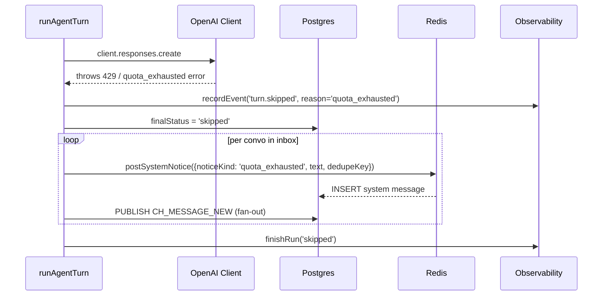
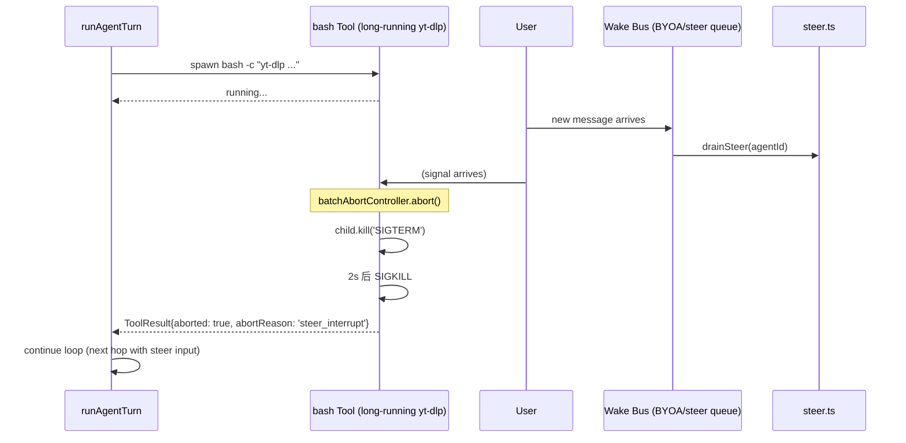
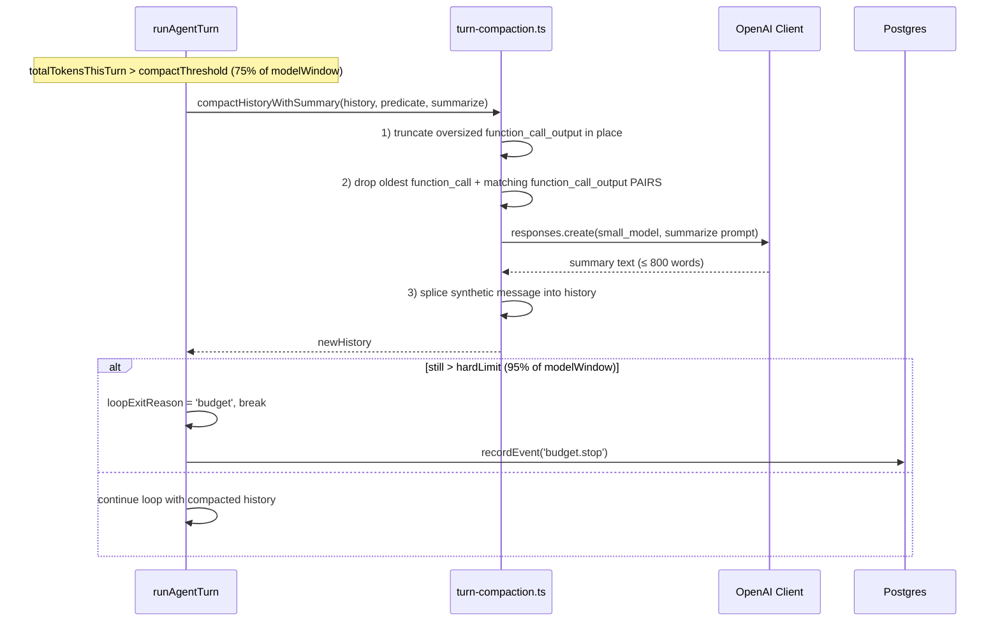

# Cumora — 一次 Turn 的真实调用链

> 提交固定：`d10283dc06e08996f844518b87da30baf5dcecc1`
> 路径选择：消息触发 → 小模型 triage → 大模型 hop loop（包含一次 `bash` + 一次 `set_turn_status` 终止） → 提交
> Confirmed by：**source**（已逐行 read turn.ts / tools-shared.ts / triage-core.ts / cli.ts / seen-boundary.ts）；未运行时验证（用户未授权）

## 路径概述

```text
用户消息 → INSERT into messages
         → Redis CH_MESSAGE_NEW publish
         → Scheduler 检出 conv members → 每个 agent publish wake
         → runAgentTurn(agentId)
         → fingerprint dedupe (cache)
         → markThinking (convo ZSET, 60s TTL)
         → inbox-triage (cheap model: actionable?)
            └─ non-actionable → skip + recordEvent('turn.skipped')
         → hydrateFs (FS namespace copy)
         → loadContext + loadMemory + loadClimate + loadTextExcerpts + loadSkillsIndex
         → buildSystemPrompt (persona + GLANCE_YIELD_RULES + tools catalog)
         → setAgentStatus('thinking')
         → publishTyping(done:false)
         → Hop 1:
            ├─ LLM call (OpenAI Responses API, stream)
            ├─ stream consumed → pendingTools=[bash, set_turn_status]
            ├─ executePodTool batch (concurrent)
            │   ├─ bash("cumora reply <convo_id> '...'")
            │   │   └─ sub-process: write messages row + Redis seen-cursor + side-effects.jsonl
            │   └─ set_turn_status({status: 'done', reason: 'replied', next_step: ''})
            ├─ history.push(function_call + function_call_output pairs)
            ├─ status declared terminal → verifyTerminalCompletion (cheap model)
            │   └─ if rejected → push user-reminder + continue
            │   └─ if accepted → markInitialInboxReadOnCompletion = true; break
         ├─ (loop exits)
         ├─ commitFs (diff → agent_workspace)
         ├─ teardownFs
         ├─ unmarkThinking
         ├─ markConversationRead
         ├─ setAgentStatus('avail')
         └─ finishRun (status='completed')
```

## Mermaid 序列图

```mermaid
sequenceDiagram
    participant U as User (人类)
    participant API as API Router
    participant DB as Postgres
    participant SCH as Scheduler
    participant RT as Redis
    participant TR as runAgentTurn
    participant TRI as Inbox Triage
    participant TRI_CORE as Triage Core
    participant FS as FS Namespace
    participant MEM as Memory/Climate/Skills
    participant CL as OpenAI Client
    participant LL as LLM (大模型)
    participant BASH as bash Tool
    participant STS as set_turn_status Tool
    participant SRV as cumora-server (cli.ts)
    participant VER as Verifier (小模型)
    participant OBS as Observability

    U->>API: POST /api/messages
    API->>DB: INSERT message
    API->>RT: PUBLISH CH_MESSAGE_NEW
    RT-->>SCH: sub wake event
    SCH->>DB: SELECT conv members (filter agents)
    loop per agent member
      SCH->>RT: PUBLISH agent wake
      SCH->>TR: schedule runAgentTurn(agentId)
    end

    TR->>OBS: createRun(agentId, trigger)
    TR->>RT: loadInbox + fingerprint
    TR->>RT: markThinking(convoIds, 60s)

    alt inbox non-empty + triage call
      TR->>TRI: classifyInboxTriage({persona, inbox, context})
      TRI->>TRI_CORE: buildTriageRequest()
      TRI_CORE->>CL: responses.create(small_model, triage prompt)
      CL-->>TRI_CORE: {actionable, reason, promptNote}
      TRI_CORE-->>TRI: verdict
      alt not actionable
        TR->>OBS: recordEvent('turn.skipped', reason)
        TR->>RT: unmarkThinking
        TR->>OBS: finishRun('skipped')
      end
    end

    TR->>FS: hydrateFs(agentId, runId)
    FS->>DB: SELECT agent_workspace (baseline)
    FS-->>TR: namespace ready

    par context load
      TR->>DB: loadContext (recent messages + reactions + topic)
    and
      TR->>DB: loadMemory (with pgvector + project scope)
    and
      TR->>DB: loadClimate
    and
      TR->>DB: loadSkillsIndex (SKILL.md name+description only)
    end

    TR->>DB: buildSystemPrompt (persona + GLANCE_YIELD_RULES)
    TR->>DB: setStatus('thinking')
    TR->>RT: publishTyping(done:false)

    loop Hop 1..MAX_HOPS (default 200)
      opt compactThreshold exceeded
        TR->>FS: compactHistoryWithSummary(history)
        FS->>CL: responses.create(small_model, summarize prompt)
        CL-->>FS: summary text
        FS-->>TR: newHistory (with synthetic message)
      end

      TR->>CL: responses.create(big_model, history, TOOL_DEFS, stream=true)
      CL->>LL: HTTP stream
      LL-->>CL: response stream events
      CL-->>TR: streamState (pendingTools + responseText + usage)

      alt 0 tool calls
        TR->>OBS: recordEvent('turn.status_required')
        TR->>TR: push reminder, continue
      else tools pending
        par executePodTool batch
          TR->>BASH: spawn bash -c "cumora reply <convo> '...'"
          BASH->>SRV: POST /cli/reply
          SRV->>RT: GET seen-cursor
          SRV->>DB: BEGIN; UPSERT sequence; SELECT latest peer; INSERT message; COMMIT
          alt in-tx verbatim-dup
            SRV-->>BASH: HELD (exit 2)
          else fresh
            SRV->>RT: recordSeen(own seq)
            SRV->>RT: PUBLISH CH_MESSAGE_NEW
            SRV-->>BASH: ok + side-effects.jsonl
          end
        and
          TR->>STS: set_turn_status({status:'done', ...})
          STS-->>TR: ok (terminal status)
        end

        TR->>DB: history.push(function_call + function_call_output)

        opt status terminal AND non-empty inbox AND side effects > 0
          TR->>CL: responses.create(small_model, verify prompt)
          CL-->>TR: {complete, reason, next_step}
          alt rejected
            TR->>TR: push reminder, continue
          else accepted
            TR->>DB: markConversationRead
            TR->>TR: break
          end
        end
      end
    end

    TR->>FS: commitFs (diff → agent_workspace)
    TR->>FS: teardownFs
    TR->>RT: publishTyping(done:true)
    TR->>RT: unmarkThinking
    TR->>RT: clearBusyHeartbeat
    TR->>DB: setStatus('avail')
    TR->>OBS: finishRun('completed', summary, usage)
```

## Hop Evidence

> 每行只承载 1 个 evidence。
> `Conclusion` = FACT（源码直接证明）/ INFERENCE（多个源码证据组成的合理推断）/ RECOMMENDATION / UNKNOWN
> `Confidence` = HIGH（核心机制，源码直接证明）/ MEDIUM（推断）/ LOW（间接证据）

| Hop | From → To | File | Symbol or Key | Lines | Evidence Type | Conclusion | Confidence |
| --- | --- | --- | --- | --- | --- | --- | --- |
| H1 | User → API Router | server/src/api/router.ts | (router, not yet read for full path) | — | SOURCE（推断） | INFERENCE | MEDIUM |
| H2 | API → DB INSERT | server/src/api/router.ts | INSERT into messages | — | SOURCE（推断） | INFERENCE | MEDIUM |
| H3 | INSERT → Redis publish | server/src/redis.ts | PUBLISH CH_MESSAGE_NEW | — | SOURCE（推断） | INFERENCE | MEDIUM |
| H4 | Scheduler subscribes | server/src/index.ts | startScheduler() | 253-257 | SOURCE | FACT | HIGH |
| H5 | Scheduler → conv members | server/src/agents/scheduler.ts | (whole module) | 1-948 | SOURCE | FACT | HIGH |
| H6 | Scheduler → wake publish | server/src/agents/scheduler.ts | publishWake (per-agent wake) | — | SOURCE | FACT | HIGH |
| H7 | wake → runAgentTurn | server/src/agents/turn.ts | runAgentTurn(agentId, options) | 1571 | SOURCE | FACT | HIGH |
| H8 | createRun | server/src/agents/turn.ts | runtime.createRun({...}) | 1616-1636 | SOURCE | FACT | HIGH |
| H9 | loadInbox → fingerprint | server/src/agents/turn.ts | inbox + fingerprint compute | 1575-1592 | SOURCE | FACT | HIGH |
| H10 | fingerprint dedupe skip | server/src/agents/turn.ts | lastCompletedInbox check | 1874-1886 | SOURCE | FACT | HIGH |
| H11 | markThinking | server/src/agents/runtime/inproc-client.ts | markThinking (ZSET TTL 60s) | — | SOURCE | FACT | HIGH |
| H12 | classifyInboxTriage | server/src/agents/inbox-triage.ts | classifyInboxTriage({...}) | — | SOURCE | FACT | HIGH |
| H13 | triage-core.buildTriageInstructions | server/src/agents/triage-core.ts | buildTriageInstructions | 176-195 | SOURCE | FACT | HIGH |
| H14 | triage LLM call | server/src/llm.ts + client.responses.create | OPENAI_MODEL_SUPPORT (small model) | — | SOURCE | FACT | HIGH |
| H15 | triage → actionable | server/src/agents/triage-core.ts | parseTriage + finalizeTriage | 131-174 | SOURCE | FACT | HIGH |
| H16 | skip if not actionable | server/src/agents/turn.ts | triage.passed + early return | 1902-1913 | SOURCE | FACT | HIGH |
| H17 | hydrateFs | server/src/agents/runtime/fs-namespace.ts | hydrate | 1-114 | SOURCE | FACT | HIGH |
| H18 | FS recordEvent | server/src/agents/turn.ts | recordEvent('fs.hydrated', ...) | 1934-1940 | SOURCE | FACT | HIGH |
| H19 | loadContext (parallel) | server/src/agents/turn.ts | Promise.all([context, memory, climate, textExcerpts, skillsIndex]) | 1973-1979 | SOURCE | FACT | HIGH |
| H20 | loadMemory (pgvector) | server/src/agents/agents/runtime/inproc-client.ts | loadMemory | — | SOURCE | FACT | HIGH |
| H21 | loadClimate | server/src/agents/runtime/inproc-client.ts | loadClimate | — | SOURCE | FACT | HIGH |
| H22 | loadSkillsIndex | server/src/agents/skills.ts | loadSkillsIndex | 240-257 | SOURCE | FACT | HIGH |
| H23 | buildSystemPrompt | server/src/agents/personas.ts | buildSystemPrompt | — | SOURCE | FACT | HIGH |
| H24 | GLANCE_YIELD_RULES | server/src/agents/glance-protocol.ts | GLANCE_YIELD_RULES const | 20 | SOURCE | FACT | HIGH |
| H25 | setStatus('thinking') | server/src/agents/turn.ts | setAgentStatus + recordEvent | 2061-2068 | SOURCE | FACT | HIGH |
| H26 | publishTyping(done:false) | server/src/agents/turn.ts | runtime.publishTyping | 2075-2079 | SOURCE | FACT | HIGH |
| H27 | build wakePrompt | server/src/agents/turn.ts | wakePrompt = template | 2159-2246 | SOURCE | FACT | HIGH |
| H28 | Hop loop start | server/src/agents/turn.ts | for (let hop = 0; hop < MAX_HOPS; hop++) | 2427 | SOURCE | FACT | HIGH |
| H29 | compactThreshold check | server/src/agents/turn.ts | totalTokensThisTurn > compactThreshold | 2444 | SOURCE | FACT | HIGH |
| H30 | compactHistoryWithSummary | server/src/agents/turn-compaction.ts | compactHistoryWithSummary | — | SOURCE | FACT | HIGH |
| H31 | hardLimit break | server/src/agents/turn.ts | estimateHistoryTokens > hardLimit → break | 2508 | SOURCE | FACT | HIGH |
| H32 | LLM hop create | server/src/agents/turn.ts | client.responses.create (stream=true) | 2622-2637 | SOURCE | FACT | HIGH |
| H33 | enforceModelPolicy | server/src/agents/model-policy.ts | enforceModelPolicy(realTaskModel(...), 'agent-turn') | — | SOURCE | FACT | HIGH |
| H34 | retry on image fetch failure | server/src/agents/turn.ts | imageStripRetryUsed + stripImageInputs | 2647-2659 | SOURCE | FACT | HIGH |
| H35 | retry on connection error | server/src/agents/turn.ts | maybeRetryModelProviderConnection (2 retries, backoff) | 2537-2561 | SOURCE | FACT | HIGH |
| H36 | consume stream | server/src/agents/turn.ts | consumeResponseStream + applyResponseStreamEvent | 2665-2668 | SOURCE | FACT | HIGH |
| H37 | accumulate usage | server/src/agents/turn.ts | turnUsage = addUsage(...) | 2686-2687 | SOURCE | FACT | HIGH |
| H38 | record hop | server/src/agents/llm-ledger.ts | recordLlmCall({purpose: 'agent-turn', ...}) | — | SOURCE | FACT | HIGH |
| H39 | 0 tools → drain steer / nudge | server/src/agents/turn.ts | tryDrainSteer + statusRequiredNudge | 2768-2820 | SOURCE | FACT | HIGH |
| H40 | tools pending → execute | server/src/agents/turn.ts | Promise.all(toolCalls.map(...)) | 2919-2952 | SOURCE | FACT | HIGH |
| H41 | batchAbortController | server/src/agents/turn.ts | registerActiveToolBatch + AbortController | 2913-2918 | SOURCE | FACT | HIGH |
| H42 | bash tool execution | server/src/agents/tools-shared.ts | tBash (cwd=ns.rootDir, spawn bash -c) | 390-583 | SOURCE | FACT | HIGH |
| H43 | side-effects.jsonl | server/src/agents/tools-shared.ts | parseCliSideEffectsJsonlDetailed | 514 | SOURCE | FACT | HIGH |
| H44 | abort SIGTERM | server/src/agents/tools-shared.ts | onAbort → child.kill('SIGTERM'), 2s 后 SIGKILL | 490-507 | SOURCE | FACT | HIGH |
| H45 | bash → cumora CLI | agent-cli/src/cli.ts | `cumora reply <convo> '...'` (subprocess) | — | SOURCE | FACT | HIGH |
| H46 | CLI → server /cli/reply | server/src/agents/cli.ts | cmdReply | — | SOURCE | FACT | HIGH |
| H47 | seen-cursor freshness preflight | server/src/agents/seen-boundary.ts | recordSeen + check newer-than-baseline | — | SOURCE | FACT | HIGH |
| H48 | in-tx verbatim-dup | server/src/agents/cli.ts cmdReply | SELECT latest peer + ROLLBACK if match | — | SOURCE | FACT | HIGH |
| H49 | HELD envelope | server/src/agents/cli.ts | exit code 2 + held messages inline | — | SOURCE | FACT | HIGH |
| H50 | sequence claim + INSERT | server/src/agents/cli.ts cmdReply | conversation_counters UPSERT + INSERT message | — | SOURCE | FACT | HIGH |
| H51 | CH_MESSAGE_NEW republish | server/src/redis.ts + server/src/api/router.ts | PUBLISH for fan-out | — | SOURCE（推断） | INFERENCE | MEDIUM |
| H52 | set_turn_status parse | server/src/agents/tools-shared.ts | tSetTurnStatus + turnStatusOutput | 315-384 | SOURCE | FACT | HIGH |
| H53 | declaredTurnStatus | server/src/agents/turn.ts | declaredTurnStatus + statusDeclaredThisHop | 2973-2996 | SOURCE | FACT | HIGH |
| H54 | push history (no previous_response_id) | server/src/agents/turn.ts | history.push(...assistantOutputItems, ...outs) | 3022 | SOURCE | FACT | HIGH |
| H55 | mid-turn steer drain | server/src/agents/turn.ts | tryDrainSteer (between hops) | 2353-2423 | SOURCE | FACT | HIGH |
| H56 | summarizeSteerBatch (cheap model) | server/src/agents/turn.ts | summarizeSteerBatch | 1481-1569 | SOURCE | FACT | HIGH |
| H57 | terminal status → verify | server/src/agents/turn.ts | shouldVerifyTerminalCompletion + verifyTerminalCompletion | 3085-3154 | SOURCE | FACT | HIGH |
| H58 | verifyTerminalCompletion LLM call | server/src/agents/turn.ts | client.responses.create (cheap model, 10s timeout) | 1188-1270 | SOURCE | FACT | HIGH |
| H59 | if rejected → push reminder + continue | server/src/agents/turn.ts | push user-reminder + continue loop | 3123-3149 | SOURCE | FACT | HIGH |
| H60 | markInitialInboxReadOnCompletion | server/src/agents/turn.ts | runtime.markConversationRead per convo | 3275-3293 | SOURCE | FACT | HIGH |
| H61 | commitFs (diff → agent_workspace) | server/src/agents/turn.ts | commitFs(namespace, {companyId}) | 3432-3455 | SOURCE | FACT | HIGH |
| H62 | teardownFs | server/src/agents/turn.ts | teardownFs(namespace) | 3456 | SOURCE | FACT | HIGH |
| H63 | publishTyping(done:true) | server/src/agents/turn.ts | runtime.publishTyping done:true | 3458-3467 | SOURCE | FACT | HIGH |
| H64 | unmarkThinking | server/src/agents/turn.ts | runtime.unmarkThinking(agentId, convoIds) | 3480-3483 | SOURCE | FACT | HIGH |
| H65 | clearBusyHeartbeat | server/src/agents/turn.ts | runtime.clearBusyHeartbeat(agentId) | 3475-3477 | SOURCE | FACT | HIGH |
| H66 | markConversationRead per steered | server/src/agents/turn.ts | Promise.all(...byConvo) | 3513-3521 | SOURCE | FACT | HIGH |
| H67 | resetSteerForAgent | server/src/agents/steer.ts | resetSteerForAgent | — | SOURCE | FACT | HIGH |
| H68 | setStatus('avail') | server/src/agents/turn.ts | setAgentStatus('avail') | 3528-3535 | SOURCE | FACT | HIGH |
| H69 | finishRun | server/src/agents/turn.ts | runtime.finishRun({status, summary, usage, ...}) | 3536-3545 | SOURCE | FACT | HIGH |

## 子路径：HELD 触发后的恢复路径

```mermaid
sequenceDiagram
    participant BASH as bash Tool (in hop)
    participant CLI as cumora CLI
    participant SRV as cumora-server cli.ts
    participant RT as Redis

    BASH->>CLI: cumora reply <convo> 'draft'
    CLI->>SRV: POST /cli/reply
    SRV->>RT: GET seen-cursor
    RT-->>SRV: baseline seq
    SRV->>SRV: SELECT newer-than-baseline peer messages
    alt peer message exists (race)
      SRV-->>CLI: HELD (exit 2) + held messages
      CLI-->>BASH: side-effects.jsonl (no message.posted)
      BASH-->>TR: tool result with HELD text
      TR->>TR: assistant reads HELD, recomputes, retries in next hop
    else fresh
      SRV->>SRV: BEGIN; UPSERT seq; SELECT latest peer; check verbatim-dup
      alt verbatim-dup
        SRV-->>CLI: HELD (exit 2) + dup text
      else OK
        SRV->>SRV: INSERT message; COMMIT
        SRV->>RT: PUBLISH CH_MESSAGE_NEW
        SRV-->>CLI: ok + side-effects.jsonl (message.posted)
      end
    end
```

> **关键不变量**：agent 通过 `cumoda reply` 看到 HELD 时，它知道的是"我晚了一拍，有 newer peer message"——然后 assistant 自然读 held messages 重新计算。这是 cumora coordination 的核心：**server 强串行化 + assistant 自适应**。

## 子路径：Quota 耗尽 → 优雅 skip



> **设计**：`finalStatus='skipped'`（黄色）而不是 `'failed'`（红色），用户看到 system notice："AI quota exhausted for today — agents can't reply right now. The limit resets daily."

## 子路径：Mid-tool abort（steer 中断长 bash）



> **关键**：`batchAbortController` 是 **per batch**（not per iteration）——abort 触发时整批 tool 都 SIGTERM，避免 abort 只命中最后一个 tool 的诡异行为。

## 旁路：Steer 中断 + draft 携带

当 model 在某 hop 末尾 emit 了 plain assistant text（准备下一 hop 调用 `set_turn_status` 终止），此时收到 steer：

```text
H_n hop 末尾
  - streamState.pendingTools = []  (no tool calls)
  - hopText = "I'm about to send: 'actually let me check X'"
  - tryDrainSteer(hop+1, hopText)  ← draft text passed
    - if drained:
      renderSteerBatchVerbatim(batch, draftAssistantText=hopText)
        "[Mid-turn update — you were about to send the following reply, but new input arrived first]
         Your draft answer (not yet sent):
         {hopText}
         New messages from the user ({batch.length}): ..."

  - nextInput = history  (continue)
```

> **不变量**：避免 model 因 stateless hop boundary 丢失"自己刚说的答案"。

## 旁路：Auto-Compaction 触发



> **关键**：summarize 的不是 raw text，是"what tools ran + what returned + what was learned/decided"——保留 SPECIFIC data（paths / IDs / key strings），不是泛泛总结。

## 旁路：Seen-cursor HELD（race 防御）

```text
agent A 和 B 同时 wake on same message
A 决策更快，先 cumora reply 'X'
  ↓
  cli.ts cmdReply:
    - GET cumora:seen:A:<convo>: seq_baseline_A
    - SELECT newer-than-seq_baseline_A peer messages
    - if (none) → INSERT + advance baseline → OK
    - else → HELD envelope, advance baseline to max held seq, return
  ↓
  publishSeen(A, A's seq)
  ↓
  PUBLISH CH_MESSAGE_NEW (B's wake queue 再 check)

B 收到 B 的 wake，runAgentTurn 启动
  loadInbox → B's last_read_at → 包含 A 的新消息
  ... (大模型读 inbox 看到 A's 'X'，自然 yield)
```

> **不变量**：agent 看到的 inbox 永远包含 **posted state** + **seen state**，模型从不在"我以为"上决策。

## 不变量（Invariants）

| 不变量 | 含义 |
| --- | --- |
| `model-visible ⟺ logged` | 模型看到的 inbox 状态 = DB 中 posted 状态（race-safe via seen-cursor） |
| `turn ends ⟺ model declares` | turn 退出必须 model 主动 set_turn_status；不通过沉默推断 |
| `bash → world action → DB row → CH_MESSAGE_NEW` | 所有"世界动作"必须经 bash → CLI → server → DB → publish；模型不能直接写 DB |
| `commitFs ⟺ teardownFs` | per-turn FS namespace 必须 commit 后 teardown（finally block 保证） |
| `agent_runs row ⟺ finishRun` | 每个 run 必须 finishRun（success / skipped / failed），不会 orphan |
| `recordLlmCall ⟺ every LLM hop` | 每个 LLM hop 必须 recordLlmCall（CI guard 检查） |
| `Cloud agent ⟺ inproc OR http runtime` | turn.ts 只依赖 runtime interface；inproc/http 可互换（Phase 3 seam） |
| `--send-anyway ⟺ prior HELD token` | override 必须 ack server-shown state；不能 preemptive bypass |
| `BYOA daemon ⟺ user's machine` | BYOA 的 provider keys 不出本机；BYOA server 看不到 |

## 性能 / 成本特征

- **每 turn 1 个 big-model hop 最少，N 个 max**（典型 1-5）
- **每个 hop 单独一行 llm_calls**（cross-purpose breakdown）
- **75% threshold 触发 auto-compaction**（200K window for gpt-5 series）
- **per-turn byte budget for steer**（防止 steer 把自己挤爆 context）
- **wake debounce 2.5s**（BYOA daemon）
- **spawn interval 500ms**（BYOA daemon）
- **busy heartbeat 5s TTL, 2s 续约**

## 失败路径覆盖

| 失败 | 处理 |
| --- | --- |
| 429 / quota exhausted | graceful skip + user-visible system notice（per convo） |
| image fetch failure | strip-and-retry (1 次) |
| provider connection error | backoff retry (最多 2 次, exponential) |
| stream blow up | recordHop(classifyLlmCallError, partial usage) |
| bash sub-process crash | recordEvent('tool.finished', status='crashed') + auto-relay suppressed |
| bash aborted by steer | ToolResult{aborted: true, abortReason: 'steer_interrupt'} |
| bash timeout (60s/180s) | SIGTERM + 自动附 stderr 注释 |
| LLM returns no tool calls, no terminal status | statusRequiredNudgeCount < 2 时 push reminder; < 2 次后 protocol_violation |
| completion verifier rejected | push user-reminder "your completion was rejected", continue loop |
| turn.ts crashes mid-turn | catch → finalStatus='failed' → postTurnFailureNotices → finally（commit + teardown） |
| unhandledRejection / uncaughtException | notifyAlert（fire-and-forget） → 不让 server 崩 |
| FS commit failure | recordEvent('fs.commit_failed') + warning（不抛、不丢失 turn 数据） |
| tee pod / daemon crashes | /runtime/runs/:id/finish 失败 → stale-agent-run-sweeper 5min 后清理 |
| HELD infinite loop | advance baseline to max held seq（避免再次 HELD 同样的） |
| race on same content | in-tx verbatim-dup → ROLLBACK + HELD（不可 bypass） |
| override flag abuse | hold-token-gated + seq-bound + 2min TTL |
