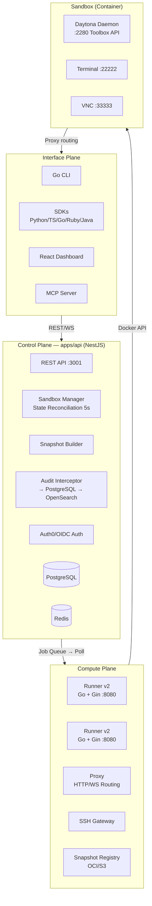
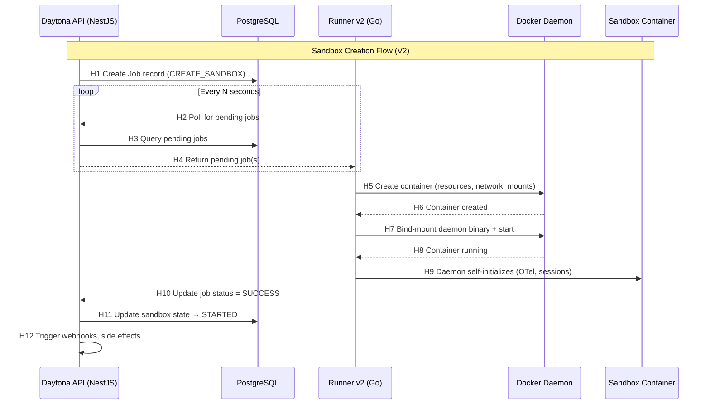

# Architecture — Daytona

> **Evidence Basis**: Official architecture docs, DeepWiki analysis, PR discussions, web search
> **Conclusion Types**: [F] = FACT, [I] = INFERENCE, [R] = RECOMMENDATION

## 1. Three-Plane Architecture Overview

Daytona 采用清晰的三平面分离架构：



**[F]** Three-plane architecture described in official docs at `apps/docs/src/content/docs/en/architecture.mdx`. [F] Runner polling model described in PR #3361.

## 2. Control Plane Deep Dive

### 2.1 API Service (`apps/api`)

Daytona 的 Control Plane 是一个 NestJS 服务，运行在端口 3001。核心职责：

1. **请求入口**：所有客户端请求（SDK/CLI/Dashboard）通过 REST API 进入
2. **认证授权**：Auth0/OIDC 集成，组织级多租户
3. **Sandbox 编排**：通过 `SandboxManager` 管理完整生命周期
4. **Job 创建**：将 sandbox 操作转化为 Job，持久化到 DB
5. **State Reconciliation**：每 5 秒运行 `syncInstanceState` cron job

**[F]** API uses NestJS with `SandboxController`, `SandboxService`, `SandboxManager`. Confirmed via DeepWiki backend architecture page.

### 2.2 State & Resource Management

```
Sandbox Entity (TypeORM)
├── state: UNKNOWN | PENDING_BUILD | STARTED | STOPPED | ARCHIVED | ERROR
├── desiredState: STARTED | STOPPED | ARCHIVED
├── resources: { cpu: 1, memory: 1, disk: 3 }  // GiB
├── metadata: { sandbox config }
├── lastActivityAt: DateTime  // for auto-stop policies
└── timestamps: createdAt, updatedAt
```

**[F]** Sandbox entity structure confirmed via DeepWiki. Entity at `apps/api/src/sandbox/entities/sandbox.entity.ts:56-233`.

### 2.3 Distributed Locking

使用 Redis 分布式锁防止竞态条件：

```
Lock Key Pattern: sandbox:{sandboxId}:state-change
Provider: RedisLockProvider
```

**[F]** Locking pattern confirmed via DeepWiki backend architecture.

### 2.4 Audit Logging ("Record-Execute-Update" Pattern)

```
Request → AuditInterceptor.pre()
        → Create AuditLog (status=null) in PostgreSQL
        → Execute handler
        → AuditInterceptor.post()
        → Update AuditLog (statusCode, error)
        → Cron (1s): publish to OpenSearch Data Streams
        → Delete from PostgreSQL staging
```

**[F]** Audit logging detailed in DeepWiki audit logging page, `audit.interceptor.ts`, and `audit-opensearch.adapter.ts`.

## 3. Compute Plane Deep Dive

### 3.1 Runner Architecture v2 (`apps/runner`)

Runner v2 采用 **Job-based Polling** 模式，这是 Daytona 架构最核心的创新：



**[F]** V2 flow confirmed via PR #3361 (Runner v2) and DeepWiki runner system page. [I] Polling interval not specified in available sources — inferred as configurable.

### 3.2 Job Types handled by Runner Executor

| Job Type | Handler File | Description |
|----------|-------------|-------------|
| `CREATE_SANDBOX` | `executor/sandbox.go` | Create container, mount daemon, start |
| `START_SANDBOX` | `executor/sandbox.go` | Start stopped container |
| `STOP_SANDBOX` | `executor/sandbox.go` | Stop running container |
| `DESTROY_SANDBOX` | `executor/sandbox.go` | Remove container |
| `RESIZE_SANDBOX` | `executor/sandbox.go` | Update CPU/mem/disk limits |
| `BUILD_SNAPSHOT` | `executor/snapshot.go` | Build Docker image |
| `SNAPSHOT_SANDBOX` | `executor/snapshot_sandbox.go` | Docker commit → tag → push |
| `FORK_SANDBOX` | `executor/sandbox.go` | Copy sandbox |
| `CREATE_BACKUP` | `executor/backup.go` | Backup sandbox |

**[F]** Job types confirmed via PR #3361, #4452, #4636 and DeepWiki.

### 3.3 Container Configuration Matrix

```
Standard Sandbox:
├── Privileged: true
├── Resources: dynamic (API-defined)
│   ├── CPU: 1-4 vCPU (org max)
│   ├── Memory: 1-8 GiB (org max)
│   └── Disk: 1-10 GiB (org max)
├── Daemon Mount: /usr/local/bin/daytona
├── Computer Use Plugin: /usr/local/lib/daytona-computer-use
└── Storage: XFS storage opts (if available)

GPU Sandbox:
├── Privileged: false (uses CDI)
├── Resources: fixed (16 cores, 256GB RAM, 512GB disk)
├── GPU: NVIDIA_VISIBLE_DEVICES=0
└── Same mounts as standard
```

**[F]** Container configs confirmed via DeepWiki runner architecture, `container_configs.go`.

### 3.4 Runner Healthcheck

```
Healthcheck Service (healthcheck.go):
├── Continuous heartbeat reporting to Control Plane
├── Capacity metrics (available resources)
├── Enables Control Plane to make scheduling decisions
└── Dead runner detection → job reassignment
```

**[F]** Healthcheck described in PR #3361 and DeepWiki runner system page.

## 4. Sandbox Architecture

### 4.1 Sandbox as Full Composable Computer

每个 Sandbox 是一个完整的 Linux 运行时环境：

```
Sandbox Container
├── Dedicated kernel namespace (PID, NET, IPC, UTS, MNT)
├── Allocated vCPU + RAM + Disk
├── Network: bridge isolation (runner-bridge, ICC disabled)
├── Internal Daemon (:2280)
│   ├── File System API
│   ├── Git Operations API
│   ├── Process Execution API (shell, code, PTY)
│   ├── LSP (Python/TypeScript)
│   ├── Computer Use API (mouse, keyboard, screenshot)
│   ├── Interpreter (stateful Python/TS)
│   └── Port/Proxy API
├── Terminal (:22222) — WebSocket terminal + SSH
└── VNC (:33333) — Recording playback
```

**[F]** Sandbox architecture from official docs (`sandboxes.mdx`) and web search results.

### 4.2 Sandbox Lifecycle States

```
                      ┌──────────┐
                      │  (Start)  │
                      └─────┬────┘
                            │
                      ┌─────▼──────┐
                ┌─────│ PULLING/   │
                │     │ BUILDING   │
                │     └─────┬──────┘
                │           │
                │     ┌─────▼──────┐
                │     │  CREATING  │
                │     └─────┬──────┘
                │           │
                │     ┌─────▼──────┐
                │     │  STARTING  │
                │     └─────┬──────┘
                │           │
                │     ┌─────▼──────┐
         ┌──────┼─────│  STARTED   │──────┐
         │      │     └─────┬──────┘      │
         │      │           │              │
   ┌─────▼──┐   │     ┌─────▼──────┐  ┌────▼──────┐
   │ ERROR  │   │     │  STOPPING  │  │ RESIZING   │
   └────────┘   │     └─────┬──────┘  └────────────┘
                │           │
                │     ┌─────▼──────┐
                │     │  STOPPED   │
                │     └─────┬──────┘
                │           │
                │     ┌─────▼──────┐
                │     │ ARCHIVING  │
                │     └─────┬──────┘
                │           │
                │     ┌─────▼──────┐
                │     │ ARCHIVED   │──► RESTORING ──► STARTING
                │     └─────┬──────┘
                │           │
                │     ┌─────▼──────┐
                │     │ DELETING   │
                │     └─────┬──────┘
                │           │
                │     ┌─────▼──────┐
                └─────│  DELETED   │
                      └────────────┘
```

**[F]** State machine confirmed via official sandbox documentation.

### 4.3 Auto-Lifecycle Policies

```
Auto-Stop:  check every 10s → stop if idle > autoStopInterval
Auto-Archive: archive stopped sandboxes after autoArchiveInterval
Auto-Delete:  delete archived sandboxes after autoDeleteInterval
Ephemeral:    destroy directly on timeout (skip STOPPED state)
```

**[F]** Auto-lifecycle policies from official docs.

## 5. Network Architecture

### 5.1 Three-Layer Network Isolation

```
Layer 1 — Bridge Isolation
├── runner-bridge (172.20.0.0/16)
├── ICC (Inter-Container Communication): DISABLED
└── Sandboxes cannot reach each other

Layer 2 — Egress Control (iptables)
├── networkBlockAll: true → block ALL outbound
├── networkAllowList: CIDR whitelist
├── limitNetworkEgress: rate limiter
└── Applied async via NetRulesManager

Layer 3 — Tier-Based
├── Tier 1-2: restricted (package registries, Git, CDN, AI APIs)
├── Tier 3-4: full internet (optional allowlist/block)
└── Proxy routing: {port}-{sandboxId}.{proxyDomain}
```

**[F]** Network policy details confirmed via official docs and DeepWiki network configuration page.

### 5.2 Proxy Routing

```
Preview URL format: {port}-{sandboxId}.{proxyDomain}
├── HTTP + WebSocket support
├── Public or signed (token in URL with expiry)
└── Proxy service handles auth + routing
```

**[F]** Proxy routing format from official architecture docs.

## 6. Workspace Snapshot System

### 6.1 Snapshot Lifecycle

```
Source (Dockerfile or OCI Image)
    → Snapshot Builder (API process)
    → Runner builds/pulls image
    → Push to Internal OCI Registry (S3-backed)
    → Propagate to regional runners (SnapshotManager)
    → Mark as READY
    → Runners pull and create sandboxes from snapshot

Cleanup: Cron removes inactive snapshots to free disk
```

**[F]** Snapshot system from DeepWiki search results and PR #4636 (docker filesystem snapshots).

### 6.2 Snapshot Types

| Type | Source | Use Case |
|------|--------|----------|
| Base Snapshot | Dockerfile / OCI image | Clean environment template |
| Filesystem Snapshot | Docker commit of running sandbox | Stateful workflow save/restore |
| Fork | Copy of existing sandbox | Agent exploration branching |

**[F]** Snapshot types from PR #4452, #4636, and architecture docs.

## 7. Customer-Managed Compute Architecture

```
Daytona Control Plane (cloud)
        │
        │ API (job queue)
        │
        ▼
Customer Infrastructure
├── Runner (customer-managed)
│   ├── Polls jobs from Daytona API
│   ├── Executes sandboxes locally
│   └── Reports health + capacity
├── Proxy (optional, customer-managed)
│   └── Routes traffic within customer network
├── SSH Gateway (optional)
│   └── SSH traffic stays in customer network
└── Snapshot Manager (optional)
    └── Snapshots stored in customer S3
```

**[F]** Customer-managed compute architecture confirmed via DeepWiki regions and infrastructure page.

## 8. Key Architectural Patterns (for RoboThree)

### Pattern 1: Job-Based Polling (Runner v2)

**What**: Control Plane creates jobs; runners poll and execute.
**Why important**: Decouples control plane from compute plane. Runners can be behind NAT/firewalls. Enables customer-managed compute.
**RoboThree mapping**: Worker Runtime should use this pattern instead of direct container management.

### Pattern 2: Daemon Injection

**What**: Runner embeds daemon binary, bind-mounts into every sandbox at `/usr/local/bin/daytona`.
**Why important**: Provides consistent in-sandbox API surface without pre-building custom images.
**RoboThree mapping**: Worker should inject agent runtime into sandbox, not require pre-installed agents.

### Pattern 3: State Reconciliation Loop

**What**: `SandboxManager.syncInstanceState()` runs every 5 seconds, compares actual vs desired state.
**Why important**: Handles runner failures, network partitions, and edge cases.
**RoboThree mapping**: Workspace Manager needs this pattern for reliability.

### Pattern 4: Record-Execute-Update Audit

**What**: Audit log created before execution (status=null), updated after completion.
**Why important**: Ensures audit trail even on crashes.
**RoboThree mapping**: Enterprise Control Plane audit logging.

**[R]** All four patterns are strong candidates for ADOPT with adaptation.
