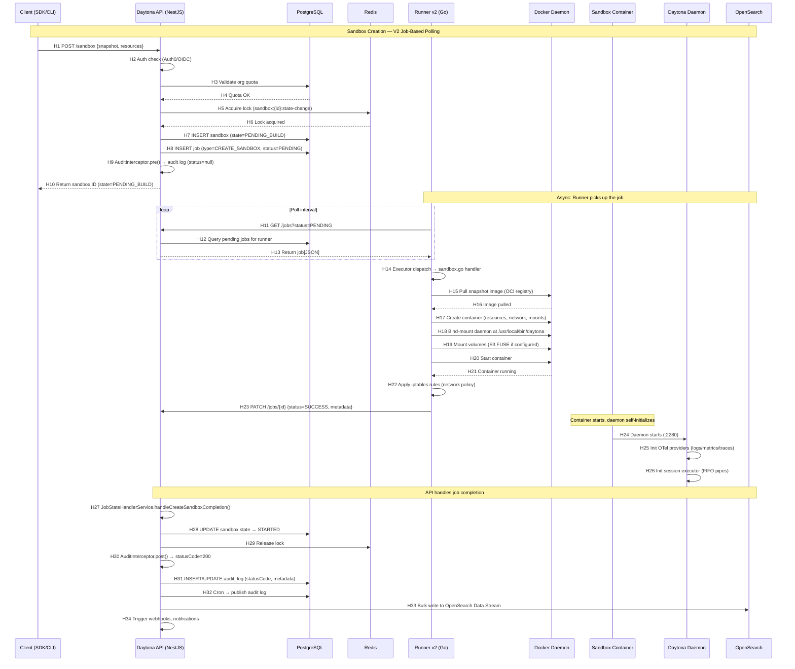
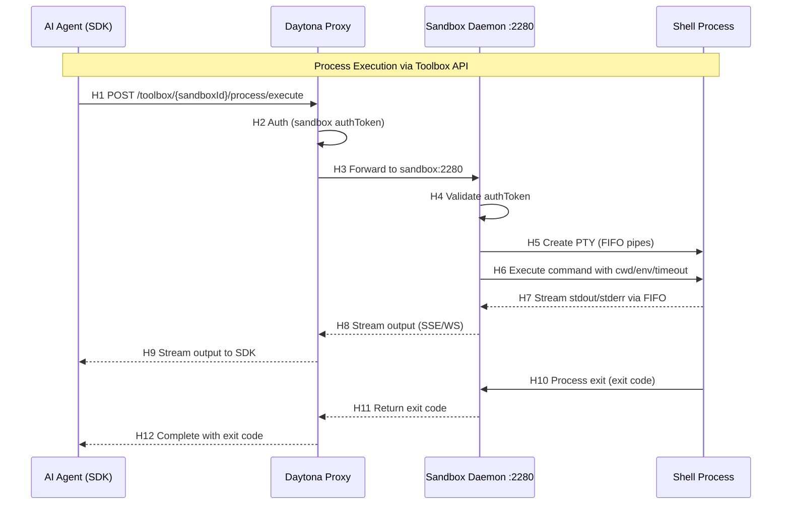
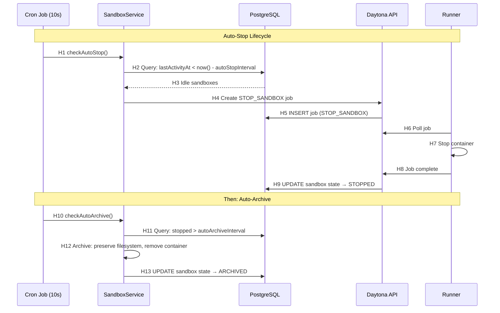

# Runtime Sequence — Daytona

> **Evidence Basis**: Official architecture docs, DeepWiki, PR #3361 (Runner v2), PR #4452
> **Conclusion Types**: [F] = FACT, [I] = INFERENCE, [R] = RECOMMENDATION

## 1. Primary Trace: Sandbox Creation (V2 Job-Based)

The representative end-to-end path for sandbox creation via the V2 job-based polling architecture.

### 1.1 Mermaid Sequence Diagram

**[F]** Sequence confirmed via: architecture docs, PR #3361 (Runner v2), DeepWiki runner system and backend architecture pages.

## 2. Hop Evidence Table

| Hop | From → To | File / Source | Symbol or Key | Evidence Type | Conclusion Type | Confidence |
|-----|-----------|---------------|---------------|---------------|-----------------|------------|
| H1 | Client → API | `sandbox.controller.ts` | `POST /sandbox` | DOCS | FACT | HIGH |
| H2 | API Auth | Auth0/OIDC config | Guard decorator | DOCS | FACT | HIGH |
| H3-H4 | API → DB Quota | NestJS service | `validateOrgQuota()` | DEEPWIKI | INFERENCE | MEDIUM |
| H5-H6 | Redis Lock | Redis module | `sandbox:{id}:state-change` | DEEPWIKI | FACT | HIGH |
| H7 | INSERT Sandbox | `sandbox.entity.ts` | TypeORM `.save()` | DEEPWIKI | FACT | HIGH |
| H8 | INSERT Job | Job entity (V2) | `RunnerAdapterV2.createJob()` | DEEPWIKI | FACT | HIGH |
| H9 | Audit Interceptor | `audit.interceptor.ts` | `pre()` → status=null | DEEPWIKI | FACT | HIGH |
| H11-H13 | Runner Poll | `poller/poller.go` | `Poll()` | DEEPWIKI | FACT | HIGH |
| H14 | Executor Dispatch | `executor/executor.go` | `Dispatch(job)` | DEEPWIKI | FACT | HIGH |
| H15-H16 | Docker Pull | `client.go` | `RetryWithExponentialBackoff` | DEEPWIKI | FACT | MEDIUM |
| H17-H20 | Container Create | `container_configs.go` | Standard vs GPU config | DEEPWIKI | FACT | HIGH |
| H21-H22 | Network Rules | `NetRulesManager` | iptables apply | DOCS | FACT | MEDIUM |
| H23 | Job Update | `poller/poller.go` | `UpdateJobStatus()` | DEEPWIKI | FACT | HIGH |
| H24-H26 | Daemon Init | `cmd/daemon/main.go` | OTel + session executor | DEEPWIKI | FACT | MEDIUM |
| H27-H28 | State Handler | `job-state-handler.service.ts` | `handleCreateSandboxCompletion()` | DEEPWIKI | FACT | HIGH |
| H29 | Release Lock | Redis module | Lock release | DEEPWIKI | INFERENCE | MEDIUM |
| H30-H33 | Audit Publish | `audit-opensearch.adapter.ts` | Bulk write to Data Stream | DEEPWIKI | FACT | MEDIUM |

## 3. Secondary Trace: Process Execution via Daemon Toolbox API

**[F]** Process execution confirmed via official sandbox docs (Toolbox API). [I] SSE/WS streaming inferred from SDK documentation.

## 4. Tertiary Trace: Auto-Stop Lifecycle

**[F]** Auto-stop flow confirmed via official sandbox docs.

## 5. Confirmed by

| Path | Confirmation |
|------|-------------|
| Primary (Sandbox Creation) | Source docs + DeepWiki + PR discussions |
| Secondary (Process Execution) | Official sandbox docs |
| Tertiary (Auto-Stop) | Official sandbox docs |

**Overall**: source-confirmed (docs + DeepWiki), not runtime-verified.
