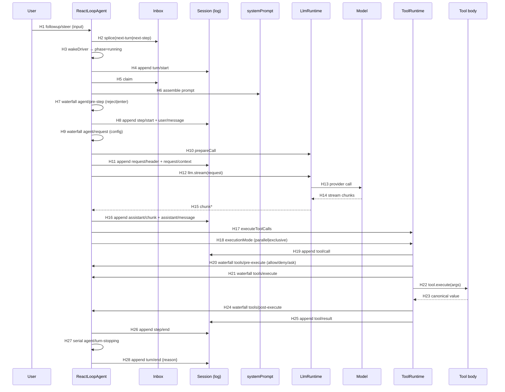

# DeepSeek Harness — Runtime Sequence

> 代表性端到端主路径：一条包含一次 Tool Call 的正常请求。
> Confirmed by: **source**（静态源码确认，未运行时验证）。

## 1. 文字链路（函数级）

```text
User input (followup/steer)
→ ReactLoopAgent.send() → inbox.splice() → wakeDriver()
→ kick() → turn() 循环
  → session.append('turn/start')
  → preStep(target, {turn, step})
    → inbox.claim() → systemPrompt.assemble() → renderContextSections()
    → dispatch.waterfall('agent/pre-step')  → reject | enter(messages)
  → session.append('step/start')
  → session.append('user/message')
  → step(assembly)
    → buildRequest()
      → dispatch.waterfall('agent/request')
      → llm.prepareCall() → canonicalHeader()
      → session.append('request/header') / 'request/context'
    → llm.stream(request) → for await chunk → session.append('assistant/chunk')
    → session.append('assistant/message')
    → 若 tool-calls → executeToolCalls()
      → ctx.tools.executionMode() 分类 parallel/exclusive
      → runGroup()（bounded rolling pool）
        → appendToolCall('tool/call')
        → scheduler.prepare → tools/pre-execute 瀑布（allow/deny/ask）
        → scheduler.dispatch → tools/execute 瀑布 → dispatchToolBody → tool.execute()
        → scheduler.finalize → tools/post-execute 瀑布 → appendToolResult('tool/result')
    → 返回 concluded? → step 循环继续或结束
  → session.append('step/end')
  → dispatch.serial('agent/turn-stopping')
  → session.append('turn/end', { reason })
```

## 2. Mermaid sequenceDiagram



## 3. Hop Evidence

| Hop | From → To | File | Symbol or Key | Lines | Evidence Type | Conclusion Type | Confidence |
|---|---|---|---|---|---|---|---|
| H1 | UserInput → Agent | packages/core/agent-loop/src/agent.ts | `send()` / `followup()` / `steer()` / `inject()` | 113-132 | SOURCE | FACT | HIGH |
| H2 | Agent → Inbox | packages/core/agent-loop/src/agent.ts | `inbox.splice()` | 118 | SOURCE | FACT | HIGH |
| H3 | Agent → driver | packages/core/agent-loop/src/agent.ts | `wakeDriver()` → `setPhase(running)` | 172-193 | SOURCE | FACT | HIGH |
| H4 | Agent → Session | packages/core/agent-loop/src/agent.ts | `session.append('turn/start')` | 255 | SOURCE | FACT | HIGH |
| H5 | Agent → Inbox | packages/core/agent-loop/src/agent.ts | `preStep()` → `inbox.claim()` | 229 | SOURCE | FACT | HIGH |
| H6 | Agent → systemPrompt | packages/core/agent-loop/src/agent.ts | `loopCtx.systemPrompt.assemble()` | 230 | SOURCE | FACT | HIGH |
| H7 | Agent → pre-step 瀑布 | packages/core/agent-loop/src/agent.ts | `dispatch.waterfall('agent/pre-step')` | 234-240 | SOURCE | FACT | HIGH |
| H8 | Agent → Session | packages/core/agent-loop/src/agent.ts | `append('step/start')` + `append('user/message')` | 279-284 | SOURCE | FACT | HIGH |
| H9 | Agent → request 瀑布 | packages/core/agent-loop/src/agent.ts | `dispatch.waterfall('agent/request')` | 438-441 | SOURCE | FACT | HIGH |
| H10 | Agent → LlmRuntime | packages/core/agent-loop/src/agent.ts | `loopCtx.llm.prepareCall()` | 449 | SOURCE | FACT | HIGH |
| H11 | Agent → Session | packages/core/agent-loop/src/agent.ts | `append('request/header')` / `append('request/context')` | 466-483 | SOURCE | FACT | HIGH |
| H12 | Agent → LlmRuntime | packages/core/agent-loop/src/agent.ts | `llm.stream(request)` | 345 | SOURCE | FACT | HIGH |
| H13-H15 | LlmRuntime → Model → chunk | packages/llm/llm/src/index.ts | `LlmRuntime.stream()` | 913 | SOURCE | FACT | HIGH |
| H16 | Agent → Session | packages/core/agent-loop/src/agent.ts | `append('assistant/chunk')` / `append('assistant/message')` | 349-390 | SOURCE | FACT | HIGH |
| H17 | Agent → ToolRuntime | packages/core/agent-loop/src/agent.ts | `executeToolCalls()` | 395-399 | SOURCE | FACT | HIGH |
| H18 | Agent → ToolRuntime | packages/core/agent-loop/src/tool-calls.ts | `ctx.tools.executionMode()` | 88 | SOURCE | FACT | HIGH |
| H19 | ToolRuntime → Session | packages/core/agent-loop/src/tool-calls.ts | `appendToolCall('tool/call')` | 167 | SOURCE | FACT | HIGH |
| H20 | ToolRuntime → pre-execute | packages/core/tools/src/index.ts | `waterfall('tools/pre-execute')` | 1475-1478 | SOURCE | FACT | HIGH |
| H21 | ToolRuntime → execute | packages/core/tools/src/index.ts | `waterfall('tools/execute')` | 1573-1576 | SOURCE | FACT | HIGH |
| H22 | ToolRuntime → body | packages/core/tools/src/index.ts | `tool.execute(exec.arguments, exec)` | 1549 | SOURCE | FACT | HIGH |
| H23 | body → value | packages/core/tools/src/index.ts | `createSuccessResult()` | 1550 | SOURCE | FACT | HIGH |
| H24 | ToolRuntime → post-execute | packages/core/tools/src/index.ts | `waterfall('tools/post-execute')`（finalize） | 1609-1621 | SOURCE | FACT | HIGH |
| H25 | ToolRuntime → Session | packages/core/agent-loop/src/tool-calls.ts | `appendToolResult('tool/result')` | 155 | SOURCE | FACT | HIGH |
| H26 | Agent → Session | packages/core/agent-loop/src/agent.ts | `append('step/end')` | 292 | SOURCE | FACT | HIGH |
| H27 | Agent → turn-stopping | packages/core/agent-loop/src/agent.ts | `dispatch.serial('agent/turn-stopping')` | 296 | SOURCE | FACT | HIGH |
| H28 | Agent → Session | packages/core/agent-loop/src/agent.ts | `append('turn/end', { reason })` | 319 | SOURCE | FACT | HIGH |

## 4. 关键机制说明

### 4.1 双队列 Inbox

- `[F]` `InboxTarget = 'next-turn' | 'next-step'`（[agent/types.ts:10](../../sources/deepseek-harness/packages/core/agent/src/types.ts#L10)）。
- `[F]` `followup` → next-turn（新 turn）；`steer`/`inject` → next-step（当前 turn 下一步）（[agent.ts:122-132](../../sources/deepseek-harness/packages/core/agent-loop/src/agent.ts#L122-L132)）。
- `[F]` 一个 turn 内：`preStep` 先 claim next-turn，之后 step 循环 claim next-step（[agent.ts:261-301](../../sources/deepseek-harness/packages/core/agent-loop/src/agent.ts#L261-L301)）。

### 4.2 Step 的 `while(true)` 与重试

- `[F]` `step()` 内部 `while(true)`：一次 step 内可因 `agent/request-error` 瀑布返回 `retry` 而重发模型请求（[agent.ts:339-400](../../sources/deepseek-harness/packages/core/agent-loop/src/agent.ts#L339-L400)）。
- `[F]` finish 为 `error`/`aborted` 时走 `dispatch.waterfall('agent/request-error')`，只有返回 `{kind:'retry'}` 才 `continue`（[agent.ts:354-370](../../sources/deepseek-harness/packages/core/agent-loop/src/agent.ts#L354-L370)）。

### 4.3 工具并发与取消

- `[F]` `executeToolCalls` 用 `executionMode` 把 parallel/exclusive 分组；`runGroup` 用 bounded rolling pool（`maxParallelToolCalls`），结果按 model 顺序 commit（[tool-calls.ts:59-246](../../sources/deepseek-harness/packages/core/agent-loop/src/tool-calls.ts#L59-L246)）。
- `[F]` abort 时 drain started calls、为 skipped calls 记录合成 error result（`TOOL_ABORTED_BEFORE_DISPATCH`），保持 replay 合法（[tool-calls.ts:248-259](../../sources/deepseek-harness/packages/core/agent-loop/src/tool-calls.ts#L248-L259)）。

### 4.4 Turn 终止判定

- `[F]` `TurnEndReason`：`completed` / `aborted`（reason 细分 user/parent/hook/disposed/legacy）/ `blocked` / `error` / `max-tokens` / `interrupted`（[types.ts:155-177](../../sources/deepseek-harness/packages/core/session/src/types.ts#L155-L177)）。
- `[F]` `max-tokens` 是 sticky：后续正常完成的 step 不会把 turn outcome 降级（[agent.ts:287-290](../../sources/deepseek-harness/packages/core/agent-loop/src/agent.ts#L287-L290)）。

## 5. 补充路径（非主路径，记录）

- **取消**：`cancel(cause)` 清 inbox + `phase.abort.abort(cause)`（[agent.ts:134-140](../../sources/deepseek-harness/packages/core/agent-loop/src/agent.ts#L134-L140)）。turn 以 `aborted` 结束，`turn/end` 记录 reason。
- **Maintenance**：`runMaintenance(job)` 独占 maintenance phase，wake 请求 latch 到收敛后重放（[agent.ts:142-162](../../sources/deepseek-harness/packages/core/agent-loop/src/agent.ts#L142-L162)）。
- **Pre-step reject / 空输入**：`preStep` 返回 `reject` → turn 以 `blocked` 结束；空消息 → turn 以 `completed` 结束但 no step（[agent.ts:267-277](../../sources/deepseek-harness/packages/core/agent-loop/src/agent.ts#L267-L277)）。

## 6. Confirmed by 标注

- 本链路为 `source-confirmed path`：全部 Hop 来自静态源码。
- 未运行时验证：不声称已观察真实执行；`stream()` 的 provider 行为、abort 时序、并发上限等只能 `[I]` / `[UNKNOWN]`。
