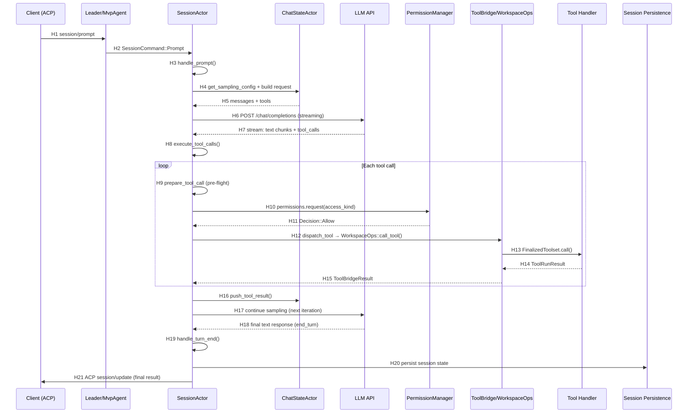

# grok-build — Runtime Sequence

> 一次 `session/prompt` → Tool Call → Result 的代表性端到端正常路径。
> 所有链路经源码确认（SOURCE_CONFIRMED）。
> Commit: `98c3b24`

## Level 3 补充（Mechanism 1 & 3）

### Tool 并发执行（Mechanism 3）

参考 [tool-system.md](tool-system.md) §2 完整分析。补充关键点：

- H12（dispatch_tool）实际通过 `FuturesUnordered` 并发（[tool_calls.rs:477](tool_calls.rs:477)），而非串行
- 同一文件路径的写操作通过 `tokio::sync::Mutex<()>` 串行化（[tool_calls.rs:392-404](tool_calls.rs:392-404)）
- 读工具 (`is_read_only=true`) 无锁，全并发
- `call_with_auth_retry` 通过 `Arc<OnceCell<bool>>` 在同一批内只触发一次 auth refresh（[tool_calls.rs:405, 444](tool_calls.rs:405)）

### Subagent 权限继承（Mechanism 1）

参考 [subagent-system.md](subagent-system.md) §2 完整分析。补充关键点：

- Subagent 创建时通过 `ctx.permission_handle.clone()` 传递父 session 的 `PermissionHandle`（[handle_request.rs:1172](handle_request.rs:1172)）
- `PermissionHandle::Actor` 通过 `Arc<UnboundedSender<PermissionCommand>>` 共享同一权限 actor task
- `yolo_state` / `auto_state` 通过 `Arc<AtomicBool>` 共享，跨 session 即时同步
- `in_flight: Arc<AtomicUsize>` 用于跨 session telemetry

## 文字调用链

```text
ACP session/prompt (JSON-RPC)
→ MvpAgent: 路由 SessionCommand::Prompt 到 SessionActor
→ SessionActor.run_session() 接收到 SessionCommand::Prompt
→ SessionActor.handle_prompt() — prompt 解析 + slash 命令处理
→ sampler loop: ChatStateActor 构建 API 请求 → LLM streaming
→ LLM 返回 tool_calls → SessionActor.execute_tool_calls()
→ 对每个 ToolCall:
    → SessionActor.prepare_tool_call() — 预检 (MCP init + args parse + hooks + permission)
    → permissions.request(access_kind) — ↑ 权限检查 (PermissionManager)
    → Decision::Allow → dispatch_tool() → WorkspaceOps::call_tool()
    → FinalizedToolset.call() → Tool handler 执行
→ ToolRunResult 写回 → ChatStateActor.push_tool_result()
→ 继续 sampler loop 或满足终止条件
→ SessionActor.handle_turn_end() → persistence 写入
→ ACP session/update 通知 → 最终结果返回客户端
```

## Mermaid Sequence Diagram



## Hop Evidence

| Hop | From → To | File | Symbol or Key | Lines | Evidence Type | Conclusion Type | Confidence |
| --- | --- | --- | --- | --- | --- | --- | --- |
| H1 | Client → Leader/MvpAgent | `crates/codegen/xai-grok-shell/src/agent/mvp_agent/acp_agent.rs` | `impl acp::Agent for MvpAgent` | 7 | SOURCE | FACT | HIGH |
| H2 | MvpAgent → SessionActor | `crates/codegen/xai-grok-shell/src/session/acp_session_impl/run_loop.rs` | `SessionCommand::Prompt {..}` match arm | 281 | SOURCE | FACT | HIGH |
| H3 | SessionActor 入口 | `crates/codegen/xai-grok-shell/src/session/acp_session_impl/turn.rs` | `SessionActor::handle_prompt()` | 210 | SOURCE | FACT | HIGH |
| H4 | SessionActor → ChatStateActor | `crates/codegen/xai-grok-shell/src/session/acp_session_impl/turn.rs` | `self.chat_state_handle` calls | ~300+ | SOURCE | FACT | HIGH |
| H5 | ChatStateActor 返回 | `crates/codegen/xai-chat-state/src/actor/queries.rs` | `get_conversation()`, `get_sampling_config()` | — | SOURCE | FACT | HIGH |
| H6 | SessionActor → LLM | `crates/codegen/xai-grok-shell/src/session/acp_session_impl/sampler_turn.rs` | sampling call | — | SOURCE | FACT | MEDIUM |
| H7 | LLM streaming 响应 | `crates/codegen/xai-grok-sampler/src/stream/` | stream processing | — | SOURCE | FACT | MEDIUM |
| H8 | 工具调用入口 | `crates/codegen/xai-grok-shell/src/session/acp_session_impl/tool_calls.rs` | `SessionActor::execute_tool_calls()` | 284 | SOURCE | FACT | HIGH |
| H9 | 工具预检 | `crates/codegen/xai-grok-shell/src/session/acp_session_impl/tool_calls.rs` | `SessionActor::prepare_tool_call()` | 742 | SOURCE | FACT | HIGH |
| H10 | 权限检查请求 | `crates/codegen/xai-grok-shell/src/session/acp_session_impl/tool_calls.rs` | `self.permissions.request(access_kind, ..)` | 1076-1084 | SOURCE | FACT | HIGH |
| H11 | 权限决策返回 | `crates/codegen/xai-grok-workspace/src/permission/types.rs` | `Decision` enum (Allow/Reject/Cancelled/FollowupMessage/Ask/PolicyDeny) | — | SOURCE | FACT | HIGH |
| H12 | 工具分发 | `crates/codegen/xai-grok-shell/src/session/acp_session_impl/tool_dispatch.rs` | `dispatch_tool()` → `WorkspaceOps::call_tool()` | 13-33 | SOURCE | FACT | HIGH |
| H13 | 最终工具执行 | `crates/codegen/xai-grok-workspace/src/workspace_ops.rs` | `WorkspaceOps::call_tool()` → `FinalizedToolset.call()` | 1460-1484 | SOURCE | FACT | HIGH |
| H14 | 工具返回结果 | `crates/codegen/xai-grok-tools/src/bridge.rs` | `ToolBridgeResult` | 32 | SOURCE | FACT | HIGH |
| H15 | 结果回传 | `crates/codegen/xai-grok-shell/src/session/acp_session_impl/tool_calls.rs` | post-execution result handling | ~450+ | SOURCE | FACT | HIGH |
| H16 | 结果写回 ChatState | `crates/codegen/xai-grok-shell/src/session/acp_session_impl/tool_calls.rs` | `self.chat_state_handle.push_tool_result()` | ~490+ | SOURCE | FACT | HIGH |
| H17 | 继续 sampling | `crates/codegen/xai-grok-shell/src/session/acp_session_impl/sampler_turn.rs` | next iteration of sampling loop | — | SOURCE | INFERENCE | MEDIUM |
| H18 | LLM 最终响应 | `crates/codegen/xai-grok-shell/src/session/acp_session_impl/sampler_turn.rs` | end_turn condition | — | SOURCE | INFERENCE | MEDIUM |
| H19 | Turn 结束 | `crates/codegen/xai-grok-shell/src/session/acp_session_impl/turn_end.rs` | `handle_turn_end()` | — | SOURCE | FACT | MEDIUM |
| H20 | 持久化 | `crates/codegen/xai-chat-state/src/persistence.rs` | `ChatPersistence` trait | — | SOURCE | FACT | MEDIUM |
| H21 | 结果通知客户端 | `crates/codegen/xai-grok-shell/src/session/acp_session_impl/notification_drain.rs` | ACP session/update notification | — | SOURCE | INFERENCE | MEDIUM |

## 正常路径

1. Client 发送 `session/prompt` JSON-RPC 到 MvpAgent
2. MvpAgent 将 prompt 路由到目标 SessionActor 的 `cmd_tx` (SessionCommand::Prompt)
3. `run_session()` 接收命令 → 调用 `handle_prompt()`
4. `handle_prompt()` 处理 slash 命令解析 → 构建 prompt blocks → 进入 sampler loop
5. LLM 返回包含 `tool_calls` 的响应
6. `execute_tool_calls()` 遍历每个 tool call:
   a. `prepare_tool_call()` 做预检
   b. 权限检查 → Decision::Allow
   c. 并发执行工具（文件编辑按 path 串行化）
7. 工具结果写回 ChatStateActor → 继续 LLM sampling 或退出
8. Turn 结束时持久化 session 状态 → 发送 ACP session/update

## Tool 拒绝路径

权限返回 `Decision::Reject` / `Decision::PolicyDeny` 时：

- `prepare_tool_call()` 返回 `Err(ToolLoop::PermissionReject {..})`（[tool_calls.rs:347](tool_calls.rs:347)）
- `execute_tool_calls()` 将同一批中后续 tool call 全部跳过，标记 ToolLoop
- 拒绝信息作为 tool_result 写回 ChatStateActor（[tool_calls.rs:319-321](tool_calls.rs:319-321)）

## 用户 Abort 路径

- SessionActor 监听 `SessionEvent` 中的 abort 事件
- Turn 设置 `CancellationToken`，sampler loop 和工具执行均可被取消
- 工具执行时 abort → 通过 `TerminalBackend.kill_foreground_commands()` 终止子进程
- 结果返回 `ToolLoop::Cancelled`

## LLM 请求失败路径

- `xai-grok-sampler` 中有 retry 逻辑（具体重试次数/退避策略未在本次深挖）
- SessionActor 的 `model_switch.rs` 处理模型不可用时的切换
- 连续失败后 turn 以 error 结束 → `TurnErrorInput` 通过 lifecycle hook 发送

## Leader 断线重连路径（补充路径，不塞入主图）

Leader 模式下的 `StdioReplayState` 机制（[main.rs:638-652](main.rs:638-652)）：

1. Stdio 模式下，bridge 缓存客户端发来的 `initialize`、`session/new`、`session/load` 请求
2. Leader 断开 → `LeaderReconnector::reconnect()` 重新连接
3. `replay_acp_state_after_reconnect()` 回放缓存的 initialize + 所有 session/load 请求
4. 等待每个 replayed 请求的 response 返回后才继续
5. 发送 `x.ai/leader_reconnected` 通知客户端
6. **恢复范围**：session 列表 + 客户端视图。不恢复运行中的 tool call、不恢复采样中间态。
