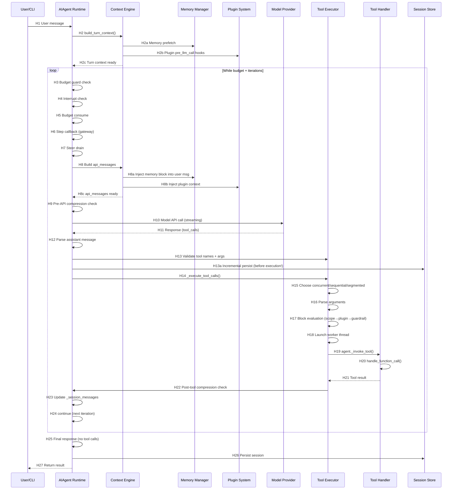

# Hermes Agent — Runtime Sequence

> **Path**: Normal CLI user turn with one tool call (e.g., `read_file`)  
> **Confirmed by**: SOURCE (static code analysis)  
> **Commit**: `3d9be2789552a495c7adf30148e867e7614a4bdc`

## Text Call Chain

```text
User Input
→ cli.py (entry)
→ AIAgent (run_agent.py, agent bootstrap)
→ run_conversation() [H1]
→ build_turn_context() [H2] (per-turn setup: stdio, memory prefetch, plugin hooks, system prompt)
→ [while loop guard: iteration_budget + max_iterations + grace call] [H3]
→ Interrupt Check [H4]
→ Budget Consume [H5]
→ Step Callback (gateway hooks) [H6]
→ Pre-API Steer Drain [H7]
→ Context Assembly [H8]
  → messages → api_messages (copy)
  → Memory injection into user message
  → Plugin context injection
  → System prompt prepend
  → Anthropic cache control
→ Pre-API Compression Check [H9]
→ API Call (retry loop) [H10]
  → _build_api_kwargs()
  → LLM Request Middleware
  → pre_api_request plugin hook
  → _interruptible_streaming_api_call() / _interruptible_api_call()
  → LLM Execution Middleware
→ Response Validation [H11]
→ Model Response Received (assistant_message with tool_calls) [H12]
→ Tool Call Processing [H13]
  → Tool name validation + repair
  → Argument JSON validation
  → Guardrails (cap, dedup)
  → Build assistant message → append to messages
  → Incremental session persist (before tool execution!)
  → _execute_tool_calls() [H14]
    → execute_tool_calls_concurrent() [H15]
    → _parse_tool_arguments() [H16]
    → Tool Search unwrap (if bridge)
    → Middleware + Block evaluation [H17]
      → Tool scope check
      → Plugin pre-tool block
      → Guardrail before_call()
    → Checkpoint preflight (file/destructive ops)
    → _run_tool worker in DaemonThreadPoolExecutor [H18]
      → agent._invoke_tool() [H19]
      → handle_function_call() [H20]
    → make_tool_result_message() [H21]
    → Append tool results to messages
    → enforce_turn_budget()
    → /steer injection
  → Post-tool Compression Check [H22]
  → agent._session_messages = messages [H23]
  → continue [H24] (back to while loop)
→ [Next iteration: no tool calls → final response]
→ Final Response Processing [H25]
  → Empty response recovery (partial stream, prior-turn fallback, nudge)
  → Post-response display
→ Post-Turn Finalization [H26]
  → turn_finalizer
  → background_review (memory/skill nudge)
  → _persist_session()
→ Return result dict to caller
```

## Mermaid Sequence Diagram



## Hop Evidence

| Hop | From → To | File | Symbol or Key | Lines | Evidence Type | Conclusion Type | Confidence |
| --- | --- | --- | --- | --- | --- | --- | --- |
| H1 | User Input → Agent Runtime | `agent/conversation_loop.py` | `run_conversation(user_message, ...)` | 565-575 | SOURCE | FACT | HIGH |
| H2 | Runtime → Context Engine | `agent/conversation_loop.py` | `build_turn_context(agent, ...)` | 618-634 | SOURCE | FACT | HIGH |
| H2a | Context → Memory | `agent/conversation_loop.py` | Memory prefetch call | 849-852 | SOURCE | INFERENCE | MEDIUM |
| H2b | Context → Plugin | `agent/conversation_loop.py` | Plugin pre_llm_call hooks | 617 (turn_context.py) | SOURCE | INFERENCE | MEDIUM |
| H3 | Budget Guard | `agent/conversation_loop.py` | `while (api_call_count < agent.max_iterations and agent.iteration_budget.remaining > 0)` | 689 | SOURCE | FACT | HIGH |
| H4 | Interrupt Check | `agent/conversation_loop.py` | `if agent._interrupt_requested:` | 694-699 | SOURCE | FACT | HIGH |
| H5 | Budget Consume | `agent/conversation_loop.py` | `agent.iteration_budget.consume()` | 710-714 | SOURCE | FACT | HIGH |
| H6 | Step Callback | `agent/conversation_loop.py` | `agent.step_callback(api_call_count, prev_tools)` | 717-742 | SOURCE | FACT | HIGH |
| H7 | Steer Drain | `agent/conversation_loop.py` | `agent._drain_pending_steer()` | 762-799 | SOURCE | FACT | MEDIUM |
| H8 | Context Assembly | `agent/conversation_loop.py` | api_messages construction loop | 838-881 | SOURCE | FACT | HIGH |
| H8a | Memory Injection | `agent/conversation_loop.py` | `build_memory_context_block(_ext_prefetch_cache)` | 849-852 | SOURCE | FACT | HIGH |
| H8b | Plugin Injection | `agent/conversation_loop.py` | `_plugin_user_context` append | 853-854 | SOURCE | FACT | HIGH |
| H9 | Pre-API Compression | `agent/conversation_loop.py` | `_compressor.should_compress(request_pressure_tokens)` | 1068-1126 | SOURCE | FACT | HIGH |
| H10 | Model API Call | `agent/conversation_loop.py` | `run_llm_execution_middleware(api_kwargs, _perform_api_call, ...)` | 1396-1413 | SOURCE | FACT | HIGH |
| H11 | Response Validation | `agent/conversation_loop.py` | api_mode-specific validation blocks | 1433-1511 | SOURCE | FACT | HIGH |
| H12 | Parse Assistant Message | `agent/conversation_loop.py` | `assistant_message.tool_calls` check | 4638 | SOURCE | FACT | HIGH |
| H13 | Tool Name Validation | `agent/conversation_loop.py` | `invalid_tool_calls = [...]` | 4656-4659 | SOURCE | FACT | HIGH |
| H13a | Incremental Persist | `agent/conversation_loop.py` | `agent._flush_messages_to_session_db(messages, conversation_history)` | 4971 | SOURCE | FACT | HIGH |
| H14 | Execute Tool Calls | `agent/conversation_loop.py` | `agent._execute_tool_calls(assistant_message, messages, effective_task_id, api_call_count)` | 4992 | SOURCE | FACT | HIGH |
| H15 | Choose Concurrent Mode | `agent/tool_executor.py` | `execute_tool_calls_concurrent(agent, assistant_message, messages, ...)` | 327 | SOURCE | FACT | HIGH |
| H16 | Parse Arguments | `agent/tool_executor.py` | `_parse_tool_arguments(tool_call.function.arguments)` | 366-368 | SOURCE | FACT | HIGH |
| H17 | Block Evaluation | `agent/tool_executor.py` | Scope → Plugin → Guardrail checks | 437-498 | SOURCE | FACT | HIGH |
| H18 | Launch Worker | `agent/tool_executor.py` | `executor.submit(propagate_context_to_thread(_run_tool), ...)` | 691-693 | SOURCE | FACT | HIGH |
| H19 | Invoke Tool | `agent/tool_executor.py` | `agent._invoke_tool(function_name, function_args, ...)` | 605 | SOURCE | FACT | HIGH |
| H20 | Handle Function Call | `agent/tool_executor.py` | `_ra().handle_function_call(...)` | 1486 | SOURCE | FACT | HIGH |
| H21 | Tool Result Message | `agent/tool_dispatch_helpers.py` | `make_tool_result_message(name, result, tc_id, ...)` | 457 | SOURCE | FACT | HIGH |
| H22 | Post-Tool Compression | `agent/conversation_loop.py` | `_compressor.should_compress(_real_tokens)` | 5073 | SOURCE | FACT | HIGH |
| H23 | Update Session Messages | `agent/conversation_loop.py` | `agent._session_messages = messages` | 5085 | SOURCE | FACT | HIGH |
| H24 | Continue Loop | `agent/conversation_loop.py` | `continue` | 5088 | SOURCE | FACT | HIGH |
| H25 | Final Response | `agent/conversation_loop.py` | `final_response = assistant_message.content or ""` | 5092 | SOURCE | FACT | HIGH |
| H26 | Persist Session | `agent/conversation_loop.py` | `agent._persist_session(...)` | Various (4700, 4781, etc.) | SOURCE | FACT | HIGH |
| H27 | Return Result | `agent/conversation_loop.py` | `return {...}` | Multiple exit points | SOURCE | FACT | HIGH |

## Key Observations

### Loop Structure

**[F]** The loop is a deterministic while-loop with three termination guards: max iterations, iteration budget, and grace call. Grace call (L708-709) allows one final iteration after budget exhaustion.

### API Call Resilience

**[F]** Each API call is wrapped in a nested retry loop (L1168) with:
- Rate limit awareness (Nous Portal guard)
- Fallback provider chain
- Error classification (HTTP status → FailoverReason)
- Adaptive backoff (`jittered_backoff()`, `adaptive_rate_limit_backoff()`)

### Tool Execution Safety

**[F]** Session is persisted **before** tool execution (L4966-4978):
```python
# Persist the assistant tool-call turn before any tool
# side effects run. If a destructive tool restarts or
# terminates Hermes mid-turn, resume logic still sees
# the exact tool-call block that already executed.
```

This is a deliberate design choice: crash-resilience > performance.

### Concurrent Tool Model

**[F]** Concurrent tool execution uses `DaemonThreadPoolExecutor` (custom — `tools/daemon_pool.py`) with:
- Max 8 workers
- Thread-local activity callbacks for heartbeat
- Thread-local interrupt bits
- Propagated ContextVars (approval session keys, sudo callbacks)
- 420s default timeout per batch

### Mixed Batch Handling

**[F]** When some tool calls have invalid names and others are valid (degrading model behavior), valid calls are executed while invalid calls get error results (L4671-4686). This is a **partial-failure tolerance** design.

## Supplement: Retry & Recovery Paths

### Path A: Invalid API Response

```text
API Call → Invalid Response → classify_api_error()
→ try_activate_fallback() → Switch provider
→ sync_failover_system_message() → Reset retry counters
→ Continue retry loop
```

### Path B: Invalid Tool Call (name hallucination)

```text
Tool Call → invalid_tool_calls list non-empty
→ _invalid_tool_retries++ → Inject error as tool result
→ continue (back to main loop, model sees error and corrects)
→ If >= 3 retries: return partial
```

### Path C: Context Overflow

```text
Pre-API: should_compress() → _compress_context()
→ conversation_history_after_compression() → Reset retry state
→ Refund iteration budget → continue

Post-Tool: should_compress(last_prompt_tokens) → _compress_context()
→ Continue loop
```
