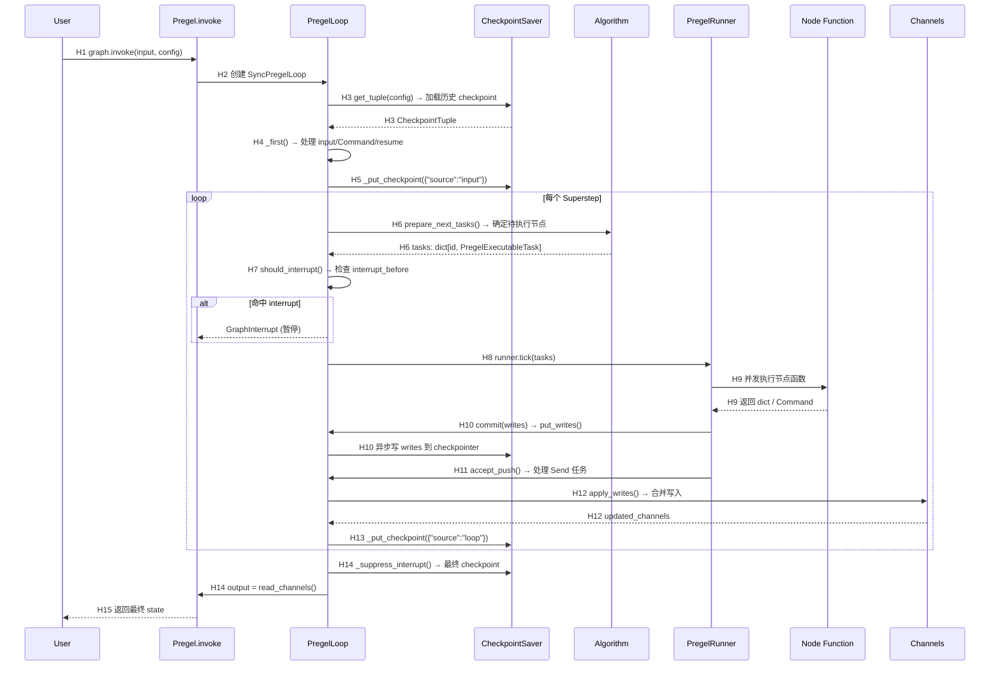

# LangGraph — 运行时调用链分析

> Commit: `49ae27c2ae983cfb92091b0dea9f7bc37a716479`
> 路径类型：source-confirmed（纯静态源码分析）
> 代表性路径：一次完整的 Superstep 执行 + Checkpoint 保存

## 1. 文字链路

### 执行进入 (`invoke` → first tick)

```
H1  User: graph.invoke(input, config)
H2  Pregel.invoke() → Pregel.stream()
H3  PregelLoop.__enter__() → 从 checkpointer 加载历史 checkpoint
H4  _first() → 处理输入/恢复逻辑
H5  _put_checkpoint({"source": "input"}) → 保存输入 checkpoint
```

### Superstep 循环 (tick → execute → after_tick)

```
H6  tick() → prepare_next_tasks() → 确定本步要执行的节点
H7  tick() → should_interrupt() → 检查 interrupt_before
H8  Runner.tick() → 提交 Call 对象到线程池/事件循环
H9  节点函数执行 → 返回 dict/Command
H10 commit() → 解析返回值 → put_writes() → 异步写 writes 到 checkpointer
H11 accept_push() → 处理 PUSH/Send 任务
H12 after_tick() → apply_writes() → 合并写入到 channels
H13 after_tick() → _put_checkpoint({"source": "loop"}) → 持久化 checkpoint
```

### 退出

```
H14 _suppress_interrupt() → 最终 checkpoint 保存 → 输出最终 state
H15 返回结果给调用方
```

## 2. Mermaid 调用链图



## 3. Hop Evidence 表

| Hop | From → To | File | Symbol or Key | Lines | Evidence Type | Conclusion Type | Confidence |
|-----|-----------|------|---------------|-------|---------------|-----------------|------------|
| H1 | User → Pregel.invoke | `pregel/main.py` | `Pregel.invoke()` | — | SOURCE | FACT | HIGH |
| H2 | invoke → PregelLoop | `pregel/main.py` | `Pregel.stream()` + `SyncPregelLoop` | — | SOURCE | FACT | HIGH |
| H3 | __enter__ → CheckpointSaver | `pregel/_loop.py` | `SyncPregelLoop.__enter__()` | 1629-1710 | SOURCE | FACT | HIGH |
| H3a | get_tuple 调用 | `_loop.py` | `self.checkpointer.get_tuple(self.checkpoint_config)` | 1637 | SOURCE | FACT | HIGH |
| H3b | 空 checkpoint 回退 | `_loop.py` | `empty_checkpoint()` | 1661 | SOURCE | FACT | HIGH |
| H3c | channels 重建 | `_loop.py` | `channels_from_checkpoint()` | 1692-1697 | SOURCE | FACT | HIGH |
| H4 | _first() 输入处理 | `pregel/_loop.py` | `PregelLoop._first()` | 848-1079 | SOURCE | FACT | HIGH |
| H4a | is_resuming 判断 | `_loop.py` | `is_resuming = bool(...)` | 861-871 | SOURCE | FACT | HIGH |
| H4b | Command 解析 | `_loop.py` | `map_command(cmd=...)` | 924 | SOURCE | FACT | HIGH |
| H4c | is_time_traveling | `_loop.py` | `is_time_traveling = ...` | 878-895 | SOURCE | FACT | HIGH |
| H5 | input checkpoint | `pregel/_loop.py` | `_put_checkpoint({"source": "input"})` | 1033 | SOURCE | FACT | HIGH |
| H6 | prepare_next_tasks | `pregel/_algo.py` | `prepare_next_tasks()` | — | SOURCE | FACT | HIGH |
| H7 | should_interrupt 检查 | `pregel/_algo.py` | `should_interrupt()` | — | SOURCE | FACT | HIGH |
| H7a | interrupt_before 触发 | `pregel/_loop.py` | `self.interrupt_before and should_interrupt(...)` | 667-671 | SOURCE | FACT | HIGH |
| H7b | GraphInterrupt 抛出 | `pregel/_loop.py` | `raise GraphInterrupt()` | 671 | SOURCE | FACT | HIGH |
| H8 | Runner.tick | `pregel/_runner.py` | `PregelRunner.tick()` | — | SOURCE | FACT | HIGH |
| H9 | 节点执行 | `pregel/_runner.py` | `PregelRunner._execute()` → `call.func(*args, **kwargs)` | — | SOURCE | FACT | HIGH |
| H10 | commit 写入 | `pregel/_runner.py` | `commit()` | — | SOURCE | FACT | HIGH |
| H10a | put_writes 调用 | `pregel/_loop.py` | `PregelLoop.put_writes()` | 415-508 | SOURCE | FACT | HIGH |
| H10b | writes 异步持久化 | `_loop.py` | `self.submit(self.checkpointer_put_writes, ...)` | 481-498 | SOURCE | FACT | HIGH |
| H11 | accept_push | `pregel/_loop.py` | `PregelLoop.accept_push()` | 550-587 | SOURCE | FACT | HIGH |
| H12 | apply_writes | `pregel/_algo.py` | `apply_writes()` | — | SOURCE | FACT | HIGH |
| H12a | Channel.update 调用 | `channels/base.py` | `BaseChannel.update()` | 89-99 | SOURCE | FACT | HIGH |
| H12b | channel_versions 更新 | `_algo.py` | `get_next_version()` | — | SOURCE | FACT | HIGH |
| H13 | _put_checkpoint loop | `pregel/_loop.py` | `_put_checkpoint({"source": "loop"})` | 1081-1219 | SOURCE | FACT | HIGH |
| H13a | create_checkpoint | `pregel/_checkpoint.py` | `create_checkpoint()` | — | SOURCE | FACT | HIGH |
| H13b | put 异步保存 | `_loop.py` | `self.submit(self._checkpointer_put_after_previous, ...)` | 1202-1209 | SOURCE | FACT | HIGH |
| H13c | delta_write_futs 等待 | `_loop.py` | `concurrent.futures.wait(futs)` / `await asyncio.gather(*futs)` | 1539-1540 | SOURCE | FACT | HIGH |
| H14 | _suppress_interrupt | `pregel/_loop.py` | `PregelLoop._suppress_interrupt()` | 1317-1378 | SOURCE | FACT | HIGH |
| H14a | exit durability 处理 | `_loop.py` | `_put_exit_delta_writes()` | 1221-1315 | SOURCE | FACT | HIGH |
| H14b | 最终 output 读取 | `_loop.py` | `read_channels(self.channels, self.output_keys)` | 1373 | SOURCE | FACT | HIGH |
| H15 | 返回给调用方 | `pregel/main.py` | stream() / invoke() 返回 | — | SOURCE | FACT | HIGH |

## 4. 关键跳说明

### H3: Checkpoint 加载

`PregelLoop.__enter__` 是恢复机制的核心入口。三种加载路径：

1. **指定 checkpoint_id** → `checkpointer.get_tuple(config)` 直接获取（time travel）
2. **ReplayState 子图恢复** → `replay_state.get_checkpoint(ns, checkpointer, config)` 父图驱动
3. **正常恢复** → `checkpointer.get_tuple(config)` 获取最新 checkpoint

第一种运行：saved 为 None → 用 `empty_checkpoint()` 初始化。

### H4: _first() — 最复杂的跳

`_first()` 同时处理四种状态转换：
- `is_resuming` — 从已有 checkpoint 恢复执行
- `is_time_traveling` — 从指定历史 checkpoint 重放（需要 fork）
- `Command(resume=...)` — 人工决策注入
- 全新输入 → 应用 input_writes

### H13: Checkpoint 持久化

`_put_checkpoint` 的逻辑有精妙的性能优化：
- `do_checkpoint` 只在 checkpointer 存在且 durability != "exit" 时执行
- `channels_to_snapshot` 只包含需要全量快照的通道（DeltaChannel 通常跳过）
- 异步提交（`self.submit(...)`），用 future 链确保顺序
- `_delta_write_futs` 保证 delta 写入先于 checkpoint 可见

### H12: apply_writes — Reducer 的实际执行点

`apply_writes()` 遍历所有完成的任务的写入，对每个通道调用 `channel.update(values)`：
- 如果多个任务写入同一个 LastValue 通道 → `InvalidUpdateError`（只能一个更新）
- 如果多个任务写入同一个 BinOp 通道 → 按顺序应用 operator
- 写入 Topic 通道 → 追加到列表

## 5. 异常路径与容错

### 5.1 Interrupt 路径

```
Node 调用 interrupt() → 写入 INTERRUPT → commit() → 
Runner 检测到 INTERRUPT → 不抛出，允许 superstep 完成 →
after_tick() → _put_checkpoint() →
interrupt_after 检查 → raise GraphInterrupt() →
_suppress_interrupt() 捕获 → 保存 checkpoint → 返回调用方
```

恢复：
```
graph.invoke(Command(resume=value), config) →
_first() 检测 Command.resume → 写入 RESUME 通道 →
tick() → _reapply_writes() + _resume_error_handlers_if_applicable() →
节点从 RESUME 读回 value → 继续执行
```

### 5.2 节点错误 + 错误处理

```
节点抛出异常 → Runner 捕获 → commit(ERROR, error) →
put_writes(ERROR_SOURCE_NODE) → 检查是否有 error_handler →
如果有 → schedule_error_handler() → 创建 handler 任务 →
下一个 superstep 执行 handler → handler 可以返回 fallback 值或 Command(goto=...)
```

### 5.3 取消 / Draining

```python
# 通过 Runtime.control 请求优雅停止
runtime.control.drain_requested = True
# → tick() 检测 → status = "draining" → 当前 superstep 后停止
```

## 6. 性能特征

| 操作 | 同步模式 | 异步模式 |
|------|----------|----------|
| 节点执行 | `concurrent.futures.ThreadPoolExecutor` | `asyncio` 协程并发 |
| Checkpoint 写入 | Future 异步提交 + 下个 checkpoint 前 wait | asyncio.Task + 下个 checkpoint 前 gather |
| Delta writes | 累积 Future，checkpoint 前批量等待 | 同上 asyncio 版本 |
| Streaming | 同步回调 | 同步回调（通过 AsyncQueue） |
