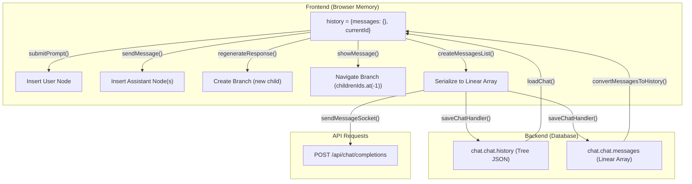

# Open WebUI — L3 深挖：消息历史树与分支对话模型

> Level 3 专项深挖 · Mechanism 2
> 源码证据基于 Commit `ecd48e2f` 的实际文件内容（通过 GitHub API 获取）

## 1. 选择依据

- Level 2 中 Tree 模型为 INFERENCE（基于 Web Search 聚合），需要源码验证
- 消息历史的数据结构是 Chat UI 的**核心数据模型**，影响所有交互路径
- 分支对话、编辑重新生成、多模型并行都依赖此模型

## 2. 数据结构（源码确认）

### 2.1 History 对象

```typescript
// [F] Chat.svelte L224-227
let history = {
    messages: {},      // Record<string, Message> — 全部消息的 flat map
    currentId: null    // string | null — 当前活跃分支的叶节点 ID
};
```

### 2.2 Message 节点

```typescript
// [F] 从 submitPrompt (L2093-2102) 和 sendMessage (L2265-2276) 确认
interface Message {
    id: string;                    // uuidv4()
    parentId: string | null;       // 父节点 ID，root 为 null
    childrenIds: string[];         // 子节点 ID 数组（支持多分支）
    role: 'user' | 'assistant';
    content: string;
    done: boolean;                 // assistant 消息是否完成
    model?: string;                // assistant 使用的模型 ID
    modelName?: string;            // 模型显示名
    modelIdx?: number;             // 多模型时的索引
    timestamp: number;             // Unix epoch seconds
    files?: File[];                // 附件
    statusHistory?: StatusEvent[]; // 工具执行状态时间线
    sources?: Citation[];          // 引用来源
    code_executions?: CodeExecution[]; // 代码执行结果
    error?: { content: any };      // 错误信息
    followUps?: string[];          // 推荐追问
    embeds?: any[];                // 嵌入内容
    output?: any;                  // 结构化输出
    usage?: any;                   // token 用量
    favorite?: boolean;            // 收藏标记
    arena?: boolean;               // Arena 模式标记
    selectedModelId?: string;      // Arena 实际使用的模型
    merged?: { status: boolean; content: string }; // MoA 合并结果
    originalContent?: string;      // outlet filter 修改前的原始内容
    models?: string[];             // user 消息关联的模型列表
}
```

### 2.3 Tree 拓扑示例

```text
[F] 从 submitPrompt + sendMessage 源码推断的完整拓扑：

Single model, single turn:
  root(null) → userMsg-1 → assistantMsg-1 (currentId)

Multi-model (2 models selected):
  root(null) → userMsg-1 ─┬→ assistantMsg-1-modelA
                           └→ assistantMsg-1-modelB

Branch (edit + regenerate):
  root(null) → userMsg-1 ─┬→ assistantMsg-1-v1 (old branch)
                           └→ assistantMsg-1-v2 (currentId, new branch)

Multi-turn with branch:
  root → user-1 → asst-1 ─┬→ user-2a → asst-2a (old branch)
                           └→ user-2b → asst-2b (currentId)
```

## 3. Tree 操作（源码确认）

### 3.1 插入 — 用户消息

```javascript
// [F] Chat.svelte L2092-2112 (submitPrompt)
let userMessageId = uuidv4();
let userMessage = {
    id: userMessageId,
    parentId: history.currentId ?? null,   // 挂在当前叶节点下
    childrenIds: [],
    role: 'user',
    content: inputContent,
    files: _files.length > 0 ? _files : undefined,
    timestamp: Math.floor(Date.now() / 1000),
    models: selectedModels
};

history.messages[userMessageId] = userMessage;

// 将新消息加入父节点的 childrenIds
if (history.currentId !== null) {
    history.messages[history.currentId].childrenIds.push(userMessageId);
}

history.currentId = userMessageId;  // 移动指针到新叶节点
```

### 3.2 插入 — 助手回复（多模型并行）

```javascript
// [F] Chat.svelte L2260-2293 (sendMessage)
for (const [_modelIdx, modelId] of selectedModelIds.entries()) {
    let responseMessageId = uuidv4();
    let responseMessage = {
        parentId: parentId,         // 挂在 userMessage 下
        id: responseMessageId,
        childrenIds: [],
        role: 'assistant',
        content: '',
        done: false,
        model: model.id,
        modelName: model.name ?? model.id,
        modelIdx: modelIdx ? modelIdx : _modelIdx,
        timestamp: Math.floor(Date.now() / 1000)
    };

    history.messages[responseMessageId] = responseMessage;
    history.currentId = responseMessageId;

    // 多个 assistant 回复是同一 parent 的多个 children
    if (parentId !== null && history.messages[parentId]) {
        history.messages[parentId].childrenIds = [
            ...history.messages[parentId].childrenIds,
            responseMessageId
        ];
    }
}
```

**关键洞察 [F]**：多模型并行时，N 个 assistant 回复是 userMessage 的 N 个 children。这意味着 `childrenIds.length > 1` 既表示分支（编辑重新生成），也表示多模型并行。UI 需要区分这两种情况。

### 3.3 分支导航 — 显示消息

```javascript
// [F] Chat.svelte L516-552 (showMessage)
const showMessage = async (message, scroll = true, save = true) => {
    let _messageId = message.id;
    let messageChildrenIds = [];

    if (_messageId === null) {
        // 找所有 root 节点
        messageChildrenIds = Object.keys(history.messages)
            .filter((id) => history.messages[id].parentId === null);
    } else {
        messageChildrenIds = history.messages[_messageId].childrenIds;
    }

    // 沿 childrenIds.at(-1) 向下遍历到最新叶节点
    while (messageChildrenIds.length !== 0) {
        _messageId = messageChildrenIds.at(-1);  // 始终取最后一个 child
        messageChildrenIds = history.messages[_messageId].childrenIds;
    }

    history.currentId = _messageId;  // 移动指针
    // ... scroll + save
};
```

**关键洞察 [F]**：分支导航使用 `childrenIds.at(-1)` — 始终选择**最新创建的分支**。这意味着"编辑后重新生成"的新分支自动成为默认显示分支。

### 3.4 分支创建 — 重新生成

```javascript
// [F] Chat.svelte L2798-2829 (regenerateResponse)
const regenerateResponse = async (message, suggestionPrompt = null) => {
    let userMessage = history.messages[message.parentId];  // 找到 parent user message
    // 从 userMessage.id 重新 sendMessage → 创建新的 assistant children
    await sendMessage(history, userMessage.id, {
        ...(suggestionPrompt ? { messages: createMessagesList(history, message.id), regenerationPrompt: suggestionPrompt } : {}),
        // 多模型时使用原消息的 model
        ...((userMessage?.models ?? [...selectedModels]).length > 1
            ? { modelId: message.model, modelIdx: message.modelIdx }
            : {})
    });
};
```

**关键洞察 [F]**：重新生成不删除旧分支。新 assistant 回复作为 userMessage 的**新 child** 加入 `childrenIds`。旧回复保留在 tree 中，可通过 sibling 导航访问。

### 3.5 Tree 修复 — sanitizeHistory

```javascript
// [F] Chat.svelte L1625-1627 (loadChat)
// Sanitize history: repair orphaned references and structurally-malformed
// nodes from failed regenerations (#24424, #24157, #20474)
sanitizeHistory(history);
```

**关键洞察 [F]**：存在已知的 tree 损坏 bug（#24424, #24157, #20474），需要 `sanitizeHistory()` 修复孤立引用和结构异常节点。这说明 Tree 模型在生产中有实际的一致性挑战。

### 3.6 线性序列化 — createMessagesList

```javascript
// [F] 从 Chat.svelte 多处调用确认 (L1768, L2348, L2847, L2924, L2957)
// 用于: API 请求、保存到后端、MoA 合并

const messages = createMessagesList(history, history.currentId);
// 从 currentId 向上遍历 parentId 到 root，返回线性数组
```

**关键洞察 [F]**：所有后端交互（API 请求、保存）使用 `createMessagesList()` 将 Tree 序列化为线性 Array。后端只看到线性对话，Tree 结构完全由前端维护。

### 3.7 持久化 — 保存与加载

```javascript
// [F] Chat.svelte L2951-2960 (saveChatHandler)
const saveChatHandler = async (_chatId, history) => {
    chat = await updateChatById(localStorage.token, _chatId, {
        models: selectedModels,
        history: history,                                    // 完整 Tree 对象
        messages: createMessagesList(history, history.currentId), // 线性化
        params: params,
        files: chatFiles
    });
};

// [F] Chat.svelte L1620-1623 (loadChat)
history = (chatContent?.history ?? undefined) !== undefined
    ? chatContent.history                                    // 直接恢复 Tree
    : convertMessagesToHistory(chatContent.messages);        // 从线性消息重建 Tree
```

**关键洞察 [F]**：后端同时存储 `history`（Tree）和 `messages`（线性 Array）。加载时优先使用 `history`，如果不存在则从 `messages` 重建。这意味着 Tree 结构被完整持久化到后端数据库。

## 4. 辅助操作

### 4.1 继续生成 (Continue Response)

```javascript
// [F] Chat.svelte L2831-2855 (continueResponse)
const continueResponse = async () => {
    const responseMessage = history.messages[history.currentId];
    responseMessage.done = false;  // 重新标记为未完成
    await sendMessageSocket(model, createMessagesList(history, responseMessage.id),
        history, responseMessage.id, _chatId, { continueResponse: true });
};
```

### 4.2 合并多模型回复 (MoA - Mixture of Agents)

```javascript
// [F] Chat.svelte L2857-2909 (mergeResponses)
const mergeResponses = async (messageId, responses, _chatId) => {
    message.merged = { status: true, content: '' };
    // 使用 generateMoACompletion 调用合并模型
    // 流式追加到 message.merged.content
    // 完成后 saveChatHandler
};
```

### 4.3 临时聊天 (Temporary Chat)

```javascript
// [F] Chat.svelte L2298-2303, L2942-2945
// 临时聊天使用 `local:${$socket?.id}` 作为 chatId
// 不持久化到后端 DB
// Tree 仅存在于内存中
```

## 5. 数据流图



## 6. RoboThree 适配结论（更新）

| Aspect | L2 Verdict | L3 Updated Verdict | Evidence |
| --- | --- | --- | --- |
| Tree 数据模型 | ADAPT (v2) | **ADAPT (v2)** — 确认复杂度值得推迟 | [F] 3453 行 Chat.svelte, 多个 tree 损坏 bug |
| 多模型并行分支 | 未知 | **ADAPT (v2)** — 自然支持，但 UI 区分复杂 | [F] childrenIds 同时表示分支和多模型 |
| Tree 持久化 | 未知 | **ADOPT** — 同时存 Tree + Linear 是好的冗余策略 | [F] saveChatHandler 双格式 |
| sanitizeHistory | 未知 | **ADOPT** — Tree 模型必须有修复机制 | [F] 3 个已知 bug 需要修复 |
| 分支导航 (at(-1)) | 未知 | **ADAPT** — 简单有效，但可能需要用户选择 | [F] 始终选最新分支 |
| MVP 用 Linear Array | ADAPT | **ADOPT (MVP)** — 确认 Tree 复杂度不适合 MVP | [F] 生产中有 tree 损坏问题 |
