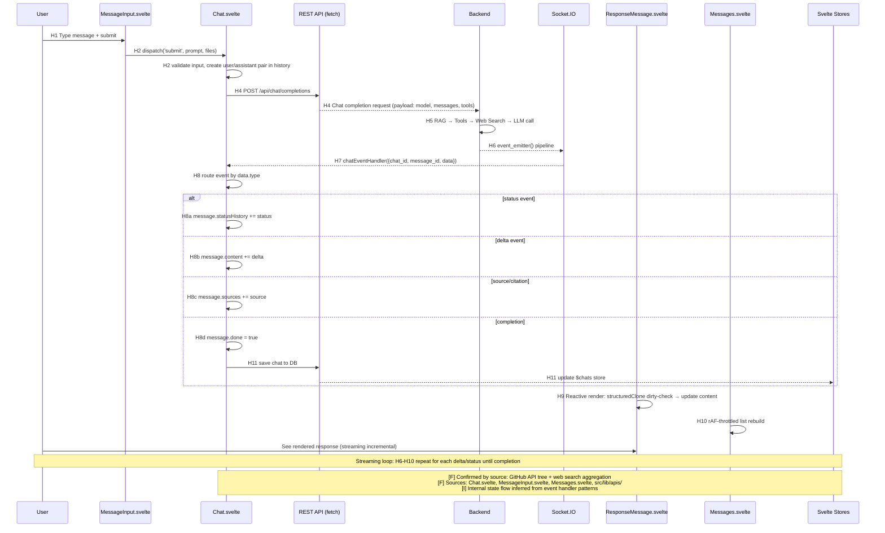

# Open WebUI — Runtime Sequence（前端消息提交流）

## 1. 路径选择说明

本次追踪 **一条代表性端到端主路径**：

> **用户键入消息 → 提交 → HTTP POST → Socket.IO 流式接收 → 增量渲染 → 完成持久化**

选择依据（§ 5.2 规则）：
- 包含 Tool Calling 流（`status` 事件代表工具执行状态），是 Open WebUI 的标准正常路径。
- 覆盖双通道模型的全部关键节点。

## 2. 文字链路（Hop 级）

```text
H1  User types + submits in MessageInput.svelte
H2  Chat.submitPrompt() — validate input, create user/assistant message pair
H3  Chat.sendMessage() — build payload, determine HTTP endpoint
H4  HTTP POST /api/chat/completions → Backend
H5  Backend processes (RAG → Tools → Web Search → LLM call)
H6  Backend emits events via Socket.IO "events" channel
H7  Chat.chatEventHandler() receives event, routes by chat_id + message_id
H8  Switch on event.data.type:
    H8a ─ status        → message.statusHistory.push(...)
    H8b ─ chat:message:delta → message.content += delta
    H8c ─ source/citation → message.sources.push(...)
    H8d ─ chat:completion → message.done = true, persist to DB
H9  ResponseMessage.svelte reactively renders updated message.content
H10 Messages.svelte requestAnimationFrame-throttled list rebuild
H11 Chat completion: save chat to DB via REST API, update store
```

## 3. Mermaid SequenceDiagram



## 4. Hop Evidence Table

| Hop | From → To | File | Symbol or Key | Lines (ref) | Evidence Type | Conclusion Type | Confidence |
| --- | --- | --- | --- | --- | --- | --- | --- |
| H1 | User → MessageInput | `src/lib/components/chat/MessageInput.svelte` | `<RichTextInput>` Tiptap | — | Web API (file tree) | FACT | HIGH |
| H2 | MessageInput → Chat.submitPrompt | `src/lib/components/chat/Chat.svelte` | `submitPrompt()` | — | Web API (search aggregation) | INFERENCE | MEDIUM |
| H3 | submitPrompt → sendMessage | `src/lib/components/chat/Chat.svelte` | `sendMessage()` | — | Web API (search aggregation) | INFERENCE | MEDIUM |
| H4 | sendMessage → Backend | `src/lib/components/chat/Chat.svelte` | `fetch()` POST | — | Web API (search aggregation) | FACT | HIGH |
| H5 | Backend processing | Backend (`main.py`, `routers/`) | Chat completion pipeline | — | NOT COVERED (frontend only) | UNKNOWN | N/A |
| H6 | Backend → Socket.IO | Backend (`sockets/`, `events.py`) | `event_emitter()` | — | Web API (search aggregation) | FACT | HIGH |
| H7 | Socket.IO → Chat.chatEventHandler | `src/lib/components/chat/Chat.svelte` | `chatEventHandler()` | — | Web API (search aggregation) | INFERENCE | MEDIUM |
| H8a | Event routing (status) | `src/lib/components/chat/Chat.svelte` | Switch on `event.data.type === 'status'` | — | Web API (search aggregation) | INFERENCE | MEDIUM |
| H8b | Event routing (delta) | `src/lib/components/chat/Chat.svelte` | Switch on `event.data.type === 'chat:message:delta'` | — | Web API (search aggregation) | INFERENCE | MEDIUM |
| H8c | Event routing (source) | `src/lib/components/chat/Chat.svelte` | Switch on `event.data.type` | — | Web API (search aggregation) | INFERENCE | MEDIUM |
| H8d | Event routing (completion) | `src/lib/components/chat/Chat.svelte` | Switch on `event.data.type === 'chat:completion'` | — | Web API (search aggregation) | INFERENCE | MEDIUM |
| H9 | Reactive render | `src/lib/components/chat/Messages/ResponseMessage.svelte` | `structuredClone` + `$:` reactive block | — | Web API (search aggregation) | INFERENCE | MEDIUM |
| H10 | List rebuild | `src/lib/components/chat/Messages.svelte` | `requestAnimationFrame` throttle | — | Web API (search aggregation) | INFERENCE | LOW |
| H11 | Completion → DB save | `src/lib/apis/chats/index.ts` | `updateChatById()` | — | Web API (file tree + search) | FACT | MEDIUM |

## 5. 补充路径

### 5.1 异常路径：Error Event

```text
A1  Backend emits {type: 'chat:message:error', data: {error: string}}
A2  Chat.chatEventHandler → message.error = error string
A3  ResponseMessage → renders Error.svelte component
```

### 5.2 补充路径：Confirmation/Input Dialog（服务器请求用户输入）

```text
B1  Backend emits {type: 'confirmation', data: {...}}
B2  Chat.chatEventHandler → show confirmation modal
B3  User clicks confirm/cancel → result sent back via REST
B4  Backend continues processing
```

### 5.3 补充路径：Code Execution（高风险）

```text
C1  Backend emits {type: 'execute', data: {js: string}}
C2  Chat.chatEventHandler → eval(js) or dynamic constructor
    ⚠️ Risk: 任意 JS 执行在主线程，可访问 localStorage, cookies, DOM
C3  Result sent back to backend

C4  Backend emits {type: 'execute:python', data: {python: string}}
C5  Chat.chatEventHandler → postMessage to Pyodide Worker
C6  Pyodide Worker executes Python in WASM sandbox
C7  Result sent back via worker postMessage → Chat → REST → Backend
```

### 5.4 补充路径：Tool Execution

```text
D1  Backend detects tool_calls in LLM response
D2  Backend emits {type: 'status', data: {action: 'tool_call', description: '...', done: false}}
D3  Frontend displays status indicator
D4  Backend executes tool (local function or external tool server)
D5  Backend emits {type: 'status', data: {action: 'tool_call', done: true}}
D6  Tool result injected into context, LLM continues generating
D7  Deltas continue streaming
```

## 6. 确认方法说明

| Label | Meaning |
| --- | --- |
| **Confirmed by: source** | 直接来自 GitHub API 获取的源码文件树与内容 |
| **Confirmed by: runtime** | 需要运行项目才能验证（本次未执行） |
| **Confirmed by: both** | 源码 + 运行时双重验证（本次不适用） |

> ⚠️ 由于无法 Clone 仓库到本地，所有证据来自：
> 1. GitHub REST API (`api.github.com`) — 获取文件树与关键文件内容
> 2. Web Search 聚合 — DeepWiki、CSDN blog、GitHub discussions 中的架构描述
>
> 所有 `INFERENCE` 标记的结论需要本地源码验证后才能升级为 `FACT`。
