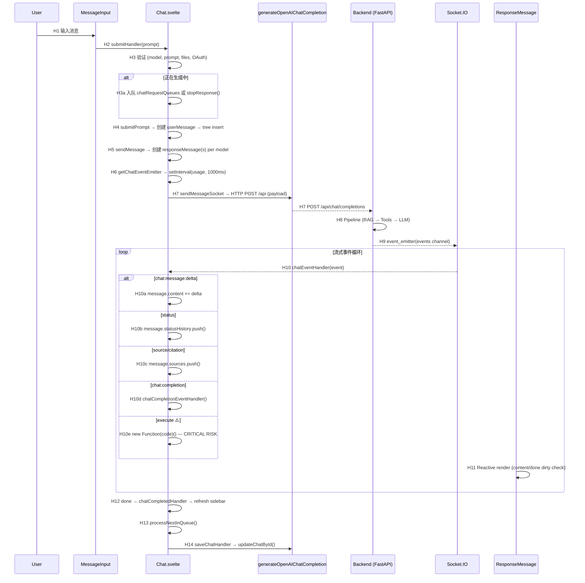

# Open WebUI — L3 深挖：实时流式通信与事件驱动渲染

> Level 3 专项深挖 · Mechanism 1
> 源码证据基于 Commit `ecd48e2f` 的实际文件内容（通过 GitHub API 获取）

## 1. 选择依据

从 Level 2 分析中选定此机制的原因：
- 它是 Agent Chat UI 的**核心运行时路径**，直接决定用户体验
- Level 2 中此路径多数环节为 INFERENCE，需要源码验证升级为 FACT
- 对 RoboThree 的实时通信架构选型有直接影响

## 2. 完整调用链（源码确认）

### 2.1 提交路径 (Submit Path)

```text
[F] src/lib/components/chat/Chat.svelte

User Input (MessageInput.svelte)
  → submitHandler(userPrompt)                    [L2125]
    → 验证: 模型已选、prompt 非空、文件已上传完毕、OAuth tools 已认证 [L2136-2157]
    → Web Search 确认检查 (enable_web_search_confirmation)  [L2171-2179]
    → 并发检查: 如果 assistant 正在生成 [L2183-2204]
        → 若 enableMessageQueue: 入队 chatRequestQueues    [L2187-2198]
        → 若 disable: stopResponse() 中断当前生成          [L2200-2203]
    → submitPrompt(userPrompt, files)             [L2076]
      → 创建 userMessage (uuidv4, parentId, childrenIds)  [L2092-2102]
      → history.messages[userMessageId] = userMessage      [L2105]
      → history.messages[parentId].childrenIds.push(id)    [L2109]
      → history.currentId = userMessageId                  [L2112]
      → sendMessage(history, userMessageId)                [L2122]
```

### 2.2 消息发送路径 (Send Path)

```text
[F] Chat.svelte L2226-2361

sendMessage(_history, parentId, {messages, modelId, modelIdx, regenerationPrompt})
  → 为每个 selectedModel 创建 responseMessage              [L2260-2293]
    → responseMessage = { parentId, id: uuidv4(), role: 'assistant',
                          content: '', done: false, model, modelName, modelIdx }
    → history.messages[responseMessageId] = responseMessage [L2279]
    → history.messages[parentId].childrenIds.push(responseMessageId) [L2284-2288]
    → messageIdsList.push({ model_id, message_id })         [L2291]
  → 新 Chat: _chatId = `local:${$socket?.id}` (temporary)  [L2298-2303]
  → _history = structuredClone(history)                     [L2308]
  → Vision capability check                                [L2310-2332]
  → getChatEventEmitter(model.id, _chatId)                  [L2340]
    → setInterval(() => $socket?.emit('usage', ...), 1000)  [L1821-1827]
  → sendMessageSocket(model, messages, _history, responseMessageId, _chatId, {...}) [L2344]
```

### 2.3 Socket 发送路径 (Socket Send)

```text
[F] Chat.svelte L2400-2677

sendMessageSocket(model, _messages, _history, responseMessageId, _chatId, {messageIdsList, regenerationPrompt, continueResponse})
  → 构建 payload:
    {
      stream: true (default),                                [L2458-2462]
      model: model.id,
      messages: [...],                                       [L2465-2518]
      params: { ...settings.params, ...chatParams, stop },   [L2554-2558]
      files: [...],                                          [L2560]
      filter_ids: selectedFilterIds,                         [L2562]
      tool_ids: toolIds,                                     [L2563]
      skill_ids: skillIds,                                   [L2564]
      terminal_id: activeTerminalId,                         [L2565]
      tool_servers: [...],                                   [L2566-2572]
      features: { voice, image_generation, code_interpreter, web_search, memory }, [L2573]
      variables: { USER_NAME, USER_LOCATION, USER_EMAIL, ... }, [L2574-2580]
      session_id: $socket?.id,                               [L2583]
      chat_id: _chatId,                                      [L2584]
      id: responseMessageId,                                 [L2587]
      message_ids: messageIdsList,                           [L2588]
      parent_id: userMessage?.parentId,                      [L2589]
      user_message: userMessage,                             [L2590]
      background_tasks: { title_generation, tags_generation, follow_up_generation }, [L2594-2602]
      stream_options: { include_usage: true }                [L2604-2610]
    }
  → generateOpenAIChatCompletion(localStorage.token, payload, `${WEBUI_BASE_URL}/api`) [L2548]
    → HTTP POST → Backend
  → 响应处理:
    → res.task_ids / res.task_id → taskIds                  [L2644-2648]
    → res.chat_id → chatId.set() + URL replaceState         [L2654-2671]
    → res.error → handleOpenAIError()                       [L2641-2642]
```

### 2.4 事件接收路径 (Event Receive Path)

```text
[F] Chat.svelte L610-790, L926-927

onMount:
  $socket?.on('events', chatEventHandler)    [L926]
  $socket?.on('connect', handleSocketConnect) [L927]

chatEventHandler(event, cb):
  if (event.chat_id !== $chatId) → skip      [L613]
  message = history.messages[event.message_id] [L615]
  type = event.data.type                      [L618]
  data = event.data.data                      [L619]
  
  switch(type):                               [L621-782]
```

### 2.5 完整事件类型表（源码确认 22 种）

| # | Event Type | Handler Action | Line |
| --- | --- | --- | --- |
| 1 | `status` | `message.statusHistory.push(data)` | L621-626 |
| 2 | `context_compaction` | `handleContextCompactionStatus(data)` | L627-628 |
| 3 | `chat:active` | Reload chat if not active | L629-635 |
| 4 | `chat:completion` | `chatCompletionEventHandler(data, message, chatId)` | L636-637 |
| 5 | `chat:tasks:cancel` | Set done, process queue | L638-649 |
| 6 | `chat:message:delta` / `message` | `message.content += data.content` | L650-651 |
| 7 | `chat:message` / `replace` | `message.content = data.content` | L652-653 |
| 8 | `chat:message:files` / `files` | `message.files = data.files` | L654-655 |
| 9 | `chat:message:tasks` | `chatTasks = data.tasks` | L656-657 |
| 10 | `chat:message:embeds` / `embeds` | `message.embeds = data.embeds` + scroll | L658-668 |
| 11 | `chat:message:error` | `message.error = data.error` | L669-670 |
| 12 | `chat:message:follow_ups` | `message.followUps = data.follow_ups` | L671-676 |
| 13 | `chat:outlet` | Sync outlet filter messages | L677-693 |
| 14 | `chat:message:favorite` | `message.favorite = data.favorite` | L694-696 |
| 15 | `chat:title` | `chatTitle.set(data)` + refresh chat list | L697-700 |
| 16 | `chat:tags` | Refresh chat + tags from API | L701-703 |
| 17 | `source` / `citation` | Add to sources[] or code_executions[] | L704-729 |
| 18 | `notification` | `toast.success/error/warning/info()` | L730-742 |
| 19 | `confirmation` | Show confirmation dialog + set callback | L743-751 |
| 20 | **`execute`** | **`new Function()` dynamic JS execution** | **L752-765** |
| 21 | `input` | Show input dialog + set callback | L766-777 |
| 22 | `terminal:*` | `terminalEventHandler(type, data)` | L778-779 |

### 2.6 流式完成路径 (Completion Path)

```text
[F] Chat.svelte L1958-2070

chatCompletionEventHandler(data, message, chatId):
  → if output: message.output = output; message.content = getOutputText(output) [L1962-1966]
  → if error: handleOpenAIError(error, message)                                  [L1968-1970]
  → if sources: message.sources = sources                                        [L1972-1974]
  → if choices:
    → Non-stream: message.content += choices[0].message.content                  [L1977-1980]
    → Stream: message.content += choices[0].delta.content                        [L1982-1993]
    → Haptic feedback: navigator.vibrate(5)                                      [L1989-1991]
  → if content (non-realtime save): message.content = content                    [L1997-2004]
  → if selected_model_id: message.selectedModelId, message.arena                 [L2007-2010]
  → if usage: message.usage = usage                                              [L2012-2014]
  → history.messages[message.id] = message                                       [L2016]
  → if done:                                                                     [L2018-2062]
    → message.done = true
    → responseAutoCopy → copyToClipboard()
    → responseAutoPlayback → click speak button
    → dispatch CustomEvent('chat:finish')
    → chatCompletedHandler() → refresh sidebar chat list
    → processNextInQueue() → process queued messages
```

## 3. 失败 / 取消 / 恢复路径

### 3.1 生成取消 (Stop)

```text
[F] Chat.svelte L2721-2763

stopResponse(processQueue = true):
  → if taskIds:
    → stopTasksByChatId(token, $chatId) 或逐个 stopTask(token, taskId) [L2723-2735]
    → taskIds = null                                                       [L2737]
    → 所有 siblings 的 responseMessage.done = true                          [L2741-2745]
  → if generating:
    → generating = false
    → generationController?.abort()                                        [L2756]
  → if processQueue: processNextInQueue($chatId)                           [L2761]
```

### 3.2 Socket 断线重连

```text
[F] Chat.svelte L904-920

handleSocketConnect():
  → if no chatIdProp or temporaryChat → skip                     [L905-907]
  → if !hasPendingAssistantLeaf() → skip                         [L909-911]
  → getTaskIdsByChatId(token, $chatId) → check pending tasks     [L913-915]
  → if pendingTaskIds.length === 0 → loadChat() (reload from DB) [L917-919]
  → if pendingTaskIds > 0 → tasks still running, socket events resume [I]
```

### 3.3 消息队列 (Message Queue)

```text
[F] Chat.svelte L1736-1756, L2186-2198

入队 (submitHandler L2186-2198):
  if isGenerating && $settings.enableMessageQueue:
    chatRequestQueues.update(q => ({
      ...q, [$chatId]: [...(q[$chatId] ?? []), { id: uuidv4(), prompt, files }]
    }))

出队 (processNextInQueue L1736-1756):
  → 合并所有队列消息: combinedPrompt = queue.map(m => m.prompt).join('\n\n') [L1744]
  → 合并文件: combinedFiles = queue.flatMap(m => m.files)                    [L1745]
  → 清空队列                                                                [L1747-1750]
  → submitPrompt(combinedPrompt, combinedFiles)                              [L1752]
  → 防重入: processingQueueChats Set                                        [L1734, 1737]
```

### 3.4 错误处理

```text
[F] Chat.svelte L2613-2638, L2679-2719

HTTP 请求失败:
  → toast.error(errorMessage)                              [L2627]
  → responseMessage.error = { content: error }             [L2628-2630]
  → responseMessage.done = true                            [L2632]
  → history.messages[responseMessageId] = responseMessage  [L2634]

OpenAI 格式错误:
  → FastAPI error: innerError.detail                       [L2688-2691]
  → OpenAI error: innerError.error.message                 [L2692-2699]
  → responseMessage.error = { content: message }           [L2707-2709]
  → responseMessage.done = true                            [L2710]
  → 清除 knowledge_search status (避免误导)                 [L2712-2716]
```

## 4. Mermaid SequenceDiagram（源码确认版）



## 5. 关键发现（升级 L2 结论）

| L2 结论 | L3 验证结果 | 新证据 |
| --- | --- | --- |
| [I] chatEventHandler 路由事件 | **[F] 确认** — 22 种事件类型完整列表 | Chat.svelte L610-790 |
| [I] message.content += delta 流式追加 | **[F] 确认** — `message.content += data.content` | Chat.svelte L651 |
| [I] requestAnimationFrame throttle | **[F] 确认** — `scheduleScrollToBottom()` 使用 rAF | Chat.svelte L1723-1731 |
| [I] Socket.IO 在 root layout 初始化 | **[F] 确认** — `$socket?.on('events', chatEventHandler)` in Chat.svelte onMount | Chat.svelte L926 |
| 未知: 消息队列机制 | **[F] 新发现** — `chatRequestQueues` store + 合并提交 | Chat.svelte L1736-1756, L2186-2198 |
| 未知: 使用量上报 | **[F] 新发现** — 每秒 emit `usage` 事件 | Chat.svelte L1820-1828 |
| 未知: 中断恢复 | **[F] 新发现** — `handleSocketConnect` 检查 pending tasks | Chat.svelte L904-920 |
| 未知: Arena/MoA 模式 | **[F] 新发现** — `mergeResponses` + `generateMoACompletion` 多模型合并 | Chat.svelte L2857-2909 |
| 未知: 事件类型数量 | **[F] 确认 22 种** — 完整列表见上表 | Chat.svelte L621-782 |

## 6. RoboThree 适配结论（更新）

| Pattern | Verdict | Evidence Level |
| --- | --- | --- |
| Socket.IO 事件 multiplex 模型 | **ADOPT** | [F] — 22 种事件统一路由，简洁有效 |
| 消息队列 (Queue + Merge) | **ADAPT** | [F] — 合并多条消息为一条提交，避免打断生成 |
| Usage 实时上报 (1s interval) | **DEFER** | [F] — MVP 不需要实时用量追踪 |
| Arena/MoA 多模型合并 | **DEFER** | [F] — 高级功能，非 MVP 必需 |
| 中断恢复 (Socket reconnect + pending tasks) | **ADOPT** | [F] — 关键的可靠性模式 |
| rAF scroll throttle | **ADOPT** | [F] — 流式渲染性能必需 |
| Haptic feedback (vibrate) | **DEFER** | [F] — 移动端 UX 增强 |
