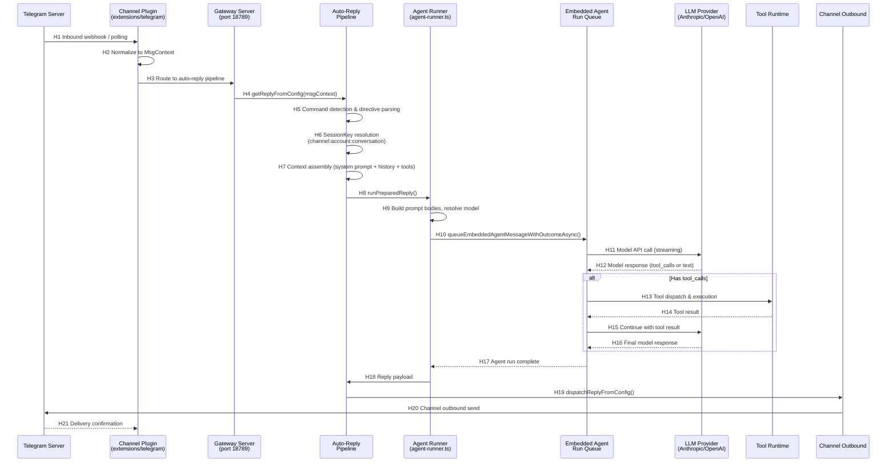
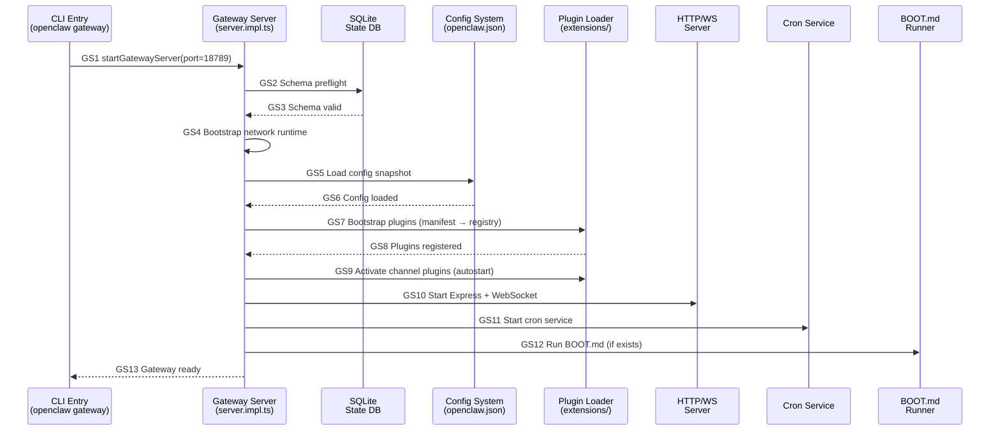

# OpenClaw — Runtime Sequence

> 追踪一条具有代表性的端到端路径：**Telegram 用户发送消息 → Channel Plugin 接收 → Gateway 处理 → Agent 运行 → 回复发送**。
>
> Confirmed by：**source**（静态源码分析，未经运行时验证）

## 文字链路

```
Telegram Webhook → 
Channel Plugin (normalize → MsgContext) → 
Auto-Reply Pipeline (getReplyFromConfig) → 
Command Detection → 
Session Resolution (SessionKey) → 
Context Assembly → 
Agent Run (runReplyAgent) → 
Embedded Agent Queue → 
Model API Call (Provider) → 
Tool Execution (if tool_calls) → 
Reply Dispatch (dispatchReplyFromConfig) → 
Channel Outbound (send message) → 
User sees reply
```

## Mermaid sequenceDiagram



## Hop Evidence

| Hop | From → To | File | Symbol or Key | Lines | Evidence Type | Conclusion Type | Confidence |
| --- | --- | --- | --- | --- | --- | --- | --- |
| H1 | Telegram → Channel Plugin | `extensions/telegram/src/channel.ts` | `telegramPlugin` (createChatChannelPlugin) | 1-80 | SOURCE | FACT | HIGH |
| H2 | Plugin → Normalize MsgContext | `extensions/telegram/src/monitor.ts` | `monitorModule` | — | INFERENCE | INFERENCE | MEDIUM |
| H3 | Channel → Gateway | `src/auto-reply/reply.runtime.ts` | `getReplyFromConfig` export | 1-3 | SOURCE | FACT | HIGH |
| H4 | Gateway → Auto-Reply | `src/auto-reply/reply/get-reply.ts` | `getReplyFromConfig()` | 216 | SOURCE | FACT | HIGH |
| H5 | Command Detection | `src/auto-reply/command-detection.ts` | `command-detection` module | — | SOURCE | FACT | HIGH |
| H6 | SessionKey Resolution | `src/routing/session-key.ts` | `session-key` module | — | SOURCE | FACT | HIGH |
| H7 | Context Assembly | `src/auto-reply/reply/get-reply-run.ts` | `runPreparedReply()` → `rebuildPromptBodies()` | 492, 1000 | SOURCE | FACT | HIGH |
| H8 | Reply Runner | `src/auto-reply/reply/get-reply-run.ts` | `runPreparedReply()` | 492 | SOURCE | FACT | HIGH |
| H9 | Build prompt & resolve model | `src/auto-reply/reply/agent-runner.ts` | `runReplyAgent()` | 1168-1268 | SOURCE | FACT | HIGH |
| H10 | Queue Agent Message | `src/agents/embedded-agent-runner/runs.ts` | `queueEmbeddedAgentMessageWithOutcomeAsync()` | 404-431 | SOURCE | FACT | HIGH |
| H11 | Model API Call | `src/agents/embedded-agent-runner/runs.ts` | `prepared.handle.queueMessage()` | 415 | SOURCE | FACT | HIGH |
| H12 | Model Response | Provider extensions (`extensions/anthropic/`, `extensions/openai/`) | Provider streaming wrappers | — | SOURCE | FACT | HIGH |
| H13 | Tool Dispatch | `src/agents/embedded-agent-runner/runs.ts` | Active run handle → tool execution | — | INFERENCE | INFERENCE | MEDIUM |
| H14 | Tool Result | `src/plugins/agent-tool-result-middleware.ts` | Tool result middleware | — | SOURCE | FACT | MEDIUM |
| H15 | Continue Model | `src/agents/embedded-agent-runner/runs.ts` | Active handle → continue loop | — | INFERENCE | INFERENCE | MEDIUM |
| H16 | Final Response | Provider extensions | Final streaming chunk | — | SOURCE | FACT | HIGH |
| H17 | Agent Run Complete | `src/auto-reply/reply/agent-runner.ts` | `runReplyAgent()` return | 1168-1262 | SOURCE | FACT | HIGH |
| H18 | Reply Payload | `src/auto-reply/reply/dispatch-from-config.ts` | `dispatchReplyFromConfig()` | 223 | SOURCE | FACT | HIGH |
| H19 | Dispatch Reply | `src/auto-reply/dispatch.ts` | `dispatch.ts` module | 1-746 | SOURCE | FACT | HIGH |
| H20 | Channel Outbound Send | `extensions/telegram/src/outbound-adapter.ts` | `createTelegramOutboundAdapter()` | — | INFERENCE | INFERENCE | MEDIUM |
| H21 | Delivery Confirmation | Channel Plugin ack handling | `ack-reactions` | — | INFERENCE | INFERENCE | LOW |

## Gateway Startup Sequence

### 文字链路

```
openclaw gateway --port 18789
  → openclaw.mjs: Launcher (Node version check, compile cache)
  → src/entry.ts: CLI entry (argv parse, profile apply)
  → src/cli/run-main.ts: Commander dispatch to gateway subcommand
  → src/gateway/server.impl.ts: startGatewayServer()
    → DB Preflight (SQLite schema check)
    → Network Runtime Bootstrap
    → Config Snapshot Load (openclaw.json)
    → Plugin Bootstrap (extensions/ → manifest → registry)
    → Plugin Activation (channel autostart)
    → HTTP Server Start (Express on port 18789)
    → WebSocket JSON-RPC Server
    → Cron Service Start
    → BOOT.md Execution
    → Gateway Ready
```

### Gateway Startup Mermaid



### Gateway Startup Hop Evidence

| Hop | From → To | File | Symbol or Key | Lines | Evidence Type | Conclusion Type | Confidence |
| --- | --- | --- | --- | --- | --- | --- | --- |
| GS1 | CLI → Gateway | `src/cli/run-main.ts` → `src/gateway/server.impl.ts` | Commander dispatch → `startGatewayServer()` | —, 572 | SOURCE | FACT | HIGH |
| GS2 | Gateway → DB Preflight | `src/gateway/server.impl.ts` | `preflightOpenClawDatabaseSchemas()` | 590-618 | SOURCE | FACT | HIGH |
| GS3 | DB Valid | `src/gateway/server.impl.ts` | Schema check results | 597-618 | SOURCE | FACT | HIGH |
| GS4 | Network Bootstrap | `src/gateway/server.impl.ts` | `bootstrapGatewayNetworkRuntime()` | 619-620 | SOURCE | FACT | HIGH |
| GS5 | Config Load | `src/gateway/server.impl.ts` | `loadGatewayStartupConfigSnapshot()` | 651-659 | SOURCE | FACT | HIGH |
| GS6 | Config Loaded | `src/gateway/server.impl.ts` | `configSnapshot` assignment | 661 | SOURCE | FACT | HIGH |
| GS7 | Plugin Bootstrap | `src/gateway/server.impl.ts` | `loadStartupPluginsModule` → `import("./server-startup-plugins.js")` | 645-647 | SOURCE | FACT | HIGH |
| GS8 | Plugins Registered | `src/plugins/registry.ts` | Plugin registry state | — | SOURCE | FACT | HIGH |
| GS9 | Channel Autostart | `src/gateway/server-channels.ts` | Channel autostart logic | — | INFERENCE | INFERENCE | MEDIUM |
| GS10 | HTTP/WS Start | `src/gateway/server.impl.ts` | Express + WebSocket server | ~1300+ | SOURCE | FACT | HIGH |
| GS11 | Cron Start | `src/gateway/server.impl.ts` → `src/cron/service.ts` | Cron service initialization | — | INFERENCE | INFERENCE | MEDIUM |
| GS12 | BOOT.md Run | `src/gateway/boot.ts` | `runBootOnce()` | 95-120 | SOURCE | FACT | HIGH |

## 补充路径

### 异常路径：Restart Recovery

Gateway 重启后，通过 `src/gateway/chat-abort.ts` 和 `src/config/sessions/restart-recovery-state.ts` 恢复活跃会话。

### 异常路径：Command Lane Cleared

当用户发送 `/reset` 或 `/new` 时，通过 `src/process/command-queue.ts` 的 `CommandLaneClearedError` 中断当前 Agent 运行。

### 取消路径：Steer

Active run 可以被 steer（转向）——新的用户消息可以中断或切换当前 Agent 运行方向（`src/auto-reply/reply/agent-runner.ts:1262-1347`）。
