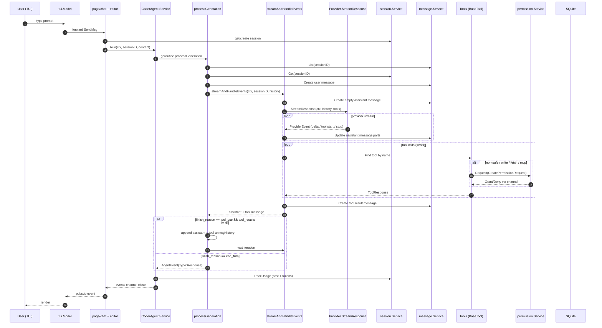
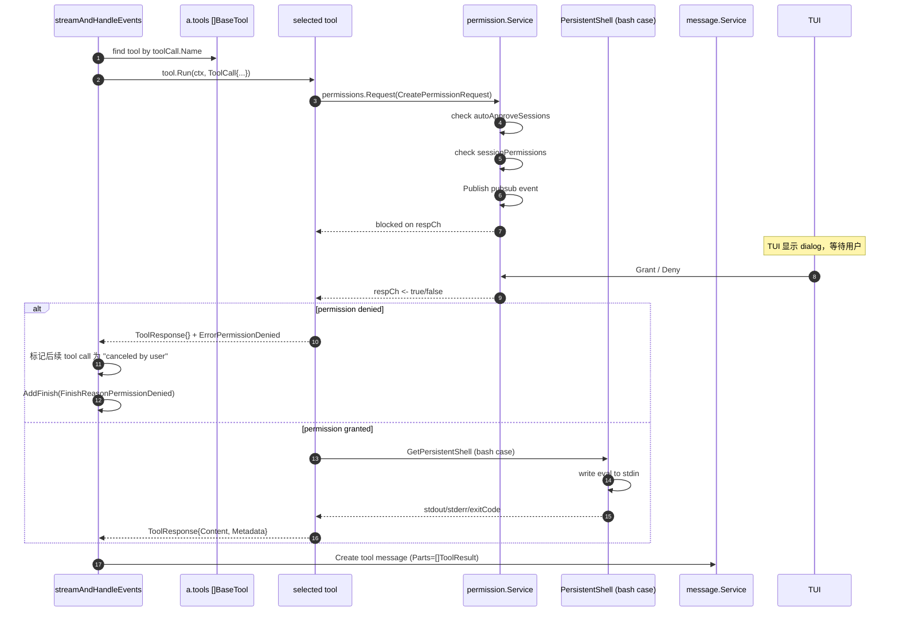
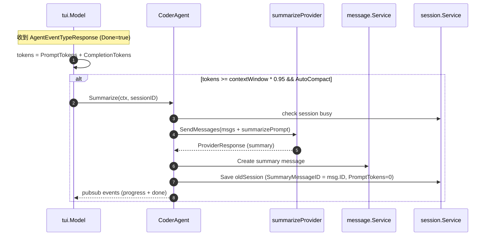

# Runtime Sequence — OpenCode

> **Target Ref**: commit `73ee493265acf15fcd8caab2bc8cd3bd375b63cb`
> **Method**: 静态源码分析（无运行时验证）
> **Confirmed by**: source（代码路径已确认；运行时行为仅作推断）

## 1. 主路径选择

OpenCode 的代表端到端路径是：

**用户输入（交互）→ Cobra 入口 → App 装配 → User 输入文本 → Coder Agent Run → Provider Stream → Tool Dispatch（含 permission）→ DB 写回 → 下一轮或返回最终响应**

理由：

1. 用户输入是入口最常见的触发。
2. 包含一次 Tool Call（bash / write / edit / patch）。
3. 包含 Permission 拦截路径（最具 OpenCode 特色的设计）。
4. 不掺杂异常路径；取消 / 错误 / 自动摘要作为补充路径单独记录。

## 2. Mermaid Sequence Diagram



## 3. Hop Evidence

| Hop | From → To | File | Symbol or Key | Lines | Evidence Type | Conclusion Type | Confidence |
| --- |---|---|---|---|---|---|---|
| H1 | Process start → main | [main.go](../../sources/opencode/main.go) | `main()` | 8-14 | SOURCE | FACT | HIGH |
| H2 | main → Cobra root | [cmd/root.go](../../sources/opencode/cmd/root.go) | `rootCmd.RunE` | 49-184 | SOURCE | FACT | HIGH |
| H3 | Cobra root → Config | [cmd/root.go](../../sources/opencode/cmd/root.go) | `config.Load` | 85 | SOURCE | FACT | HIGH |
| H4 | Cobra root → DB | [cmd/root.go](../../sources/opencode/cmd/root.go) | `db.Connect` | 91 | SOURCE | FACT | HIGH |
| H5 | Cobra root → App | [cmd/root.go](../../sources/opencode/cmd/root.go) | `app.New(ctx, conn)` | 100 | SOURCE | FACT | HIGH |
| H6 | App → CoderAgent | [internal/app/app.go](../../sources/opencode/internal/app/app.go) | `agent.NewAgent` | 63-74 | SOURCE | FACT | HIGH |
| H7 | TUI chat → CoderAgent.Run | [internal/tui/page/chat.go](../../sources/opencode/internal/tui/page/chat.go) | `p.app.CoderAgent.Run(...)` | 154-175 | SOURCE | FACT | HIGH |
| H8 | Run → goroutine | [internal/llm/agent/agent.go](../../sources/opencode/internal/llm/agent/agent.go) | `a.processGeneration` | 198-231 | SOURCE | FACT | HIGH |
| H9 | processGeneration → messages.List | [internal/llm/agent/agent.go](../../sources/opencode/internal/llm/agent/agent.go) | `a.messages.List` | 236 | SOURCE | FACT | HIGH |
| H10 | processGeneration → title generate (first msg) | [internal/llm/agent/agent.go](../../sources/opencode/internal/llm/agent/agent.go) | `go a.generateTitle` | 240-250 | SOURCE | FACT | HIGH |
| H11 | processGeneration → session.Get | [internal/llm/agent/agent.go](../../sources/opencode/internal/llm/agent/agent.go) | `a.sessions.Get` | 251 | SOURCE | FACT | HIGH |
| H12 | summary truncate | [internal/llm/agent/agent.go](../../sources/opencode/internal/llm/agent/agent.go) | summary truncation | 255-267 | SOURCE | FACT | HIGH |
| H13 | createUserMessage | [internal/llm/agent/agent.go](../../sources/opencode/internal/llm/agent/agent.go) | `a.createUserMessage` | 269-272 | SOURCE | FACT | HIGH |
| H14 | streamAndHandleEvents | [internal/llm/agent/agent.go](../../sources/opencode/internal/llm/agent/agent.go) | `streamAndHandleEvents` | 322-438 | SOURCE | FACT | HIGH |
| H15 | create empty assistant | [internal/llm/agent/agent.go](../../sources/opencode/internal/llm/agent/agent.go) | `a.messages.Create` | 326-330 | SOURCE | FACT | HIGH |
| H16 | provider.StreamResponse | [internal/llm/agent/agent.go](../../sources/opencode/internal/llm/agent/agent.go) | `a.provider.StreamResponse` | 324 | SOURCE | FACT | HIGH |
| H17 | processEvent | [internal/llm/agent/agent.go](../../sources/opencode/internal/llm/agent/agent.go) | `a.processEvent` | 445-492 | SOURCE | FACT | HIGH |
| H18 | EventThinkingDelta → AppendReasoningContent | [internal/llm/agent/agent.go](../../sources/opencode/internal/llm/agent/agent.go) | case `EventThinkingDelta` | 454-456 | SOURCE | FACT | HIGH |
| H19 | EventContentDelta → AppendContent | [internal/llm/agent/agent.go](../../sources/opencode/internal/llm/agent/agent.go) | case `EventContentDelta` | 457-459 | SOURCE | FACT | HIGH |
| H20 | EventToolUseStart → AddToolCall | [internal/llm/agent/agent.go](../../sources/opencode/internal/llm/agent/agent.go) | case `EventToolUseStart` | 460-462 | SOURCE | FACT | HIGH |
| H21 | EventToolUseStop → FinishToolCall | [internal/llm/agent/agent.go](../../sources/opencode/internal/llm/agent/agent.go) | case `EventToolUseStop` | 472-474 | SOURCE | FACT | HIGH |
| H22 | EventComplete → TrackUsage | [internal/llm/agent/agent.go](../../sources/opencode/internal/llm/agent/agent.go) | case `EventComplete` + `TrackUsage` | 482-489 + 494-514 | SOURCE | FACT | HIGH |
| H23 | tool loop (serial) | [internal/llm/agent/agent.go](../../sources/opencode/internal/llm/agent/agent.go) | `for i, toolCall := range toolCalls` | 352-420 | SOURCE | FACT | HIGH |
| H24 | tool not found | [internal/llm/agent/agent.go](../../sources/opencode/internal/llm/agent/agent.go) | tool not found branch | 382-389 | SOURCE | FACT | HIGH |
| H25 | tool.Run | [internal/llm/agent/agent.go](../../sources/opencode/internal/llm/agent/agent.go) | `tool.Run(ctx, ...)` | 390-394 | SOURCE | FACT | HIGH |
| H26 | permission denied cancel | [internal/llm/agent/agent.go](../../sources/opencode/internal/llm/agent/agent.go) | `permission.ErrorPermissionDenied` | 396-411 | SOURCE | FACT | HIGH |
| H27 | create tool message | [internal/llm/agent/agent.go](../../sources/opencode/internal/llm/agent/agent.go) | `a.messages.Create` (Tool role) | 429-432 | SOURCE | FACT | HIGH |
| H28 | loop continuation | [internal/llm/agent/agent.go](../../sources/opencode/internal/llm/agent/agent.go) | `msgHistory = append(...)` | 302 | SOURCE | FACT | HIGH |
| H29 | finish → return AgentEventTypeResponse | [internal/llm/agent/agent.go](../../sources/opencode/internal/llm/agent/agent.go) | `return AgentEvent{Type: Response}` | 305-309 | SOURCE | FACT | HIGH |
| H30 | Publish + events channel close | [internal/llm/agent/agent.go](../../sources/opencode/internal/llm/agent/agent.go) | `a.Publish + events <- + close` | 226-228 | SOURCE | FACT | HIGH |
| H31 | Tool.Run → permission.Request | [internal/llm/agent/agent.go](../../sources/opencode/internal/llm/agent/agent.go) | `b.permissions.Request` | bash.go:270-284; mcp-tools.go:92-104 | SOURCE | FACT | HIGH |
| H32 | permission.Request → pubsub event | [internal/permission/permission.go](../../sources/opencode/internal/permission/permission.go) | `s.Publish(pubsub.CreatedEvent, permission)` | 103 | SOURCE | FACT | HIGH |
| H33 | permission.Request → blocked wait | [internal/permission/permission.go](../../sources/opencode/internal/permission/permission.go) | `resp := <-respCh` | 106 | SOURCE | FACT | HIGH |
| H34 | TUI permission dialog | [internal/tui/tui.go](../../sources/opencode/internal/tui/tui.go) | `case pubsub.Event[permission.PermissionRequest]` | 274-277 | SOURCE | FACT | HIGH |
| H35 | TUI Grant → Permissions.Grant | [internal/tui/tui.go](../../sources/opencode/internal/tui/tui.go) | `case dialog.PermissionAllow` | 281-282 | SOURCE | FACT | HIGH |
| H36 | TUI Cancel → CoderAgent.Cancel | [internal/tui/page/chat.go](../../sources/opencode/internal/tui/page/chat.go) | `p.app.CoderAgent.Cancel(p.session.ID)` | 102-119 | SOURCE | FACT | HIGH |
| H37 | Cancel → context.CancelFunc | [internal/llm/agent/agent.go](../../sources/opencode/internal/llm/agent/agent.go) | `a.activeRequests.LoadAndDelete + cancel()` | 117-133 | SOURCE | FACT | HIGH |
| H38 | Cancel → processGeneration return ctx.Err | [internal/llm/agent/agent.go](../../sources/opencode/internal/llm/agent/agent.go) | `return a.err(ctx.Err())` | 278-280 | SOURCE | FACT | HIGH |
| H39 | 95% trigger → Summarize | [internal/tui/tui.go](../../sources/opencode/internal/tui/tui.go) | `tokens >= contextWindow * 0.95` | 335-341 | SOURCE | FACT | HIGH |
| H40 | Summarize → summarizerProvider.SendMessages | [internal/llm/agent/agent.go](../../sources/opencode/internal/llm/agent/agent.go) | `a.summarizeProvider.SendMessages` | 609-613 | SOURCE | FACT | HIGH |
| H41 | Summarize → set SummaryMessageID | [internal/llm/agent/agent.go](../../sources/opencode/internal/llm/agent/agent.go) | `oldSession.SummaryMessageID = msg.ID` | 673 | SOURCE | FACT | HIGH |
| H42 | DB writes (sessions / messages / files) | [internal/db/sql/*.sql](../../sources/opencode/internal/db/sql/) | sqlc generated | — | SOURCE | FACT | HIGH |

## 4. Tool Dispatch 微链路（Tool Call 串行 + Permission）



## 5. Auto Compact 补充路径



**[I]** README / TUI 文案声称"compact creates a new session"，但实现是**修改原 session 的 SummaryMessageID**（[agent.go:673](../../sources/opencode/internal/llm/agent/agent.go#L673)）。这是 doc-vs-code 差异，详见 [open-questions.md](open-questions.md)。

## 6. 异常与取消路径

### 6.1 用户按 Esc

**[F]** [internal/tui/page/chat.go:102-119](../../sources/opencode/internal/tui/page/chat.go#L102-L119)：

```go
case tea.KeyMsg:
    if msg.String() == "esc" {
        if p.session.ID != "" {
            p.app.CoderAgent.Cancel(p.session.ID)
        }
    }
```

`Cancel(sessionID)`：

**[F]** [internal/llm/agent/agent.go:117-133](../../sources/opencode/internal/llm/agent/agent.go#L117-L133)：

1. 从 `activeRequests` 删除 `sessionID` 键并调用 stored `context.CancelFunc`。
2. 也尝试删除 `sessionID+"-summarize"` 键。

**[I]** cancel 触发后：

- Provider stream goroutine 的下一次 ctx check 返回 ctx.Err（[agent.go:344-347](../../sources/opencode/internal/llm/agent/agent.go#L344-L347)）。
- `streamAndHandleEvents` 提前返回并 `finishMessage(ctx, ..., FinishReasonCanceled)`（[agent.go:341-346](../../sources/opencode/internal/llm/agent/agent.go#L341-L346)）。
- `processGeneration` 把 cancel 当作 `ErrRequestCancelled`，向外传递。
- `Run()` goroutine 清理 `activeRequests.Delete(sessionID)` 并 publish + close events（[agent.go:224-228](../../sources/opencode/internal/llm/agent/agent.go#L224-L228)）。

### 6.2 Permission 永久阻塞

**[I]** **静态发现的风险**：

- [permission.go:106](../../sources/opencode/internal/permission/permission.go#L106) `resp := <-respCh` **无 timeout / context select**。
- 如果 TUI 未响应（或在 headless / 测试场景下），tool 永久阻塞。
- 没有任何 watchdog goroutine 来清理 stale pendingRequests。

### 6.3 Provider Error / 重试

**[F]** Anthropic client 支持 429 / 529 状态码重试，最多 8 次（[provider/anthropic.go](../../sources/opencode/internal/llm/provider/anthropic.go)）。

**[F]** OpenAI client 支持 429 / 500 状态码重试，最多 8 次（[provider/openai.go](../../sources/opencode/internal/llm/provider/openai.go)）。

**[I]** 重试逻辑由具体 provider client 实现，不在通用 Provider 抽象层。

### 6.4 Subagent 同步失败

**[F]** [agent-tool.go:67-74](../../sources/opencode/internal/llm/agent/agent-tool.go#L67-L74)：

```go
done, err := agent.Run(ctx, session.ID, params.Prompt)
if err != nil { return ... }
result := <-done
if result.Error != nil { return ... }
```

**[I]** 如果父 ctx 被 cancel，子 agent 的 Run() 也 cancel；result.Error 可能是 `ErrRequestCancelled` / `context.Canceled`，但**没有显式判断**，会返回 `"error generating agent: %s"`。