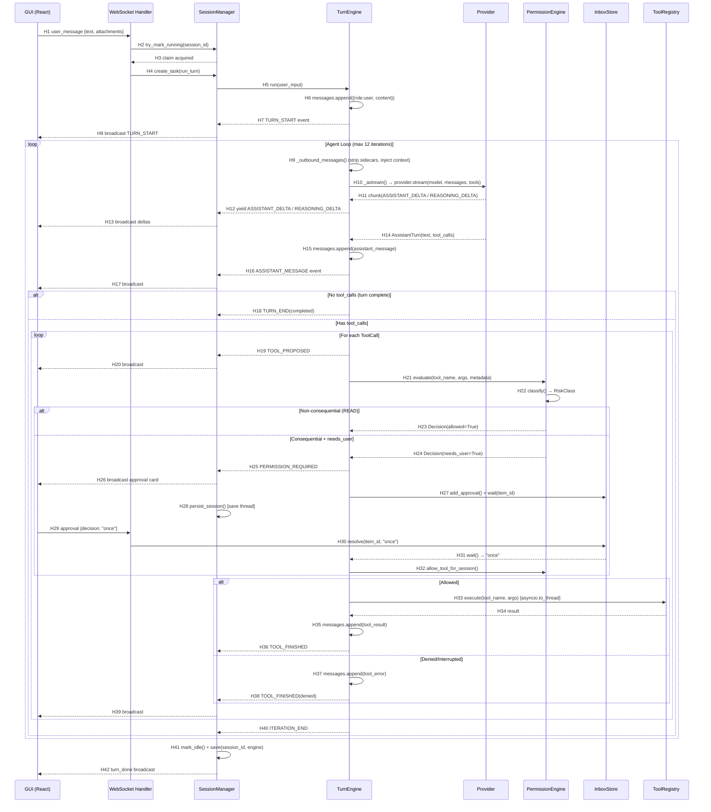

# Runtime Sequence — OpenWorker

> Commit: `f96ad4c8e6865f0aec519681a3717b6bcdd81546`
> Confirmed by: **source** (static analysis)

## Representative End-to-End Call Chain

**Scenario**: User sends "Write a report on Q2 sales" in a Cowork session with Interactive mode. The agent does a web search, then writes a file (which requires approval).

### Textual Call Chain

```
User WS Message (type: "user_message")
  → SessionManager claim turn (try_mark_running)
    → TurnEngine.run(user_input, source)
      → messages.append(user message)
      → yield TURN_START
      → TurnEngine._loop()
        → TurnEngine._astream()          [Provider call in thread]
          → ProviderRouter.stream(model, messages, tools)
          → yield REASONING_DELTA / ASSISTANT_DELTA chunks
          → yield AssistantTurn(text, tool_calls=[web_search])
        → messages.append(assistant message)
        → yield ASSISTANT_MESSAGE
        → TurnEngine._handle_tool_calls([web_search])
          → yield TOOL_PROPOSED
          → TurnEngine._authorize(web_search)
            → PermissionEngine.evaluate("web_search", args, metadata)
              → classify() = RiskClass.READ (non-consequential)
              → return Decision(allowed=True)
          → TurnEngine._execute_sync(web_search)  [asyncio.to_thread]
            → ToolRegistry.execute("web_search", args)
          → yield TOOL_FINISHED
        → yield ITERATION_END
        → TurnEngine._loop()                        [iteration 2]
          → TurnEngine._astream()
          → AssistantTurn(text, tool_calls=[write_file])
        → TurnEngine._handle_tool_calls([write_file])
          → TurnEngine._authorize(write_file)
            → PermissionEngine.evaluate("write_file", args, metadata)
              → classify() = RiskClass.WRITE_LOCAL (consequential)
              → Mode.INTERACTIVE → needs_user=True
              → return Decision(allowed=False, needs_user=True)
            → yield PERMISSION_REQUIRED
            → await approver(PermissionRequest)     [human in the loop]
              → InboxStore.add_approval()
              → persist_session()                   [save thread to disk]
              → await InboxStore.wait(item.id)      [block until resolved]
              → return ApprovalOutcome.ONCE
            → PermissionEngine (approved by user)
          → TurnEngine._execute_sync(write_file)    [asyncio.to_thread]
            → yield TOOL_FINISHED
        → yield ITERATION_END
        → TurnEngine._loop()                        [iteration 3]
          → TurnEngine._astream()
          → AssistantTurn(text="Report written to ...", tool_calls=[])
        → yield ASSISTANT_MESSAGE
        → yield TURN_END(status="completed")
      → SessionManager.mark_idle()
      → SessionManager.save(session_id, engine)
```

### Mermaid Sequence Diagram



## Hop Evidence

| Hop | From → To | File | Symbol or Key | Lines | Evidence Type | Conclusion Type | Confidence |
|-----|-----------|------|---------------|-------|---------------|-----------------|------------|
| H1 | GUI → WS | `server/app.py` | `ws_session()` → `while True: message = await ws.receive_json()` | 1752-1754 | SOURCE | FACT | HIGH |
| H2 | WS → Manager | `server/app.py` | `claim_turn()` → `manager.try_mark_running()` | 1743-1749 | SOURCE | FACT | HIGH |
| H4 | WS → Manager | `server/app.py` | `asyncio.create_task(run_turn(content))` | 1749 | SOURCE | FACT | HIGH |
| H5 | Manager → Engine | `engine.py` | `TurnEngine.run(user_input)` | 156-178 | SOURCE | FACT | HIGH |
| H6 | Engine | `engine.py` | `self.messages.append(message)` | 171 | SOURCE | FACT | HIGH |
| H9 | Engine | `engine.py` | `_outbound_messages()` — strip sidecars, inject context | 880-985 | SOURCE | FACT | HIGH |
| H10 | Engine → Provider | `engine.py` | `_astream()` → `provider.stream(model, messages, tools)` | 390-437, 405 | SOURCE | FACT | HIGH |
| H14 | Provider → Engine | `engine.py` | `chunk.turn is not None` → `turn = chunk.turn` | 329-330 | SOURCE | FACT | HIGH |
| H15 | Engine | `engine.py` | `self.messages.append(_assistant_message(turn))` | 356 | SOURCE | FACT | HIGH |
| H21 | Engine → Permission | `engine.py` | `_authorize()` → `self.permissions.evaluate(...)` | 537-539 | SOURCE | FACT | HIGH |
| H22 | Permission | `permissions.py` | `classify(tool_name, metadata, self.risk_overrides)` | 125 | SOURCE | FACT | HIGH |
| H23-H24 | Permission → Engine | `permissions.py` | `evaluate()` return `Decision(allowed, reason, needs_user)` | 120-178 | SOURCE | FACT | HIGH |
| H25 | Engine | `engine.py` | `yield Event(EventType.PERMISSION_REQUIRED, ...)` | 553-570 | SOURCE | FACT | HIGH |
| H27 | Engine → Inbox | `server/app.py` | `approver()` → `manager.inbox.add_approval(...)` | 1495-1512 | SOURCE | FACT | HIGH |
| H28 | Manager | `server/app.py` | `manager.persist_session(session_id)` | 1516-1518 | SOURCE | FACT | HIGH |
| H30 | WS → Inbox | `server/app.py` | `_resolve_pending(message.get("decision"))` | 1778-1779 | SOURCE | FACT | HIGH |
| H31 | Inbox → Engine | `server/app.py` | `resolution = await manager.inbox.wait(item.id)` | 1521 | SOURCE | FACT | HIGH |
| H33 | Engine → Tool | `engine.py` | `_execute_sync()` → `self.registry.execute(...)` | 637-642 | SOURCE | FACT | HIGH |
| H35 | Engine | `engine.py` | `self.messages.append(_tool_result_message(...))` | 657 | SOURCE | FACT | HIGH |
| H41 | Manager | `server/app.py` | `manager.mark_idle(session_id); manager.save(...)` | 1727-1728 | SOURCE | FACT | HIGH |

## Interrupt Path

When the user clicks "Stop" (WS `type: "interrupt"`):

```
WS "interrupt"
  → engine.request_interrupt()
    → self._cancel.set()                     [sets asyncio.Event]
    → for hook in self._interrupt_hooks:     [kills running shell command]
        hook()  # executor.interrupt_now
```

The cancel event is checked at:
1. **Mid-stream**: `_astream()` producer loop checks `self._cancel.is_set()` between chunks → drops stream [F: `engine.py:410-411`]
2. **Between iterations**: `_loop()` checks `self._cancel.is_set()` after each iteration → stops loop [F: `engine.py:382-385`]
3. **During tool execution**: `_handle_tool_calls()` checks before each serial tool → interrupted calls get tool-error [F: `engine.py:447-450, 498-500`]
4. **Awaiting approval**: `_interruptible()` resolves as `ApprovalOutcome.DENY` [F: `engine.py:134-148`]

Every pending tool_call always gets a result (real or error) — no orphaned calls in history. [F: `engine.py:126`]

## Retry Path

After a provider error (WS `type: "retry"`):

```
WS "retry"
  → claim_turn(retry=True)
    → engine.retry()
      → guard: _tail_is_retriable_error()     [last non-model_switch notice is "error"]
      → _cancel.clear()
      → yield TURN_START
      → _loop()                               [normal loop from here]
```

The guard prevents retrying a completed turn. Model-switch notices between the error and the retry are transparent to the guard. [F: `engine.py:237-248`]

## Durable Resume Path

After a server restart while a turn was suspended at a prompt:

```
Inbox item resolved (REST / Slack button)
  → SessionManager.resolve_inbox(item_id, resolution)
    → InboxStore.resolve(item_id, resolution)
    → if not is_running(session_id):
        → _durable_resume(item)
          → engine = get_engine(item.session_id)    [rebuilds from saved thread]
          → engine.resume()
            → _unanswered_trailing_tool_calls()      [find unanswered calls in thread]
            → _handle_tool_calls(pending)            [re-process; already-answered skip]
            → _loop()                                [continue the turn]
```

The inbox approver in `get_engine` re-uses the already-resolved item ID, so `inbox.wait()` returns immediately instead of re-prompting. [F: `manager.py:833-858`, `engine.py:250-266`]
