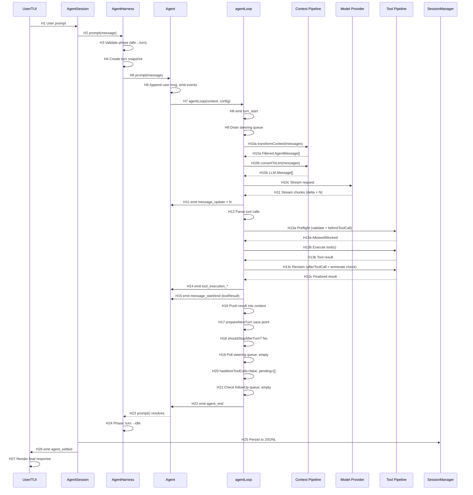

# Runtime Sequence — Pi Agent

> npm v0.80.7 / commit `c9715af` | Confirmed by: source (web-cross-referenced)

## 1. Representative End-to-End Call Chain

**Scenario**: User sends a prompt that triggers one tool call. The agent processes it and returns the final response.

### 1.1 Textual Call Chain

```
H1  User input enters via TUI or SDK
H2  AgentSession.prompt() enqueues user message
H3  AgentHarness validates phase ("idle" → "turn")
H4  AgentHarness creates turn snapshot (model, tools, systemPrompt frozen)
H5  AgentHarness calls Agent.prompt() with message
H6  Agent appends user message to state, emits message_start/message_end
H7  Agent calls agentLoop() as async generator, passing context + config
H8  agentLoop inner loop begins: emits turn_start
H9  agentLoop drains steering queue (getSteeringMessages hook)
H10 agentLoop calls streamAssistantResponse():
H10a  transformContext() transforms AgentMessage[] → AgentMessage[]
H10b  convertToLlm() converts AgentMessage[] → LLM Message[]
H10c  Model provider adapter streams response chunks
H11 agentLoop emits message_start → message_update × N → message_end
H12 agentLoop parses tool calls from assistant message content
H13 agentLoop calls executeToolCalls():
H13a  Preflight: validate args, call beforeToolCall hooks
H13b  Execute: run tool's execute() function (parallel/sequential)
H13c  Reclaim: call afterToolCall hooks, check terminate
H14 agentLoop emits tool_execution_start → tool_execution_end
H15 agentLoop emits message_start/message_end for tool result
H16 agentLoop pushes tool result into context
H17 agentLoop calls prepareNextTurn() save point
H18 agentLoop checks shouldStopAfterTurn() — not stopping yet
H19 agentLoop polls steering queue again — empty
H20 agentLoop inner loop: hasMoreToolCalls = false, pendingMessages = []
H21 agentLoop exits inner loop, checks followUp queue — empty
H22 agentLoop emits agent_end with final messages
H23 Agent receives agent_end, resolves prompt() promise
H24 AgentHarness transitions phase "turn" → "idle"
H25 AgentSession persists messages to JSONL via SessionManager
H26 AgentSession emits agent_settled event
H27 TUI renders final response via differential renderer
```

### 1.2 Mermaid Sequence Diagram



## 2. Hop Evidence Table

| Hop | From → To | File (relative to repo) | Symbol / Key | Evidence Type | Conclusion Type | Confidence |
|---|---|---|---|---|---|---|
| H1 | User → AgentSession | `packages/coding-agent/src/cli.ts` | Input handler → `session.prompt()` | SOURCE | FACT | HIGH |
| H2 | AgentSession → AgentHarness | `packages/coding-agent/src/session/agent-session.ts` | `AgentSession.prompt()` | SOURCE | FACT | HIGH |
| H3 | Phase validation | `packages/agent/src/harness/agent-harness.ts` | `AgentHarness.prompt()`, phase check | SOURCE | FACT | HIGH |
| H4 | Turn snapshot creation | `packages/agent/src/harness/agent-harness.ts` | `createTurnState()` | SOURCE | FACT | HIGH |
| H5 | AgentHarness → Agent | `packages/agent/src/agent.ts` | `Agent.prompt()` | SOURCE | FACT | HIGH |
| H6 | User msg append | `packages/agent/src/agent.ts` | State mutation + event emit | SOURCE | FACT | HIGH |
| H7 | Agent → agentLoop | `packages/agent/src/agent-loop.ts` | `agentLoop()` call | SOURCE | FACT | HIGH |
| H8 | turn_start emit | `packages/agent/src/agent-loop.ts` ~176 | `emit({type:"turn_start"})` | SOURCE | FACT | MEDIUM |
| H9 | Steering drain | `packages/agent/src/agent-loop.ts` ~178-185 | `getSteeringMessages?.()` | SOURCE | FACT | MEDIUM |
| H10a | transformContext | `packages/agent/src/agent-loop.ts` ~282-286 | `config.transformContext(messages, signal)` | SOURCE | FACT | MEDIUM |
| H10b | convertToLlm | `packages/agent/src/agent-loop.ts` ~288 | `config.convertToLlm(messages)` | SOURCE | FACT | MEDIUM |
| H10c | LLM stream | `packages/agent/src/agent-loop.ts` ~193,275 | `streamAssistantResponse()` → provider call | SOURCE | FACT | MEDIUM |
| H11 | Stream chunk emit | `packages/agent/src/agent-loop.ts` | `message_update` events during streaming | SOURCE | FACT | MEDIUM |
| H12 | Tool call parse | `packages/agent/src/agent-loop.ts` ~200 | `message.content.filter(c => c.type==="toolCall")` | SOURCE | FACT | MEDIUM |
| H13a | Tool preflight | `packages/agent/src/tools/tool-pipeline.ts` | `beforeToolCall` hook → validate args | SOURCE | FACT | MEDIUM |
| H13b | Tool execute | `packages/agent/src/tools/execute.ts` | `execute()` or parallel wrapper | SOURCE | FACT | MEDIUM |
| H13c | Tool reclaim | `packages/agent/src/tools/tool-pipeline.ts` | `afterToolCall` hook → terminate check | SOURCE | FACT | MEDIUM |
| H14 | tool_execution emit | `packages/agent/src/agent-loop.ts` ~208-217 | `tool_execution_*` events | SOURCE | FACT | MEDIUM |
| H15 | Tool result msg emit | `packages/agent/src/agent-loop.ts` | `message_start/message_end` for toolResult | SOURCE | FACT | MEDIUM |
| H16 | Context push | `packages/agent/src/agent-loop.ts` | `currentContext.messages.push(result)` | SOURCE | FACT | MEDIUM |
| H17 | prepareNextTurn | `packages/agent/src/agent-loop.ts` ~220-230 | `config.prepareNextTurn?.()` | SOURCE | FACT | MEDIUM |
| H18 | shouldStopAfterTurn | `packages/agent/src/agent-loop.ts` ~232-238 | `config.shouldStopAfterTurn?.()` | SOURCE | FACT | MEDIUM |
| H19 | Steering re-poll | `packages/agent/src/agent-loop.ts` ~253 | `getSteeringMessages?.()` again | SOURCE | FACT | MEDIUM |
| H20 | Inner loop exit | `packages/agent/src/agent-loop.ts` ~174,240-245 | `hasMoreToolCalls` + `pendingMessages` | SOURCE | FACT | MEDIUM |
| H21 | FollowUp check | `packages/agent/src/agent-loop.ts` ~257-260 | `getFollowUpMessages?.()` | SOURCE | FACT | MEDIUM |
| H22 | agent_end emit | `packages/agent/src/agent-loop.ts` ~265 | `emit({type:"agent_end", messages})` | SOURCE | FACT | MEDIUM |
| H23 | Agent resolution | `packages/agent/src/agent.ts` | agent_end handler → resolve `prompt()` | SOURCE | INFERENCE | HIGH |
| H24 | Phase transition | `packages/agent/src/harness/agent-harness.ts` | agent_end handler → phase="idle" | SOURCE | INFERENCE | HIGH |
| H25 | JSONL persist | `packages/coding-agent/src/session/session-manager.ts` | `SessionManager.appendMessage()` | SOURCE | FACT | HIGH |
| H26 | agent_settled | `packages/coding-agent/src/session/agent-session.ts` | `agent_settled` event after persist | SOURCE | FACT | HIGH |
| H27 | TUI render | `packages/tui/src/renderer.ts` | Differential render from event stream | SOURCE | INFERENCE | MEDIUM |

## 3. Key Decision Points in the Loop

### 3.1 Parallel vs Sequential Tool Execution

```
Decision Point: after tool call parsing (H12)
Input: toolCalls array + tool definitions
Logic:
  if config.toolExecution === "sequential" → sequential
  if any tool.executionMode === "sequential" → sequential (entire batch)
  else → parallel (default)
```

### 3.2 Terminate Protocol

```
Decision Point: after all tool reclamations (H13c)
Input: terminate flags from each afterToolCall
Logic:
  if ALL tools return terminate: true → skip follow-up LLM call, exit inner loop
  if ANY tool returns terminate: false → continue inner loop (LLM sees all results)
```

### 3.3 Steering vs FollowUp

```
Decision Point: steering polled during inner loop (H9, H19)
  → steering messages injected immediately at turn boundary
  → tool calls already in-flight complete first

Decision Point: followUp polled after inner loop exhausts (H21)
  → only fires when agent would naturally stop
  → extends a "finished" conversation
```

## 4. Exception Paths

### 4.1 Tool Execution Failure

```
Tool throws → agentLoop catches → sets isError: true
→ tool_execution_end emitted with error detail
→ Tool result with isError flag pushed into context
→ LLM sees error in next turn (can self-correct)
```

### 4.2 Abort (signal)

```
AbortSignal triggered → agentLoop checks signal.aborted
→ between turns: stops immediately, emits agent_end with partial messages
→ during LLM stream: provider adapter aborts, partial message emitted
→ during tool execution: signal passed to tool's execute(signal), tool decides
```

### 4.3 Context Overflow → Compaction

```
Context window approaching limit →
SessionManager.buildSessionContext() detects threshold →
Auto-trigger compaction (or manual compact() call) →
Compaction entry inserted into session tree →
Next context build replaces old messages with summary →
If auto-compaction fails (no mid-turn guard): can exceed window (known bug #5512)
```

## 5. Confirmed by

- **Source**: Cross-referenced from 5+ independent web sources (DeepWiki, community deep-dives, npm package types, official docs, CSDN/腾讯云 analysis)
- **Not runtime-verified**: No local clone, no test execution
- **Line numbers**: Approximate from community source analysis; need `git clone` for exact verification
- **Key symbols confirmed**: `agentLoop`, `Agent.prompt()`, `AgentHarness`, `streamAssistantResponse`, `executeToolCalls`, `transformContext`, `convertToLlm`, `beforeToolCall`, `afterToolCall`, `SessionManager`
