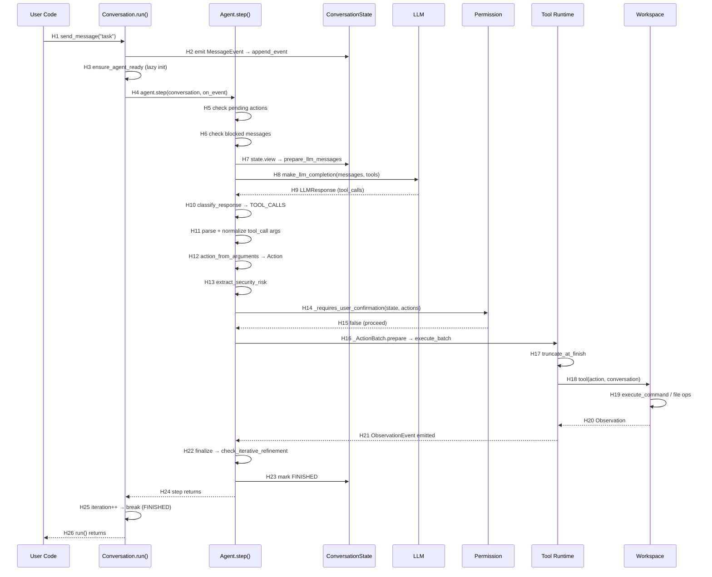

# runtime-sequence.md — 端到端调用链

> Commit: `4fe565663af2b4f1130a6e0dac7566b002bfe9b4`
> Confirmed by: source (静态源码分析)

## 代表性路径选择

选择包含一次 Tool Call 的标准用户请求路径：

**User Message → Agent Loop → LLM Call → Tool Call → Tool Execution → State Persist → Continue/Finish**

## 文字链路

```text
User Input (send_message)
→ MessageEvent emitted → EventLog append → HEAD advance
→ run() starts → ensure_agent_ready (lazy init)
→ while loop:
  → ConversationState checks (PAUSED/STUCK/FINISHED/WAITING_FOR_CONFIRMATION)
  → StuckDetector.is_stuck()
  → Agent.step(conversation, on_event, on_token)
    → init_state() [first call only] → SystemPromptEvent
    → check pending actions → execute
    → check blocked messages
    → LLMCallContext.build()
    → prepare_llm_messages(state.view, condenser, llm)
    → handle condensation if needed
    → make_llm_completion(llm, messages, tools, on_token, call_context)
    → classify_response(message)
    → [TOOL_CALLS]:
      → for each tool_call in message.tool_calls:
        → parse_tool_call_arguments()
        → normalize_tool_call()
        → tool.action_from_arguments()
        → _extract_security_risk()
        → _extract_summary()
        → ActionEvent emitted
      → _requires_user_confirmation(state, action_events)
      → _ActionBatch.prepare():
        → _truncate_at_finish()
        → Partition blocked actions
        → ParallelToolExecutor.execute_batch():
          → for each action:
            → Tool(executable_tool).__call__(action, conversation)
            → Tool.execute(action, conversation) → Observation
        → ObservationEvent emitted
      → _ActionBatch.finalize():
        → check iterative refinement
        → mark FINISHED if done
  → iteration++ → check max iterations / budget
```

## Mermaid Sequence Diagram



## Hop Evidence

| Hop | From → To | File | Symbol or Key | Lines | Evidence Type | Conclusion Type | Confidence |
| --- | --- | --- | --- | --- | --- | --- | --- |
| H1 | UserCode → Conversation.run | [local_conversation.py](openhands-sdk/openhands/sdk/conversation/impl/local_conversation.py) | `send_message()` | 1628-1692 | SOURCE | FACT | HIGH |
| H2 | send_message → State | [local_conversation.py](openhands-sdk/openhands/sdk/conversation/impl/local_conversation.py) | `_default_callback` → `_state.append_event()` | 338-350 | SOURCE | FACT | HIGH |
| H3 | run() → ensure_agent_ready | [local_conversation.py](openhands-sdk/openhands/sdk/conversation/impl/local_conversation.py) | `_ensure_agent_ready()` | 1738 | SOURCE | FACT | HIGH |
| H4 | run() → agent.step() | [local_conversation.py](openhands-sdk/openhands/sdk/conversation/impl/local_conversation.py) | `self.agent.step(self, on_event=..., on_token=...)` | 1820-1822 | SOURCE | FACT | HIGH |
| H5 | step → pending actions check | [agent.py](openhands-sdk/openhands/sdk/agent/agent.py) | `ConversationState.get_unmatched_actions()` | 622-629 | SOURCE | FACT | HIGH |
| H6 | step → blocked messages check | [agent.py](openhands-sdk/openhands/sdk/agent/agent.py) | `state.pop_blocked_message()` | 633-643 | SOURCE | FACT | HIGH |
| H7 | step → prepare messages | [agent.py](openhands-sdk/openhands/sdk/agent/agent.py) | `prepare_llm_messages(state.view, condenser, llm)` | 651-653 | SOURCE | FACT | HIGH |
| H8 | step → LLM call | [agent.py](openhands-sdk/openhands/sdk/agent/agent.py) | `make_llm_completion(self.llm, _messages, tools, ...)` | 691-697 | SOURCE | FACT | HIGH |
| H9 | LLM → Response | [agent.py](openhands-sdk/openhands/sdk/agent/agent.py) | `llm_response = make_llm_completion(...)` | 691-697 | SOURCE | FACT | HIGH |
| H10 | Response → classify | [response_dispatch.py](openhands-sdk/openhands/sdk/agent/response_dispatch.py) | `classify_response(message)` | 53-77 | SOURCE | FACT | HIGH |
| H11 | Parse tool args | [agent.py](openhands-sdk/openhands/sdk/agent/agent.py) | `parse_tool_call_arguments()` → `normalize_tool_call()` | 1183-1211 | SOURCE | FACT | HIGH |
| H12 | Args → Action | [agent.py](openhands-sdk/openhands/sdk/agent/agent.py) | `tool.action_from_arguments(arguments)` | 1228 | SOURCE | FACT | HIGH |
| H13 | Extract security risk | [agent.py](openhands-sdk/openhands/sdk/agent/agent.py) | `_extract_security_risk()` | 1034-1059 | SOURCE | FACT | HIGH |
| H14 | Check confirmation | [agent.py](openhands-sdk/openhands/sdk/agent/agent.py) | `_requires_user_confirmation(state, action_events)` | 991-1032 | SOURCE | FACT | HIGH |
| H15 | Confirmation result | [agent.py](openhands-sdk/openhands/sdk/agent/agent.py) | `state.execution_status = WAITING_FOR_CONFIRMATION` | 1027-1029 | SOURCE | FACT | HIGH |
| H16 | Execute batch | [agent.py](openhands-sdk/openhands/sdk/agent/agent.py) | `_ActionBatch.prepare()` | 227-258 | SOURCE | FACT | HIGH |
| H17 | Truncate at finish | [agent.py](openhands-sdk/openhands/sdk/agent/agent.py) | `_truncate_at_finish()` | 200-225 | SOURCE | FACT | HIGH |
| H18 | Execute tool | [agent.py](openhands-sdk/openhands/sdk/agent/agent.py) | `_execute_action_event()` → `tool(action, conversation)` | 1293-1351 | SOURCE | FACT | HIGH |
| H19 | Workspace operation | [base.py](openhands-sdk/openhands/sdk/workspace/base.py) | `BaseWorkspace.execute_command()` | 72-92 | SOURCE | INFERENCE | MEDIUM |
| H20 | Observation return | [agent.py](openhands-sdk/openhands/sdk/agent/agent.py) | `observation = tool(action_event.action, conversation)` | 1329 | SOURCE | FACT | HIGH |
| H21 | Emit ObservationEvent | [agent.py](openhands-sdk/openhands/sdk/agent/agent.py) | `ObservationEvent(observation=observation, ...)` | 1345-1350 | SOURCE | FACT | HIGH |
| H22 | Finalize batch | [agent.py](openhands-sdk/openhands/sdk/agent/agent.py) | `batch.finalize()` → `check_iterative_refinement()` | 566-577 | SOURCE | FACT | HIGH |
| H23 | Mark finished | [agent.py](openhands-sdk/openhands/sdk/agent/agent.py) | `state.execution_status = FINISHED` | 571-575 | SOURCE | FACT | HIGH |
| H24 | Step returns | [agent.py](openhands-sdk/openhands/sdk/agent/agent.py) | (end of `step()` method) | 796 | SOURCE | FACT | HIGH |
| H25 | run() loop break | [local_conversation.py](openhands-sdk/openhands/sdk/conversation/impl/local_conversation.py) | `if status == FINISHED: break` | 1766-1793 | SOURCE | FACT | HIGH |
| H26 | run() returns | [local_conversation.py](openhands-sdk/openhands/sdk/conversation/impl/local_conversation.py) | (end of `run()` method) | 1893 | SOURCE | FACT | HIGH |

## 异步变体

`arun()` → `Agent.astep()` 使用相同的逻辑结构，但通过 `asyncio` 实现非阻塞 LLM I/O：

- LLM 调用使用 `await amake_llm_completion()`。[F]
- 工具执行使用 `await _aexecute_actions()` → `asyncio.gather` 并行调度。[F]
- 状态锁在 LLM 网络等待期间释放，保证 `send_message()` 的响应性。[F]

证据 — [agent.py:797-989](openhands-sdk/openhands/sdk/agent/agent.py#L797-L989)

## 异常路径

| 场景 | 处理 | 证据 |
| --- | --- | --- |
| LLM 返回格式错误的函数调用 | `FunctionCallValidationError` → 注入错误消息作为用户消息 | [agent.py:698-708](openhands-sdk/openhands/sdk/agent/agent.py#L698-L708) |
| LLM 返回被内容过滤拦截 | `LLMContentPolicyViolationError` → 注入提示让模型重试 | [agent.py:709-730](openhands-sdk/openhands/sdk/agent/agent.py#L709-L730) |
| 上下文窗口超限 | `LLMContextWindowExceedError` → 触发 Condensation | [agent.py:759-772](openhands-sdk/openhands/sdk/agent/agent.py#L759-L772) |
| 工具执行抛出 ValueError | 转换为 `AgentErrorEvent` 让 Agent 自我纠正 | [agent.py:1333-1343](openhands-sdk/openhands/sdk/agent/agent.py#L1333-L1343) |
| 超过最大迭代次数 | `ConversationErrorEvent(MaxIterationsReached)` → ERROR 状态 | [local_conversation.py:1849-1871](openhands-sdk/openhands/sdk/conversation/impl/local_conversation.py#L1849-L1871) |
| 死循环检测 | `StuckDetector.is_stuck()` → STUCK 状态 | [local_conversation.py:1796-1804](openhands-sdk/openhands/sdk/conversation/impl/local_conversation.py#L1796-L1804) |
| 异步中断（CancelledError） | `interrupt()` → PAUSED 状态 + InterruptEvent | [local_conversation.py:2298-2318](openhands-sdk/openhands/sdk/conversation/impl/local_conversation.py#L2298-L2318) |
